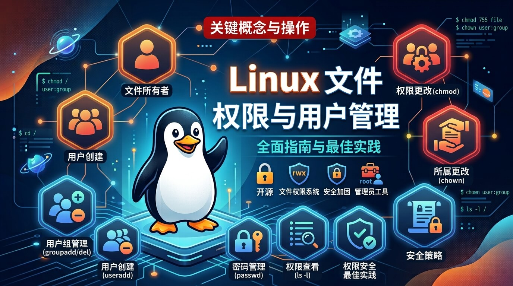

# Linux 文件权限与用户管理：从原理到实操

[[toc]]



在 Linux 系统中，**权限与用户管理**是保证系统安全与稳定运行的基石。

Linux 是一个天然的**多用户、多任务**操作系统。不同的用户拥有不同的身份，而系统通过一套严密的**文件权限机制**，精确控制每个用户能够对文件或目录执行哪些操作（读取、修改还是执行）。

本文将带你理清用户/用户组模型，并掌握文件权限的查看、修改与实战运用。

## 1. 用户角色与提权机制（root / 普通用户 / sudo）

在深入具体的权限位之前，我们需要先搞清楚 Linux 中三种核心的用户身份与协作关系：

```
                ┌─────────────────────────────────────────┐
                │          root 用户 (超级管理员)          │
                │        UID = 0, 拥有绝对掌控权          │
                └────────────────────┬────────────────────┘
                                     │
                        (通过 sudo 授权高危命令)
                                     │
                ┌────────────────────▼────────────────────┐
                │         普通用户 (受限环境)             │
                │  UID >= 1000, 仅能修改自己的家目录与文件 │
                └─────────────────────────────────────────┘

```

### 1.1 root 用户（超级管理员 / God Mode）

* **标识**：用户 ID（UID）固定为 **`0`**，命令行提示符通常是 **`#`**。
* **权限**：**无限权限**。可以读取、修改、删除系统中的任何文件，可以强行终止任何进程，甚至可以一条命令抹掉整个系统。
* **风险**：没有“撤销”按钮。敲错一个空格（如 `rm -rf / tmp/`）就可能导致生产环境彻底崩溃。

### 1.2 普通用户（Standard User）

* **标识**：UID 通常 **`>= 1000`**，命令行提示符通常是 **`$`**。
* **权限**：**受限权限**。默认只能在其家目录（如 `/home/alex`）和 `/tmp` 目录下自由创建/修改文件。无法修改系统核心配置（如 `/etc`）、无法安装全局软件、无法重启系统服务。
* **目的**：实现环境隔离，防止单个用户的误操作或恶意行为破坏整个操作系统。

### 1.3 sudo 命令（SuperUser Do）

* **定位**：一种**安全提权机制**。
* **作用**：允许被授权的普通用户，以 `root`（或其他特权用户）的身份来执行**某一条特定的命令**，而**无需知道 root 的真实密码**。
* **安全机制**：执行 `sudo` 时，系统提示输入的**是普通用户自己的密码**，且密码在一定时间内（默认 15 分钟）会被缓存，无需频繁重复输入。

> **最佳实践**：在生产环境中，**“平时用普通用户，敏感操作用 sudo，禁用 root 直接远程登录”** 是最核心的安全准则。


## 2. 用户与用户组（User & Group）

Linux 将访问系统的个体划分为三种主体角色：

* **用户（User / Owner）**：文件的拥有者，通常是创建该文件的用户。
* **用户组（Group）**：具有相同权限需求的多个用户的集合。将权限赋予用户组，可以方便地进行批量权限管理。
* **其他人（Others）**：既不是文件拥有者，也不属于该文件所属用户组的系统其他所有用户。

除此之外，系统中还有一个最高特权身份：**`root`（超级管理员）**。`root` 拥有系统的绝对控制权，可以跨越绝大多数普通权限限制。

### 2.1 关键系统文件

Linux 将用户和组的信息存储在以下配置文件中：

* **`/etc/passwd`**：存储用户账号的基本信息（用户名、UID、默认 Shell 等）。
* **`/etc/group`**：存储用户组的信息（组名、GID、组成员等）。
* **`/etc/shadow`**：存储加密后的用户密码（仅 `root` 可读）。

### 2.2 用户与组管理命令实操

 **实操案例 1：创建用户并将其加入开发组**
 ```bash
 # 1. 创建一个新的用户组：devteam
 sudo groupadd devteam

 # 2. 创建新用户 alex，并将其加入 devteam 组，同时为其创建家目录
 sudo useradd -m -g devteam alex

 # 3. 为 alex 设置密码
 sudo passwd alex

 # 4. 查看 alex 的身份信息（UID、GID 及所属组）
 id alex
 # 输出示例: uid=1001(alex) gid=1001(devteam) groups=1001(devteam)

 # 5. 将 alex 赋予 sudo 权限（将其加入 sudo 组）
 sudo usermod -aG sudo alex

 ```

## 3. 深入理解 Linux 文件权限

使用 `ls -l` 命令查看文件或目录时，输出的第一列就是**权限字符串**。

```bash
ls -l /var/www/html/index.html
# 输出: -rwxr-xr-- 1 alex devteam 2048 Aug 27 10:00 /var/www/html/index.html

```

将权限字符串 `-rwxr-xr--` 拆解如下：

```
 -   rwx   r-x   r--
│    │     │     └── [第 7-9 位] 其他人 (Others) 的权限: 可读 (r)
│    │     └─────── [第 4-6 位] 所属组 (Group) 的权限: 可读 (r)、可执行 (x)
│    └───────────── [第 1-3 位] 所有者 (User/Owner) 的权限: 可读 (r)、可写 (w)、可执行 (x)
└────────────────── [第 0 位] 文件类型: - 表示普通文件, d 表示目录, l 表示软链接

```

### 3.1 权限位（r, w, x）的含义

读（r）、写（w）、执行（x）在**普通文件**与**目录**上的含义完全不同，这是初学者最容易混淆的地方：

| 权限符号 | 对应数值 | 对普通文件的含义 | 对目录的含义 |
| --- | --- | --- | --- |
| **`r`** (Read) | **4** | 可以查看文件内容（如 `cat`、`less`） | 可以列出目录内的文件列表（如 `ls`） |
| **`w`** (Write) | **2** | 可以修改文件内容（如 `vim`） | 可以**在目录内创建、删除、重命名**文件 |
| **`x`** (Execute) | **1** | 可以作为程序/脚本执行（如 `./script.sh`） | 可以**进入该目录**（如 `cd`），以及访问其内部文件的属性 |

 ⚠️ **重要细节**：如果对一个目录只有 `r` 权限而没有 `x` 权限，你能看到目录下的文件名，但**无法进入该目录**，也无法查看文件的具体属性或内容。


## 4. 修改权限与所有者

### 4.1 修改文件权限：`chmod`

修改权限有两种常用方式：**数字法** 和 **字母法**。

#### 1. 数字表示法（最常用）

将 `r=4, w=2, x=1` 相加，算出每一组的权值（范围 0~7）：

* `rwx` = 4 + 2 + 1 = **7**（全权限）
* `rw-` = 4 + 2 + 0 = **6**（读写）
* `r-x` = 4 + 1 + 0 = **5**（读与执行）
* `r--` = 4 + 0 + 0 = **4**（只读）

```bash
# 将 index.html 设置为：所有者可读写执行(7)，所属组可读执行(5)，其他人只读(4)
chmod 754 index.html

# 常用：将脚本设置为所有者可读写执行，其他人可读执行
chmod 755 deploy.sh

# 常用：将私钥文件设置为仅所有者可读写，其他人无任何权限（SSH 私钥硬性要求）
chmod 600 id_rsa

```

#### 2. 符号表示法

* 角色：`u` (user), `g` (group), `o` (others), `a` (all)
* 操作：`+` (增加), `-` (减少), `=` (赋予)

```bash
# 为文件所有者增加执行权限
chmod u+x build.sh

# 移除其他人对该文件的写权限
chmod o-w config.json

# 递归（-R）将整个项目目录的所有者权限设为读写，其他人无权限
chmod -R u=rwX,go= project/

```


### 4.2 修改文件所有者与所属组：`chown`

只有文件所有者或 `root` 用户才能修改文件的属主或属组。

 **实操案例 2： Web 服务器目录权限重置**
 ```bash
 # 1. 将 /var/www/html 目录及其内部所有文件的所有者改为 www-data，所属组改为 devteam
 sudo chown -R www-data:devteam /var/www/html

 # 2. 仅修改所属组为 devteam
 sudo chown :devteam /var/www/html/index.html

 ```


## 5. 生产环境常见安全实战

### 场景：部署一个部署脚本 `deploy.sh`

当你新建一个 Shell 脚本时，默认通常是没有执行权限的：

```bash
touch deploy.sh
ls -l deploy.sh
# 输出: -rw-r--r-- 1 alex devteam 0 Aug 27 10:15 deploy.sh

# 此时直接运行会报错: Permission denied (权限被拒绝)
./deploy.sh

# 赋予执行权限并再次运行
chmod +x deploy.sh
./deploy.sh  # 运行成功

```


## 6. 总结

| 需求场景 | 推荐命令 / 权限值 | 说明 |
| --- | --- | --- |
| **赋予脚本执行权限** | `chmod +x script.sh` 或 `chmod 755` | 保证当前用户或所有人能够直接 `./script.sh` 运行 |
| **保护敏感配置文件/密钥** | `chmod 600 id_rsa` / `chmod 640 config.env` | 防止敏感数据被其他人或组外成员读取 |
| **修改网站静态资源归属** | `sudo chown -R www-data:www-data /var/www` | 让 Nginx/Apache 进程拥有对网页目录的访问权限 |
| **解决 Permission denied** | 排查 `ls -l` 查看当前身份对应的 `r/w/x` 权限 | 优先通过 `chmod` 或 `chown` 精确赋权，**切忌盲目 `chmod 777**` |

> 💡 **安全提示**：不要给生产环境的文件随意使用 `chmod 777`（这会让所有用户都具备读、写、执行权限）。按需赋权、最小权限原则才是保障 Linux 安全的核心。
