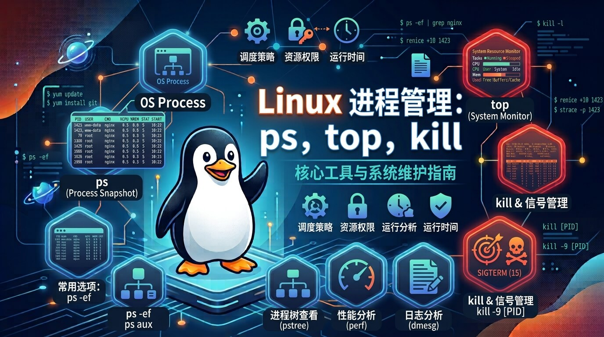

# Linux 进程管理：ps、top 与 kill 实战指南

[[toc]]



在 Linux 操作系统中，**进程（Process）** 是正在运行的程序的实例。无论是系统后台运行的服务（如 Nginx、MySQL），还是你执行的命令行脚本，都以进程的形式存在。

掌握进程管理，是排查服务器卡顿、处理 CPU/内存爆满、以及安全停止异常服务的必备基本功。

本文将聚焦三大核心命令：**查看静态快照的 `ps`**、**实时监控状态的 `top`**，以及**终止进程的 `kill`**。


## 1. 进程的基础概念

在深入命令前，先了解几个核心术语：

* **PID（Process ID）**：系统分配给每个进程的唯一数字标识符。
* **PPID（Parent Process ID）**：父进程 ID。除了 `init` / `systemd`（PID 1）外，所有进程都由另一个进程衍生。
* **进程状态**：
* **R (Running)**：正在运行或在运行队列中等待。
* **S (Sleeping)**：休眠状态，等待某个事件或信号唤醒。
* **Z (Zombie)**：**僵尸进程**。子进程已结束，但父进程尚未回收其状态信息，仍占用进程表位置。


## 2. 查看静态进程快照：`ps` (Process Status)

`ps` 命令用于捕获**当前时间节点**的进程状态快照。

### 2.1 常用参数组合

在实际工作中，最常用的组合有两个：

#### 1. `ps aux`（BSD 风格，最常用）

* **`a`**：显示所有终端下的进程（包括其他用户的进程）。
* **`u`**：以用户为主的格式显示详细信息（包含 CPU、内存占用等）。
* **`x`**：显示没有控制终端的后台进程（如系统后台服务）。

```bash
ps aux | head -n 5
# 输出列解析：
# USER       PID %CPU %MEM    VSZ   RSS TTY      STAT START   TIME COMMAND
# root         1  0.0  0.1 168128  9640 ?        Ss   Aug27   0:05 /sbin/init

```

* **`%CPU` / `%MEM**`：占用 CPU 和物理内存的百分比。
* **`RSS`**：实际使用的物理内存大小（单位 KB）。
* **`STAT`**：进程状态（`S` 休眠, `s` 包含子进程, `<` 高优先级等）。

#### 2. `ps -ef`（System V 风格）

* **`-e`**：显示所有进程。
* **`-f`**：全格式显示（主要用于查看父进程 **PPID** 追溯源头）。

### 2.2 生产案例：结合 `grep` 查找特定服务

```bash
# 查看 Node.js 相关的运行进程
ps aux | grep node

# 查看端口/进程匹配（排查 MySQL 进程）
ps -ef | grep mysql

```

## 3. 实时动态监控：`top` (系统任务管理器)

如果说 `ps` 是“拍照”，那 `top` 就是“录像”。它能**实时动态刷新**系统的 CPU、内存使用率以及各进程的资源消耗。

### 3.1 top 界面上半部分（系统整体健康度）

```text
top - 10:15:30 up 2 days,  4:20,  1 user,  load average: 0.15, 0.20, 0.05
Tasks: 120 total,   1 running, 119 sleeping,   0 stopped,   0 zombie
%Cpu(s):  2.3 us,  1.0 sy,  0.0 ni, 96.5 id,  0.2 wa,  0.0 hi,  0.0 si
MiB Mem :   7950.0 total,   2150.0 free,   3200.0 used,   2600.0 buff/cache

```

* **`load average` (系统负载)**：分别表示 **1 分钟、5 分钟、15 分钟** 内的平均负载。
* *判断法则*：数值除以 CPU 核心数。若长期大于 1.0/核，说明系统存在排队卡顿。


* **`%Cpu(s)`**：
* **`us` (user)**：用户进程消耗 CPU 百分比。
* **`sy` (system)**：内核/系统进程消耗百分比。
* **`wa` (iowait)**：**CPU 等待磁盘 I/O 完成的时间**。该值过高说明磁盘读写瓶颈严重。


* **`zombie`**：僵尸进程数量，大于 0 时需关注。

### 3.2 top 快捷交互按键（进入 top 后直接敲击）

在 `top` 运行界面中，按下以下快捷键可快速分析问题：

| 快捷键 | 作用 |
| --- | --- |
| **`P`** | 按照 **CPU 占用率** 从高到低排序（默认） |
| **`M`** | 按照 **内存占用率 (MEM)** 从高到低排序 |
| **`N`** | 按照 **PID** 排序 |
| **`1`** | 展开/折叠显示**每个 CPU 核心**的独立占用情况 |
| **`k`** | 在 top 内部直接结束某个进程（输入 PID 后回车） |
| **`q`** | 退出 top 界面 |

> 💡 **进阶替代品**：在现代服务器中，通常会使用界面更美观、支持鼠标交互的 **`htop`**（需要通过 `apt install htop` 或 `yum install htop` 安装）。

## 4. 终止与管理进程：`kill` / `killall` / `pkill`

当进程卡死、死循环或需要优雅重启时，我们使用 `kill` 相关的工具发送信号（Signal）给进程。

### 4.1 核心信号类型

使用 `kill -l` 可以查看所有信号，最核心的三种信号如下：

| 信号编号 | 信号名称 | 作用与含义 |
| --- | --- | --- |
| **`15`** | **SIGTERM** (默认) | **软件终止信号**。通知进程“请平滑关闭”，进程会先保存数据、释放资源再退出。 |
| **`9`** | **SIGKILL** | **无条件强制杀进程**。系统内核直接回收资源，进程无法拦截或拒绝（可能引发数据丢失）。 |
| **`1`** | **SIGHUP** | **挂起/重载信号**。常用于让服务在不重启的情况下**平滑重新加载配置文件**。 |

### 4.2 实操案例

**实操案例 1：优雅关闭与强制关闭**
```bash
# 1. 查找应用进程 PID
ps aux | grep myapp
# 假设找到 PID 为 12345
>
# 2. 优先尝试优雅关闭 (SIGTERM)
kill 12345
>
# 3. 如果进程无响应，使用强制杀进程 (SIGKILL)
kill -9 12345
>
```

**实操案例 2：按名称批量杀死进程 (`pkill` / `killall`)**
```bash
# 1. 杀死名字为 nginx 的所有进程
killall nginx
# 2. 根据进程名模糊匹配并杀死（如杀死所有带有 node 关键字的进程）
pkill -f node
# 3. 踢出某个指定终端的用户
pkill -u alex
```


## 5. 综合排查实战：CPU 爆满排查步骤

当收到报警提醒服务器 CPU 使用率达到 100% 时，标准排查流程如下：

1. **定位问题进程**：输入 `top`，按下 `P` 键，找出占用 CPU 最高进程的 **PID**（假设为 `8888`）。
2. **确认进程身份**：通过 `ps aux | grep 8888` 查看该进程对应的完整路径与启动参数。
3. **深入线程分析（可选）**：如果是 Java/Python 等多线程程序，执行 `top -Hp 8888` 查看具体是哪个子线程占用过高。
4. **处理进程**：
* 如果是正常业务飙高，检查日志或配合代码分析。
* 如果是异常死循环或恶意挖矿程序，使用 `kill -9 8888` 强制终止。


## 6. 总结

| 工具/命令 | 核心定位 | 典型使用场景 |
| --- | --- | --- |
| **`ps aux` / `ps -ef**` | **静态快照** | 结合 `grep` 快速精准定位某个具体进程的 PID 和启动路径 |
| **`top`** | **动态监控** | 排查 CPU 爆满、内存泄露、系统高负载（查看 `load average`） |
| **`kill -15`** | **优雅停机** | 生产环境首选，给程序留出写日志、保存缓存的时间 |
| **`kill -9`** | **强行斩杀** | 程序卡死或无响应时的最终兜底手段 |
