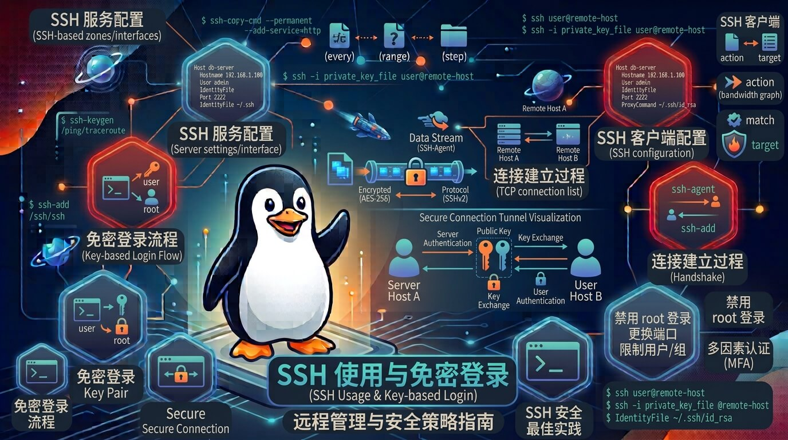

# Linux SSH 使用与免密登录全面指南

[[toc]]



**SSH (Secure Shell)** 是 Linux 系统中最核心的远程管理协议。它通过**非对称加密**（公钥与私钥）技术，为终端会话、文件传输提供安全通道。

无论是日常连接服务器，还是构建 CI/CD 自动化部署、集群拉取代码，掌握 SSH 的配置与免密登录都是必修课。


## 1. SSH 工作原理与非对称加密

SSH 免密登录基于**非对称加密体系**：

```
          [ 本地客户端 (Client) ]                     [ 远程服务器 (Server) ]
          ┌────────────────────┐                     ┌────────────────────┐
          │  私钥 (id_ed25519) │ (绝不泄露)           │                    │
          └─────────┬──────────┘                     │ ~/.ssh/            │
                    │                                │  authorized_keys   │
                    │ 发送连接请求                    │ (存有客户端公钥)    │
                    └───────────────────────────────>│                    │
                                                     └─────────┬──────────┘
                                                               │
                                  服务器用公钥加密随机质询       │
                    ┌──────────────────────────────────────────┘
                    ▼
          ┌────────────────────┐
          │ 本地用私钥解密并响应 │
          └─────────┬──────────┘
                    │ 验证成功，建立加密会话
                    └───────────────────────────────> [ 登录成功 ]

```

* **私钥 (Private Key)**：存放在**本地电脑**（`~/.ssh/id_ed25519`），绝对不能泄露。
* **公钥 (Public Key)**：存放在**远程服务器**（`~/.ssh/authorized_keys`），用于解密和身份校验。


## 2. SSH 基础连接命令

最基本的连接语法：`ssh [用户名]@[服务器IP或域名] -p [端口号]`

```bash
# 1. 默认连接（使用 22 端口）
ssh alex@192.168.1.100

# 2. 连接指定端口（如果服务器修改了默认 SSH 端口，如 2222）
ssh -p 2222 alex@192.168.1.100

# 3. 指定特定私钥文件进行连接
ssh -i ~/.ssh/my_custom_key alex@192.168.1.100

# 4. 在远程服务器上直接执行单条命令并返回结果（无需保持交互）
ssh alex@192.168.1.100 "df -h"

```


## 3. SSH 免密登录配置（标准四步法）

### 步骤 1：在本地机器生成 SSH 密钥对

打开本地终端，执行以下命令生成密钥对。

> 💡 **推荐算法**：强烈建议优先使用 **Ed25519** 算法（比传统的 RSA 更安全、密钥更短且性能更好）。

```bash
# 优先推荐：使用 Ed25519 算法生成（可加上 -C 备注邮箱或主机名）
ssh-keygen -t ed25519 -C "alex@example.com"

# 备选：如果老旧系统不支持 ed25519，使用 4096 位的 RSA
ssh-keygen -t rsa -b 4096 -C "alex@example.com"

```

* 执行后系统会提示保存路径（默认在 `~/.ssh/` 目录下），连按三次回车即可（默认不设置私钥密码）。


### 步骤 2：将公钥复制到远程服务器

生成密钥后，你需要将本地生成的公钥（`id_ed25519.pub`）添加到远程服务器的 `~/.ssh/authorized_keys` 文件中。

#### 方法 A：使用 `ssh-copy-id` 自动安装（推荐，最省心）

```bash
# 格式：ssh-copy-id -p [端口] [用户名]@[服务器IP]
ssh-copy-id -p 22 alex@192.168.1.100

```

输入一次远程用户的密码后，系统会自动帮你创建目录并配置权限。

#### 方法 B：手动配置（若远程机器没有 `ssh-copy-id` 工具）

```bash
# 一键读取本地公钥并通过管道写入远程 authorized_keys
cat ~/.ssh/id_ed25519.pub | ssh alex@192.168.1.100 "mkdir -p ~/.ssh && chmod 700 ~/.ssh && cat >> ~/.ssh/authorized_keys && chmod 600 ~/.ssh/authorized_keys"

```


### 步骤 3：验证免密登录

配置完成后，再次尝试连接，系统将不再提示输入密码，而是直接登录：

```bash
ssh alex@192.168.1.100

```

## 4. 高级技巧：使用 `~/.ssh/config` 简化配置

每次都输入 `ssh alex@192.168.1.100 -p 2222 -i ~/.ssh/my_key` 非常繁琐。你可以在本地配置 **SSH 别名**。

创建并编辑本地的 `~/.ssh/config` 文件：

```bash
nano ~/.ssh/config

```

写入以下配置内容：

```text
# 定义别名，如 dev-server
Host dev
    HostName 192.168.1.100
    User alex
    Port 2222
    IdentityFile ~/.ssh/id_ed25519

# 定义公司生产环境服务器
Host prod
    HostName prod.example.com
    User admin
    Port 22
    IdentityFile ~/.ssh/prod_key

```

设置保存后，下次你只需输入极其简短的别名即可直接连接：

```bash
ssh dev

```

## 5. 生产环境 SSH 安全加固规范

在公网服务器中，默认配置的 SSH 经常会遭遇密码爆破攻击。强烈建议修改 `/etc/ssh/sshd_config` 进行安全加固：

```bash
# 1. 打开服务器上的 SSH 服务配置文件
sudo nano /etc/ssh/sshd_config

# 2. 做出如下安全改动：
Port 2222                 # 修改默认 22 端口，避开绝大部分通用扫描脚本
PermitRootLogin no        # 禁止 root 用户直接远程登录（强制使用普通用户 sudo 提权）
PasswordAuthentication no # ⚠️ 彻底禁用密码登录！强制要求使用 SSH 密钥登录
PubkeyAuthentication yes  # 开启公钥认证

# 3. 重载 SSH 服务配置使修改生效
sudo systemctl reload sshd

```

## 6. 排查免密登录失败（常见权限坑点）

如果你已经配置了 `authorized_keys`，但系统依然要求输入密码，90% 的原因是**文件权限太开放**导致 SSH 处于安全机制拒绝读取。

请登录远程服务器，严格检查并修复以下权限：

```bash
# 1. 用户家目录权限不能过大
chmod 750 /home/alex

# 2. .ssh 目录权限必须为 700
chmod 700 /home/alex/.ssh

# 3. authorized_keys 文件权限必须为 600
chmod 600 /home/alex/.ssh/authorized_keys

# 4. 确保文件所有者是当前用户而非 root
chown -R alex:alex /home/alex/.ssh

```

> 💡 **终极排查参数**：如果还是不行，在本地连接时加上 **`-v`** 参数（如 `ssh -v dev`），查看详细的握手日志与密钥匹配过程。


## 7. 总结

1. **生成算法**：首选 `ssh-keygen -t ed25519`。
2. **免密部署**：用 `ssh-copy-id user@ip` 最快。
3. **高效接入**：配置 `~/.ssh/config` 打造极简快捷命令。
4. **安全加固**：禁止密码登录 (`PasswordAuthentication no`) + 修改默认端口 + 严格控制 `.ssh` 目录权限（`700` 和 `600`）。
