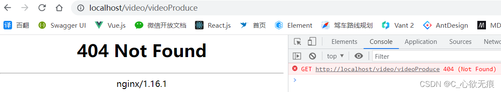

# 前端hash、history模式的区别及history路由刷新报404问题


___
**目录**
[[toc]]

## 1，前端路由原理


::: tip SPA
 在前端单页面(SPA)中, 只有一个html页面，单纯的浏览器地址改变，不会再去请求新的html网页，而是通过监听路由的变化，并利用JS动态显示和隐藏页面内容来达到类似多个网页的切换效果；

实现切换的路由模式也分为两种： hash模式 和 history模式
:::


## 2，hash模式
**概述：**
hash指的是地址中#号以及后面的字符，这个#就是hash符号，中文名哈希符或锚点，哈希符后面的值，我们称之为哈希值；如：

```javascript
http://localhost:31001/#/videoProduce
http://localhost:31001/#/xgplayer
```

这里的`#/videoProduce`和`#/xgplayer`就是hash。

**特点：**
hash 虽然出现在 URL 中，但不会被包括在 HTTP 请求中，对请求后端资源完全没有影响，`因此改变 hash 不会重新加载页面。`

路由的哈希模式其实是利用了window可以监听`onhashchange`事件，可以实现监听浏览器地址hash值变化，执行相应的js切换网页。这么一来，即使前端并没有发起http请求它也能够找到对应页面的代码块进行按需加载。

## 3，history模式
**概述：**
window.history 属性指向 History 对象，它表示当前窗口的浏览历史，更新URL地址不重新发请求。History 对象保存了当前窗口访问过的所有页面网址，它提供的一些方法如下：

| 方法           | 描述                                                         |
| -------------- | ------------------------------------------------------------ |
| back()         | 该方法转到浏览器会话历史的上一页，与用户单击浏览器的 Back 按钮的行为相同。等价于 `history.go(-1)`。 |
| forward()      | 该方法转到浏览器会话历史的下一页，与用户单击浏览器的 forward 按钮的行为相同。 |
| go()           | 该方法从会话历史记录中加载特定页面。你可以使用它在历史记录中前后移动，具体取决于你传的参数值。注意：window.history.go()和go(0) 都会重新加载当前页面; |
| pushState()    | 该方法用于在历史中添加一条记录。pushState()方法不会触发页面刷新，只是导致 History 对象发生变化，地址栏会有变化; |
| replaceState() | 该方法用来修改 History 对象的当前记录，用法与 pushState() 方法一样; |


**弊端**：刷新页面会报404；解决方案如下：

## 4，解决刷新404问题

我的vue前端项目是使用`nginx`部署到本地的，当路由模式是hash 模式刷新页面没有任何问题，当是history模式时 刷新页面就会报404错误；



**history路由模式：**
```javascript
const router = new VueRouter({
  mode: 'history',
  base: process.env.BASE_URL, // 应用的基路径。例如，如果整个单页应用服务在 /app/ 下，然后 base 就应该设为 “/app/”
  routes,
});
```


**原因**：我们使用vue等框架创建的其实是单页面应用，只有一个html页面，路由模式是`history时`
刷新页面，浏览器会发起一个`get`请求（见上图右侧部分），请求的路径就是我当前页面刷新的路径：`http://localhost/video/videoProduce`

我nginx代理的项目路径是`/video/` 如果直接访问 `http://localhost/video/`是没有问题的，因为nginx能够匹配到 `/video/` 并找到alias 目录下面的 index.html文件并运行，也就是启动了前端项目；

但是我访问的是 `/video/videoProduce` 它匹配不到 当然就报404了；

```javascript
# 视频演示项目 http协议
location /video/ {
    alias  D:/myProject/deployProject/video/;
    index index.html index.htm;
}
```

**解决方案：**

在nginx 配置添加一行配置： `try_files $uri $uri/ /index.html last;`


> 解释：
> 尝试解析下列2个文件/文件夹(自动分辨出，IP后面的路径是文件还是文件夹)， $uri/$uri/;
> 如果解析到，返回第一个，如果都没有解析到，向127.0.0.1/index.html发起请求跳转(该路由必须真实，不然会报错)

正确写法：
```javascript
# 视频演示项目 http协议
location /video/ {
​    alias  D:/myProject/deployProject/video/;
​    try_files $uri $uri/ /index.html last;
​    index index.html index.htm;
​}
```
vue 官网给出的解决方案就有这条：[https://router.vuejs.org/zh/guide/essentials/history-mode.html](https://router.vuejs.org/zh/guide/essentials/history-mode.html)

## 5，两种路由模式的对比

两种路由模式对比如下：
|          | **hash**                   | **history**              |
| -------- | -------------------------- | ------------------------ |
| url显示  | 地址中永远带着`#`，不美观    | 地址干净、美观           |
| 页面刷新 | 可以加载到hash值对应页面   | 可能会出现404 找不到页面 |
| 支持版本 | 支持低版本浏览器和IE浏览器 | HTML5新推出的API         |
| 上线部署 | 无                         | 需要设置一下nginx的配置  |

**注意：**

 - 如果用户考虑url的规范那么就需要使用`history模式`，因为history模式没有#号，是个正常的url适合推广宣传。
 - 其功能也有区别，比如我们在开发app的时候有分享页面，咱们把这个页面分享到第三方的app里，有的app里面url是不允许带有#号的，会被标记为不合法。所以要将#号去除那么就要使用history模式。
