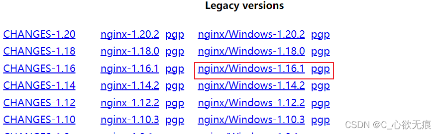
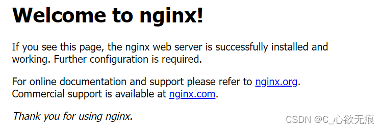
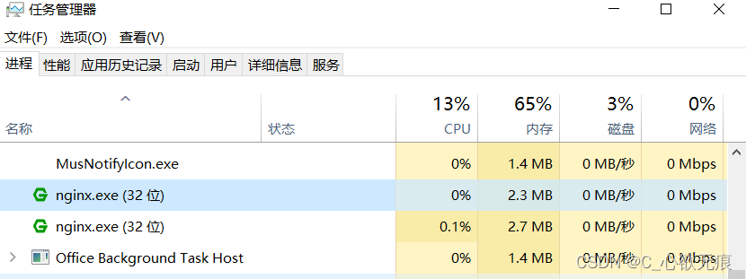
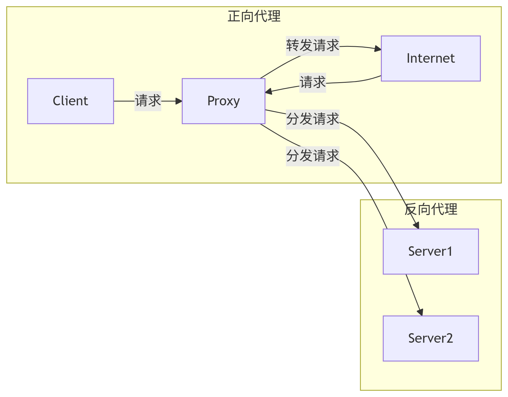
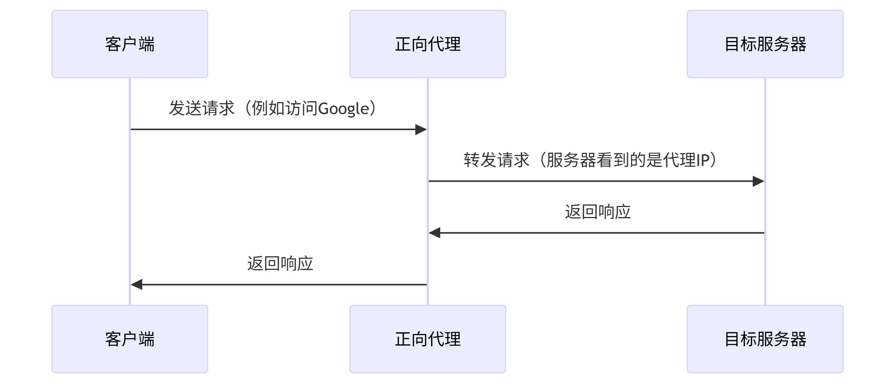
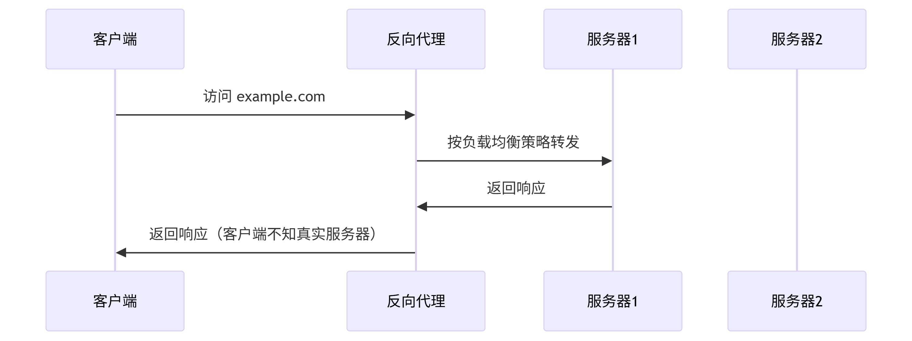
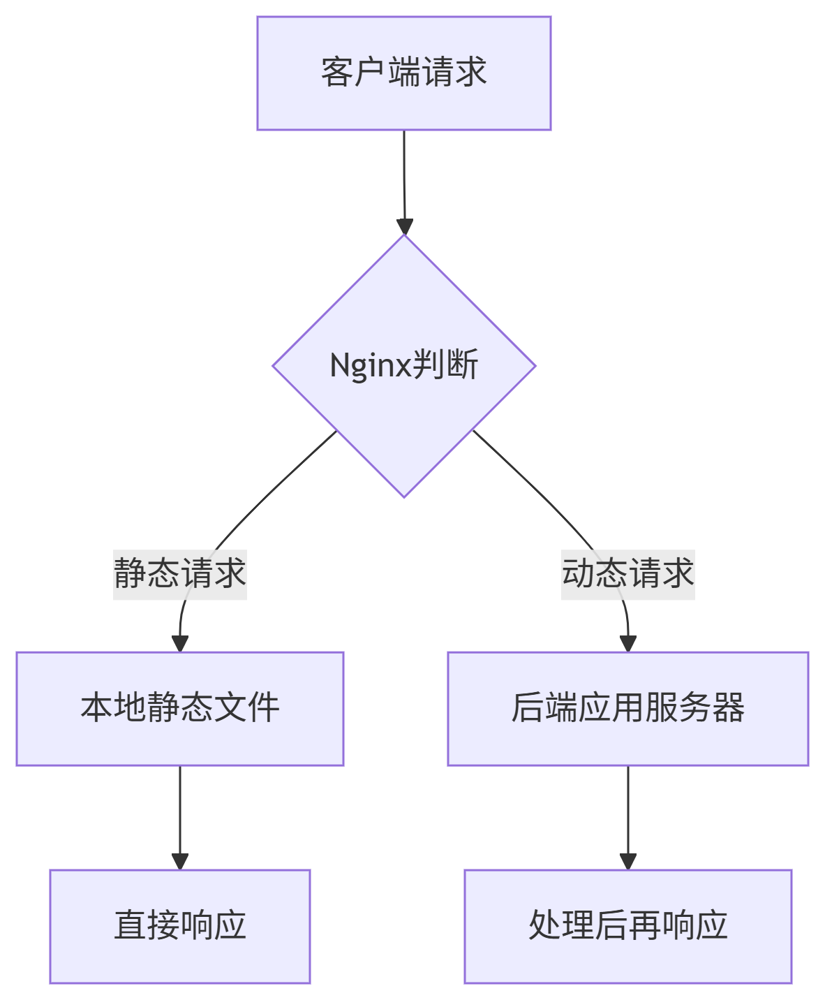

# Nginx 基本介绍

## 一、Nginx 核心概念解析

`Nginx`是一个高性能的 HTTP 和反向代理服务器，以其**高并发处理能力**、**低内存消耗**和**模块化架构**闻名。根据 W3Techs 数据，全球约**34.2%**的网站使用 Nginx 作为 Web 服务器或反向代理。

### 1.1 安装

下载链接：[http://nginx.org/en/download.html](http://nginx.org/en/download.html)

我安装的是：1.16.1 版本的，如下：

{width=90%}

**然后解压到一个指定的文件夹就行；双击根目录的 nginx 图标** ，然后再访问 [http://localhost/](http://localhost/)若出现以下页面表示启动成功：

{width=90%}

**也可以在任务管理器中查看是否启动成功:**

{width=90%}

### 1.2 核心功能

| 功能     | 描述                                 | 典型应用场景               |
| -------- | ------------------------------------ | -------------------------- |
| 正向代理 | 代理客户端请求，隐藏真实客户端信息   | 企业内网访问外网、爬虫代理 |
| 反向代理 | 代理服务器端响应，隐藏真实服务器信息 | 网站接入层、API 网关       |
| 负载均衡 | 将流量分发到多个后端服务器           | 高并发网站、微服务架构     |
| 动静分离 | 静态资源与动态请求分开处理           |

## 二、正向代理和反向代理

{width=60%}

### 2.1 正向代理

正向代理是指`客户端`配置代理服务器，通过代理服务器访问目标服务器。客户端并不知道实际的目标服务器，只能通过代理服务器进行访问。

{width=90%}

**核心特点**

1. **客户端配置**：需在客户端显式设置代理地址
2. **隐私保护**：服务器无法获取真实客户端 IP
3. **访问控制**：企业常用于限制员工上网行为

**典型场景**

- 企业内网访问外网
- 爬虫 IP 轮换
- 科学上网工具

**配置示例**

```nginx
server {
    listen 3128;
    resolver 8.8.8.8;

    location / {
        proxy_pass http://$http_host$request_uri;
        proxy_set_header X-Forwarded-For $remote_addr;
    }
}
```

### 2.2 反向代理

反向代理是指客户端直接访问`代理服务器`，代理服务器再将请求转发给目标服务器。客户端并不知道实际的目标服务器，只能通过代理服务器进行访问。

{width=90%}

**核心特点**

1. **客户端无感知**：用户直接访问代理地址
2. **服务器保护**：隐藏后端服务器拓扑
3. **功能扩展**：支持 SSL 卸载、缓存等

**典型场景**

- 网站接入层
- CDN 边缘节点
- API 网关

  **配置示例**

```nginx
upstream backend {
    server 10.0.0.1:8080 weight=3;
    server 10.0.0.2:8080;
}
server {
    listen 80;
    server_name example.com;

    location / {
        proxy_pass http://backend;
        proxy_set_header Host $host;
    }
}
```

## 三、负载均衡

见这篇文章： [负载均衡策略](/column/Network/Nginx/负载均衡策略.html)

## 四、动静分离

动静分离是指将网站的静态资源（`如HTML、CSS、JS、图片等`）和动态内容（如 PHP、Java 生成的页面）分开处理的技术方案。通过`Nginx`实现动静分离，可以显著提高网站的性能和并发处理能力。

**为什么要做动静分离？**

1、性能优化：静态资源由 Nginx 直接返回，效率比应用服务器高 10 倍以上  
2、减轻后端压力：减少应用服务器的请求量，节省 CPU 资源  
3、提升用户体验：静态资源加载更快，页面响应更迅速  
4、便于扩展：静态资源可以单独做 CDN 加速

### 4.1 动静分离的实现原理

{width=300px}

### 4.2 Nginx 配置实战

**1、基础配置示例**

```nginx
server {
    listen 80;
    server_name example.com;

    # 静态资源目录
    location ~* \.(html|htm|gif|jpg|jpeg|bmp|png|ico|txt|js|css|woff|ttf)$ {
        root /var/www/static;
        expires 30d;  # 缓存30天
        access_log off;
    }

    # 动态请求转发
    location / {
        proxy_pass http://backend_server;
        proxy_set_header Host $host;
    }
}
```

**2、进阶优化配置**

```nginx
# 静态资源压缩
gzip on;
gzip_types text/plain text/css application/json application/javascript;

# 静态资源缓存控制
location ~* \.(jpg|png|gif)$ {
    expires 365d;
    add_header Cache-Control "public, no-transform";
}

# 禁止访问隐藏文件
location ~ /\. {
    deny all;
}
```

**动静分离的目录结构建议**

```
/var/www/
├── static/            # 静态资源
│   ├── css/
│   ├── js/
│   ├── images/
│   └── fonts/
└── dynamic/           # 动态程序
    ├── index.php
    └── api/
```

### 4.3 为什么静态资源由 Nginx 直接返回回比较快

架构层级更少，处理路径更短。

**Nginx 直接返回**：客户端 → Nginx → 硬盘文件 → 返回客户端（仅需 2 步跳转）

**后端服务器处理**：客户端 → Nginx → 后端程序 → 框架处理 → 读取文件 → 返回 Nginx → 返回客户端（至少 5 步跳转，链路更长）

📌 类比：就像去图书馆借书，`Nginx`是管理员直接拿书给你，后端服务器是让管理员先问馆长，馆长再找图书管理员，最后才把书给你。
