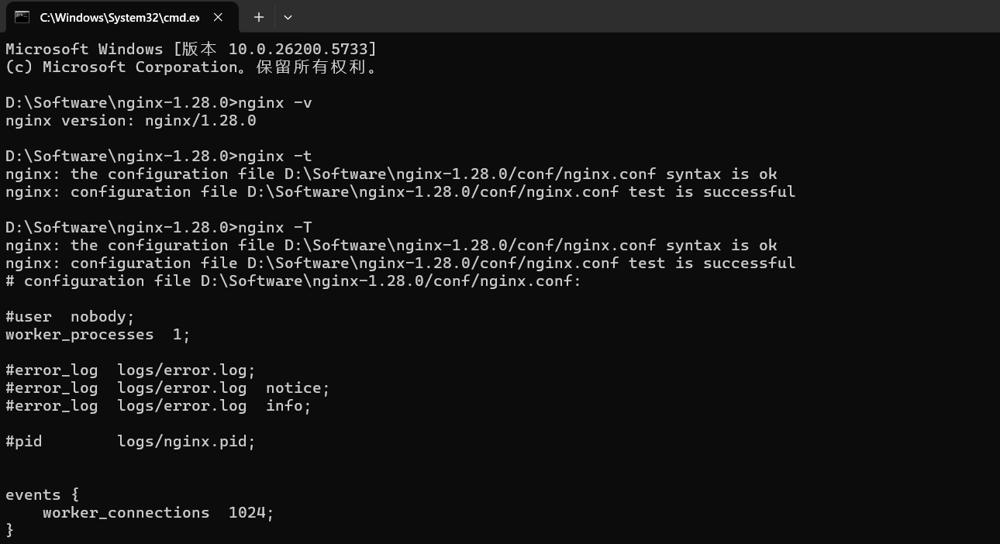
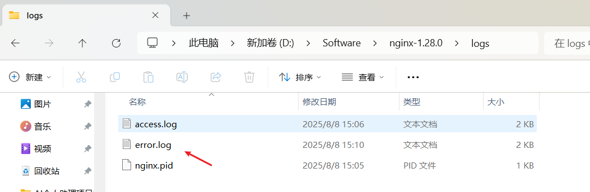

# Nginx 常用命令

## 常用命令

| 目的                           | Linux / macOS               | Windows（exe 同级目录）          |
| ------------------------------ | --------------------------- | -------------------------------- |
| **启动**                       | `nginx`                     | `start nginx` 或双击 `nginx.exe` |
| **优雅停止**                   | `nginx -s quit`             | `nginx -s quit`                  |
| **立即停止**                   | `nginx -s stop`             | `nginx -s stop`                  |
| **重载配置**（**热更新**）     | `nginx -s reload`           | `nginx -s reload`                |
| **重新打开日志**（切割日志用） | `nginx -s reopen`           | `nginx -s reopen`                |
| **测试配置是否正确**           | `nginx -t`                  | `nginx -t`                       |
| **打印配置信息**               | `nginx -T`                  | `nginx -T`                       |
| **指定配置文件启动**           | `nginx -c /path/nginx.conf` | `nginx -c D:\conf\nginx.conf`    |
| **指定前缀目录**               | `nginx -p /opt/nginx/`      | `nginx -p D:\nginx\`             |
| **查看版本 & 编译参数**        | `nginx -V`                  | `nginx -V`                       |
| **查看帮助**                   | `nginx -h`                  | `nginx -h`                       |

一行搞定常见组合

```bash
nginx -t && nginx -s reload   # 先检查再热重载
```

> 提示：Windows 下若提示找不到 `nginx.pid`，先 `start nginx` 确保进程已启动，再执行 `-s reload/quit` 即可。

**如图：**



## Nginx 日志存放位置

默认日志路径（可能因安装方式不同而变化）：

访问日志：`/nginx/log/nginx/access.log`

错误日志：`/nginx/log/nginx/error.log`


