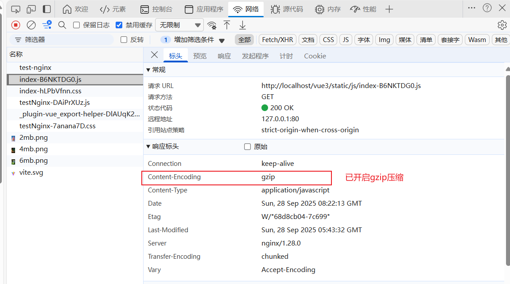
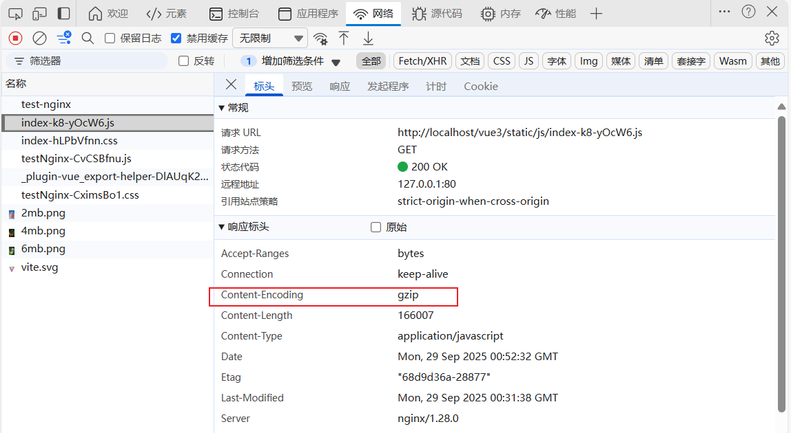

# 开启 gzip 压缩

[[toc]]

在前端项目中，`JS/CSS `文件较大时，启用 `Gzip` 压缩可以显著减少传输体积，提高页面加载速度。  
下面我以 `Vue3` 项目 为例，讲解如何在 本地 Nginx 环境下开启 Gzip，并验证效果。

**开启 gzip 压缩有两种方式：**

1. 服务器端开启 Gzip 压缩
2. 客户端开启 Gzip 压缩

但都要在 `nginx` 中配置，才能生效。

## 一、 服务器端开启 Gzip 压缩

将 Vue3 打包目录拷贝到 Nginx 的部署目录，我这里是 `D:\Deploy\vue3`


编辑 `Nginx` 配置` nginx.conf`，添加 `server` 配置：

```nginx
server {
    listen 8080;
    server_name localhost;

    # 压缩开启 [!code highlight:5]
    gzip on;                # 开启 gzip
    gzip_vary on;           # 根据 Accept-Encoding 缓存不同版本
    gzip_min_length 1024;   # 小于 1KB 的不压缩
    gzip_comp_level 6;      # 压缩等级
    gzip_types text/plain text/css application/javascript application/json text/html application/xml image/svg+xml;

    location / {
        try_files $uri $uri/ /index.html;
    }

    # vue3项目
    location /vue3/ {
        alias  D:/Deploy/vue3/;
        try_files $uri $uri/ /index.html last;
        index index.html index.htm;
    }
}
```

**配置解释：**

- gzip on：开启 Gzip 压缩
- gzip_types：指定压缩的文件类型
- try_files $uri $uri/ /index.html：Vue3 history 模式路由支持

启动 Nginx 后，访问 `http://localhost/vue3/`，查看 `Network` 面板，查看 `JS/CSS` 文件响应头的字段 `content-encoding` 为 `gzip`，说明开启了 Gzip 压缩。

如果没有 `content-encoding` 字段，说明未成功开启`gzip`。

**如下所示(成功开启)：**



**未成功开启：**


## 二、 客户端开启 Gzip 压缩（也需要配置 nginx）

客户端开启 Gzip 压缩，需要在使用第三方插件在打包构建时就需要生成对应的 `.gz` 文件。我的 vue3 项目使用的是 `vite-plugin-compression`,在 vite.config.ts 中这样配置：

```ts
import compressionPlugin from "vite-plugin-compression";

export default defineConfig({
  plugins: [
    // gzip压缩
    ViteCompression({
      verbose: true, // 是否在控制台输出压缩结果
      disable: false, // 是否禁用
      threshold: 1024, // 体积大于 threshold 才会被压缩,单位 b
      algorithm: "gzip", // 压缩算法,可选 [ 'gzip' , 'brotliCompress' ,'deflate' , 'deflateRaw']
      ext: ".gz", // 生成的压缩包后缀
      deleteOriginFile: false //压缩后是否删除源文件
    })
  ]
});
```

运行 `vite build` 打包项目，会在 `dist` 目录下生成对应的 `.gz` 文件。

**如下所示：**


然后在 nginx 中配置`gzip on` 和 `gzip_static on;`，开启直接返回 `.gz` 文件的功能。

```nginx
server {
    listen 80;
    server_name localhost;

    # 压缩开启 [!code highlight:2]
    gzip on;
    gzip_static on;  # 直接返回 .gz 文件

    location / {
        try_files $uri $uri/ /index.html;
    }

    # vue3项目
    location /vue3/ {
        alias  D:/Deploy/vue3/;
        try_files $uri $uri/ /index.html last;
        index index.html index.htm;
    }
}
```

最后访问部署的项目 `http://localhost/vue3/`，查看 `Network` 面板，查看 `JS/CSS` 文件响应头的字段 `content-encoding` 为 `gzip`，说明开启了 Gzip 压缩。

**如下所示：**



## 三、总结

### 1️. `vite-plugin-compression` 的作用

- 在 **构建阶段**就把静态资源（JS/CSS/HTML）生成压缩文件（如 `.gz` 或 `.br`）。
- 优点：

  - 浏览器访问时直接获取压缩文件，不需要 Nginx 或其他服务器再压缩
  - 减少服务器 CPU 消耗，适合高并发场景

- 缺点：

  - 文件体积会多一份（原文件 + 压缩文件）
  - 部署时服务器需要正确配置，让 `.gz` 文件直接返回给浏览器

### 2️. Nginx Gzip 压缩与插件的区别

| 特性       | Nginx Gzip                                | vite-plugin-compression               |
| ---------- | ----------------------------------------- | ------------------------------------- |
| 压缩时机   | 请求时（服务器动态压缩）                  | 构建时（生成静态压缩文件）            |
| CPU 消耗   | 高并发时占用服务器 CPU                    | 构建阶段消耗 CPU，运行时几乎零消耗    |
| 配置复杂度 | 简单：`gzip on` + `gzip_types`            | 需要插件 + 配置 Nginx 支持 `.gz` 文件 |
| 文件存储   | 不占额外磁盘空间                          | 占额外空间（生成 `.gz` 文件）         |
| 性能       | 小文件差异不大，长连接 + HTTP2 可快速传输 | 高并发大文件优势明显                  |

### 3️. 实际项目选择建议

1. **本地开发或小型项目**

   - 只使用 **Nginx Gzip** 就够了
   - 简单配置即可，无需插件

2. **大型项目 / 高并发部署**

   - 推荐在 **构建阶段生成压缩文件**（`vite-plugin-compression`）
   - 配合 Nginx 配置：

     ```nginx
     location /assets/ {
        gzip on;
        gzip_static on;  # 直接返回 .gz 文件
        expires 1y;
        add_header Cache-Control "public, immutable";
     }
     ```

   - 优点：请求时不再动态压缩，CPU 占用低，性能更稳定

## 四、常见问题

### 1️. Nginx 配置作用域规则

- Nginx 配置指令有 **全局、http、server、location** 作用域
- **某些指令只能在 http/server 级别生效，或者全局继承**
- `gzip on;` 指令就是典型例子：

  - 可以在 **http** 或 **server** 块中开启
  - 在 **location 块** 中开启，有些版本/编译方式不生效，导致 gzip header 不加

> 官方文档也说明：`gzip` 可以在 http、server 或 location 块启用，但有些版本 location 中开启可能不触发 `gzip_static` 的 `Content-Encoding` 逻辑

### 2. `gzip_static on;` 的作用

如果请求的文件存在`.gz`压缩文件，直接返回该文件给浏览器。

**请求流程（开启 gzip_static）**：

1. 浏览器请求资源 `app.js`，并发送 `Accept-Encoding: gzip`
2. Nginx 检查：

   - 是否存在 `app.js.gz`
   - 浏览器是否支持 gzip

3. 如果条件满足：

   - 返回 `app.js.gz` 文件内容
   - **必须开启全局 `gzip on;` 才会自动添加 `Content-Encoding: gzip` 响应头**

4. 浏览器收到响应后自动解压显示

### 3. `gzip_static on; + 静态压缩文件` 与 `gzip on;` 同时存在？

**优先级原则**

1. **如果请求的资源存在 `.gz` 文件，且浏览器支持 gzip**

   - Nginx **优先使用 `.gz` 文件**（gzip_static）
   - `gzip on` 不会再次压缩 `.gz` 文件

2. **如果请求的资源没有 `.gz` 文件**

   - Nginx 会使用 `gzip on` 对原文件进行动态压缩

::: warning 注意

想要开启 `gzip`压缩，`gzip on;` 必须开启全局，才能自动添加 `Content-Encoding: gzip` 响应头。

只有 `gzip_static` 是不会生效的。

:::
