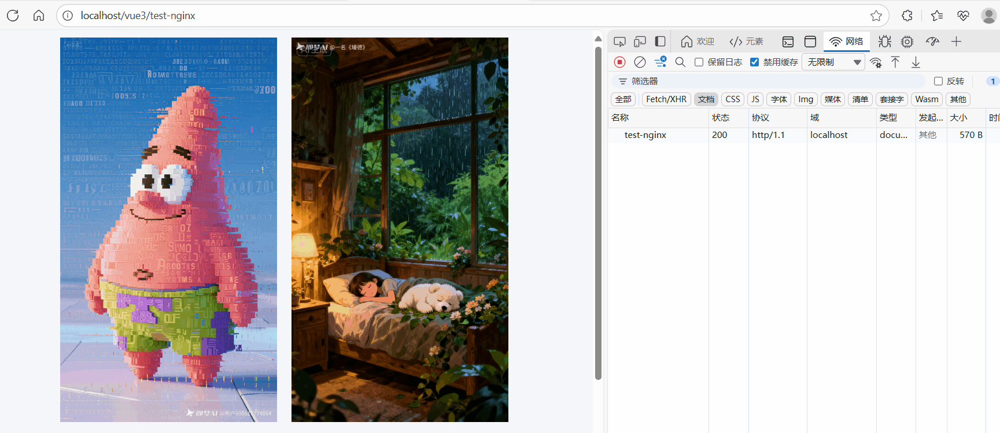

# Nginx 实现域名跳转的几种方式

[[toc]]

在日常项目中，我们经常会遇到这样的需求或情况：

- 访问 `http://abc.com` 时，强制跳到 `https://www.abc.com`，上面域名发生变化。
- 旧域名 `old.com` 迁移到 `new.com`，用户访问旧域名时需要自动跳转。
- 为了 SEO 统一入口，`abc.com` 和 `www.abc.com` 最终都要跳到同一个主域名。

对于域名跳转，我们可以在 **Web 服务器层实现** 也可以在 **应用层中**实现。下面我主要讲解在`Web 服务层 Nginx`中的实现方式。

这些场景在 **Nginx** 中都可以很优雅地实现，如下：

## 1. 301 永久重定向（推荐 SEO 场景）

如果网站更换了域名，或者需要强制统一入口，可以用 `301` 永久重定向。

```nginx
server {
    listen 80;
    server_name old.com;

    # 永久重定向到新域名，并保留路径和参数
    return 301 https://new.com$request_uri;
}
```

📌 说明：

- `301`：告诉浏览器和搜索引擎，这是永久跳转，搜索引擎会更新索引。
- `$request_uri`：保留原路径和查询参数，比如 `/about?from=123`。

**示例效果**：访问 `http://old.com/about` → 自动跳到 `https://new.com/about`

**如下图演示所示：**

我图中的演示是本地项目跳百度链接的 demo，实际项目中可以根据实际情况进行配置。



我本地项目的配置：

```nginx
server {
    listen 80;
    server_name localhost;

    # 永久重定向到新域名
    return  301 https://www.baidu.com;
}
```

## 2. 302 临时重定向（推荐活动页/短链场景）

如果只是临时跳转（例如活动推广、临时域名），可以使用 `302`。

```nginx
server {
    listen 80;
    server_name promo.old.com;

    # 临时跳转，不会影响搜索引擎索引
    return 302 https://event.new.com$request_uri;
}
```

📌 说明：

- `302`：临时跳转，搜索引擎不会更新索引。
- 常用于：活动页、营销短链。

## 3. 强制 HTTPS 跳转

为了保证安全，通常会把所有 HTTP 请求跳转到 HTTPS。

```nginx
server {
    listen 80;
    server_name www.abc.com;

    return 301 https://www.abc.com$request_uri;
}
```

📌 效果：访问 `http://www.abc.com/login` → 自动跳到 `https://www.abc.com/login`

## 4. 去掉或强制 `www`

很多公司会要求所有请求统一成 `www.abc.com` 或 `abc.com`，这样可以避免 SEO 重复收录。

### 去掉 `www` → 跳到裸域名

```nginx
server {
    listen 80;
    server_name www.abc.com;

    return 301 https://abc.com$request_uri;
}
```

### 强制加 `www`

```nginx
server {
    listen 80;
    server_name abc.com;

    return 301 https://www.abc.com$request_uri;
}
```

## 5. 正则匹配更复杂的跳转

有时候旧域名和新域名的路径不一样，可以用正则匹配。

```nginx
server {
    listen 80;
    server_name old.com;

    location /oldpath/(.*) {
        return 301 https://new.com/newpath/$1;
    }
}
```

📌 效果：访问 `http://old.com/oldpath/123` → 跳到 `https://new.com/newpath/123`

## 6. 总结

在日常项目中，推荐优先使用 **Nginx 配置跳转**，因为：

- 配置简单，性能高，不会增加应用层压力。
- `301/302` 语义明确，对 SEO 和用户体验都更友好。
- 可以灵活控制是否保留路径和参数。

**常见实践**：

- **SEO & 域名统一** → 用 `301`
- **活动页 & 临时跳转** → 用 `302`
- **安全要求** → 强制 HTTPS

## 7. 常见问题

### 1. 301 和 302 的区别

从 **用户体验** 来看：

- 浏览器访问时，都会立即跳转到新地址，看起来没什么差别（所以你测试时感觉一样）。

从 **底层逻辑** 来看：

- **301 永久重定向**

  - 告诉浏览器/搜索引擎：这个资源以后都在新地址了。
  - 浏览器可能会 **缓存跳转规则**，下次再访问旧域名时，直接跳过请求。
  - 搜索引擎会更新索引，把权重转移到新域名。

- **302 临时重定向**

  - 告诉浏览器/搜索引擎：这是临时跳转，原地址以后还可能恢复。
  - 浏览器一般不会长期缓存规则。
  - 搜索引擎不会把权重转移到新域名。

📌 总结：

- **SEO 场景（换域名/统一入口）** → 用 **301**。
- **临时活动 / 营销页** → 用 **302**。
- **用户体验**基本一样，主要区别在 **缓存 & 搜索引擎**。

### 2. `return 302 https://event.new.com$request_uri;` 是否是固定写法

这不是唯一写法，但这是最常见、最简洁的写法。

- `return 302` → 表示返回一个 **302 临时重定向** 状态码。
- `https://event.new.com` → 目标域名。
- `$request_uri` → 变量，代表原始请求的路径和参数。

#### 举个例子

用户请求：

```
http://promo.old.com/sale?from=wechat
```

Nginx 配置：

```nginx
return 302 https://event.new.com$request_uri;
```

跳转结果：

```
https://event.new.com/sale?from=wechat
```

#### 只跳到首页（不保留路径参数）

```nginx
return 302 https://event.new.com;
```

👉 无论用户访问什么路径，都直接跳到 `https://event.new.com` 首页。

#### 路径改写（比如 old → new）

```nginx
location /oldpath/(.*) {
    return 302 https://event.new.com/newpath/$1;
}
```

👉 `http://old.com/oldpath/123` → `https://event.new.com/newpath/123`

✅ 所以：

- `return 302 https://event.new.com$request_uri;` 只是最常见的写法（保留路径和参数）。
- 你完全可以根据项目需要，改成只跳首页、改写路径、或者换成 301。
