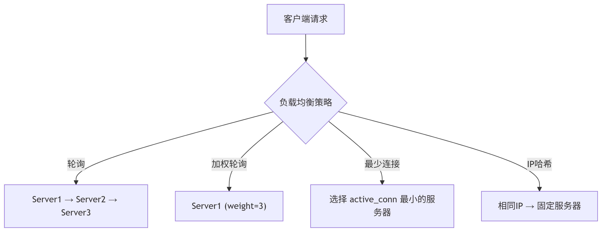

# **Nginx 负载均衡策略**

`Nginx `作为高性能的反向代理服务器，提供了多种负载均衡算法，能够有效分配客户端请求到后端服务器群集。

## **1. 基础负载均衡配置**

```nginx
http {
    upstream backend {
        # 定义后端服务器群
        server 10.0.0.1:80;
        server 10.0.0.2:80;
        server 10.0.0.3:80;
    }

    server {
        listen 80;

        location / {
            proxy_pass http://backend;
        }
    }
}
```

## **2. 核心负载均衡策略**

### **2.1 轮询（Round Robin）**

**默认策略**，按顺序均匀分配请求

```nginx
upstream backend {
    server 10.0.0.1; # 权重默认为1
    server 10.0.0.2;
}
```

**特点**：

- 简单公平的请求分配
- 不考虑服务器负载情况
- 适合服务器性能相近的场景

### **2.2 加权轮询（Weighted Round Robin）**

根据服务器性能分配不同权重

```nginx
upstream backend {
    server 10.0.0.1 weight=3; # 处理3倍请求
    server 10.0.0.2 weight=1;
}
```

**特点**：

- 高性能服务器可承担更多流量
- 权重比为请求分配比例（如 3:1）
- 需手动配置权重值

### **2.3 最少连接（Least Connections）**

优先选择当前连接数最少的服务器

```nginx
upstream backend {
    least_conn;
    server 10.0.0.1;
    server 10.0.0.2;
}
```

**特点**：

- 动态平衡服务器负载
- 适合长连接场景（如 WebSocket）
- 需要 Nginx 实时监控连接数

### **2.4 IP 哈希（IP Hash）**

基于客户端 IP 固定分配服务器

```nginx
upstream backend {
    ip_hash;
    server 10.0.0.1;
    server 10.0.0.2;
}
```

**特点**：

- 保持会话一致性（Session Persistence）
- 解决分布式会话问题
- 可能导致负载不均

### **2.5 响应时间优先（Least Time）**

Nginx Plus 专属，基于响应时间和连接数

```nginx
upstream backend {
    least_time header; # 或last_byte
    server 10.0.0.1;
    server 10.0.0.2;
}
```

**特点**：

- 商业版 Nginx 独有功能
- 选择最快响应的服务器
- 需要服务器性能监控

### **2.6 随机负载均衡（Random）**

随机选择后端服务器

```nginx
upstream backend {
    random;
    server 10.0.0.1;
    server 10.0.0.2;
}
```

**变种**：带权重的随机

```nginx
upstream backend {
    random two; # 随机选2台后根据权重选择
    server 10.0.0.1 weight=3;
    server 10.0.0.2 weight=1;
}
```

## **3. 高级配置技巧**

### **3.1 健康检查**

```nginx
upstream backend {
    server 10.0.0.1 max_fails=3 fail_timeout=30s;
    server 10.0.0.2;
}
```

- `max_fails`：允许失败次数
- `fail_timeout`：故障服务器暂停服务时间

### **3.2 备份服务器**

```nginx
upstream backend {
    server 10.0.0.1;
    server 10.0.0.2 backup; # 仅当主服务器不可用时启用
}
```

### **3.3 长连接优化**

```nginx
upstream backend {
    server 10.0.0.1;
    keepalive 32; # 保持的连接池大小
}
```

### **3.4 分片负载均衡**

```nginx
# 按URL路径分配到不同集群
location /video/ {
    proxy_pass http://video_backend;
}

location /api/ {
    proxy_pass http://api_backend;
}
```

## **4. 策略选择决策指南**

| 场景           | 推荐策略      | 原因         |
| -------------- | ------------- | ------------ |
| 常规 Web 应用  | 加权轮询      | 简单高效     |
| 会话依赖型应用 | IP 哈希       | 保持会话一致 |
| 长连接服务     | 最少连接      | 平衡持久连接 |
| 静态资源分发   | 轮询          | 无状态请求   |
| 高可用集群     | 健康检查+备份 | 故障自动转移 |
| 商业版环境     | 响应时间优先  | 最优性能     |

## **5. 可视化策略对比**



## **6. 性能监控建议**

1. **Nginx 状态模块**：

   ```nginx
   location /nginx_status {
       stub_status on;
       allow 10.0.0.0/24;
       deny all;
   }
   ```

2. **关键指标**：

   - 请求处理速率（Requests/sec）
   - 后端服务器响应时间
   - 活跃连接数

3. **日志分析**：
   ```nginx
   log_format upstream_log '$remote_addr - $upstream_addr - $upstream_response_time';
   ```

## **7. 常见问题解决方案**

**问题 1：会话不一致**  
👉 方案：使用`ip_hash`或引入 Redis 集中式会话存储

**问题 2：某台服务器过载**  
👉 方案：调整权重或启用`least_conn`

**问题 3：健康检查不灵敏**  
👉 方案：减小`fail_timeout`值（如改为 10s）

**问题 4：DNS 缓存问题**  
👉 方案：在 upstream 中直接使用 IP 地址
