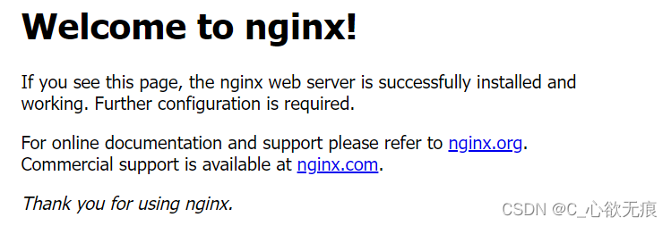
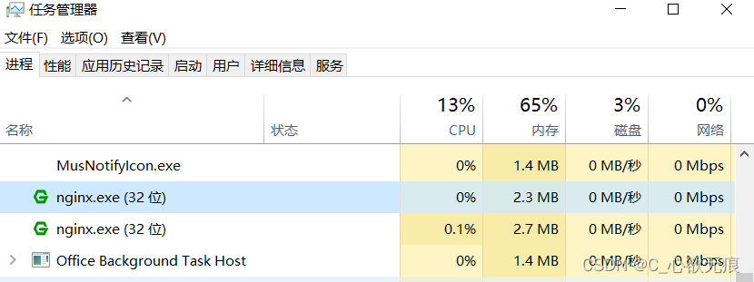
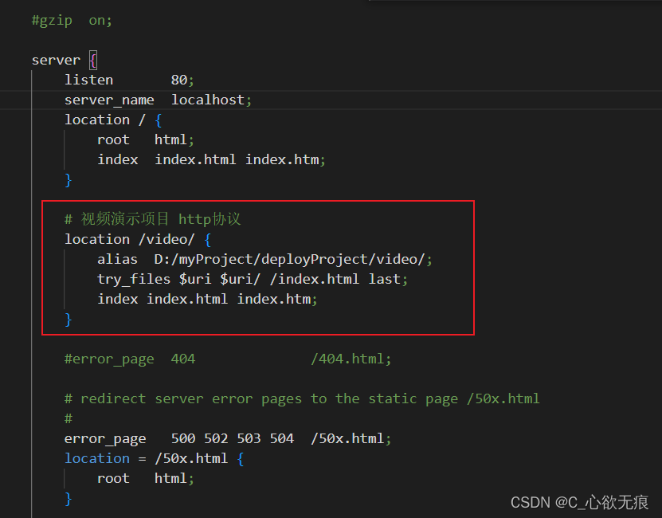

# 使用 nginx 部署 vue 项目到本地以及代理

[[toc]]

> [!TIP]
> 介绍本篇介绍打包后的 vue 项目使用 nginx 部署到本地以及接口的反向代理和负载均衡；<br/>
> 前提：准备一个打包后的 vue 项目和安装 nginx;

## 1，先安装 nginx

下载链接：[http://nginx.org/en/download.html](http://nginx.org/en/download.html)

我安装的是：`1.16.1 `版本的，如下：

{width=70%}

**然后解压到一个指定的文件夹就行；双击根目录的 nginx 图标** ，然后再访问 [http://localhost/](http://localhost/)若出现以下页面表示启动成功：

{width=70%}


**也可以在任务管理器中查看是否启动成功:**

{width=70%}


## 2，打包 vue 项目

在 vue 项目根目录的 vue.config.js 文件配置 publicPath 路径；如下：

```javascript
module.exports = {
  outputDir: "video", //打包后的文件夹名字及路径
  publicPath: "/video/", // 生产的项目名
  lintOnSave: false
};
```

然后运行 `npm run build` 打包完成；打包后的就是根目录下的 video 文件；


## 3，修改 nginx 配置文件

> 此步需要进入到 nginx 的 conf/nginx.conf 下面新增一个 `路径监听`，这个路径对应的就是 vue 项目打包后存放的本地的绝对路径，如下：

### 3.1 先进入到 nginx.conf 里面


### 3.2 添加 nginx.conf 路径监听

在配置文件里面加入我画红线的内容；`alias` 对应的就是本地打包后的项目文件夹存放的本地路径；

::: warning 注意！ 

location /video/ 这个`nginx`映射路径一定要对应 ：  

`vue` 2项目的 `publicPath : "/video/"` 或者  
`vite` 项目的` base: "/video/"`

末尾一定要加 `/`
:::

一旦映射错误，报下面错误：

::: danger 错误提示！

Failed to load module script: Expected a JavaScript-or-Wasm module script but the server responded with a MIME type of "text/html". Strict MIME type checking is enforced for module scripts per HTML spec.

:::


{width=70%}

配置如下：

```nginx
# 视频演示项目 http协议
location /video/ {
    alias  D:/myProject/deployProject/video/;
    try_files $uri $uri/ /index.html last;
    index index.html index.htm;
}
```

### 3.3 设置反向代理和负载均衡

如果你部署的里面有接口的请求，那么需要设置反向代理和负载均衡，请好好的看下面案例：

```nginx
upstream serve_backend {
	ip_hash;
	server 192.168.11.68:20201;
	server 192.168.11.69:20201 weight=1 down;
	server 192.168.11.70:20201 weight=2;
	server 192.168.11.71:20201 weight=3 backup;
	server 192.168.11.72:20201 weight=1 max_fails=3 fail_timeout=30s;
}
```

::: warning 配置说明

1. **down：** 表示当前的 server 暂时不参与负载
2. **weight：** 默认为 1.weight 越大，负载的权重就越大
3. **backup：** 其它所有的非 backup 机器 down 或者忙的时候，请求 backup 机器。所以这台机器压力会最轻
4. 上例中 192.168.11.72:20201 设置最大失败次数为 3，也就是最多进行 3 次尝试，且超时时间为 30 秒；（max_fails 的默认值为 1，fail_timeout 的默认值是 10s。）
5. 注意，当**upstream**中只有一个**server** 时，max_fails 和 fail_timeout 参数可能不会起作用； weight\backup 不能和 ip_hash 关键字一起使用。
6. 最后在需要使用负载均衡的 server 中增加 proxy_pass http://serve_backend/，对应 upstream 的名字。
7. nginx.conf 的 serve 模块配置如下：  
:::

nginx.conf 的 serve 模块配置如下：

```nginx
http {
    include       mime.types;
    default_type  application/octet-stream;

    sendfile        on;
    #tcp_nopush     on;

    #keepalive_timeout  0;
    keepalive_timeout  65;

    #gzip  on;

    # 在这里 设置负载均衡
    # 上面有讲解
    upstream serve_backend{
		ip_hash;
		server 192.168.11.68:20201;
		server 192.168.11.69:20201 weight=1 down;
		server 192.168.11.70:20201 weight=2;
		server 192.168.11.71:20201 weight=3 backup;
		server 192.168.11.72:20201 weight=1 max_fails=3 fail_timeout=30s;
	}

    server {
        listen       80;
        server_name  localhost;
        location / {
            root   html;
            index  index.html index.htm;
        }

        # 视频演示项目 http协议
        location /video/ {
            alias  D:/myProject/deployProject/video/;
            try_files $uri $uri/ /index.html last;
            index index.html index.htm;
        }

        # 在这里设置反向代理
        # wxserver 是需要代理的标志
        location /wxserver/ {
            proxy_pass http://serve_backend/;
            # 启用keep alive
            proxy_http_version 1.1;
            proxy_set_header Connection "";

            # 获取 xforward和真实IP
            proxy_set_header  X-Forwarded-For  $proxy_add_x_forwarded_for;
            proxy_set_header  X-Real-IP  $remote_addr;
            proxy_set_header  Host $host;
        }


        #error_page  404              /404.html;
        # redirect server error pages to the static page /50x.html
        #
        error_page   500 502 503 504  /50x.html;
        location = /50x.html {
            root   html;
        }
    }
```

## 4，重启 nginx

上面如果没有涉及到接口的请求，就不用设置`第3.3步骤`了；设置完成后需要到任务管理器结束掉所有的 nginx 进程，然后进入到 nginx 根目录下 双击 nginx 图标，重新启动 nginx;

## 5，重新访问项目路径

然后再重新访问本地项目路径：`http://localhost/video/login` ; `/video`是 nginx 代理到本地的映射，一定要有 `/login` 是你 vue 项目的入口路由 ，一定要有后面就进入到你的项目了，使用的接口也是代理过的。

如下：部署成功；


