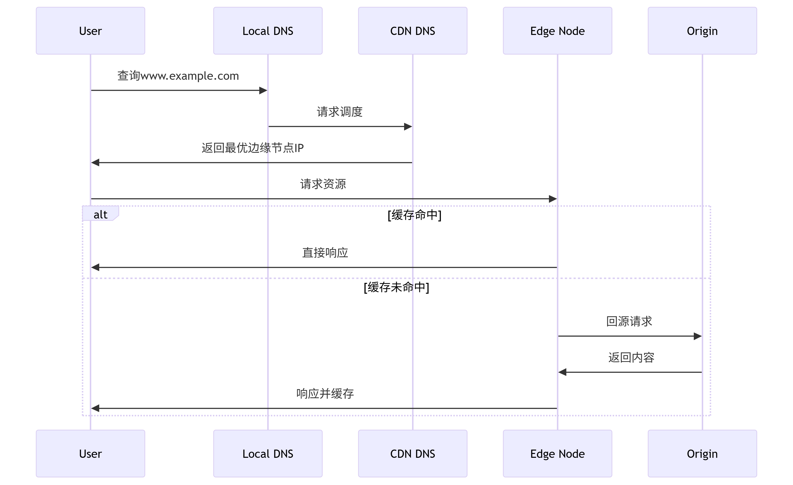

# 为什么前端说 CDN 会比较快？

[[toc]]

在现代 `Web` 开发中，**CDN（内容分发网络）** 是提高网站性能的常用技术。前端开发者常常说，“使用 CDN 后，网站会变得更快”，这背后到底有什么原理？

## 一、CDN 简介

`CDN（Content Delivery Network）`是一种将内容存储在分布全球的 **边缘节点** 上的网络架构。当用户请求某个资源时，CDN 会选择离用户地理位置最近的服务器节点提供资源，从而减少网络延迟、提高加载速度。

## 二、CDN 提升速度的关键原因

### 1. **地理位置接近用户**

CDN 最核心的特点是它通过 **全球分布的节点** 缓存资源，用户请求时可以从 **离用户最近的边缘节点** 获取资源，避免了长距离传输的延迟。比如，一个位于美国纽约的用户访问一个托管在中国服务器的资源时，通过 CDN，用户可以从 **美国的边缘节点** 获取内容，减少了跨洲访问的延迟。

### 2. **缓存静态资源**

CDN 可以缓存 **静态资源**，例如图片、CSS 文件、JavaScript 文件等。当这些资源被请求时，CDN 会直接返回缓存的内容，而不需要每次都回到源站（原始服务器）获取。这种 **缓存机制** 大大减少了回源请求的次数，提高了资源的获取速度，尤其在 **高流量场景**下表现尤为明显。

### 3. **负载均衡和智能路由**

CDN 利用 **负载均衡** 技术，将用户的请求自动路由到 **最优的节点**。不仅会根据用户的 **地理位置** 选择最近的节点，还会根据 **网络质量**（如带宽、延迟等）选择响应最快的节点。这种智能的流量调度确保了即使在网络高峰期，网站也能维持良好的性能。

### 4. **减轻源站压力**

源站（原始服务器）在没有 CDN 时，所有的用户请求都必须直接到源站服务器处理，这会造成源站负载过高，影响性能。而通过使用 CDN，大部分请求可以由 CDN 节点直接处理，**源站负载大大减少**，从而提高了源站的稳定性和响应速度。

## 三、CDN 在前端开发中的应用

### 1. **静态资源加速**

大多数前端网站会将静态资源（如图片、视频、JS 和 CSS 文件）托管在 CDN 上。通过将这些常见资源分发到边缘节点，用户可以快速加载网站的静态内容，提升页面加载速度。

### 2. **媒体文件加速**

对于 **视频、音频** 等大文件，CDN 能通过其全球节点加速内容分发，尤其是对于大规模直播或点播平台，CDN 的加速效果尤其显著，减少了卡顿和缓冲。

### 3. **动态内容分发**

尽管 CDN 主要用于加速静态资源，但一些 CDN 也支持动态内容的分发。通过优化边缘节点和源站之间的通信，CDN 也能在某些场景下加速动态内容的请求，进一步提高网站的性能。

### 4. **DDoS 防护与安全加速**

CDN 通常提供 **DDoS 防护** 和 **WAF（Web 应用防火墙）** 等安全功能，能够在全球范围内拦截恶意流量，保护网站免受攻击，确保网站在流量激增时依然稳定运行。

## 四、CDN 工作流程

总的来说，前端说 CDN 会比较快，是因为 CDN 通过以下几种方式加速网站访问：

- **地理位置的优化**：通过将资源缓存到离用户更近的服务器节点，减少了网络延迟。
- **缓存机制**：CDN 缓存静态资源，避免频繁回源，提升访问速度。
- **负载均衡**：通过智能路由和负载均衡技术，确保请求能够快速响应。
- **减轻源站压力**：分担源站的流量，减少源站的负载，保证网站的稳定性。
