# HTTPS(TSL 和 SSL)

[[toc]]

## 一、HTTPS 协议

`HTTPS，全称为 Hypertext Transfer Protocol Secure`，是一种通过加密通道传输数据的安全协议。它是 `HTTP` 协议的安全版本，用于在 Web 浏览器和 Web 服务器之间进行安全的数据传输。`HTTPS` 在传输过程中使用了` SSL（Secure Sockets Layer）或 TLS（Transport Layer Security）`协议来加密数据，确保敏感信息在传输过程中不会被窃取或篡改。

**http 缺点:**

1、通信使用明文(不加密)，内容可能会被盗用  
2、不验证通信方的身份，因此有可能遭遇伪装  
3、无法证明报文的完整性，所以有可能已遭篡改

**https 优点:**

1、信息加密  
2、完整性校验  
3、身份验证

**身份验证**

HTTPS = http + TLS/SSL

## 二、SSL/TLS 协议

`SSL（Secure Sockets Layer，安全套接层）和 TLS（Transport Layer Security，传输层安全）`是用于在计算机网络中提供加密通信的安全协议。

SSL：由网景公司(Netscape)于 1994 年开发，现已淘汰（最新版本 SSL 3.0 于 2015 年被弃用） TLS：是 SSL 的标准化版本，由 IETF 开发（是 SSL 的后续版本）

TLS 1.0 (1999) → TLS 1.1 (2006) → TLS 1.2 (2008) → TLS 1.3 (2018)

**所以说现在使用最多的是 TLS 协议（SSL 只是名声比较大）**

> [!TIP] 面试题：SSL/TLS 是在 TCP 那一层做的加密呢？答案：应用层的下面，传输层的上面 ；也可以把它理解为一个安全层

`SSL/TLS` 使用了三种加密方式，分别是：

1. 对称加密
2. 非对称加密
3. 哈希算法（散列函数加密）

## 三、三种加密方式

这里只介绍加密的基本概念，如何使用见:[常用加密方式使用](/column/Project/性能与架构/前端常用加密方式.html#前端常用加密方式使用)

### 1. 对称加密（AES、DES）

**比喻**：就像你和朋友共用一个密码锁保险箱，你们都有相同的钥匙，你用钥匙打开保险箱，朋友也用钥匙打开保险箱，这样就可以安全地交换信息了。

### 2. 非对称加密（RSA、DSA）

**比喻**：就像你和朋友分别有两把钥匙，一把是公钥，一把是私钥。你用公钥加密的信息，只有用私钥才能解密。朋友用公钥加密的信息，只有用私钥才能解密。这样就可以安全地交换信息了。

公钥可以对外公开，私钥必须保密。

### 3. 哈希算法（散列函数加密）

**比喻**：就像你和朋友都有一个密码本，你写的每一条信息都有一个对应的密码，这个密码就是哈希值。你把哈希值写在密码本上，朋友可以根据哈希值找到对应的信息。这样就可以安全地交换信息了。

**哈希算法的特点**

1. 输入任意长度的消息，输出固定长度的哈希值。
2. 不同的输入会得到不同的哈希值。
3. 相同的输入会得到相同的哈希值。
4. 不能根据哈希值反推输入的消息。

## 四、使用 HTTPS

### 4.1 openSSL 安装和配置

[openSSL 下载地址](https://slproweb.com/products/Win32OpenSSL.html), 下载后安装即可。

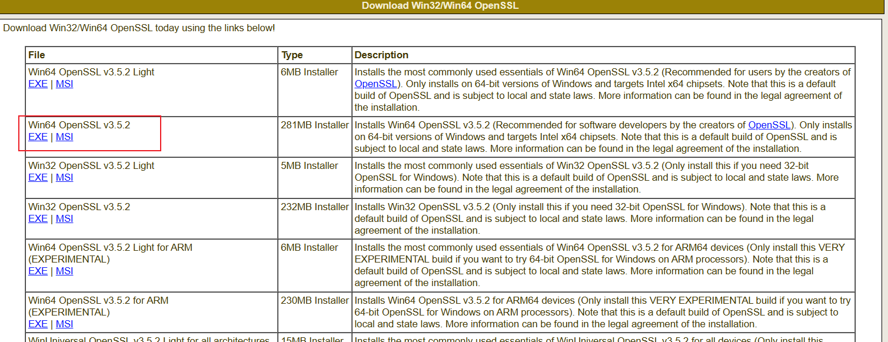

**取消勾选付费：**

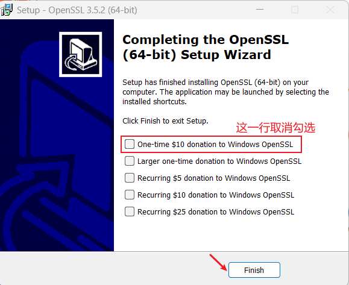

**打开 OpenSSL**

找到 OpenSSL 安装目录下的【start.bat】脚本双击启动，打开 OpenSSL 命令行窗口。

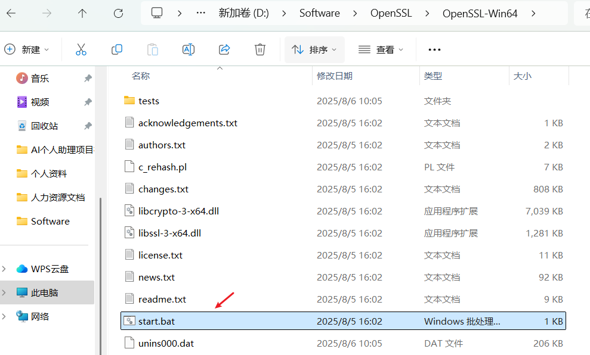

**配置全局环境变量**

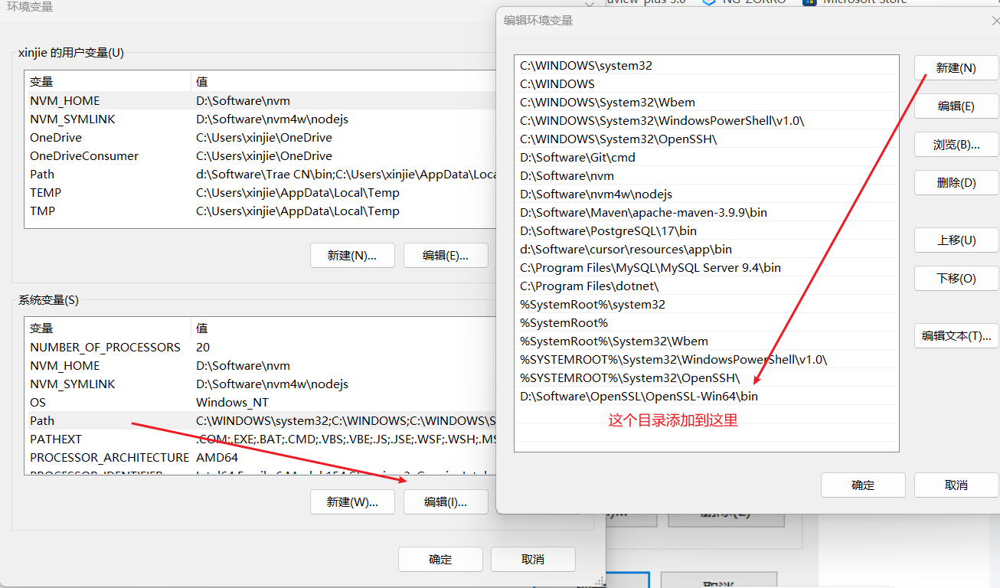

cmd 验证：按【win+R】键打开运行窗口 → 输入【cmd】→ 点击【确定】打开命令提示符 → 输入 OpenSSL → 然后就可以使用 OpenSSL 了 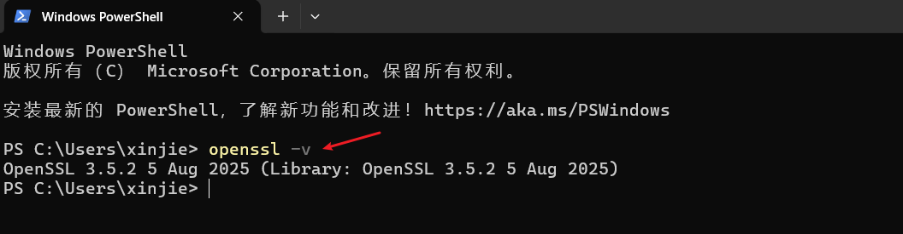

### 4.2 openSSL 生成私钥和证书

在 `SSL/TLS `加密通信中，一般需要使用三个文件来完成证书相关操作，即：

1、私钥文件（例如 "private-key.pem"），用于对加密数据进行解密操作。  
2、证书签名请求文件（例如 "certificate.csr"），用于向 CA 申请 SSL/TLS 证书签名。  
3、`SSL/TLS` 证书文件（例如 "certificate.pem"），用于对客户端发送的请求进行验证，以确保通信安全可靠。

#### 1. 生成私钥

在 OpenSSL 命令行窗口中输入以下命令，即可生成一个 2048 位的 RSA 私钥文件（private-key.pem）：

```bash
# 运行
openssl genpkey -algorithm RSA -out private-key.pem -aes256

# 下面是命令参数介绍
openssl: OpenSSL 命令行工具的名称。
genpkey: 生成私钥的命令。
-algorithm RSA: 指定生成 RSA 私钥。
-out private-key.pem: 将生成的私钥保存为 private-key.pem 文件。
-aes256: 为私钥添加 AES 256 位加密，以保护私钥文件不被未经授权的人访问。
Enter PEM pass phrase 123456 密码短语生成pem文件的时候需要
```

**注意**: 主动输入的密码短语一定要记住，不能忘记；这里我输入的是`123456`

如下： 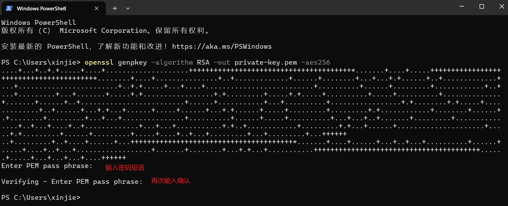

#### 2. 生成 csr 证书签名

在 OpenSSL 命令行窗口中输入以下命令，即可生成一个`certificate.csr`：

```bash
# 运行
openssl req -new -key private-key.pem -out certificate.csr

# 下面是命令参数介绍
"req": 表示使用 X.509 证书请求管理器 (Certificate Request Management) 功能模块。
"-new": 表示生成新的证书签名请求。
"-key private-key.pem": 表示使用指定的私钥文件 "private-key.pem" 来加密证书签名请求中的密钥对。
"-out certificate.csr": 表示输出生成的证书签名请求到文件 "certificate.csr" 中。该文件中包含了申请者提供的一些证书请求信息，例如公钥、授权主体的身份信息等。
```

**如下**：

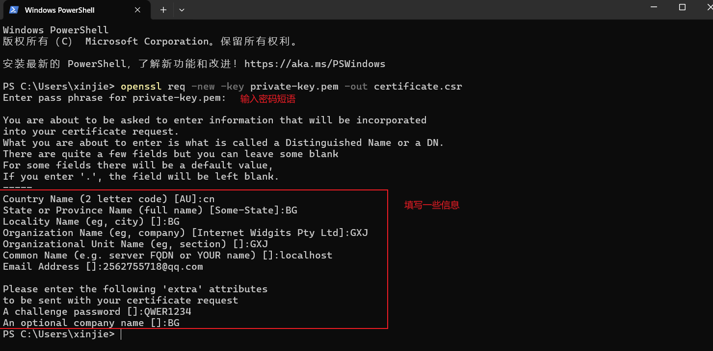

**填写的信息字段说明：**

```bash
Country Name (2 letter code) []:CN   国家
State or Province Name (full name) []:BJ 省份
Locality Name (eg, city) []:BJ 城市
Organization Name (eg, company)GXJ 组织或者是个人
Organizational Unit Name (eg, section) []:XMKJ 机构名称
Common Name (eg, fully qualified host name) []:localhost 域名
Email Address []: 邮箱地址
Please enter the following 'extra' attributes
to be sent with your certificate request
A challenge password []:  密码加盐 QWER1234
```

#### 3. 生成 pem 证书文件

在 OpenSSL 命令行窗口中输入以下命令，即可生成一个`certificate.csr`：

```bash
# 运行
openssl x509 -req -in certificate.csr -signkey private-key.pem -out certificate.pem

# 下面是命令参数介绍
"x509": 表示使用 X.509 证书管理器功能模块。
"-req": 表示从输入文件（这里为 "certificate.csr"）中读取证书签名请求数据。
"-in certificate.csr": 指定要读取的证书签名请求文件名。
"-signkey private-key.pem": 指定使用指定的私钥文件 "private-key.pem" 来进行签名操作。一般情况下，签名证书的私钥应该是和之前生成 CSR 的私钥对应的。
"-out certificate.pem": 表示将签名后的证书输出到文件 "certificate.pem" 中。该文件中包含了签名后的证书信息，包括签名算法、有效期、公钥、授权主体的身份信息等。
Enter pass phrase for private-key.pem: 密码短语
```

**如下：**

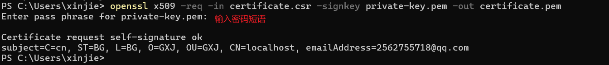

至此我们生成了三个文件：就可以使用`https`了

1、private-key.pem：私钥文件，用于对加密数据进行解密操作。  
2、certificate.csr：证书签名请求文件，用于向 CA 申请 SSL/TLS 证书签名。  
3、certificate.pem：`SSL/TLS` 证书文件，用于对客户端发送的请求进行验证，以确保通信安全可靠。

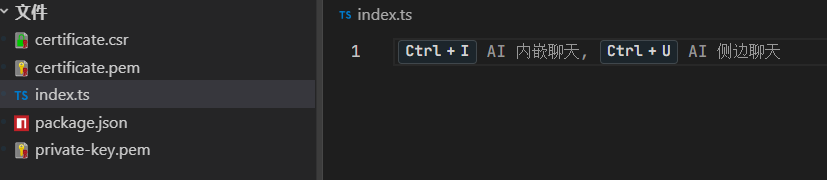

### 4.3 Nodejs 接口测试 https（后端服务）

项目目录如下:

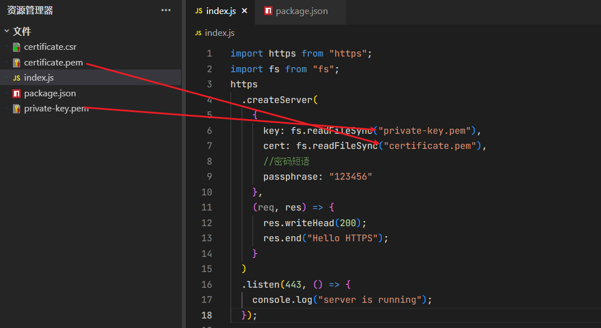

```js
import https from "https";
import fs from "fs";
https
  .createServer(
    {
      key: fs.readFileSync("private-key.pem"),
      cert: fs.readFileSync("certificate.pem"),
      //密码短语
      passphrase: "123456"
    },
    (req, res) => {
      res.writeHead(200);
      res.end("Hello HTTPS");
    }
  )
  .listen(443, () => {
    console.log("server is running");
  });
```

然后启动服务：

```bash
# 运行
node index.js
```

**直接访问 https://localhost**

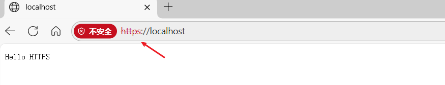

可以看到，访问成功了。

### 4.4 Nginx 配置 https（前端服务）

先下载[nginx](https://nginx.org/en/download.html)

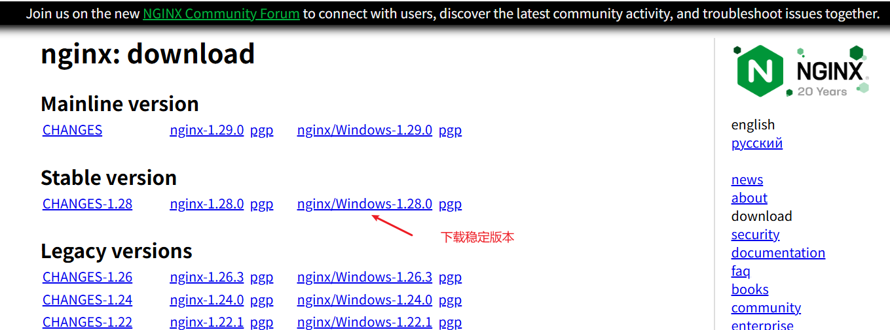

**注意：** 如果在 windows 使用 nginx 配置 https 私钥不能设置密码。所以私钥命令使用（`openssl genrsa -out nginx.key 2048`）。

在 `nginx.cof` 的同目录下面使用 `cmd `命令行生成以下三个文件，分别是：

1、`nginx.key`：生成私钥文件。  
2、`nginx.csr`：生成签名文件。  
3、`nginx.crt`：证书文件。

#### 1. 生成私钥

```bash
openssl genrsa -out nginx.key 2048
```

#### 2. 生成签名文件

```bash
openssl req -new -key nginx.key -out nginx.csr
```

**如下：**

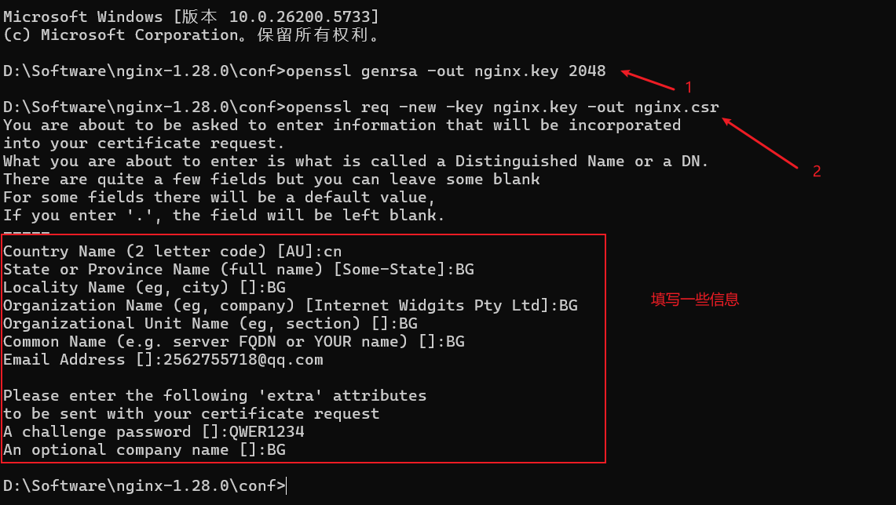

#### 3. 生成证书文件

```bash
openssl x509 -req -in nginx.csr -signkey nginx.key -out nginx.crt
```

**如下：**

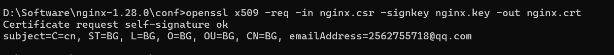

#### 4. 在 nginx 配置文件

只配置 `https` 证书，也就是监听端口为`443`的。

```bash
    server {
       listen       443 ssl;
       server_name  localhost;

       ssl_certificate      nginx.crt;
       ssl_certificate_key  nginx.key;

       ssl_session_cache    shared:SSL:1m;
       ssl_session_timeout  5m;

    #    ssl_ciphers  HIGH:!aNULL:!MD5;
    #    ssl_prefer_server_ciphers  on;

       location / {
           root   html;
           index  index.html index.htm;
       }
    }
```

配置完成后运行 `nginx` 服务。

**如下：**

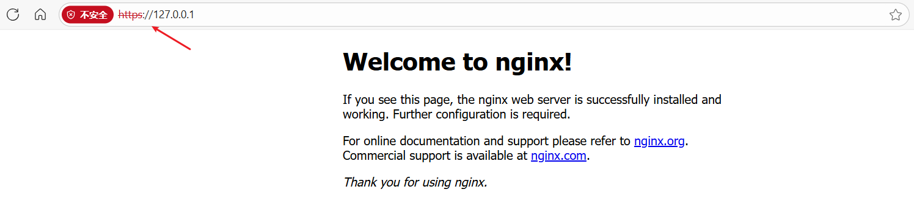

`https` 访问成功。

## 五、什么是哈希算法

一句话 ：`哈希算法（Hash Function）`是把**任意长度的输入**通过确定的数学变换，映射成**固定长度的、看似随机的输出**（哈希值 / 摘要 / 指纹）的规则。

---

### 1. 核心特征

| 特征         | 解释                           | 例子                              |
| ------------ | ------------------------------ | --------------------------------- |
| **确定性**   | 同一输入永远得到同一输出       | `"hello"` → `2cf24dba…` 每次一样  |
| **定长输出** | 输出长度固定，与输入大小无关   | SHA-256 永远 256 bit              |
| **不可逆**   | 从输出无法反推输入（单向函数） | 知道 `5d41402a…` 算不回 `"hello"` |
| **雪崩效应** | 输入轻微改动，输出天差地别     | `"hello"` vs `"hallo"` → 几乎全变 |
| **抗碰撞**   | 难以找到两个输入产生同一输出   | 理想状态下几乎不可能              |

---

### 2. 常见算法

| 算法           | 输出长度      | 场景               | 状态              |
| -------------- | ------------- | ------------------ | ----------------- |
| MD5            | 128 bit       | 旧校验/分片        | ❌ 已不安全       |
| SHA-1          | 160 bit       | Git、老 TLS        | ❌ 已不安全       |
| SHA-256        | 256 bit       | 区块链、HTTPS、JWT | ✅ 主流           |
| SHA-3 / BLAKE3 | 可变          | 新一代             | ✅ 更安全         |
| MurmurHash     | 32/64/128 bit | 哈希表、分片       | ✅ 高性能、非加密 |

---

### 3. 前端/网络中的典型用途

- **缓存校验**：文件指纹 `app.4e5c67.js` 判断是否重新下载
- **密码存储**：`bcrypt(password + salt)` 保存摘要而不是明文
- **数据结构**：JavaScript 对象、`Map`、`Set` 内部哈希表
- **分片上传**：按文件内容哈希生成 `etag` 秒传/断点续传
- **URL 签名**：`?sign=SHA256(secret+path+exp)` 防篡改

---

### 4. 不是加密

哈希 ≠ 加密。加密是可逆的（需要密钥），哈希是单向的。  
因此“解密哈希”是伪概念；正确说法应是“暴力破解”或“查彩虹表”。

哈希算法是数字世界的**指纹机**：给任何数据拍一张不可逆、唯一且定长的“指纹照”，用来校验、索引、签名、去重、存密码。
