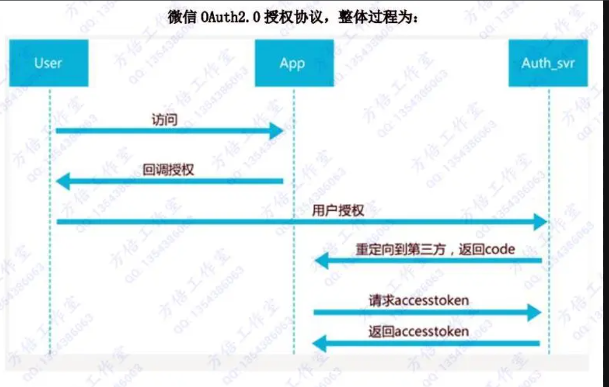
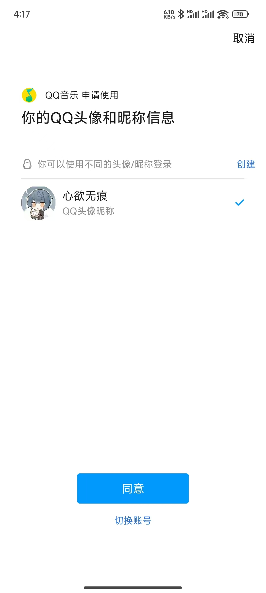
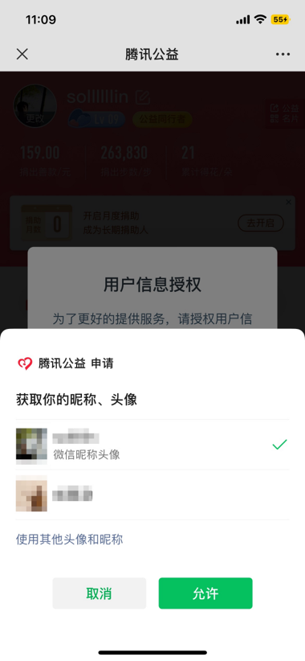

# OAuth2.0 授权流程讲解

[[toc]]

::: info 介绍

OAuth 2.0 是目前最流行的授权机制，用来授权第三方应用，获取用户数据。

先了解一下什么是`认证`（Authentication）和`授权`（Authorization）。

:::

## 1、什么是认证（Authentication）

通俗地讲就是验证当前用户的身份，证明“你是你自己”（比如：你每天上下班打卡，都需要通过指纹打卡，当你的指纹和系统里录入的指纹相匹配时，就打卡成功）互联网中的认证：

(1) 用户名密码登录

(2) 邮箱发送登录链接

(3) 手机号接收验证码

(4) 只要你能收到邮箱/验证码，就默认你是账号的主人

## 2、什么是授权（Authorization）

用户授予第三方应用访问该用户某些资源的权限

你在安装手机应用的时候，APP 会询问是否允许授予权限（访问相册、地理位置等权限）你在访问微信小程序时，当登录时，小程序会询问是否允许授予权限（获取昵称、头像、地区、性别等个人信息）

实现授权的方式有：cookie、session、token、OAuth

## 3、OAuth2.0 介绍

`OAuth 2.0` 是一种**授权框架**，用于使第三方应用能够以安全的方式访问用户在某个服务提供商处的资源，而无需将用户的凭证（如用户名和密码）直接暴露给第三方应用。

`OAuth 2.0` 通过引入访问令牌（Access Token）的概念来实现这一点，这些令牌代表了用户授予第三方应用的权限。

## 4、OAuth2.0 的主要角色

(1) Resource Owner (资源所有者):用户，拥有受保护资源的人。

(2) Client (客户端):第三方应用，希望访问资源所有者的受保护资源。

(3)Authorization Server (授权服务器):负责验证资源所有者的身份，并颁发访问令牌。

(4) Resource Server (资源服务器):持有受保护资源的服务器，使用访问令牌来验证请求的合法性。

## 5、OAuth 2.0 的主要流程和应用场景

流程图如下：

{width=80%}

### 案例 1 、app 授权登录

我们经常使用 app 或者小程序登录，就会遇见以下场景；

我手机上下载了一个新的`qq音乐`,进入 app 时需要登录，下方有 QQ 登录和微信登录的按钮，点击 QQ 登录，就会跳转到 QQ 的授权页面（授权页面上显示 qq 音乐申请使用你的头像和昵称信息），点击`[同意授权]`后返回 qq 音乐 app，然后登陆成功。

::: info 授权页面： 
{width=50%}
:::

上面就是一个典型的应用场景，qq 音乐作为客户端，需要使用 QQ 用户的数据（头像、昵称等），qq 作为授权服务器，验证 qq 音乐的请求是否合法，并下发令牌。配合流程图不难理解。

### 案例 2、微信网页授权

如果用户在微信客户端中访问第三方网页，公众号可以通过微信网页授权机制，来获取用户基本信息，进而实现业务逻辑。

微信网页授权是通过 OAuth2.0 机制实现的，在用户授权给公众号后，公众号可以获取到一个网页授权特有的接口调用凭证（网页授权 access_token），通过网页授权 access_token 可以进行授权后接口调用，如获取用户基本信息；

**网页授权流程分为四步**

(1)、引导用户进入授权页面同意授权，获取 code



(2)、通过 code 换取网页授权 access_token（与基础支持中的 access_token 不同）

```json
{
  "access_token": "ACCESS_TOKEN",
  "expires_in": 7200,
  "refresh_token": "REFRESH_TOKEN",
  "openid": "OPENID",
  "scope": "SCOPE",
  "is_snapshotuser": 1,
  "unionid": "UNIONID"
}
```

(3)、如果需要，开发者可以刷新网页授权 access_token，避免过期

由于 access_token 拥有较短的有效期，当 access_token 超时后，可以使用 refresh_token 进行刷新，refresh_token 有效期为 30 天，当 refresh_token 失效之后，需要用户重新授权

(4)、通过网页授权 access_token 和 openid 获取用户基本信息（支持 UnionID 机制）

```json
{
  "openid": "OPENID",
  "nickname": NICKNAME,
  "sex": 1,
  "province":"PROVINCE",
  "city":"CITY",
  "country":"COUNTRY",
  "headimgurl":"https://thirdwx.qlogo.cn/mmopen/g3MonUZtNHkdmzicIlibx6iaFqAc56vxLSUfpb6n5WKSYVY0ChQKkiaJSgQ1dZuTOgvLLrhJbERQQ4eMsv84eavHiaiceqxibJxCfHe/46",
  "privilege":[ "PRIVILEGE1" "PRIVILEGE2"     ],
  "unionid": "o6_bmasdasdsad6_2sgVt7hMZOPfL"
}
```

[官方地址](https://developers.weixin.qq.com/doc/offiaccount/OA_Web_Apps/Wechat_webpage_authorization.html)

## 6、OAuth 2.0 的好处

OAuth 2.0 是一种广泛采用的授权框架，它允许用户向第三方应用授权访问其存储在另一服务提供商上的信息，而无需将用户名和密码直接提供给第三方应用。以下是 OAuth 2.0 授权的一些主要好处：

(1)、 安全性：用户不需要共享他们的用户名和密码给第三方应用，降低了账号被盗用的风险。

(2)、简化登录：用户可以使用已有的账号（如 Google、Facebook 等）来快速登录第三方应用，提高了用户体验。

(3)、灵活性：OAuth 2.0 支持多种授权流程，能够适应不同的应用场景，包括网站、移动应用和桌面应用。

(4)、可控性：用户可以授予或撤销第三方应用的权限，而不需要改变主账号的密码。

(5)、扩展性：OAuth 2.0 可以支持大量的服务提供商和第三方应用，适用于各种规模的网络服务。

(6)、标准化：作为一个行业标准，OAuth 2.0 被广泛支持，使得开发者可以更容易地集成和使用授权机制。

(7)、减少开发者负担：开发者不需要自己实现复杂的用户认证和授权系统，可以利用现有的 OAuth 2.0 服务。

(8)、增强隐私：用户可以精确控制哪些信息可以被第三方应用访问，有助于保护个人隐私。

(9)、跨平台：用户可以在不同的设备和平台上使用相同的账号进行授权，提高了服务的便携性。
