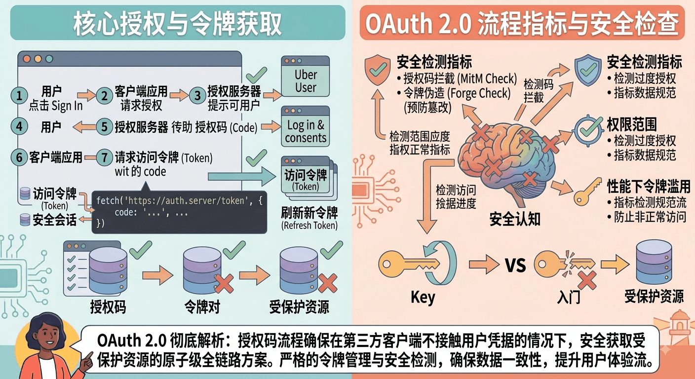

# OAuth 2.0 授权流程

[[toc]]

**OAuth 2.0** 是目前最通用的授权框架，它的核心目的在于**让第三方应用在不获取用户账号密码的前提下，获得对用户资源的有限访问权限**。

理解 OAuth 2.0 的关键，在于掌握其四大核心角色、最主流的授权流程（授权码模式），以及其他适用不同场景的授权模式。




## 一、 核心角色 (The Four Roles)

在整个 OAuth 2.0 流程中，主要存在以下 4 个角色：

1. **资源所有者 (Resource Owner)**：即**用户**。拥有数据/资源的人。
2. **客户端 (Client)**：请求访问用户资源的**第三方应用**（如：你想登录的网站）。
3. **授权服务器 (Authorization Server)**：负责**认证用户身份**并颁发令牌（Token）的服务器（如：微信、Google、GitHub 登录服务）。
4. **资源服务器 (Resource Server)**：托管用户受保护资源的服务器，通过验证令牌来响应数据请求（如：微信的用户个人信息接口、GitHub 的 Repo API）。


## 二、 最标准的授权流程：授权码模式 (Authorization Code Flow)

授权码模式是 OAuth 2.0 中**最安全、最推荐**的流程，适用于有后端服务器参与的常规 Web 应用。

### 完整流转交互步骤

1. **用户发起授权请求**：客户端重定向至授权服务器。
用户在第三方应用点选"用 GitHub 登录"。第三方应用将用户浏览器**重定向**至授权服务器的 `/authorize` 端点，请求 URL 通常携带以下关键参数：

* `client_id`：第三方应用的唯一标识
* `redirect_uri`：授权成功后的回调地址
* `response_type=code`：告知服务器使用授权码模式
* `scope`：申请的权限范围（如获取头像、邮箱）
* `state`：随机字符串，需与用户当前会话绑定（如存入 Session 或写入带 `HttpOnly` 的 Cookie），用于在回调时比对，绑定授权请求与当前会话，防御 CSRF（登录 CSRF）攻击


2. **用户身份认证与授权**：在授权服务器上操作。
授权服务器弹窗或跳转出登录页面。用户输入账号密码完成身份认证，并确认勾选是否同意授权第三方应用获取请求的权限范围（Scope）。


3. **发放授权码 (Authorization Code)**：重定向回第三方应用回调地址。
用户同意授权后，授权服务器生成一个**短期有效且只能使用一次**的授权码（`code`）。然后将用户浏览器重定向回此前指定的 `redirect_uri`，并在 URL 参数中附带该 `code` 和之前收到的 `state`。


4. **用授权码换取访问令牌**：后端直接向授权服务器发起请求。
第三方应用的**后端服务**提取到回调链接中的 `code` 后，在后台发送 HTTP POST 请求到授权服务器的 `/token` 接口。请求包含：

* `code`：上一步获取的授权码
* `client_id` 与 `client_secret`：第三方应用的身份标识与密钥（保存在后端，不暴露给前端浏览器）
* `grant_type=authorization_code`


5. **颁发 Access Token**：授权服务器验证参数。
授权服务器校验 `code`、`client_secret` 及回调地址无误后，向第三方应用后端返回 JSON 响应，内容包括：

* `access_token`：访问令牌
* `expires_in`：令牌有效时长
* `refresh_token`（可选）：用于续期 Access Token 的更新令牌


6. **携带 Token 访问资源**：请求资源服务器。
第三方应用拿到 `access_token` 后，即可将其放在 HTTP 请求头 `Authorization: Bearer <access_token>` 中，向资源服务器请求 API 数据。


## 三、 为什么不直接发 Token，而是多一步"授权码"？

许多开发者会产生疑问：**为什么授权服务器不直接把 `access_token` 返回给浏览器，非要绕一圈先给 `code`，再用 `code` 换 `token`？**

这主要是出于**安全性**考虑：

1. **防止 Token 暴露在前端**：重定向过程发生在浏览器（前端），URL 参数会被保存在浏览器历史记录、服务器日志甚至网络代理中。授权码 `code` 只是短期凭证且一次性失效，即使泄露，攻击者没有 `client_secret` 也无法换取真正的 Token。
2. **校验第三方应用身份**：授权码换 Token 的步骤发生在**服务端对服务端**（Back-channel），可以使用 `client_secret` 确认第三方应用的真正身份，防止身份伪造。


## 四、 其他常见授权模式 (Grant Types)

除了授权码模式外，规范还定义了其他几种适用特定场景的模式：

| 授权模式 | 适用场景 | 安全级别 | 特点/说明 |
| --- | --- | --- | --- |
| **授权码+PKCE** *(推荐)* | 单页应用 (SPA)、移动端 App | **高** | 在标准授权码模式上增加了动态密钥挑战（Code Verifier），无需保存 `client_secret` 即可防止授权码拦截。 |
| **客户端凭证模式 (Client Credentials)** | 服务端对服务端 API（没有用户参与） | **中高** | 应用凭自身的 `client_id` 和 `client_secret` 直接向授权服务器换取 Token。 |
| **隐式许可模式 (Implicit)** | 早期纯前端应用 *(现已废弃)* | **低** | 直接在重定向 URL 的 Fragment 中返回 Token，不经过后端交换，极易造成 Token 泄露。 |
| **密码模式 (Password)** | 高度信任的官方自研应用 *(不推荐)* | **低** | 用户直接将账号密码提交给第三方应用。破坏了"不暴露密码"的初衷。 |


## 五、真实案例：用微信登录"掘金 APP"

我们可以借用一个大家天天接触的真实场景——**"用微信登录掘金（或知乎/小红书等应用）"**，来将前面的 OAuth 2.0 理论打通。

假设你想在掘金发布文章，但懒得注册新账号，决定点击"使用微信登录"。在这个场景中，各角色对应如下：

> **补充说明**：微信的 OAuth 授权实际存在两套接口体系——**开放平台网站扫码登录**（`open.weixin.qq.com/connect/qrconnect`，`scope=snsapi_login`，用户信息通过 `/sns/oauth2/access_token` 换取）与**公众号网页授权**（`api.weixin.qq.com/sns/oauth2/access_token`，`scope=snsapi_userinfo`，用户信息通过 `/sns/userinfo` 获取）。两者最终都遵循授权码模式。本文为了便于理解，以开放平台扫码登录为主线展开。

* **资源所有者 (User)**：你（微信账号的拥有者）
* **客户端 (Client)**：掘金 APP（想要获取你微信头像和昵称的应用）
* **授权服务器 (Authorization Server)**：微信认证服务器（负责弹出二维码、校验你的身份）
* **资源服务器 (Resource Server)**：微信 Open API 服务器（存放着你的微信头像、昵称等个人数据）


### 1. 图解：微信登录背后的 6 步流转

```
  +------+                              +-------------------+
  |      |--(1) 点击"微信登录" --------> |                   |
  |      |<-(2) 展示微信二维码/授权页--- |   微信授权服务器   |
  |  用  |                              | (open.weixin.qq)  |
  |  户  |--(3) 扫码/点击确认授权 ---->  |                   |
  |      |                              +-------------------+
  |      |                                       |
  | (你) |<-(4) 重定向带回 code=XYZ123 -----------+
  +------+          |
                    v
          +-------------------+
          |  掘金前端 (浏览器) |
          +-------------------+
                    |
               (传输 code)
                    |
                    v
          +-------------------+                 +-------------------+
          |                   |--(5) 用 code +  |                   |
          |  掘金后端服务器    |    Secret 换取  |   微信授权服务器  |
          |                   |<-- access_token |                   |
          |                   |                 +-------------------+
          |                   |
          |                   |                 +-------------------+
          |                   |--(6) 携带 Token |                   |
          |                   |    获取个人信息  |   微信资源服务器  |
          |                   |<-- 返回头像/昵称 | (api.weixin.qq)   |
          +-------------------+                 +-------------------+
```


### 2. 详细步骤拆解

1. 你在掘金点击"微信登录"，掘金前端将你的浏览器跳转至微信的授权页面，URL 大致长这样：

```text
https://open.weixin.qq.com/connect/qrconnect
  ?appid=wx_juejin_123456
  &redirect_uri=https://juejin.cn/oauth/callback
  &response_type=code
  &scope=snsapi_login
  &state=a8b9c7

```

* `appid`：微信分配给掘金的身份标识。
* `redirect_uri`：授权完成后，微信把数据发回掘金的哪个地址。
* `scope=snsapi_login`：掘金向微信申请的权限范围（网站扫码登录，授权后仅可获取头像、昵称等公开信息）。
* `state`：掘金生成的防伪随机数，需与你的登录会话绑定（如存入 Session），用于回调时比对。


2. **身份认证与用户授权**：你与微信交互。
微信弹出一个二维码。你拿出手机微信扫描并点击 **"同意授权"**。此时，你向微信证明了"我确实是这个微信账号的主人"，并批准掘金读取你的头像。


3. 微信收到你的同意后，把你的浏览器重定向回掘金在 Step 1 填写的 `redirect_uri`，并在 URL 后面挂上一串临时授权码 `code`：

```text
https://juejin.cn/oauth/callback?code=CODE_ABC123&state=a8b9c7

```

* 掘金后端校验回调 URL 中的 `state` 与之前存进会话的 `state` 是否一致，确认这是由"当前用户会话"发起的授权（而非攻击者伪造的），再把 `code=CODE_ABC123` 用于后续换 Token。


4. 掘金后端在**后台**向微信发起 POST 请求：

```text
POST https://api.weixin.qq.com/sns/oauth2/access_token
  ?appid=wx_juejin_123456
  &secret=JUEJIN_SECRET_KEY_999
  &code=CODE_ABC123
  &grant_type=authorization_code

```

微信验证 `code` 有效，且暗号 `secret` 与 `appid` 对得上，便向掘金后端返回响应：

```json
{
  "access_token": "ACCESS_TOKEN_XYZ888",
  "expires_in": 7200,
  "refresh_token": "REFRESH_TOKEN_666",
  "openid": "USER_OPENID_555"
}

```


5. 掘金后端拿到 `ACCESS_TOKEN_XYZ888` 后，向微信的数据接口请求你的信息：

```text
GET https://api.weixin.qq.com/sns/userinfo?access_token=ACCESS_TOKEN_XYZ888&openid=USER_OPENID_555

```

微信校验 Token 无误，返回：`{"nickname": "张三", "headimgurl": "https://..."}`。


6. 掘金在自己的数据库里创建（或关联）你的账号，并生成掘金自己的登录状态（如 Session 或 JWT）发回给你的浏览器。至此，你成功登录了掘金！


### 3. 这个案例解答了 OAuth 2.0 的三大核心疑问

1. **为什么掘金自始至终不知道你的微信密码？**
    * 因为你只在微信的域名（`open.weixin.qq.com`）下扫码/输入了密码，掘金拿到的只是一张微信签发的限时通行证（`access_token`）。


2. **为什么授权码 `code` 只能用一次？**
    * 即使有人拦截了 Step 3 中浏览器 URL 里的 `code`，他也无法去微信换 Token，因为换 Token 必须提供保存在掘金服务器内部的 `secret`，且微信还会校验换取 Token 时携带的 `redirect_uri` 是否与申请 `code` 时完全一致。`code` 一旦被使用或过期就会立刻失效。


3. **微信的 `access_token` 与掘金后来的登录 Session 有什么区别？**
    * **微信 Token**：用于掘金和微信服务器之间"拿数据"的钥匙（接口级别）。
    * **掘金 Session/JWT**：用于你和掘金之间"证明你已登录掘金"的钥匙（应用级别）。
