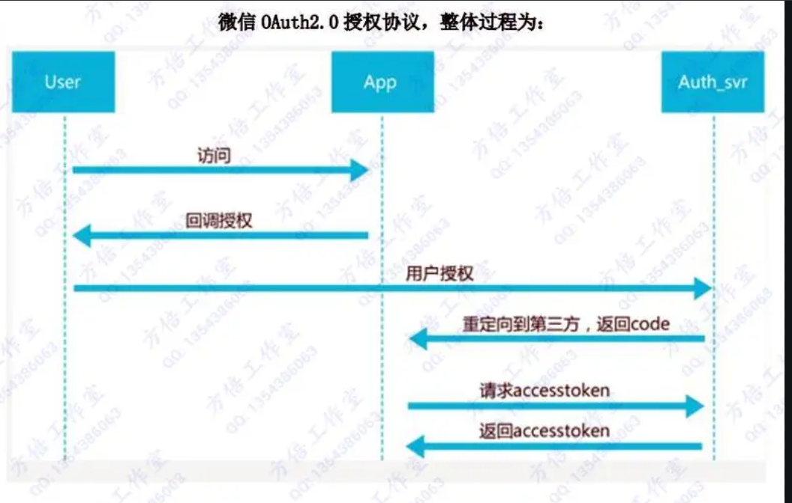

# OAuth2.0 授权流程讲解

[[toc]]

OAuth 2.0 是目前最流行的授权机制，用来授权第三方应用，获取用户数据。

先了解一下什么是`认证`（Authentication）和`授权`（Authorization）。

## 1、什么是认证（Authentication）

通俗地讲就是验证当前用户的身份，证明“你是你自己”。

> 比如：你每天上下班打卡，都需要通过指纹打卡，当你的指纹和系统里录入的指纹相匹配时，就打卡成功

**互联网中的认证：**

(1) 用户名密码登录  
(2) 邮箱发送登录链接  
(3) 手机号接收验证码  
(4) 只要你能收到邮箱/验证码，就默认你是账号的主人

## 2、什么是授权（Authorization）

用户授予第三方应用访问该用户某些资源的权限:你在安装手机应用的时候，APP 会询问是否允许授予权限（访问相册、地理位置等权限）。  
你在访问微信小程序时，当登录时，小程序会询问是否允许授予权限（获取昵称、头像、地区、性别等个人信息）。

实现授权的方式有：`cookie、session、token、OAuth`

## 3、OAuth2.0 介绍

`OAuth 2.0` 是一种**授权框架**，用于使第三方应用能够以安全的方式访问用户在某个服务提供商处的资源，而无需将用户的凭证（如用户名和密码）直接暴露给第三方应用。

`OAuth 2.0` 通过引入访问令牌（Access Token）的概念来实现这一点，这些令牌代表了用户授予第三方应用的权限。

### 3.1 主要概念

1. **授权服务器（Authorization Server）**：负责验证用户身份并颁发访问令牌（access token）。
2. **资源服务器（Resource Server）**：存储用户的资源，保护这些资源的访问，只允许持有有效访问令牌的请求访问。
3. **客户端（Client）**：第三方应用或服务，获取用户授权后，通过访问令牌访问用户在资源服务器上的资源。
4. **资源所有者（Resource Owner）**：通常是最终用户，授权客户端访问其资源。

### 3.2 授权流程

1. **用户授权**：用户通过授权服务器同意允许客户端应用访问自己的资源。
2. **授权码或令牌交换**：客户端通过授权码或直接通过客户端凭证，向授权服务器请求访问令牌（access token）。
3. **令牌使用**：客户端使用获取到的访问令牌，向资源服务器请求用户数据。

### 3.3 常见授权方式

1. **授权码模式（Authorization Code Flow）**：适用于服务器端应用，用户首先通过授权服务器授权，获得授权码，再用授权码交换访问令牌。
2. **客户端凭证模式（Client Credentials Flow）**：适用于服务器与服务器之间的授权，无需用户参与，客户端直接使用自己的凭证获取令牌。
3. **密码凭证模式（Resource Owner Password Credentials Flow）**：用户提供用户名和密码，客户端直接用这些凭证获取访问令牌，适用于受信任的客户端。
4. **隐式授权模式（Implicit Flow）**：适用于浏览器中的客户端应用，直接返回访问令牌，适合公共客户端。

## 4、OAuth 2.0 的主要流程和应用场景

流程图如下：

{width=80%}

### 案例 1 、app 授权登录

我们经常使用 app 或者小程序登录，就会遇见以下场景；

我手机上下载了一个新的`qq音乐`,进入 app 时需要登录，下方有 QQ 登录和微信登录的按钮，点击 QQ 登录，就会跳转到 QQ 的授权页面（授权页面上显示 qq 音乐申请使用你的头像和昵称信息），点击`[同意授权]`后返回 qq 音乐 app，然后登陆成功。

::: info 授权页面：

{width=50%}

:::

上面就是一个典型的应用场景，qq 音乐作为客户端，需要使用 QQ 用户的数据（头像、昵称等），qq 作为授权服务器，验证 qq 音乐的请求是否合法，并下发令牌。配合流程图不难理解。

### 案例 2、微信网页授权

如果用户在微信客户端中访问第三方网页，公众号可以通过微信网页授权机制，来获取用户基本信息，进而实现业务逻辑。

微信网页授权是通过 OAuth2.0 机制实现的，在用户授权给公众号后，公众号可以获取到一个网页授权特有的接口调用凭证（网页授权 access_token），通过网页授权 access_token 可以进行授权后接口调用，如获取用户基本信息；

**网页授权流程分为四步**

(1)、引导用户进入授权页面同意授权，获取 code


(2)、通过 code 换取网页授权 access_token（与基础支持中的 access_token 不同）

```json
{
  "access_token": "ACCESS_TOKEN",
  "expires_in": 7200,
  "refresh_token": "REFRESH_TOKEN",
  "openid": "OPENID",
  "scope": "SCOPE",
  "is_snapshotuser": 1,
  "unionid": "UNIONID"
}
```

(3)、如果需要，开发者可以刷新网页授权 access_token，避免过期

由于 access_token 拥有较短的有效期，当 access_token 超时后，可以使用 refresh_token 进行刷新，refresh_token 有效期为 30 天，当 refresh_token 失效之后，需要用户重新授权

(4)、通过网页授权 access_token 和 openid 获取用户基本信息（支持 UnionID 机制）

```json
{
  "openid": "OPENID",
  "nickname": NICKNAME,
  "sex": 1,
  "province":"PROVINCE",
  "city":"CITY",
  "country":"COUNTRY",
  "headimgurl":"https://thirdwx.qlogo.cn/mmopen/g3MonUZtNHkdmzicIlibx6iaFqAc56vxLSUfpb6n5WKSYVY0ChQKkiaJSgQ1dZuTOgvLLrhJbERQQ4eMsv84eavHiaiceqxibJxCfHe/46",
  "privilege":[ "PRIVILEGE1" "PRIVILEGE2"     ],
  "unionid": "o6_bmasdasdsad6_2sgVt7hMZOPfL"
}
```

[官方地址](https://developers.weixin.qq.com/doc/offiaccount/OA_Web_Apps/Wechat_webpage_authorization.html)

## 5、OAuth 2.0 的好处

**OAuth 2.0** 是一种授权框架，广泛用于授权第三方应用访问用户资源。它相比传统的授权方式（如基本认证）有几个显著的好处：

### 1. **安全性增强**

- **无需暴露密码**：用户无需将密码直接提供给第三方应用，而是通过授权代码或访问令牌授权，从而降低了密码泄露的风险。
- **短期令牌**：OAuth 2.0 使用短期的 **访问令牌** 和可控制的 **刷新令牌**，即使令牌泄露，攻击者也无法长期访问资源。

### 2. **细粒度授权**

- **权限控制**：OAuth 2.0 允许用户根据需要精确授权第三方应用访问特定资源和权限，而不是全盘授权。用户可以授权读取邮箱，但不授权发送邮件等功能。

### 3. **简化用户体验**

- **单点登录**：通过 OAuth 2.0，用户可以使用现有的身份验证服务（如 Google、Facebook 登录）登录其他应用，避免了多次注册和登录的麻烦。

### 4. **支持第三方应用**

- **灵活性**：OAuth 2.0 支持多种授权方式（如授权码、客户端凭证、密码凭证等），适应了不同类型的客户端（Web、移动、桌面应用等）需求。

### 5. **减少服务器负担**

- **不存储密码**：OAuth 2.0 实现了授权和认证的分离，减少了服务器端存储和管理用户密码的负担，降低了安全风险。

### 6. **适用跨平台应用**

- **跨平台支持**：OAuth 2.0 可在多种平台（Web、iOS、Android 等）上工作，提供一致的授权机制，提升了跨平台应用的安全性和可扩展性。
