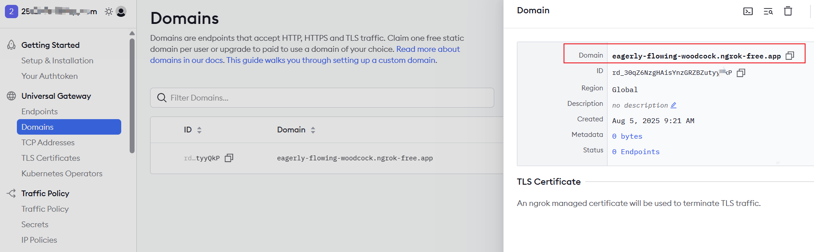

# Ngrok 内网穿透 ：开发者的利器

[[toc]] 在开发过程中，我们经常需要将本地服务暴露到公网进行测试或演示，而 ngrok 正是解决这一需求的完美工具。

**什么是 ngrok？**

`ngrok`是一个反向代理工具，能够创建从公共互联网到本地服务的安全隧道。它解决了开发者面临的几个核心问题：

1、无公网 IP：大多数开发者没有固定公网 IP

2、防火墙限制：公司/学校网络通常限制入站连接

3、HTTPS 支持：为本地服务提供 HTTPS 支持

4、临时需求：快速分享本地开发环境

## 一、安装和注册

### 1.1 下载

`ngrok官网`：https://ngrok.com/


### 1.2 注册，登录

注册，登录，可以使用`github`或者谷歌账号登录。

{width=60%}

### 1.3 多因素认证

为了增加安全性，ngrok 提供了多因素认证功能。在注册账号后，你可以启用多因素认证，增加账号的安全性。

提示用户使用认证器应用(如`1Password、Google Authenticator或Microsoft Authenticator`)生成一次性密码。如图所示：

{width=80%}

然后使用手机客户端 `Authenticator` 扫描`二维码`，获取一次性密码（如下图所示）。

{width=80%}

**点击** `Continue`，继续下面操作。

### 1.4 恢复码设置

以下代码用于在您无法访问 `MFA` 身份验证器时恢复您的账户。请像保护密码一样安全地保存这些恢复码。我们建议使用密码管理器，如`lPassword、KeePassXC、orbitwarden`。

如果你找不到这些验证码，你将无法访问你的账户。

{width=80%}

可以点击复制或下载保存恢复码。

然后**点击** `Finish`，继续下面操作。

{width=80%}

**继续点击** `Continue`，完成注册流程。

## 二、使用

### 2.1 启动 ngrok

到刚才`ngrok`官网下载的.exe 所在文件下执行这个命令：


需要带上`token`如图：


**开始执行命令**：


这时，你的密钥已经保存到如上目录的`ngrok.yml`文件中了。

### 2.2 内网穿透

首先，`去ngrok官网获取domains` 用来作为要对外提供的固定访问地址，先创建一个`domain`:


自动生成：



点击图中划红线的部分：`Domain:eagerly-flowing-woodcock.ngrok-free.app` 然后打开`ngrok.yml`文件（在已有的基础上添加如下配置，添加前后端两个隧道）

```bash
tunnels:
  frontdemo:
    proto: http
    addr: 5173
    domain: eagerly-flowing-woodcock.ngrok-free.app
  backdemo:
    proto: http
    addr: 7500
    domain: eagerly-flowing-woodcock.ngrok-free.app
# inspect: false
```

`domain` 要替换为自己的。

`domain` 是外网访问的固定地址。

`addr` 是映射到本地服务的端口。

`frontdemo` 是前端服务的名称。 `backdemo` 是后端服务的名称。都是可以自定义的。

### 2.3 启动隧道

执行如下命令， 注意前后端都启动，则`domain`要设置成不一样的

```bash
#前后端都启动
ngrok start --all
#只启动前端/后端
ngrok start frontdemo
ngrok start backdemo

```

这里我们只启动前端服务，所以执行`ngrok start frontdemo`即可。


图中划线的位置可以看出，`https://eagerly-flowing-woodcock.ngrok-free.app` 已经映射到我们前端本地项目开启的服务了 `http://localhost:5173 `

### 2.4 测试

打开浏览器，输入`https://eagerly-flowing-woodcock.ngrok-free.app`，即可访问到本地服务。


这是由于第一次访问，没有信任感，点下`visit site`就可以了。.

然后又会出现以下提示：

```js
Blocked request. This host ("eagerly-flowing-woodcock.ngrok-free.app") is not allowed.
To allow this host, add "eagerly-flowing-woodcock.ngrok-free.app" to `server.allowedHosts` in vite.config.js.
```

这是由于`Vite`的限制`,Vite `项目里，有 `server.allowedHosts` 配置项，作用是限制哪些域名 / 主机能访问你的本地开发服务，防止非法域名的访问，保障开发环境安全。改造下就可以了。

```js
export default defineConfig({
  server: {
    // 允许访问的主机，添加 ngrok 的域名
    allowedHosts: [
      "eagerly-flowing-woodcock.ngrok-free.app", // 你的ngrok域名
      ".ngrok-free.app" // 允许所有ngrok免费域名
    ]
  }
});
```

**然后重新启动前端服务，访问`https://eagerly-flowing-woodcock.ngrok-free.app` 即可。**

## 三、我本地的配置

`ngrok.exe `文件位置:

```js
"C:\Users\xinjie\Desktop\ngrok.exe"
```

`ngrok.yml`配置文件目录：

```js
C:\Users\xinjie\AppData\Local\ngrok
```

使用`1Password、Google Authenticator或Microsoft Authenticator`等身份验证应用程序来生成一次性密码:

```js
BFKHMH7AS6E34G3TO7NZAI4VTHTZEXTY;
```

以下代码用于在您无法访问 MFA 身份验证器时恢复您的账户。如果你找不到这些验证码，你将无法访问你的账户。

```js
HWU6ZXSZQU
YJA7RGNUTD
SSUNDW8VPB
4ZKYWJX8GK
4EPX379FPZ
49SKRZENDR
M76MKSKKYX
PE7E63XYK9
T4VP4K66GU
2XCVDYWZAT
```
