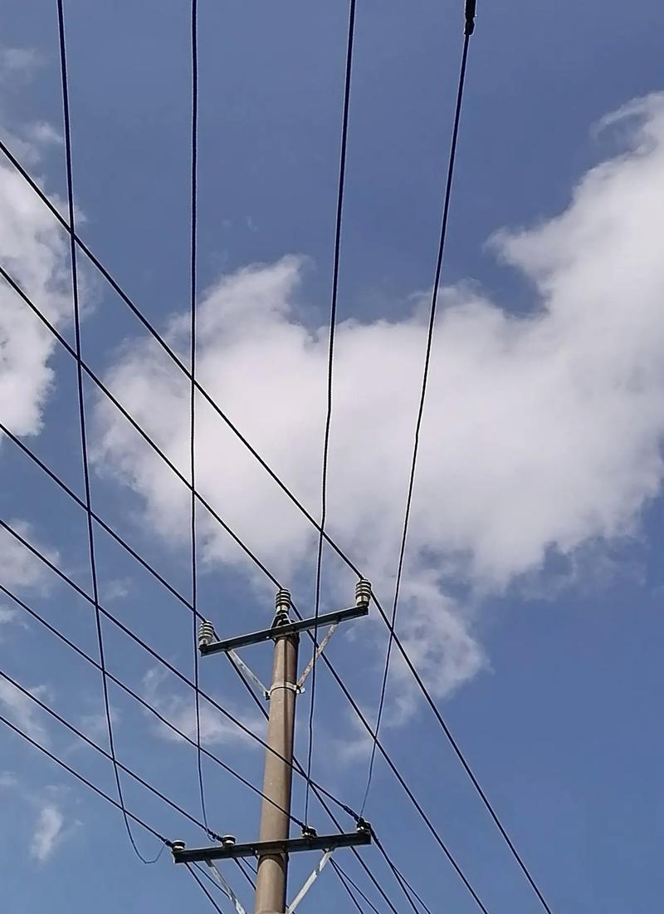
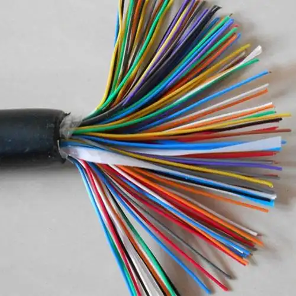
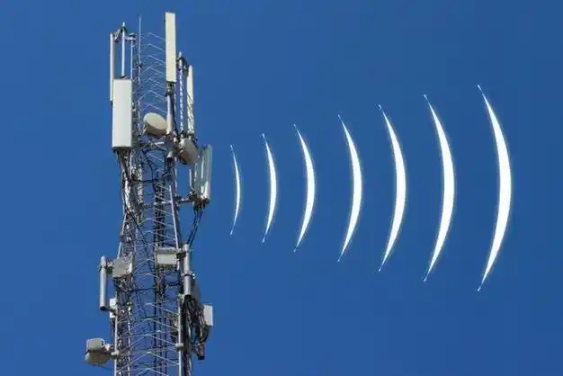

# OSI 七层网络模型

**目录**
[[toc]]

## 什么是 OSI 七层模型？

`OSI`（`Open Systems Interconnection`，开放系统互连）模型是由国际标准化组织（`ISO`）提出的一个网络通信框架，用于标准化不同厂商设备之间的通信流程。它将网络通信划分为七层，每一层负责特定的功能，并通过接口与上下层交互。

下面是 `OSI `模型的七个层级：

| **层数** | **名称**   | **主要功能**                      | **典型协议**    | **相关设备**         |
| -------- | -------------- | --------------------------------- | -------------------- | -------------------- |
| **7**    | **应用层**     | 提供用户接口，支持网络应用服务    | HTTP、FTP、SMTP、DNS | 网关、代理服务器     |
| **6**    | **表示层**     | 数据格式转换、加密解密、压缩解压  | SSL/TLS、JPEG、ASCII | -                    |
| **5**    | **会话层**     | 建立、管理、终止应用会话          | NetBIOS、RPC、SSH    | -                    |
| **4**    | **传输层**     | 提供端到端可靠/不可靠数据传输     | TCP、UDP             | 防火墙、负载均衡器   |
| **3**    | **网络层**     | 逻辑寻址、路由选择、分组转发      | IP、ICMP、ARP、OSPF  | 路由器、三层交换机   |
| **2**    | **数据链路层** | 物理寻址（MAC）、帧同步、差错控制 | Ethernet、PPP、VLAN  | 交换机、网桥         |
| **1**    | **物理层**     | 传输原始比特流，定义电气/机械特性 | RS-232、光纤、Wi-Fi  | 网卡、集线器、中继器 |

## 1. 物理层

物理层是直接和物理介质打交道的。

物理层的设备 网卡，网线，集线器，中继器，调制解调器。负责传输原始比特流（0 和 1 的电信号/光信号）。

分为有线通道和无线通道：

### 1.1 有线通道

有线通道是指通过物理介质（如网线、光纤等）进行数据传输的通道。

`明线`

明线是指平行架设在电线杆上的架空线路。它本身是导电裸线或带绝缘层的导线。虽然它的传输损耗低，但是由于易受天气和环境的影响，对外界噪声干扰比较敏感，已经逐渐被电缆取代。

{width=50%}

`对称电缆`

对称电缆是由多对双绞线组成的线缆。

{width=60%}

`同轴电缆`

同轴线缆的应用范围极为广泛，同轴电缆能以低损耗的方式传输模拟信号和数字信号，适用于各种应用，其中常见的有电视广播系统、长途电话传输系统、计算机系统之间的短距离跳线以及局域网互联等。

{width=60%}

`光纤`

光导纤维是由玻璃或塑料制成的纤维，利用光在这些纤维中以全反射原理传输的光传导工具（全反射现象是光的折射的特殊现象，只有光从光密介质射向光疏介质并且入射角大于等于临界角时全反射 现象才会发生）

{width=60%}

### 1.2 无线通道

无线通道是指通过无线信号进行数据传输的通道。

以辐射无线电波为传输方式无线信道主要有地波传输，天波传输和视距传输 例如：卫星通讯，电台广播。

{width=60%}

## 2. 数据链路层

建立逻辑连接、进行硬件地址寻址、差错校验等功能。（由底层网络定义协议）。

将比特组合成字节进而组合成帧，用 MAC 地址访问介质，错误发现但不能纠正。

`MAC地址`：每个网卡的唯一标识.

{width=100%}

有了`Mac`地址之后就可以知道谁是接收者，谁是发送者，并且知道了数据的内容并且进行了分组。那么他如何进行传播数据，他是进行广播的方式进行传输,在局域网内所有的计算机都能收到消息

## 3. 网络层

`网络层`是最复杂的一层，在这一层就定义了我们的`IP`，例如 `10.170.112.11`。

该层控制数据链路层与传输层之间的信息转发，建立、维持和终止网络的连接。具体地说，数据链路层的数据在这一层被转换为数据包，然后通过路径选择、分段组合、顺序、进/出路由等控制，将信息从一个网络设备传送到另一个网络设备。

1.寻址：对网络层而言使用 `IP` 地址来唯一标识互联网上的设备，网络层依靠 `IP` 地址进行相互通信（类似于数据链路层的 MAC 地址） 

2.路由：在同一个网络中的内部通信并不需要网络层设备，仅仅靠数据链路层就可以完成相互通信，对于不同的网络之间相互通信则必须借助路由器等三层设备。 

我们的`路由器`就是在第三层工作的

{width=70%}

在数据链路层的时候说过了如果所有的使用互联网的用户在同一个网段中，会产生广播风暴，所以要将用户进行划分，让他们在不同的网段中，自己在自己的小网段中广播。而互联网就是这无数的子网络构成的一个巨型网络。

在网络层中引入了一套新的地址，让我们能够区分不同的网段。这套地址就叫做“网络地址”，简称“网址”。
于是，”网络层”出现以后，每台计算机有了两种地址，一种是MAC地址，另一种是网络地址。两种地址之间没有任何联系，MAC地址是绑定在网卡上的，网络地址则是管理员分配的，它们只是随机组合在一起。

网络地址帮助我们确定计算机所在的子网络，MAC地址则将数据包送到该子网络中的目标网卡。因此，从逻辑上可以推断，必定是先处理网络地址，然后再处理MAC地址。

这一层中有一个规定网络地址的协议，叫做IP协议，它所定义的地址，就被称为IP地址。目前，广泛采用的是IP协议第四版，简称IPv4。这个版本规定，网络地址由32个二进制位组成。因为IPv4的地址已经不够用了，所以现在推广IPv6。

## 4. 传输层

传输层主要就是定义我们的端口号，以及控流，和校验。并且拥有两个熟知的协议 `TCP`、` UDP`。

> [!TIP] TCP
> `TCP` 是面向连接的协议并且TCP是可靠的。
> 因为TCP会进行三次握手四次挥手所以是可靠的，但是这样会降低速度。

> [!TIP] UDP
> `UDP` 具有较好的实时性 效率比TCP高
> UDP是没有三次握手四次挥手的，故此不稳定，但是速度快 常用于直播，游戏。

## 5. 会话层

会话层，是在发送方和接收方之间进行通信时创建、维持、之后终止或断开连接的地方，与电话通话有点相似。

会话层定义了一种机制，允许发送方和接收方启动或停止请求会话，以及当双方发生拥塞时仍然能保持对话。
会话层包含了一种称为检查点（`Checkpoint`） 的机制来维持可靠会话。

检查点定义了一个最接近成功通信的点，并且定义了当发生内容丢失或损坏时需要回滚以便恢复丢失或损坏数据的点，即断点下载的原理。
 
## 6. 表示层

表示层主要做了几件重要的事情 安全，压缩，也是程序在网络中的一个翻译官。

1.安全 在你的数据发送之前进行加密，在接受者的表示层进行解密。

2.表示层还会对图片文件等格式进行解码和编码 例如 JPEG、ASCll 图片是人类能读懂的计算机需要转换成计算机能读懂的编码。

**核心功能** 
1、数据格式转换：如JSON ↔ 二进制。 
2、加密/解密：SSL/TLS保护数据传输。 
3、压缩/解压缩：减少数据量（如GZIP）。 

**实际案例** 
1、HTTPS：表示层对HTTP数据加密。 
2、JPEG图片：图像数据压缩后传输。 

## 7. 应用层

应用层就是我们使用最多的一层，例如`ajax`调用接口发送`http`请求，再比如域名系统`DNS`，邮件协议`SMTP`，`webSocket`长连接，`SSH`协议。

直接面向用户，提供网络服务接口。不同协议对应不同服务（如HTTP→网页，SMTP→邮件）。

**典型协议**

1、HTTP	网页浏览
2、FTP	文件传输
3、DNS	域名解析
4、SMTP	发送电子邮件