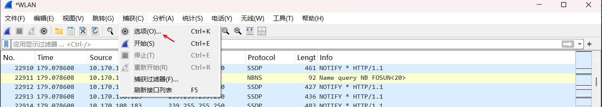
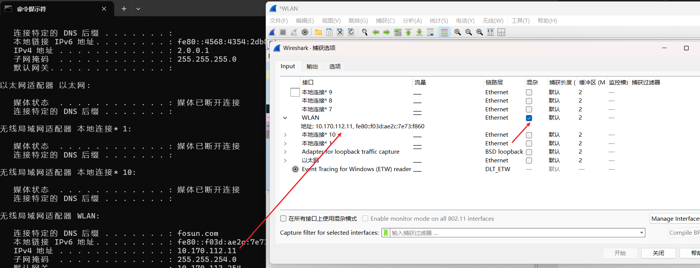
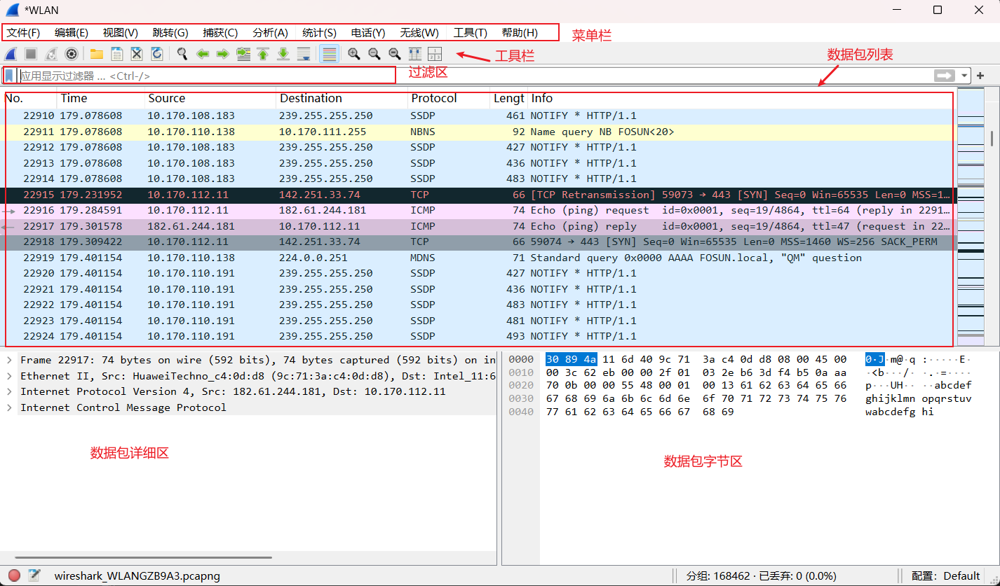
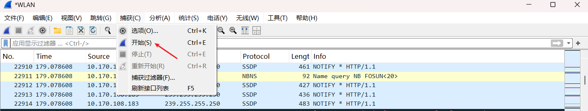
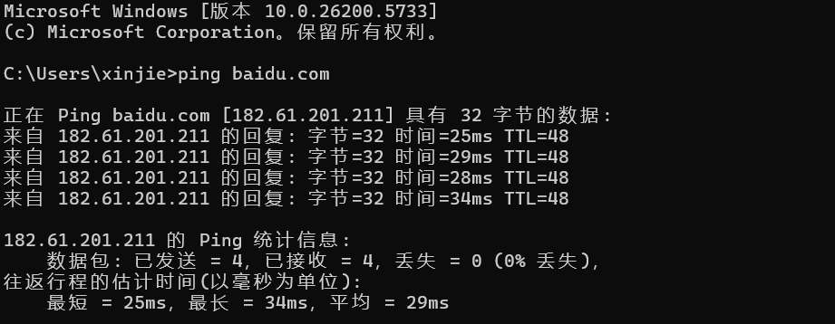
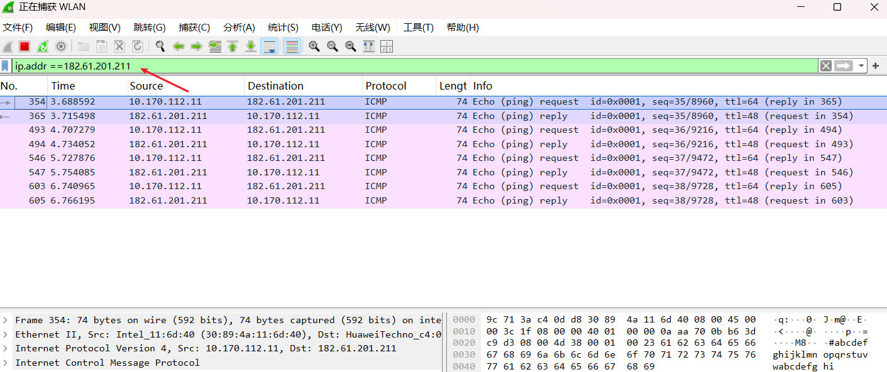

# Wireshark 抓包工具

`Wireshark` 是世界上最流行的网络协议分析工具(简称小鲨鱼)，它能够捕获网络数据包并详细展示协议内容。  
**主要功能包括：**  
1、实时捕获 网络接口传输的数据包  
2、详细解析 数百种网络协议  
3、离线分析 保存的抓包文件  
4、强大过滤 精确查找目标数据

**适用场景**：1、网络故障排查 2、协议学习研究 3、应用调试分析 4、网络安全检测

## 一、安装

官网地址：https://www.wireshark.org


## 二、选择网卡

打开软件，点击 `捕获` -> `选项` 打开配置界面。



使用`cmd ipconfig`查看本地的 ip，然后选中 `Wireshark` 对应的网卡连接，点击并选中。



## 三、开始抓包

**抓包界面介绍：**



点击 `捕获` -> `开始` 开始抓包。



**测试抓包 baidu.com**

```cmd
ping baidu.com
```

{width=80%}

**Wireshark 开始捕获：**



为避免其他无用的数据包影响分析，可以通过在过滤栏设置过滤条件进行数据包列表过滤，获取结果如下。

```js
ip.addr == 182.61.201.211  and icmp
```

表示只显示 ICPM 协议且源主机 IP 或者目的主机 IP 为`182.61.201.211` 的数据包。

`Wireshark`抓包完成，就这么简单。
