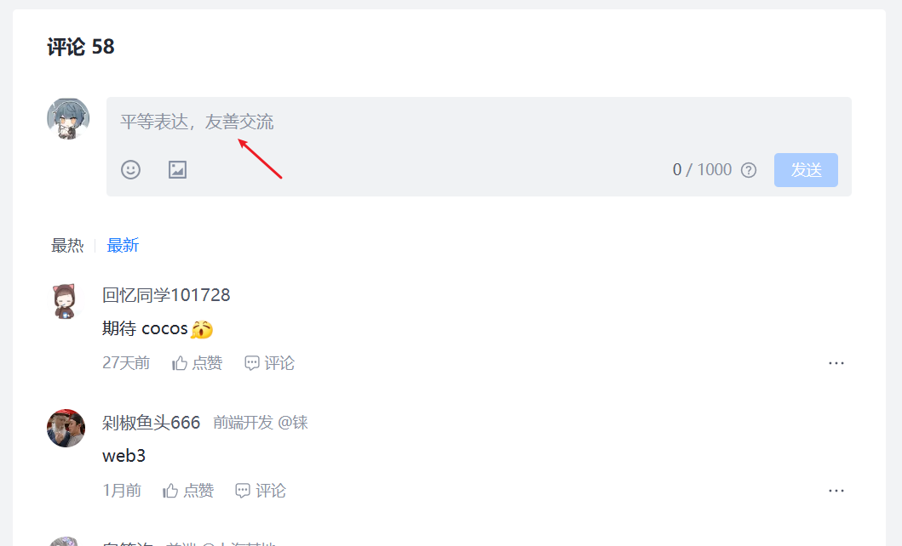

# 前端 XSS 攻击：原理、危害与防御

[[toc]]

## 什么是 XSS 攻击？

`XSS（Cross-Site Scripting，跨站脚本攻击）`是一种常见的 `Web` 安全漏洞，攻击者通过在网页中注入恶意脚本，当其他用户浏览该网页时，这些脚本会在用户的浏览器中执行，从而达到攻击目的。

有趣的是，虽然缩写是 XSS 而不是 CSS，这是为了避免与层叠样式表(CSS)的缩写混淆。

::: tip XSS 攻击的危害

1. **窃取用户 Cookie**：攻击者可以获取用户的会话 Cookie，从而冒充用户登录
2. **钓鱼攻击**：伪造登录表单，诱骗用户输入敏感信息
3. **键盘记录**：记录用户的键盘输入，获取密码等敏感信息
4. **篡改页面内容**：修改网页显示内容，传播虚假信息
5. **发起其他攻击**：利用受害者身份发起 CSRF 攻击等

:::

## XSS 攻击的类型

### 1. 反射型 XSS（非持久型）

`反射型XSS` 是最常见的类型，恶意脚本作为请求的一部分发送到服务器，然后服务器将恶意脚本"反射"回响应中，在用户的浏览器中执行。

**典型场景**：

- 攻击者构造一个包含恶意脚本的 URL
- 诱骗用户点击该 URL
- 服务器将恶意脚本返回并在用户浏览器执行

```javascript
// 恶意URL示例
http://example.com/search?query=<script>alert('XSS')</script>
```

**靶场练习**

**1，浏览器输入** ：`http://test.ctf8.com/level1.php?name=test`, test 字符串会显示到网页上面，如下图：


**2，浏览器输入** ：`http://test.ctf8.com/level1.php?name<script>alert('XSS')</script>`,会发现直接触发了`alert`弹窗,如下图：


### 2. 存储型 XSS（持久型）

存储型` XSS` 更为危险，恶意脚本被永久存储在目标服务器上（如数据库），当其他用户访问包含该脚本的页面时，脚本会被执行。

**典型场景**：

- 攻击者在论坛评论中提交恶意脚本
- 服务器将评论存储到数据库
- 其他用户查看该评论时，恶意脚本被执行

**如图：**



### 3. DOM 型 XSS

`DOM 型 XSS` 是完全在客户端发生的攻击，不涉及服务器。恶意脚本通过修改页面的 DOM 结构来执行。

**第一种注入：**

```html
<!-- 漏洞代码示例 -->
<body>
  <div>
    <textarea style="font-size: 24px;" id="textarea"> </textarea>
    <br />
    <button id="btn">提交</button>
    <script>
      // 点击提交按钮 测试DOMxss漏洞
      const btn = document.getElementById("btn");
      btn.addEventListener("click", function () {
        const textareaValue = document.getElementById("textarea").value;
        document.body.innerHTML += textareaValue;
      });
    </script>
  </div>
</body>
```

点击提交按钮，会发现输入的内容会直接显示在页面上，如下图：


**第二种注入：(直接注入脚本)**

如下：直接在输入框中输入脚本，点击提交按钮，会发现脚本直接执行了。


**解决办法**

1，对输入内容的特殊字符进行转义，例如：将 `<` 转义为 `&lt;`，将 `>` 转义为 `&gt;` 等。

```javascript
// 转义HTML特殊字符
btn.addEventListener("click", function () {
  const textareaValue = document.getElementById("textarea").value;
  const safeValue = textareaValue.replace(/</g, "&lt;").replace(/>/g, "&gt;"); // 注意这行
  document.body.innerHTML += safeValue;
});
```

2，使用第三方库 xss 进行处理 xss 攻击

```javascript
// 引入xss库
import xss from "xss";

// 清理HTML字符串
const dirtyHTML = '<script>alert("XSS");</script>';
const cleanHTML = xss(dirtyHTML);
console.log(cleanHTML); // 输出：&lt;script&gt;alert("XSS");&lt;/script&gt;
```

## 防御 XSS 攻击的措施

### 1. 输入验证和过滤

对所有用户输入进行严格的验证和过滤：

- 只允许预期的字符集（如仅字母数字）
- 使用白名单而非黑名单策略
- 对特殊字符进行转义

```javascript
// 转义HTML特殊字符
function escapeHtml(unsafe) {
  return unsafe.replace(/&/g, "&amp;").replace(/</g, "&lt;").replace(/>/g, "&gt;").replace(/"/g, "&quot;").replace(/'/g, "&#039;");
}
```

### 2. 输出编码

根据输出上下文使用适当的编码：

- HTML 实体编码：`& -> &amp;`, `< -> &lt;`等
- JavaScript 编码：对动态插入到 JS 代码中的内容进行编码
- URL 编码：对 URL 参数进行编码

### 3. 使用安全的 API

避免使用不安全的 API：

- 避免使用`innerHTML`，改用`textContent`
- 避免使用`eval()`、`setTimeout(string)`等可以执行字符串作为代码的函数

### 4. 内容安全策略（CSP）

CSP 是一种强大的防御机制，通过 HTTP 头`Content-Security-Policy`定义哪些资源可以被加载和执行。

```http
Content-Security-Policy: default-src 'self'; script-src 'self' https://trusted.cdn.com
```

### 5. HttpOnly 和 Secure Cookie 标记

设置 Cookie 时使用 HttpOnly 和 Secure 标记：

- `HttpOnly`：防止 JavaScript 访问 Cookie
- `Secure`：仅通过 HTTPS 传输 Cookie

```javascript
Set-Cookie: sessionid=12345; HttpOnly; Secure
```

### 6. 现代框架的内置防护

现代前端框架如 React、Vue、Angular 等内置了 XSS 防护机制：

- React 自动转义所有嵌入 JSX 的值
- Vue 的模板语法也自动转义内容
- 但要注意使用`dangerouslySetInnerHTML`或`v-html`时的风险
