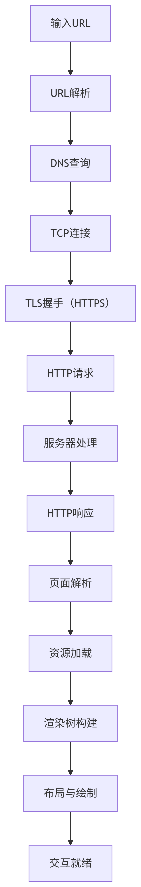

# 浏览器输入 URL 后发生的完整过程

当在浏览器地址栏输入 URL（如`https://www.example.com`）并按下回车时，背后发生了以下 `12` 个关键步骤，如下：

[[toc]]

## **一、完整流程概览图**

{width=150}

## **二、详细步骤解析**

### **1. URL 解析与预处理**

- **浏览器解析 URL 结构**：
  ```
  https://www.example.com:443/path?query=1#section
  └─协议 └──主机名 └─端口 └─路径 └──查询参数 └─锚点
  ```
- **自动补全**：  
  若输入`example.com`，浏览器自动补全为`https://www.example.com`（根据历史记录和 HSTS 列表）

### **2. DNS 域名解析**

浏览器通过 **DNS 查询** 将域名转换为 IP 地址，查询顺序如下：


- **关键点**：
  - DNS 查询使用 UDP 协议（端口 53）
  - 结果缓存 TTL 由 DNS 服务器设置

### **3. 建立 TCP 连接（三次握手）**


- **目的**：确保双方收发能力正常
- **耗时**：通常 1~3 个 RTT（往返时间）

### **4. TLS 握手（HTTPS 专属）**


- **关键步骤**：
  - 证书链验证（CA 机构签名）
  - 密钥交换（ECDHE/RSA）
  - 协商对称加密算法（如 AES_256_GCM）

### **5. 发送 HTTP 请求**

浏览器发送的请求头示例：

```http
GET /index.html HTTP/1.1
Host: www.example.com
User-Agent: Mozilla/5.0
Accept: text/html,application/xhtml+xml
Cookie: session_id=abc123
```

### **6. 服务器处理请求**

服务器端典型处理流程：

```
Nginx → 反向代理 → 应用服务器（如Node.js） → 数据库查询 → 生成HTML
```

### **7. 接收 HTTP 响应**

服务器返回的响应头示例：

```http
HTTP/1.1 200 OK
Content-Type: text/html; charset=utf-8
Cache-Control: max-age=3600
Set-Cookie: session_id=def456
```

### **8. 浏览器解析与渲染**

#### **关键子流程**：

{width=300}

#### **优化策略**：

- **预加载扫描器**：提前发现``/`<script>`资源
- **延迟加载**：对非首屏图片使用`loading="lazy"`

### **9. 加载静态资源**

- **并行下载**：现代浏览器支持 6~8 个 TCP 连接并行下载
- **优先级控制**：
  - CSS/阻塞 JS > 图片 > 异步脚本

### **10. JavaScript 执行**

- **解析阶段**：词法分析 → 语法分析 → 字节码生成
- **执行阶段**：
  - 同步任务直接执行
  - 异步任务（如`setTimeout`）进入事件循环队列

### **11. 页面交互就绪**

- **触发事件**：  
  `DOMContentLoaded`（DOM 解析完成） → `load`（所有资源加载完成）

### **12. 后续优化行为**

- **预渲染**：Chrome 在后台预加载用户可能访问的下一个页面
- **Service Worker 缓存**：支持离线访问（PWA 技术）
