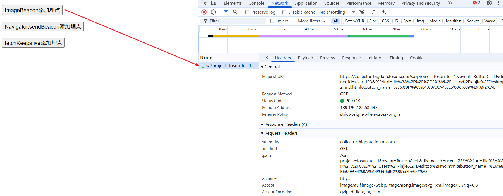
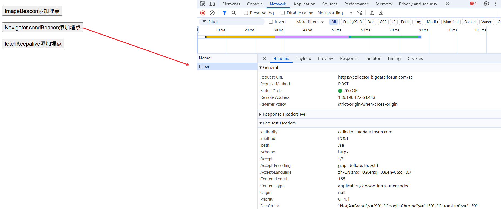

# 前端添加埋点方式和原理

前端埋点，就是把用户在产品里的关键行为（点击、曝光、停留、错误等）记录下来，回传到服务器或第三方平台，为产品决策、运营分析、问题排查提供数据依据。

[[toc]]

:::tip

**核心实现思路** 埋点本质上就是向埋点平台的数据接收 URL 发送一个 HTTP 请求，请求中携带了格式化的数据（通常是 URL 参数或 JSON）。您提供的响应头表明这是一个 GET 请求，并且服务器配置为不缓存且允许跨域。

:::

## 方法一：使用 Image Beacon（最经典、最可靠的方法）

这是最传统且兼容性最好的方式，利用图片请求没有跨域限制的特性。

代码如下：

```js
// 将属性对象转换为URL参数字符串
function formatParams(params) {
  return Object.keys(params)
    .map((key) => `${encodeURIComponent(key)}=${encodeURIComponent(params[key])}`)
    .join("&");
}
// 使用 Image Beacon
document.getElementById("ImageBeacon").addEventListener("click", () => {
  // 构建埋点URL和参数
  const saUrl = "https://..."; // 数据接收地址
  const project = "fosun_test1"; // 您的项目名
  const event = "ButtonClick"; // 事件名称，如 'PageView', 'ButtonClick'
  const distinctId = "user_123"; // 用户ID
  const properties = {
    // 事件属性
    $url: window.location.href,
    button_name: "提交按钮"
  };
  const finalUrl = `${saUrl}?project=${project}&event=${event}&distinct_id=${distinctId}&${formatParams(properties)}`;

  // 创建Image对象发送请求
  const beacon = new Image(1, 1); // 创建一个1x1像素的图片
  beacon.src = finalUrl; // 设置src即发起GET请求

  // 可选的错误处理
  beacon.onerror = function () {
    console.error("Sensors beacon request failed.");
  };
  beacon.onload = function () {
    console.log("Sensors beacon request successful.");
  };
});
```

截图如下：



## 方法二：使用 Navigator.sendBeacon（现代浏览器推荐）

这是 HTML5 专门为日志上报设计的新 API，非常适合埋点场景。

代码如下：

```js
// 使用 sendBeacon 发送数据
document.getElementById("sendBeacon").addEventListener("click", () => {
  // 构建数据对象
  const data = {
    project: "fosun_test1",
    event: "ButtonClick",
    distinct_id: "user_123",
    properties: {
      $url: window.location.href,
      button_name: "提交按钮"
    }
  };

  // 注意：sendBeacon 通常以 POST 方式发送字符串化的JSON
  const blob = new Blob([JSON.stringify(data)], { type: "application/x-www-form-urlencoded" });
  const success = navigator.sendBeacon("https://...", blob); // 数据接收地址
  if (success) {
    console.log("Beacon enqueued successfully!");
  } else {
    console.error("Beacon failed to queue.");
  }
});
```

截图如下：



**优点：**

- 专为日志设计：即使页面卸载也会保证发送。
- 低优先级：不会阻塞页面卸载过程或与关键操作竞争网络资源。

## 方法三：使用 Fetch API with keepalive（不推荐）

`Fetch API `提供了 `keepalive` 选项，用于在页面卸载后继续发送请求。这在需要确保数据上报的场景下非常有用。

```javascript
// 使用 fetchKeepalive 发送数据
document.getElementById("keepalive").addEventListener("click", () => {
  const data = new URLSearchParams();
  data.append("project", "your_project_name");
  data.append("event", "ButtonClick");
  data.append("distinct_id", "user_123");
  data.append(
    "properties",
    JSON.stringify({
      $url: window.location.href,
      button_name: "提交按钮"
    })
  );
  fetch("https://...", {
    method: "POST",
    body: data,
    keepalive: true, // 关键参数：确保请求在页面卸载后仍能继续
    headers: {
      "Content-Type": "application/x-www-form-urlencoded"
    }
  }).catch((error) => {
    console.error("Fetch beacon failed:", error);
  });
});
```

## 方法四：直接使用神策官方 SDK（最推荐）

实际上，您不需要手动实现这些。神策提供了非常完善的官方 SDK，只需简单初始化即可。

1.  **安装 SDK**：

    ```bash
    npm install sa-sdk-javascript
    ```

2.  **初始化并调用**：

    ```html
    <script>
      // 初始化神策分析
      var sensors = window["sensorsDataAnalytic201505"];
      sensors.init({
        server_url: "https://your-sensors-data-server.com/sa", // 数据接收地址
        heatmap: {
          // 可选：点击图/触达图配置
          clickmap: "default",
          scroll_notice_map: "default"
        }
      });

      // 标识用户
      sensors.login("user_123");

      // 发送事件
      sensors.track("ButtonClick", {
        button_name: "提交按钮"
      });
    </script>
    ```

**这是最推荐的方式**，因为官方 SDK 处理了所有的兼容性、批量上报、重试机制等复杂问题。

### 神策请求参数详解

无论用哪种方法，最终发送给神策服务器的 URL 通常包含以下核心参数：

| 参数          | 含义               | 示例                                |
| :------------ | :----------------- | :---------------------------------- |
| `project`     | 项目名称           | `production`                        |
| `event`       | 事件名称           | `$pageview` (页面浏览)              |
| `distinct_id` | 匿名/用户 ID       | `123456`                            |
| `properties`  | 事件属性           | `{ "$url": "https://example.com" }` |
| `time`        | 事件时间戳（可选） | `1631234567890`                     |

## 总结与选择

| 方法                | 适用场景                    | 优点                         | 缺点                    |
| :------------------ | :-------------------------- | :--------------------------- | :---------------------- |
| **Image Beacon**    | 需要极致兼容性（如旧版 IE） | 兼容性最好，无跨域问题       | 无法发送大量数据        |
| **sendBeacon**      | 现代浏览器，页面卸载时上报  | 专为日志设计，不阻塞卸载     | 兼容性稍差（IE 不支持） |
| **fetch keepalive** | 现代浏览器，需要更多控制    | 功能强大，可控制请求细节     | 兼容性比 sendBeacon 差  |
| **官方 SDK**        | **所有生产环境**            | **功能完整，稳定可靠，省心** | 需要引入 SDK            |

**最终建议**：对于生产环境，**强烈推荐直接使用神策官方 SDK**。它封装了所有最佳实践，您只需要关心业务逻辑（触发什么事件），而不需要关心网络传输的实现细节。只有在一些非常特殊的场景下，才需要考虑自己实现埋点请求。

## 常见问题：神策使用 Image Beacon 是怎么获取用户数据的？

像神策这种发送一个图片给后端，他们是怎么通过图片分析数据的？

**神策并不是真的去“分析”图片本身的内容**（比如图片里的像素、颜色等），而是**巧妙地利用浏览器请求图片的行为来传递数据**。

可以这样理解：**图片的 URL（地址）不是指向一张真实的图片，而实际上是一个精心编排的、包含了你所有埋点数据的“代码字符串”**。

整个过程就像一个秘密通信协议：

### 核心原理：URL 即消息

埋点系统会动态生成一个 1x1 像素的透明 GIF 图片的 URL，但这个 URL 的路径和参数部分被用来编码数据。

**举个例子：** 一个真实的埋点图片请求 URL 可能长这样：

```
https://data-sensors.com/sa.gif?project=my_web&event=pageview&user_id=123&page_url=https%3A%2F%2Fexample.com&button_name=checkout&time=1631234567890
```

**分解这个 URL：**

| URL 部分                          | 作用                     | 说明                                                       |
| :-------------------------------- | :----------------------- | :--------------------------------------------------------- |
| `https://data-sensors.com/sa.gif` | **接收端点**             | 神策服务器的地址，路径叫 `sa.gif` 只是为了**伪装**成图片。 |
| `?project=my_web`                 | **查询参数（数据载体）** | 从问号 `?` 开始的部分才是关键！这些参数就是埋点数据。      |
| `&event=pageview`                 | 事件名称                 | 告诉服务器用户进行了“页面浏览”这个行为。                   |
| `&user_id=123`                    | 用户标识                 | 告诉服务器是哪个用户做的。                                 |
| `&page_url=...`                   | 事件属性                 | 告诉用户是在哪个页面做的。                                 |
| `&time=...`                       | 时间戳                   | 告诉服务器事件发生的确切时间。                             |

当浏览器尝试加载这个“图片”时，会发生以下事情：

1.  **浏览器**：认为这是一个普通的图片资源，向 `https://data-sensors.com/sa.gif` 发起一个 **HTTP GET 请求**。
2.  **神策服务器**：
    - 接收到这个请求，**完全忽略**请求的是 `.gif` 这个事实。
    - 服务器端的程序（如 Nginx、Node.js、Java 等）会**解析 URL 中的查询参数**（即 `?` 后面的部分）。
    - 将这些参数（`project=my_web`, `event=pageview`...）解析成结构化的 JSON 数据。
    - **将这些数据存入数据库或大数据平台**，用于后续的分析和计算。
    - 最后，服务器返回一个**极其微小的 1x1 像素的透明 GIF 图片**作为响应内容（就是你响应头里 `content-type: image/gif` 对应的内容）。
3.  **浏览器**：接收到这个微小的图片数据，并渲染它（当然，在页面上你什么都看不到）。

### 为什么选择用图片（Image Beacon）？

这种技术被称为 **“Image Beacon”**（图片信标），它被广泛采用是因为有诸多优点：

| 优点             | 解释                                                                            |
| :--------------- | :------------------------------------------------------------------------------ |
| **没有跨域问题** | 图片资源不受同源策略的限制，可以从任何域名下加载。这是最大的优势。              |
| **兼容性极好**   | 所有浏览器，包括非常古老的版本，都支持图片加载。                                |
| **简单可靠**     | 实现起来非常简单，只需要创建一个 `Image` 对象并设置 `src` 属性即可。            |
| **不阻塞页面**   | 图片加载是异步的，不会阻塞页面的渲染或卸载过程。                                |
| **开销极小**     | 请求的图片只有 1x1 像素，几乎是所有网络请求中数据量最小的，对性能影响微乎其微。 |

### 🆚 与现代方法的对比

虽然 Image Beacon 非常经典，但现在也有更现代的技术：

| 技术                       | 工作原理                             | 优点                             | 缺点                               |
| :------------------------- | :----------------------------------- | :------------------------------- | :--------------------------------- |
| **Image Beacon**           | 伪装成图片的 GET 请求，数据在 URL 中 | 兼容性最好，无跨域问题           | URL 长度有限制，不适合传输大量数据 |
| **navigator.sendBeacon()** | HTML5 新 API，专门用于发送少量数据   | 即使页面关闭也会保证发送，不阻塞 | 兼容性稍差（IE 完全不支持）        |
| **Fetch API**              | 使用 JavaScript 发起异步请求         | 功能强大，可控制性强             | 可能受跨域策略限制                 |

### 总结

所以，神策并不是分析图片，而是**挂羊头卖狗肉**：

- **羊头（请求头）**：`Content-Type: image/gif` -> 让浏览器以为这是个图片。
- **狗肉（请求体和目的）**：`?event=xxx&user_id=xxx` -> 在 URL 参数中携带数据，服务器解析后存入数据库。

最终，您在海量数据中看到的**用户行为分析报表、转化漏斗、留存分析**等，全都是基于**解析这些 URL 参数后存入数据库的数据**计算出来的，与那张微小的透明图片本身没有任何关系。

## 案例代码

上面的案例代码如下：

```html
<!DOCTYPE html>
<html>
  <head>
    <title>Markdown Renderer</title>
    <style>
      button {
        display: block;
        margin: 20px;
        font-size: 16px;
      }
    </style>
  </head>
  <body>
    <div id="result"></div>
    <button id="ImageBeacon">ImageBeacon添加埋点</button>
    <button id="sendBeacon">Navigator.sendBeacon添加埋点</button>
    <button id="keepalive">fetchKeepalive添加埋点</button>
    <script>
      // 将属性对象转换为URL参数字符串
      function formatParams(params) {
        return Object.keys(params)
          .map((key) => `${encodeURIComponent(key)}=${encodeURIComponent(params[key])}`)
          .join("&");
      }
      // 使用 Image Beacon
      document.getElementById("ImageBeacon").addEventListener("click", () => {
        // 构建埋点URL和参数
        const saUrl = "https://..."; // 数据接收地址
        const project = "fosun_test1"; // 您的项目名
        const event = "ButtonClick"; // 事件名称，如 'PageView', 'ButtonClick'
        const distinctId = "user_123"; // 用户ID
        const properties = {
          // 事件属性
          $url: window.location.href,
          button_name: "提交按钮"
        };
        const finalUrl = `${saUrl}?project=${project}&event=${event}&distinct_id=${distinctId}&${formatParams(properties)}`;
        // 创建Image对象发送请求
        const beacon = new Image(1, 1); // 创建一个1x1像素的图片
        beacon.src = finalUrl; // 设置src即发起GET请求
        // 可选的错误处理
        beacon.onerror = function () {
          console.error("Sensors beacon request failed.");
        };
        beacon.onload = function () {
          console.log("Sensors beacon request successful.");
        };
      });

      // 使用 sendBeacon 发送数据
      document.getElementById("sendBeacon").addEventListener("click", () => {
        // 构建数据对象
        const data = {
          project: "fosun_test1",
          event: "ButtonClick",
          distinct_id: "user_123",
          properties: {
            $url: window.location.href,
            button_name: "提交按钮"
          }
        };
        // 注意：sendBeacon 通常以 POST 方式发送字符串化的JSON
        const blob = new Blob([JSON.stringify(data)], { type: "application/x-www-form-urlencoded" });
        const success = navigator.sendBeacon("https://...", blob);
        if (success) {
          console.log("Beacon enqueued successfully!");
        } else {
          console.error("Beacon failed to queue.");
        }
      });

      // 使用 fetchKeepalive 发送数据
      document.getElementById("keepalive").addEventListener("click", () => {
        const data = new URLSearchParams();
        data.append("project", "your_project_name");
        data.append("event", "ButtonClick");
        data.append("distinct_id", "user_123");
        data.append(
          "properties",
          JSON.stringify({
            $url: window.location.href,
            button_name: "提交按钮"
          })
        );
        fetch("https://...", {
          method: "POST", // 也可能是GET，取决于神策服务器的配置
          body: data,
          keepalive: true, // 关键参数：确保请求在页面卸载后仍能继续
          headers: {
            "Content-Type": "application/x-www-form-urlencoded"
          }
        }).catch((error) => {
          console.error("Fetch beacon failed:", error);
        });
      });
    </script>
  </body>
</html>
```
