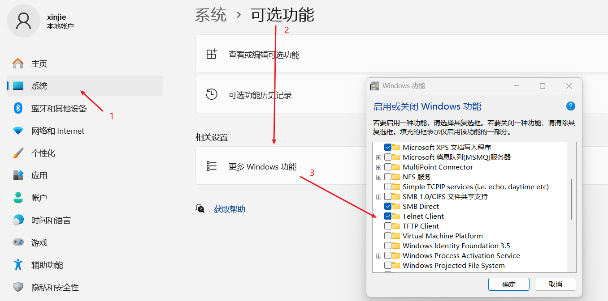

# 网络常用命令详解：Telnet、Ping 及其他实用工具

作为前端开发者，掌握基本的网络命令对于调试接口、排查网络问题非常有帮助。

[[toc]]

## 一、Ping 命令 - 网络连通性测试

**功能**：测试主机之间的网络连通性，测量往返时间(RTT)

**基本语法**：

```bash
ping [选项] 目标主机
```


**常用选项**：

- `-c 数量`：指定发送的 ICMP 包数量（Linux/macOS）
- `-n 数量`：指定发送的 ICMP 包数量（Windows）
- `-t`：持续 ping 直到手动停止（Windows）
- `-i 间隔`：设置 ping 包发送间隔（秒）
- `-s 大小`：设置 ping 包大小（字节）

**使用示例**：

```bash
# 基本ping测试
ping www.baidu.com

# 指定ping包数量（Linux/macOS）
ping -c 5 www.baidu.com

# 指定ping包数量（Windows）
ping -n 5 www.baidu.com

# 设置ping包大小为100字节
ping -s 100 www.example.com
```

**输出解读**：

```
PING www.baidu.com (142.250.190.36): 56 data bytes
64 bytes from 142.250.190.36: icmp_seq=0 ttl=115 time=12.345 ms
64 bytes from 142.250.190.36: icmp_seq=1 ttl=115 time=11.876 ms
64 bytes from 142.250.190.36: icmp_seq=2 ttl=115 time=13.210 ms

--- www.baidu.com ping statistics ---
3 packets transmitted, 3 packets received, 0.0% packet loss
round-trip min/avg/max/stddev = 11.876/12.477/13.210/0.557 ms
```

**应用场景**：

- 检查网络是否通畅
- 测试 DNS 解析是否正常
- 测量网络延迟
- 排查网络连接问题

## 二、Telnet 命令 - 端口连通性测试

**功能**：测试远程主机的特定端口是否开放并可连接

**基本语法**：

```bash
telnet [主机] [端口]
```

如果出现：

```bash
'telnet' 不是内部或外部命令，也不是可运行的程序
```

需要安装 `telnet` 客户端。

```bash
WIN+I 【设置】
---》 点击【系统】
---》 【可选功能】
---》 【更多windows功能】
---》 打开【启用或关闭Windows功能】
---》 勾选【Telnet客户端】
---》 点击【确定】进行安装。
```

如图：



**使用示例**：

```bash
# 测试80端口（HTTP）是否开放
telnet www.example.com 80

# 测试443端口（HTTPS）是否开放
telnet www.example.com 443

# 测试SMTP服务（25端口）
telnet mail.example.com 25
```

**成功连接示例**：

```
Trying 93.184.216.34...
Connected to example.com.
Escape character is '^]'.
```

**失败连接示例**：

```
正在连接www.baidu.com...无法打开到主机的连接。 在端口 8000: 连接失败
```

**应用场景**：

- 检查服务端口是否开放
- 测试防火墙配置
- 调试网络服务
- 与简单 TCP 服务交互（如 SMTP、Redis 等）

**注意**：现代系统可能默认未安装 Telnet，需要手动安装：

- Ubuntu/Debian: `sudo apt install telnet`
- CentOS/RHEL: `sudo yum install telnet`
- macOS: 通常已安装
- Windows: 需在"启用或关闭 Windows 功能"中启用

## 三、Traceroute/Tracert - 路由追踪

**功能**：显示数据包到达目标主机经过的路由路径

**Linux/macOS 语法**：

```bash
traceroute [选项] 目标主机
```

**Windows 语法**：

```bash
tracert [选项] 目标主机
```

**常用选项**：

- `-n`：不解析 IP 为域名（加快显示）
- `-m 跳数`：设置最大跳数
- `-w 超时`：设置等待超时（秒）

**使用示例**：

```bash
# Linux/macOS
traceroute www.baidu.com

# Windows
tracert www.baidu.com

# 不解析域名，最大跳数30
traceroute -n -m 30 www.baidu.com
```

**输出如下**：


**应用场景**：

- 诊断网络连接问题
- 发现网络瓶颈
- 了解网络拓扑结构

## 四、Netstat - 网络状态查看

**功能**：显示网络连接、路由表、接口统计等信息

**基本语法**：

```bash
netstat [选项]
```

**常用选项**：

- `-a`：显示所有连接和监听端口
- `-t`：显示 TCP 连接
- `-u`：显示 UDP 连接
- `-n`：以数字形式显示地址和端口
- `-p`：显示进程 ID/名称（Linux）
- `-b`：显示创建连接的可执行文件（Windows）
- `-e`：显示以太网统计信息
- `-r`：显示路由表

**使用示例**：

```bash
# 显示所有TCP连接
netstat -atn

# 显示所有UDP连接
netstat -aun

# 显示监听端口及对应进程（Linux）
netstat -tulnp

# 显示路由表
netstat -r
```

**输出示例**：


**应用场景**：

- 查看服务器监听端口
- 检查异常网络连接
- 排查端口占用问题
- 监控网络流量

## 五、Curl - 多功能网络工具

**功能**：强大的命令行 HTTP 客户端，支持多种协议

**基本语法**：

```bash
curl [选项] [URL]
```

**常用选项**：

- `-X`：指定 HTTP 方法（GET/POST/PUT 等）
- `-H`：添加请求头
- `-d`：发送 POST 数据
- `-o`：输出到文件
- `-v`：显示详细输出
- `-L`：跟随重定向
- `-k`：忽略 SSL 证书验证
- `-u`：基本认证

**使用示例**：

```bash
# 简单GET请求
curl https://api.example.com/data

# 带自定义头的GET请求
curl -H "Authorization: Bearer token123" https://api.example.com/data

# POST请求发送JSON数据
curl -X POST -H "Content-Type: application/json" -d '{"key":"value"}' https://api.example.com/data

# 下载文件
curl -o file.zip https://example.com/file.zip

# 显示请求详情（调试用）
curl -v https://api.example.com/data
```

**应用场景**：

- 测试 API 接口
- 调试 HTTP 请求
- 下载文件
- 自动化脚本

## 总结

| 命令       | 主要用途         | 适用场景       |
| ---------- | ---------------- | -------------- |
| ping       | 测试网络连通性   | 基础网络诊断   |
| telnet     | 测试端口连通性   | 服务可用性检查 |
| traceroute | 路由追踪         | 网络路径分析   |
| netstat    | 网络连接状态查看 | 端口占用检查   |
| curl       | HTTP 请求测试    | API 调试       |
