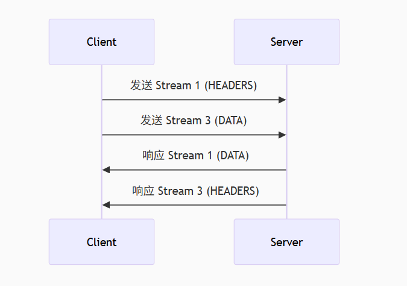

# HTTP/1.1 与 HTTP/2：核心区别与性能对比

`HTTP（HyperText Transfer Protocol）`是 `Web` 通信的基础协议，从 `HTTP/1.1` 到 `HTTP/2`，协议经历了重大升级，显著提升了 Web 性能。

## 1. HTTP/1.1 的局限性

`HTTP/1.1` 于 `1999` 年发布，虽然稳定，但随着现代 Web 应用的复杂性增加，其性能瓶颈日益明显：

### 1.1 队头阻塞（Head-of-Line Blocking）

- HTTP/1.1 使用**串行请求**，浏览器对同一域名最多允许 **6-8 个并发连接**。
- 如果某个请求响应慢，后续请求会被阻塞（即使它们可以更快完成）。

### 1.2 无头部压缩

- 每个 HTTP 请求都携带大量重复头部（如 `User-Agent`、`Cookie`），导致冗余数据传输。

### 1.3 文本协议

- HTTP/1.1 使用**纯文本格式**，解析效率低，容易出错。

### 1.4 无服务器推送

- 服务器无法主动推送资源（如 CSS、JS），必须等待客户端请求。

## 2. HTTP/2 的核心优化

`HTTP/2（2015 年发布）`在兼容 `HTTP/1.1` 语义的基础上，大幅优化了传输效率：

### 2.1 二进制分帧（Binary Framing）

> [!WARNING] HTTP/1.1 是纯文本格式传输数据（存在以下问题）解析复杂（需按行读取）  
> 容易出错（如换行符处理）  
> 无法高效支持多路复用

- **HTTP/2 采用二进制格式**，取代 `HTTP/1.1` 的文本格式，解析更高效。
- 数据被拆分为**帧（Frame）**，每个帧有类型（HEADERS、DATA 等），支持多路复用。

```plaintext
+-----------------------------------------------+
| Length (24 bits)                              | → 帧长度
+---------------+---------------+---------------+
| Type (8 bits)  | Flags (8 bits)               | → 帧类型和标志位
+-+-------------+---------------+---------------+
| R (1 bit)     | Stream ID (31 bits)           | → 流标识符
+---------------+-------------------------------+
| Frame Payload (0~16,384 bytes)                | → 帧数据
+-----------------------------------------------+
```

**关键字段说明：**  
Type：帧类型（如 HEADERS、DATA、SETTINGS）  
Stream ID：所属流的唯一标识（支持多路复用的关键）  
Payload：实际传输的数据

### 2.2 多路复用（Multiplexing）**

> [!WARNING] HTTP/1.1 的并发限制  
> 浏览器对同一域名限制 6~8 个 TCP 连接  
> 每个连接只能串行处理请求（队头阻塞）

> [!IMPORTANT] HTTP/2 多路复用  
> **HTTP/2 通过流（Stream）机制实现真正的并行传输 一个 TCP 连接可并行传输多个请求和响应**，彻底解决队头阻塞问题。  
> 单 TCP 连接可承载多个双向流（Stream）  
> 每个流有唯一 Stream ID，可乱序发送帧  
> 接收方通过 Stream ID 重组消息

**如图所示：**

{width=80%}

不同流的帧可以交替传输;  
一个流的阻塞不会影响其他流;

### 2.3 头部压缩（HPACK）

> [!WARNING] HTTP/1.1 头部的问题  
> 每个请求重复携带相同头部（如 User-Agent、Cookie）  
> 平均头部大小 500~800 字节，实际有效信息占比低

- 使用 **HPACK 算法** 压缩 HTTP 头部，减少冗余数据（如 `User-Agent` 只需发送一次）。
- 典型场景下，头部大小减少 **50%-90%**。

> [!IMPORTANT] HPACK 压缩原理  
> **(1) 静态表（Static Table）** 预定义 61 个常见头部字段（如 :method: GET 对应索引 2）  
> **(2) 动态表（Dynamic Table）** 在连接过程中动态维护的头部字段表（如自定义 X-Token）  
> **(3) 编码方式** 索引表示：直接引用表中的索引（如 :method: GET → 0x82，霍夫曼编码：对字符串进一步压缩

**压缩示例：**

```plaintext
原始头部:
  :method: GET
  :path: /index.html
  user-agent: Mozilla/5.0

压缩后:
  0x82 (静态表索引2: GET)
  0x85 (静态表索引5: /index.html)
  0x40 0x7a (动态表新增user-agent)
```

### 2.4 服务器推送（Server Push）

- 服务器可以**主动推送资源**（如 CSS、JS）到客户端缓存，减少额外请求延迟。
- 例如：
  ```http
  HTTP/2 200 OK
  Link: </style.css>; rel=preload; as=style
  ```
  服务器可同时推送 `style.css`，而不需等待 HTML 解析后再请求。

### 2.5 流优先级（Stream Prioritization）

- 客户端可指定请求的优先级（如优先加载 CSS 而非图片），优化渲染性能。

## 3. HTTP/1.1 vs HTTP/2 对比表

| 特性           | HTTP/1.1                        | HTTP/2                    |
| -------------- | ------------------------------- | ------------------------- |
| **传输协议**   | 文本                            | 二进制                    |
| **并发模型**   | 6-8 个连接/域名（串行）         | 单连接多路复用            |
| **头部压缩**   | 无                              | HPACK 压缩                |
| **服务器推送** | 不支持                          | 支持                      |
| **队头阻塞**   | 存在（TCP 层）                  | 基本解决（QUIC 彻底解决） |
| **优先级控制** | 有限支持（如 `<link preload>`） | 精细控制（权重依赖树）    |

## 4. HTTP/2 的实际性能优势

### 4.1 减少延迟

- 多路复用 + 头部压缩使页面加载速度提升 **30%-50%**（尤其是高延迟网络）。

### 4.2 降低服务器负载

- 单连接替代多连接，减少 TCP 握手和 TLS 协商开销。

### 4.3 更好的移动端体验

- 头部压缩节省流量（对蜂窝网络尤为重要）。
