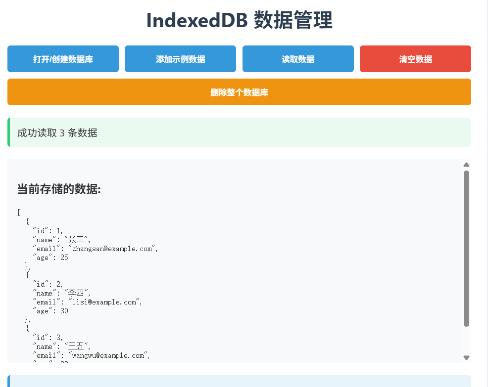
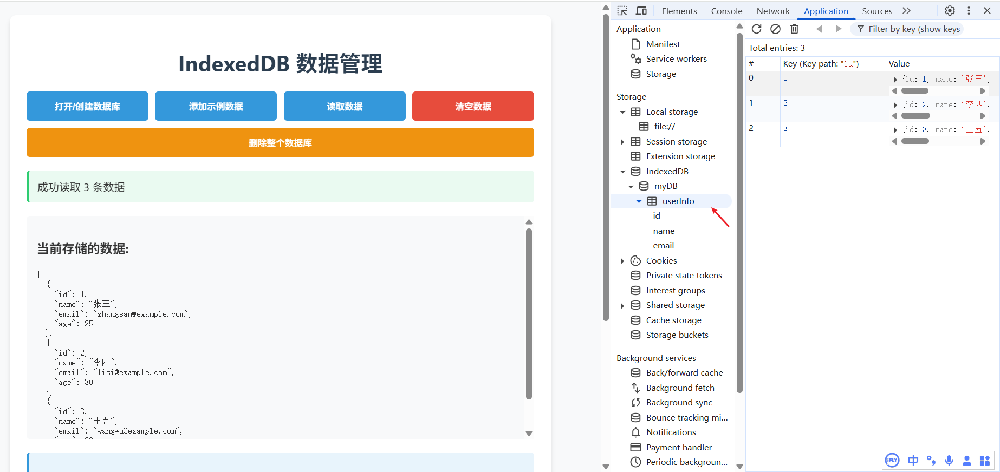

# 浏览器缓存: IndexDB 缓存

[[toc]]



---
`IndexedDB `是一个运行在浏览器上的`非关系型`数据库，用于在客户端存储大量结构化数据。

**特点:**

| 特点             | 简要说明                                                                    |
| ---------------- | --------------------------------------------------------------------------- |
| 存储空间大       | 每个源通常 ≥ 250 MB，浏览器/系统配额决定，可视为“无上限”。                  |
| 支持二进制数据   | 原生支持 `ArrayBuffer`、`Blob`、`File` 等二进制类型。                       |
| 键值对存储       | 以对象仓库为单位，按主键（key）存储 JavaScript 对象（value）。              |
| 同源限制         | 只能被同一协议+域名+端口的页面访问，无法跨域共享。                          |
| 异步执行         | 所有操作基于事件/Promise，非阻塞主线程。                                    |
| 事务型数据库系统 | 支持 read-only、readwrite、versionchange 事务，具备 ACID 语义（失败回滚）。 |

## 主要 API 方法和步骤

### 1. 打开/创建数据库

使用 `indexedDB.open(name, version)` 方法。如果数据库不存在，则会创建它。

```javascript
// 打开版本为 1 的 'my-database' 数据库
const request = indexedDB.open("my-database", 1);

let db; // 用于保存数据库连接

// 成功打开数据库
request.onsuccess = function (event) {
  db = event.target.result; // 数据库对象
  console.log("数据库打开成功");
};

// 打开数据库失败
request.onerror = function (event) {
  console.error("数据库打开错误:", event.target.error);
};
```

### 2. 处理版本升级 (`onupgradeneeded`)

这是最关键的一步。当第一次创建数据库，或者传入的版本号比当前版本高时，会触发 `onupgradeneeded` 事件。**所有对象存储和索引的创建、修改、删除都必须在这里进行。**

```javascript
request.onupgradeneeded = function (event) {
  // 保存数据库实例
  const db = event.target.result;

  // 检查对象存储是否已存在，如果不存在则创建
  if (!db.objectStoreNames.contains("books")) {
    // 创建一个名为 ‘books’ 的对象存储，并定义主键为 ‘id’（它将来自对象本身的 ‘id’ 属性）
    const objectStore = db.createObjectStore("books", { keyPath: "id", autoIncrement: true });

    // 创建一个索引以便通过 ‘title’ 搜索
    objectStore.createIndex("title", "title", { unique: false });
    objectStore.createIndex("author", "author", { unique: false });

    console.log("对象存储和索引创建完毕");
  }
};
```

### 3. 增删改查操作

所有操作都需要在事务中进行。

**a. 添加数据**

```javascript
function addBook(book) {
  // 1. 开启一个读写事务，指定涉及的对象存储 ‘books’
  const transaction = db.transaction(["books"], "readwrite");
  // 2. 获取对象存储
  const objectStore = transaction.objectStore("books");
  // 3. 执行添加操作
  const request = objectStore.add(book);

  request.onsuccess = function () {
    console.log("书籍已添加");
  };

  request.onerror = function () {
    console.error("添加书籍失败:", request.error);
  };
}

// 使用
addBook({ title: "JavaScript权威指南", author: "David Flanagan", year: 2020 });
```

**b. 读取数据（通过主键）**

```javascript
function getBook(id) {
  const transaction = db.transaction(["books"], "readonly");
  const objectStore = transaction.objectStore("books");
  const request = objectStore.get(id); // 根据主键获取

  request.onsuccess = function () {
    if (request.result) {
      console.log("找到书籍:", request.result);
    } else {
      console.log("未找到该书籍");
    }
  };

  request.onerror = function () {
    console.error("获取书籍失败:", request.error);
  };
}
```

**c. 通过索引查询数据**

```javascript
function getBooksByAuthor(authorName) {
  const transaction = db.transaction(["books"], "readonly");
  const objectStore = transaction.objectStore("books");
  // 1. 获取索引
  const index = objectStore.index("author");
  // 2. 在索引上查询
  const request = index.getAll(authorName); // 获取所有匹配的作者

  request.onsuccess = function () {
    console.log(`找到作者为 ${authorName} 的书籍:`, request.result);
  };
}
```

**d. 使用游标遍历所有数据**

```javascript
function getAllBooks() {
  const transaction = db.transaction(["books"], "readonly");
  const objectStore = transaction.objectStore("books");
  // 1. 在对象存储上打开游标请求
  const request = objectStore.openCursor();
  const allBooks = [];

  request.onsuccess = function (event) {
    // 2. 获取游标对象
    const cursor = event.target.result;
    if (cursor) {
      // 3. cursor.value 是当前指向的数据记录
      allBooks.push(cursor.value);
      // 4. 移动到下一条记录
      cursor.continue();
    } else {
      // 5. 遍历完毕，没有更多数据了
      console.log("所有书籍:", allBooks);
    }
  };
}
```

**e. 更新数据**

更新操作类似于添加，但使用 `put()` 方法。如果主键已存在，则替换该记录；如果不存在，则添加新记录。

```javascript
function updateBook(updatedBook) {
  const transaction = db.transaction(["books"], "readwrite");
  const objectStore = transaction.objectStore("books");
  const request = objectStore.put(updatedBook); // 使用 put 方法

  request.onsuccess = function () {
    console.log("书籍已更新");
  };
}
```

**f. 删除数据**

```javascript
function deleteBook(id) {
  const transaction = db.transaction(["books"], "readwrite");
  const objectStore = transaction.objectStore("books");
  const request = objectStore.delete(id);

  request.onsuccess = function () {
    console.log("书籍已删除");
  };
}
```

---

### 现代开发：使用 `Promise` 包装

原生的 API 是基于事件的，代码容易形成“回调地狱”。一个常见的做法是用 `Promise` 将其包装起来，使其更易于使用。

```javascript
// 一个简单的 Promise 包装函数，用于执行事务操作
function promisifyRequest(request) {
  return new Promise((resolve, reject) => {
    request.onsuccess = () => resolve(request.result);
    request.onerror = () => reject(request.error);
  });
}

// 使用 async/await 的读取示例
async function getBookAsync(id) {
  const transaction = db.transaction(["books"], "readonly");
  const objectStore = transaction.objectStore("books");
  try {
    const book = await promisifyRequest(objectStore.get(id));
    console.log("找到书籍:", book);
    return book;
  } catch (error) {
    console.error("获取失败:", error);
  }
}
```

## 总结

| 概念/方法                  | 用途                                      |
| :------------------------- | :---------------------------------------- |
| `indexedDB.open()`         | 打开/创建数据库                           |
| `onupgradeneeded`          | **创建/修改**数据库结构（对象存储、索引） |
| `transaction()`            | 创建事务，指定模式和对象存储              |
| `objectStore()`            | 在事务中获取对象存储                      |
| `add()`                    | 添加新数据                                |
| `get()`                    | 通过主键获取数据                          |
| `put()`                    | 更新数据（或添加）                        |
| `delete()`                 | 删除数据                                  |
| `createIndex()`            | 创建索引                                  |
| `index()`                  | 获取索引                                  |
| `openCursor()`             | 打开游标以遍历数据                        |
| `getAll()`, `getAllKeys()` | 获取所有数据或键（小心大量数据）          |

**优点：**

- 存储量大（通常远大于 `localStorage` 的 5MB）。
- 支持异步操作，不阻塞 UI。
- 支持事务，保证数据一致性。
- 支持复杂的查询（通过索引和游标）。
- 支持二进制数据存储（如 `Blob`, `File`）。

**缺点：**

- API 相对底层和繁琐。
- 语法较为复杂，需要理解事务、游标等概念。

对于现代项目，可以考虑使用封装了 IndexedDB 的库（如 **Dexie.js**、**IDB**），它们提供了更简洁、更符合现代开发习惯的 API。

## 实战演示

主要操作如下：



实现代码如下：

```html
<!DOCTYPE html>
<html lang="zh-CN">
  <head>
    <meta charset="UTF-8" />
    <meta name="viewport" content="width=device-width, initial-scale=1.0" />
    <title>IndexedDB 数据管理</title>
    <style>
      body {
        font-family: "Segoe UI", Tahoma, Geneva, Verdana, sans-serif;
        max-width: 800px;
        margin: 0 auto;
        padding: 20px;
        background-color: #f8f9fa;
        color: #333;
      }
      h1 {
        color: #2c3e50;
        text-align: center;
        margin-bottom: 20px;
      }
      .container {
        background-color: white;
        border-radius: 10px;
        padding: 25px;
        box-shadow: 0 4px 6px rgba(0, 0, 0, 0.1);
      }
      .button-group {
        display: flex;
        flex-wrap: wrap;
        gap: 10px;
        margin-bottom: 20px;
      }
      button {
        padding: 12px 18px;
        border: none;
        border-radius: 5px;
        background-color: #3498db;
        color: white;
        font-weight: bold;
        cursor: pointer;
        transition: background-color 0.3s;
        flex: 1;
        min-width: 150px;
      }
      button:hover {
        background-color: #2980b9;
      }
      button.success {
        background-color: #2ecc71;
      }
      button.success:hover {
        background-color: #27ae60;
      }
      button.danger {
        background-color: #e74c3c;
      }
      button.danger:hover {
        background-color: #c0392b;
      }
      button.warning {
        background-color: #f39c12;
      }
      button.warning:hover {
        background-color: #d35400;
      }
      .status {
        margin: 15px 0;
        padding: 12px;
        border-radius: 5px;
        background-color: #f8f9fa;
        border-left: 4px solid #3498db;
      }
      .status.success {
        border-left-color: #2ecc71;
        background-color: #eafaf1;
      }
      .status.error {
        border-left-color: #e74c3c;
        background-color: #fdedec;
      }
      .status.warning {
        border-left-color: #f39c12;
        background-color: #fef9e7;
      }
      .data-display {
        margin-top: 20px;
        padding: 15px;
        background-color: #f8f9fa;
        border-radius: 5px;
        max-height: 300px;
        overflow-y: auto;
      }
      pre {
        white-space: pre-wrap;
        word-break: break-all;
        margin: 0;
      }
      .explanation {
        margin-top: 20px;
        padding: 15px;
        background-color: #e8f4fc;
        border-radius: 5px;
        border-left: 4px solid #3498db;
      }
    </style>
  </head>
  <body>
    <div class="container">
      <h1>IndexedDB 数据管理</h1>

      <div class="button-group">
        <button id="open-btn">打开/创建数据库</button>
        <button id="add-btn" disabled>添加示例数据</button>
        <button id="read-btn" disabled>读取数据</button>
        <button id="clear-btn" disabled class="danger">清空数据</button>
        <button id="delete-db-btn" class="warning">删除整个数据库</button>
      </div>

      <div id="status" class="status">准备就绪，请点击"打开/创建数据库"开始</div>

      <div class="data-display">
        <h3>当前存储的数据:</h3>
        <pre id="data-output">暂无数据</pre>
      </div>

      <div class="explanation">
        <h3>为什么清空数据后刷新页面数据还在？</h3>
        <p>IndexedDB 是浏览器端的持久化存储，数据会一直保存直到：</p>
        <ol>
          <li>用户手动清除浏览器数据</li>
          <li>程序主动删除数据库或数据</li>
          <li>达到浏览器存储配额限制</li>
        </ol>
        <p>"清空数据"只是删除当前对象仓库中的所有记录，但数据库结构仍然存在。</p>
        <p>如果需要完全移除数据，请使用"删除整个数据库"按钮。</p>
      </div>
    </div>

    <script>
      let db = null;
      const dbName = "myDB";
      const storeName = "userInfo";
      const dbVersion = 1;

      const openBtn = document.getElementById("open-btn");
      const addBtn = document.getElementById("add-btn");
      const readBtn = document.getElementById("read-btn");
      const clearBtn = document.getElementById("clear-btn");
      const deleteDbBtn = document.getElementById("delete-db-btn");
      const statusEl = document.getElementById("status");
      const dataOutput = document.getElementById("data-output");

      // 更新状态信息
      function updateStatus(message, isError = false, isWarning = false) {
        statusEl.textContent = message;
        if (isError) {
          statusEl.className = "status error";
        } else if (isWarning) {
          statusEl.className = "status warning";
        } else {
          statusEl.className = "status success";
        }
        console.log(message);
      }

      // 打开/创建一个 IndexedDB 数据库
      openBtn.addEventListener("click", () => {
        updateStatus("正在打开数据库...");

        const request = indexedDB.open(dbName, dbVersion);

        request.onsuccess = function (event) {
          db = event.target.result;
          updateStatus("数据库打开成功！");

          // 启用其他按钮
          addBtn.disabled = false;
          readBtn.disabled = false;
          clearBtn.disabled = false;

          // 自动读取现有数据
          readData();
        };

        request.onerror = function (event) {
          updateStatus("打开数据库时出错: " + event.target.error, true);
        };

        request.onupgradeneeded = function (event) {
          db = event.target.result;
          updateStatus("数据库升级中，正在创建对象仓库...", false, true);

          // 如果对象仓库不存在，则创建它
          if (!db.objectStoreNames.contains(storeName)) {
            const objectStore = db.createObjectStore(storeName, {
              keyPath: "id",
              autoIncrement: false
            });

            // 创建索引
            objectStore.createIndex("id", "id", { unique: true });
            objectStore.createIndex("name", "name");
            objectStore.createIndex("email", "email");

            updateStatus("对象仓库创建成功");
          }
        };
      });

      // 添加示例数据
      addBtn.addEventListener("click", () => {
        if (!db) {
          updateStatus("请先打开数据库", true);
          return;
        }

        try {
          const transaction = db.transaction([storeName], "readwrite");
          const objectStore = transaction.objectStore(storeName);

          // 添加示例数据
          const users = [
            { id: 1, name: "张三", email: "zhangsan@example.com", age: 25 },
            { id: 2, name: "李四", email: "lisi@example.com", age: 30 },
            { id: 3, name: "王五", email: "wangwu@example.com", age: 28 }
          ];

          users.forEach((user) => {
            const request = objectStore.add(user);
            request.onerror = () => {
              updateStatus(`添加用户 ${user.name} 时出错: 可能ID已存在`, true);
            };
          });

          transaction.oncomplete = () => {
            updateStatus("成功添加示例数据");
            readData(); // 读取并显示数据
          };

          transaction.onerror = (event) => {
            updateStatus("添加数据时出错: " + event.target.error, true);
          };
        } catch (error) {
          updateStatus("添加数据时发生异常: " + error.message, true);
        }
      });

      // 读取数据
      readBtn.addEventListener("click", readData);

      function readData() {
        if (!db) {
          updateStatus("请先打开数据库", true);
          return;
        }

        try {
          const transaction = db.transaction([storeName], "readonly");
          const objectStore = transaction.objectStore(storeName);
          const request = objectStore.getAll();

          request.onsuccess = () => {
            const data = request.result;
            if (data.length > 0) {
              dataOutput.textContent = JSON.stringify(data, null, 2);
              updateStatus(`成功读取 ${data.length} 条数据`);
            } else {
              dataOutput.textContent = "暂无数据";
              updateStatus("数据库中没有数据", false, true);
            }
          };

          request.onerror = () => {
            updateStatus("读取数据时出错", true);
          };
        } catch (error) {
          updateStatus("读取数据时发生异常: " + error.message, true);
        }
      }

      // 清空数据（只删除记录，不删除数据库结构）
      clearBtn.addEventListener("click", () => {
        if (!db) {
          updateStatus("请先打开数据库", true);
          return;
        }

        if (confirm("确定要清空所有数据吗？此操作不可撤销。刷新页面后数据将不再显示，但数据库结构仍会保留。")) {
          try {
            const transaction = db.transaction([storeName], "readwrite");
            const objectStore = transaction.objectStore(storeName);
            const request = objectStore.clear();

            request.onsuccess = () => {
              dataOutput.textContent = "暂无数据";
              updateStatus("数据已清空。注意：刷新页面后数据库结构仍然存在。", false, true);
            };

            request.onerror = () => {
              updateStatus("清空数据时出错", true);
            };
          } catch (error) {
            updateStatus("清空数据时发生异常: " + error.message, true);
          }
        }
      });

      // 删除整个数据库（完全移除）
      deleteDbBtn.addEventListener("click", () => {
        if (confirm("确定要删除整个数据库吗？此操作将完全移除数据库及其所有数据，不可撤销！")) {
          // 先关闭当前数据库连接
          if (db) {
            db.close();
          }

          const deleteRequest = indexedDB.deleteDatabase(dbName);

          deleteRequest.onsuccess = () => {
            db = null;
            dataOutput.textContent = "暂无数据";
            updateStatus("数据库已成功删除！刷新页面后将不再存在。");

            // 禁用操作按钮
            addBtn.disabled = true;
            readBtn.disabled = true;
            clearBtn.disabled = true;
          };

          deleteRequest.onerror = () => {
            updateStatus("删除数据库时出错", true);
          };

          deleteRequest.onblocked = () => {
            updateStatus("删除操作被阻止，请关闭其他可能使用此数据库的页面", true);
          };
        }
      });

      // 页面加载时尝试自动打开数据库
      window.addEventListener("load", () => {
        openBtn.click();
      });
    </script>
  </body>
</html>
```
