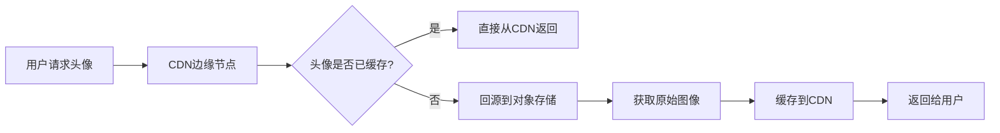

# 什么是对象存储服务

[[toc]]

> 在一个典型的图片分享应用中，当用户上传照片时，这张照片不再直接保存到应用的数据库中，而是被传送到一个独立的对象存储服务中。这个转变背后，是一场深刻的存储革命。

## 1. 什么是对象存储？

对象存储是一种将数据作为独立对象进行管理的存储架构。与传统的文件系统（以目录树组织文件）和块存储（将数据分割成固定大小的块）相比，每个对象包含三个核心要素：

- **数据本身**（可以是图片、视频、文档等任何内容）
- **元数据**（描述性信息，如创建时间、文件类型、所有者等）
- **全局唯一标识符**（一个用于访问该对象的独特 ID）

这种设计理念使得对象存储特别适合存储 **海量的非结构化数据**——正是我们今天在社交媒体、流媒体服务和云应用中每天产生和消费的内容类型。

## 2. 核心原理与关键技术

### 2.1 扁平命名空间

对象存储摒弃了传统文件系统的层次结构。每个对象都被分配一个**全局唯一的标识符**（通常是一个由系统生成的字符串），而非通过复杂的路径访问。

这种扁平结构消除了目录嵌套带来的复杂性，**使数据检索速度不受文件夹深度影响**，特别适合需要快速存取海量文件的场景。

### 2.2 不可变性与版本控制

在对象存储中，对象一旦创建就**不可更改**。如果需要“修改”一个对象，实际上会创建一个新版本，旧版本仍被保留。这种设计带来了多重优势：

- **数据完整性保障**：防止意外或恶意修改
- **内置版本控制**：轻松回溯到任意历史版本
- **简化并发控制**：无需传统文件系统中的锁机制

### 2.3 元数据驱动

对象存储的强大之处部分源于其丰富的元数据支持。除了系统自动添加的标准元数据外，用户可以自定义任意数量的元数据标签。

```yaml
# 一个图片对象的元数据示例
object-id: "a1b2c3d4-5678-90ef-ghij-klmnopqrstuv"
content-type: "image/jpeg"
file-size: "4.2MB"
created: "2023-10-15T14:30:00Z"
custom-metadata:
  upload-user: "user_12345"
  location-tagged: "true"
  gps-coordinates: "40.7128°N,74.0060°W"
  camera-model: "iPhone 14 Pro"
  processing-status: "thumbnail-generated"
```

通过这种元数据驱动的方法，**应用程序可以根据自定义标签而非仅通过文件名来组织和查找数据**，极大提高了数据管理的灵活性和效率。

**对象存储 vs 传统存储：架构对比**

| 特性维度       | **对象存储**                         | **文件存储**                   | **块存储**                 |
| -------------- | ------------------------------------ | ------------------------------ | -------------------------- |
| **数据结构**   | 非结构化对象                         | 结构化文件系统                 | 原始数据块                 |
| **访问方式**   | RESTful API (HTTP/HTTPS)             | 文件系统协议 (NFS, SMB)        | 块级协议 (iSCSI, FC)       |
| **扩展性**     | 近乎无限（EB 级）                    | 有限（受单系统限制）           | 有限（需复杂管理）         |
| **典型延迟**   | 较高（几十到几百毫秒）               | 较低（几毫秒到几十毫秒）       | 最低（亚毫秒级）           |
| **元数据能力** | 非常丰富（可自定义）                 | 有限（固定字段）               | 无                         |
| **适用场景**   | 海量非结构化数据、Web 内容、备份归档 | 共享文档、开发环境、用户主目录 | 数据库、虚拟机、高性能应用 |

从上表可以看出，对象存储**在扩展性和元数据管理方面具有显著优势**，但在低延迟场景下不如块存储高效。

## 3. 主流对象存储服务对比

市面上有多种对象存储解决方案，各有特色：

| 服务提供商     | 核心优势                 | 特色功能                               | 适用场景                           |
| -------------- | ------------------------ | -------------------------------------- | ---------------------------------- |
| **Amazon S3**  | 行业标杆，生态系统最完善 | 多存储类别、生命周期管理、强大访问控制 | 全球部署的企业级应用、AWS 生态集成 |
| **阿里云 OSS** | 中国本地化优势明显       | 与阿里云生态深度集成、成本优化明显     | 面向中国用户的应用、电商平台       |
| **腾讯云 COS** | 社交与多媒体处理优化     | 内置智能图像处理、音视频转码           | 社交应用、媒体内容平台             |
| **MinIO**      | 开源、可自部署           | Kubernetes 原生、S3 兼容 API           | 私有云部署、混合云策略             |

## 4. 实践应用：从上传到展示的全流程

让我们通过一个典型场景——用户上传头像到社交应用，了解对象存储的实际工作流程：

### 4.1 客户端上传

当用户选择头像图片后，应用通常不会将文件直接发送到应用服务器，而是采用更高效的**预签名 URL 方案**：

```javascript
// 前端从应用服务器获取预签名URL
const response = await fetch("/api/get-upload-url", {
  method: "POST",
  body: JSON.stringify({
    fileName: "avatar-user123.jpg",
    fileType: "image/jpeg"
  })
});

const { uploadUrl, objectKey } = await response.json();

// 使用预签名URL直接上传到对象存储
const uploadResult = await fetch(uploadUrl, {
  method: "PUT",
  body: imageFile,
  headers: { "Content-Type": "image/jpeg" }
});
```

这种方式**将上传流量从应用服务器分流**，减少了服务器负载，提高了上传速度。

### 4.2 服务器端处理

上传完成后，对象存储服务会触发一个事件通知应用服务器：

```python
# 示例：使用Python处理上传完成事件
def handle_avatar_upload(event):
    # 从事件中获取对象信息
    object_key = event['object_key']
    user_id = extract_user_id_from_key(object_key)

    # 生成访问该头像的URL（通常带有时效性）
    avatar_url = generate_presigned_url(
        bucket='avatars-bucket',
        key=object_key,
        expires_in=3600*24*7  # 一周有效期
    )

    # 更新用户记录，只保存对象引用，而非文件本身
    update_user_profile(user_id, {'avatar_url': avatar_url})

    # 可选：触发图片处理工作流
    trigger_image_processing(object_key, operations=[
        'thumbnail:200x200',
        'optimize:webp'
    ])
```

### 4.3 内容分发与访问

当其他用户查看该头像时，请求流程如下：



这种架构**将静态内容请求压力从源站分离**，显著提高了全球用户的访问速度。

## 5. 核心优势总结

1. **无限扩展性**：无需预先规划存储容量，可按需自动扩展
2. **成本效益**：采用“按实际使用量付费”模式，避免资源浪费
3. **高耐久性**：通过冗余机制，提供高达 99.999999999%（11 个 9）的数据持久性
4. **全球可访问性**：结合 CDN，全球用户都能快速访问内容
5. **简化管理**：自动化处理数据备份、复制和版本控制
