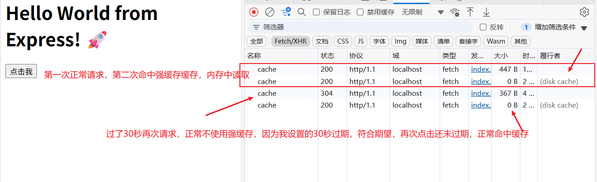
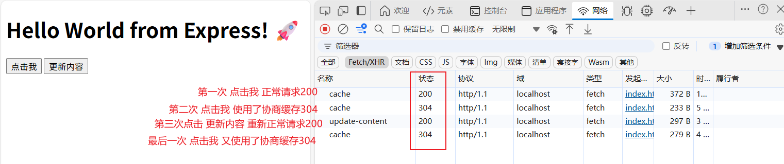

# 强缓存与协商缓存：提升 Web 性能的关键策略

在 Web 性能优化中，缓存机制是减少网络请求、加快页面加载速度的核心技术之一。其中，`强缓存（Strong Cache）`和`协商缓存（304 Not Modified）`是 HTTP 缓存策略的两种主要方式。

## 1. 什么是 HTTP 缓存？

`HTTP` 缓存是指浏览器或代理服务器将请求过的资源（如 `HTML、CSS、JS、`图片等）存储起来，后续请求相同的资源时可以直接从本地或就近缓存获取，而不必重新从服务器下载。缓存机制分为两类：

- **强缓存**：直接使用本地缓存，不发送请求到服务器。
- **协商缓存**：向服务器验证缓存是否可用，若可用则返回 304 状态码，否则返回新资源。

**浏览器缓存机制**

1，浏览器在发送请求前先判断是否命中强缓存  
2，命中则不发送请求直接使用缓存，否则进行下一步  
3，浏览器发送请求后会由服务器判断是否命中协商缓存  
4，命中则从缓存获取资源，否则进行下一步  
5，浏览器直接使用服务器返回的资源并更新缓存

## 2. 强缓存（Strong Cache）

强缓存是指浏览器在请求资源时，先检查本地缓存是否有效，如果有效则直接使用缓存，**不发送 HTTP 请求**到服务器。强缓存由以下两个`HTTP`头部控制，分别是 `Cache-Control和Expires：`

| HTTP Header     | 说明                                           | 示例                                     |
| --------------- | ---------------------------------------------- | ---------------------------------------- |
| `Cache-Control` | 控制缓存行为（优先级高于`Expires`）            | `Cache-Control: max-age=3600`            |
| `Expires`       | 指定资源的过期时间（HTTP/1.0，受本地时间影响） | `Expires: Wed, 21 Oct 2025 07:28:00 GMT` |

### 2.1 `Cache-Control和Expires` 区别

| 特性 | `Expires` | `Cache-Control` |
| :-- | :-- | :-- |
| **HTTP 版本** | HTTP/1.0 | HTTP/1.1 |
| **优先级** | **低** (如果两者同时存在，`Cache-Control` 的 `max-age` 会覆盖 `Expires`) | **高** |
| **值类型** | **绝对时间** (一个具体的 GMT 时间点，如 `Wed, 21 Oct 2026 07:28:00 GMT`) | **相对时间** (相对于当前时间的秒数，如 `max-age=300`) |
| **控制粒度** | 粗糙，只能设置一个过期时间 | 精细，提供多种指令进行复杂控制 |
| **主要指令** | 无 | `max-age`, `no-cache`, `no-store`, `public`, `private`, `must-revalidate`, `s-maxage` 等 |
| **客户端时间敏感** | **是**。如果用户本地时间不正确，会导致缓存提前失效或意外延长。 | **否**。使用相对时间，不受客户端时间设置影响。 |
| **适用场景** | 主要用于向后兼容旧的客户端和代理服务器。 | **现代 Web 开发的标准和首选**，功能强大且可靠。 |

在现代 Web 开发中，应优先使用 `Cache-Control` 的 `max-age` 指令来控制强缓存。`Expires` 通常仅作为降级方案或为了兼容性而存在。

### 2.2 `Cache-Control` 常见指令

| 指令           | 说明                                                                             |
| -------------- | -------------------------------------------------------------------------------- |
| `max-age=3600` | 资源缓存有效期为 3600 秒（1 小时）                                               |
| `no-cache`     | 允许被客户端和代理服务器缓存，但在使用缓存时需要经过协商缓存来验证决定           |
| `no-store`     | 所有内容都不会被缓存，即不使用强制缓存也不使用协商缓存每次请求都会下载完整的资源 |
| `public`       | 允许被客户端和代理服务器缓存                                                     |
| `private`      | 仅允许浏览器缓存，不允许代理服务器缓存                                           |

> [!WARNING] Cache-Control 注意点 `no-cache` 名字存在误导，其并不是不缓存数据，只是在使用缓存时需要经过协商缓存来验证决定  
> `max-age=0 和 no-cache` 效果一致

### 2.3 强缓存生效流程

| 状态码 (Status) | Size 列显示 | 含义 |
| :-- | :-- | :-- |
| **200** | **(from memory cache)** | **从内存缓存加载**。资源直接从浏览器内存中读取，**未向服务器发送任何请求**，速度极快（0-1ms）。通常用于页面导航、同一页面的资源复用。 |
| **200** | **(from disk cache)** | **从磁盘缓存加载**。资源从硬盘中读取，**未向服务器发送任何请求**，速度比内存缓存稍慢，但依然极快。通常用于关闭标签页后再次打开时的加载。 |

### 2.4 适用场景

- 静态资源（JS/CSS/图片等）长期不变，如`main.[hash].js`。
- 希望减少服务器请求，提升加载速度。

### 2.5 实战演示

使用 `node express` 创建一个静态资源服务器，并设置强缓存。

```js
// 1. 导入 express 模块
const express = require("express");

// 2. 创建一个 Express 应用实例
const app = express();

// 3. 定义端口号
const PORT = 3003;

// 4. 定义一个最简单的路由，并添加强缓存
// 当用户以 GET 方法访问根路径 '/' 时，执行这个处理函数
app.get("/cache", (req, res) => {
  // 设置 CORS 响应头
  // 允许来自任何源的请求（生产环境应替换为具体的源，如 'http://localhost:3000'）
  res.set("Access-Control-Allow-Origin", "*");
  // 允许客户端携带的请求头（根据你的前端需求调整）
  res.set("Access-Control-Allow-Headers", "Content-Type, Authorization");
  // 允许的HTTP方法
  res.set("Access-Control-Allow-Methods", "GET, POST, PUT, DELETE, OPTIONS");

  // 设置 Cache-Control 头，启用强缓存，有效期设置为 30 秒）
  // 'public' 表示响应可以被任何中间件（如CDN、代理服务器）和浏览器缓存
  // 'max-age=30' 表示资源在客户端缓存 30 秒
  res.set("Cache-Control", "public, max-age=30");

  // （可选）设置 Expires 头，为兼容旧浏览器提供绝对过期时间
  // 设置一个 5 分钟后的时间点
  // const expiresDate = new Date(Date.now() + 30 * 1000).toUTCString();
  // res.set('Expires', expiresDate);

  res.send("Hello World from Express! 🚀");
});

// 5. 启动服务器，监听指定端口
app.listen(PORT, () => {
  console.log(`✅ Express server is running at http://localhost:${PORT}`);
});
```

浏览器请求如下：



> [!IMPORTANT] 可以看出第一次请求时，服务器正常返回资源。资源大小是 447b。  
> 第二次请求时，资源大小是 0b,说明使用了强缓存。  
> 第三次请求时，服务器正常返回资源。资源大小是 367b。 因为缓存时间 30 秒到了，资源被重新请求。  
> 第四次请求时，资源大小是 0b,说明正常使用了强缓存。

## 3. 协商缓存（304 Not Modified）

### 3.1 工作原理

协商缓存是指浏览器携带缓存标识（如`Last-Modified`或`ETag`）向服务器发起请求，服务器检查资源是否变化：

- **未变化** → 返回 `304 Not Modified`，浏览器继续使用缓存。
- **已变化** → 返回 `200 OK` 和新资源。

协商缓存由以下两组 HTTP 头部控制：

| 请求头/响应头                 | 说明                                    | 示例                                                        |
| ----------------------------- | --------------------------------------- | ----------------------------------------------------------- |
| `Last-Modified`（响应头）     | 资源最后修改时间                        | `Last-Modified: Wed, 21 Oct 2025 07:28:00 GMT`              |
| `If-Modified-Since`（请求头） | 浏览器发送`Last-Modified`值给服务器验证 | `If-Modified-Since: Wed, 21 Oct 2025 07:28:00 GMT`          |
| `ETag`（响应头）              | 资源的唯一标识（如哈希值）              | `ETag: "33a64df551425fcc55e4d42a148795d9f25f89d4"`          |
| `If-None-Match`（请求头）     | 浏览器发送`ETag`值给服务器验证          | `If-None-Match: "33a64df551425fcc55e4d42a148795d9f25f89d4"` |

**Last-Modified 和 If-Modified-Since**

`Last-Modified` 表示资源的最后修改时间，值为 GMT(格林威治)格式时间字符串，精确到秒 。

> [!IMPORTANT] 浏览器第一次请求时，服务器会在响应头中返回请求资源的上次更新时间 `Last-Modified` ,当浏览器再次请求时，会在请求头中携带 `If-Modified-Since `值为上次请求返回的 `Last-Modified ` . 服务器收到请求后，会根据请求头中的 `If-Modified-Since` 和该资源在服务器的最后被修改时间做对比  
> 大于 `If-Modified-Since` 重新返回资源文件，状态码为 200  
> 小于 `If-Modified-Since` 资源无更新继续使用缓存文件，状态码为 304

**ETag 和 If-None-Match**

`ETag` 是服务器通过算法对资源内容计算出的一个唯一标识（文件 hash）其有强弱之分。

强 `Etag（"<etag_value>"）`资源发生任何改变都会立刻更新。  
弱 `Etag（W/"<etag_value>"）`资源发生改变时，会更新。

> [!IMPORTANT] 浏览器第一次请求时，服务器会在响应头中返回当前资源文件的一个唯一标识 `ETag`,当浏览器再次请求时，会在请求头中携带` If-None-Match` 值为上次请求返回的` ETag`
>
> 通过接收的 ETag 和服务器重新生成的 ETag 进行对比  
> 不一致 重新返回资源文件，状态码为 200  
> 一致 资源无更新继续使用缓存文件，状态码为 304

### 3.2 协商缓存生效流程

```
浏览器请求资源 → 携带 `If-None-Match`/`If-Modified-Since` → 服务器检查资源是否变化 →
   → 未变化（304 Not Modified） → 使用缓存
   → 已变化（200 OK） → 返回新资源
```

### 3.3 `ETag` vs `Last-Modified`

| 对比项   | `ETag`                          | `Last-Modified`            |
| -------- | ------------------------------- | -------------------------- |
| 精确度   | 更高（基于内容哈希）            | 较低（基于时间）           |
| 性能     | 计算`ETag`可能消耗服务器资源    | 仅记录时间，开销小         |
| 适用场景 | 频繁修改的小文件（如 JSON API） | 不常修改的大文件（如图片） |

### 3.4 适用场景

- 频繁更新的资源（如用户数据 API）。
- 需要确保用户获取最新版本，但又希望减少带宽消耗。

### 3.5 实战演示

使用 `node express` 创建一个静态资源服务器，并设置协商缓存。

```javascript
// 1. 导入 express 模块
const express = require("express");
const crypto = require("crypto"); // 用于生成ETag
const cors = require("cors"); // 引入 cors 模块
// 2. 创建一个 Express 应用实例
const app = express();

// 3. 定义端口号
const PORT = 3003;

// 4. 使用 CORS 中间件
// 允许所有来源（对于开发和测试很方便，生产环境应指定具体来源）:cite[2]:cite[6]
app.use(cors());

// 模拟一个会变化的内容
let dynamicContent = "Hello World from Express! 🚀";
let contentVersion = 1;

// 4. 定义一个路由，并设置为协商缓存
app.get("/cache", (req, res) => {
  // ！！！关键区别：移除或缩短强缓存时间 ！！！
  // 设置为 no-cache 或很短的 max-age，表示每次使用前必须向服务器验证
  // 方案A: 完全禁用强缓存，每次都验证
  res.set("Cache-Control", "no-cache");

  // 方案B: 设置一个很短的强缓存时间，之后再进行验证（更常见的做法）
  // res.set('Cache-Control', 'max-age=0, must-revalidate');

  // -------------------- 方法1: 使用 ETag / If-None-Match --------------------
  // 为当前响应内容生成一个唯一标识符（ETag）
  // 这里使用内容的简单哈希作为示例。生产环境可以用更复杂的算法。
  const currentETag = crypto.createHash("md5").update(dynamicContent).digest("hex");

  // 设置 ETag 响应头
  res.set("ETag", currentETag);

  // 检查客户端请求是否携带了 If-None-Match 头，且值匹配当前的ETag
  const clientETag = req.headers["if-none-match"];
  if (clientETag && clientETag === currentETag) {
    // 如果匹配，说明内容没有变化，返回 304 Not Modified
    console.log("✅ ETag 匹配，返回 304");
    return res.sendStatus(304);
  }

  // -------------------- 方法2: 使用 Last-Modified / If-Modified-Since (备用) --------------------
  // 假设这个资源是在特定时间被创建的（这里用固定时间模拟）
  const lastModifiedDate = new Date("2023-10-01T00:00:00Z").toUTCString();
  res.set("Last-Modified", lastModifiedDate);

  // 检查客户端请求是否携带了 If-Modified-Since 头
  const clientModifiedSince = req.headers["if-modified-since"];
  // (为了演示，这里假设资源从未被修改过，所以总是返回304 if header exists)
  if (clientModifiedSince) {
    console.log("ℹ️  收到 If-Modified-Since，假设未修改");
    return res.sendStatus(304);
  }

  // 如果验证未通过（即内容已变化或客户端无缓存），则返回最新内容和200状态码
  console.log(`🚀 返回新内容，版本: ${contentVersion}`);
  res.send(dynamicContent);
});

// 5. 添加一个路由来模拟内容变更（用于测试）
app.get("/update-content", (req, res) => {
  contentVersion++;
  dynamicContent = `Hello World from Express! 🚀 (Updated v${contentVersion})`;
  res.send(`Content has been updated to version ${contentVersion}`);
});

// 6. 启动服务器，监听指定端口
app.listen(PORT, () => {
  console.log(`✅ Express server with Negotiation Cache is running at http://localhost:${PORT}`);
  console.log(`👉 测试接口: http://localhost:${PORT}/cache`);
  console.log(`👉 更新内容: http://localhost:${PORT}/update-content`);
});
```



**如图所示，测试结果如下：**

> [!IMPORTANT]  
> 首次访问 (GET /cache)： 状态码: 200; 响应头: 包含 ETag 和 Last-Modified; 响应体: 完整内容
>
> 再次访问 (GET /cache); 请求头: 自动包含 If-None-Match (值为之前的 ETag) 和 If-Modified-Since 状态码: 304 Not Modified
>
> 更新内容后访问 (先访问 /update-content，再访问 /cache)：状态码: 200 OK;响应体: 返回新的内容 Hello World from Express! 🚀 (Updated v2)
>
> 因为内容变了，ETag 也随之改变，客户端的旧 If-None-Match 不再匹配。

## 4. 用户行为对缓存的影响对比表

| 用户行为 | **强缓存是否有效** | **协商缓存是否有效** | **缓存查找优先级** | **发送的请求头特点** | **结果** |
| :-- | :-- | :-- | :-- | :-- | :-- |
| **地址栏输入**<br>**或页面跳转** | **是** | **是** (如果强缓存过期) | 1. **Memory Cache**<br>2. **Disk Cache**<br>3. 网络请求 | 正常发送。<br>如果缓存未过期，**不发送任何请求**。 | **最优体验**。<br>若缓存新鲜，直接使用 (`200 from disk cache`)，**无网络请求**。 |
| **普通刷新 (F5 / 刷新按钮)** | **否** (被跳过) | **是** | 1. **Memory Cache**<br>2. **Disk Cache**<br>3. 网络请求 | 会携带 `If-Modified-Since`、`If-None-Match` 等**验证字段**。 | **协商缓存生效**。<br>服务器验证缓存，返回 `304` 或 `200`。**有一次网络请求**。 |
| **强制刷新**<br>**(Ctrl + F5 / Cmd + Shift + R)** | **否** (被跳过) | **否** (被跳过) | **跳过所有缓存**，直接发送网络请求。 | 携带 `Cache-Control: no-cache`<br>和 `Pragma: no-cache`，**忽略本地任何缓存**。 | **完全不用缓存**。<br>服务器必须返回最新内容 (`200 OK`)。 |
