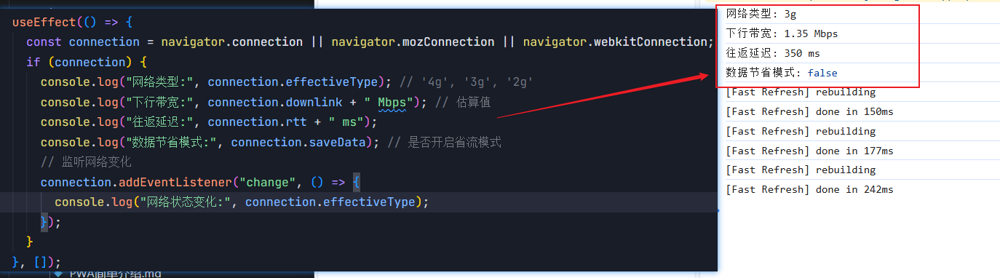
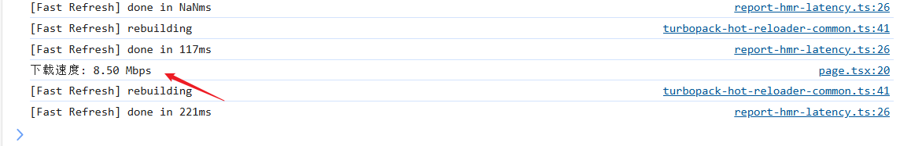

# 前端检测网络状态和强度

前端提供了 `navigator.connection` 等 API 来检测用户的网络状态和强度。

## 1. 使用浏览器原生 API

### 1.1 `navigator.connection` (Network Information API)

获取网络类型、带宽估算和 RTT（往返延迟）：

```javascript
const connection = navigator.connection || navigator.mozConnection || navigator.webkitConnection;

if (connection) {
  console.log("网络类型:", connection.effectiveType); // '4g', '3g', '2g'
  console.log("下行带宽:", connection.downlink + " Mbps"); // 估算值
  console.log("往返延迟:", connection.rtt + " ms");
  console.log("数据节省模式:", connection.saveData); // 是否开启省流模式

  // 监听网络变化
  connection.addEventListener("change", () => {
    console.log("网络状态变化:", connection.effectiveType);
  });
}
```

**如图所示：**



**兼容性**：`Chrome/Edge/Android WebView` 支持，`Safari 和 Firefox `部分支持。

### 1.2 在线/离线状态检测

```javascript
// 检测当前状态
console.log("是否在线:", navigator.onLine);

// 监听网络变化
window.addEventListener("online", () => console.log("网络恢复"));
window.addEventListener("offline", () => console.log("网络断开"));
```

```js
是否在线: true;
```

## 2. 主动测量网络速度

### 2.1 通过下载测试估算带宽

```javascript
async function measureSpeed(url = "https://search-operate.cdn.bcebos.com/5b8fa41e5c92ea8793a99c5081a7a9d8.mp4") {
  const start = performance.now();
  const response = await fetch(url, { cache: "no-store" });
  const blob = await response.blob();
  const duration = (performance.now() - start) / 1000; // 秒
  const bits = blob.size * 8; // 转为比特
  const speed = (bits / duration / 1024 / 1024).toFixed(2); // Mbps

  console.log(`下载速度: ${speed} Mbps`);
  return speed;
}

// 使用示例
measureSpeed();
```

**如图所示：**



**注意**：需准备一个已知大小的测试文件，避免跨域问题。

### 2.2 通过 Image 加载时间检测

```javascript
function measureLatency(imageUrl) {
  const start = Date.now();
  const img = new Image();
  img.onload = () => {
    const latency = Date.now() - start;
    console.log(`图片加载延迟: ${latency}ms`);
  };
  img.src = imageUrl + "?t=" + Date.now(); // 避免缓存
}
```

## 3. 综合网络状态判断

```javascript
class NetworkMonitor {
  constructor() {
    this.speed = 0; // Mbps
    this.type = "unknown";
    this.init();
  }

  async init() {
    // 浏览器API检测
    if (navigator.connection) {
      this.type = navigator.connection.effectiveType;
      this.speed = navigator.connection.downlink;
    }

    // 主动测量（如果浏览器API不可用）
    if (this.speed === 0) {
      this.speed = await this.measureSpeed();
      this.type = this.speed > 10 ? "4g" : this.speed > 2 ? "3g" : "2g";
    }

    console.log(`网络类型: ${this.type}, 速度: ${this.speed}Mbps`);
  }

  async measureSpeed() {
    /* 同前文方法 */
  }
}

// 使用
const monitor = new NetworkMonitor();
```

## 4. 应用场景与优化策略

### 4.1 动态调整资源加载

```javascript
if (monitor.type === "4g") {
  loadHDVideo();
} else {
  loadLQVideo();
}
```

### 4.2 显示网络状态提示

```html
<div id="network-status"></div>

<script>
  const statusEl = document.getElementById("network-status");

  function updateStatus() {
    const status = navigator.onLine ? `在线 (${monitor.type}, ${monitor.speed}Mbps)` : "离线";
    statusEl.textContent = `网络状态: ${status}`;
  }

  window.addEventListener("online", updateStatus);
  window.addEventListener("offline", updateStatus);
</script>
```

### 4.3 请求失败自动降级

```javascript
async function fetchWithFallback(primaryUrl, fallbackUrl, retries = 2) {
  try {
    const response = await fetch(primaryUrl);
    return response.json();
  } catch (error) {
    if (retries > 0) {
      return fetchWithFallback(fallbackUrl, null, retries - 1);
    }
    throw error;
  }
}
```

## 5. 兼容性增强方案

### 5.1 旧版浏览器支持

```javascript
// 如果没有navigator.connection，默认按3G处理
if (!navigator.connection) {
  console.warn("Network Information API not supported");
  monitor.type = "3g";
  monitor.speed = 1.5;
}
```

### 5.2 使用第三方库

- **[Network Speed](https://github.com/beradrian/js-network-speed)**：跨浏览器网络测速
- **[Offline.js](http://github.hubspot.com/offline/docs/welcome/)**：离线状态管理

## 6. 注意事项

1. **隐私限制**：部分浏览器在安全上下文（HTTPS）下才允许访问`navigator.connection`。
2. **测量误差**：主动测速受服务器响应和缓存影响。
3. **省电模式**：移动设备可能限制后台网络检测。
