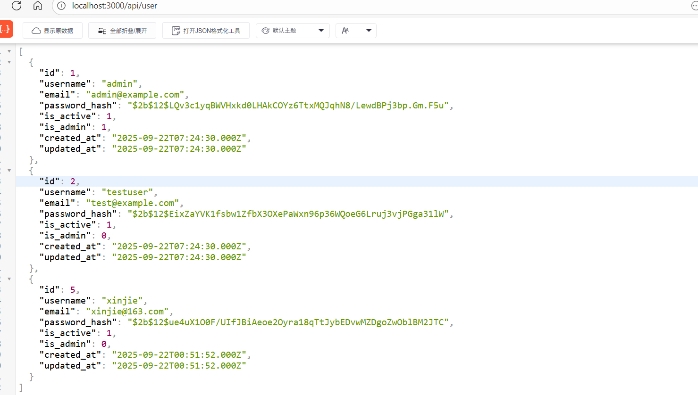
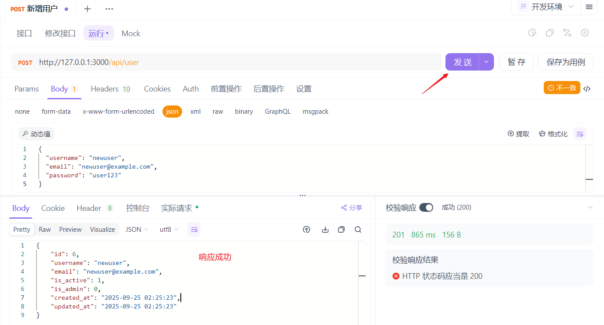

# 服务端路由：api 文件夹

[[toc]]

## 一、 api 文件夹的作用

在` Next.js`中，`api` 文件夹 来定义 `API` 路由，它的作用是：

- 在 `Next.js` 项目里快速创建一个后端接口（Node.js 环境下运行，不会被打包到前端）。
- 用来处理数据请求，比如登录接口、数据库查询、调用第三方 API 等。
- 避免额外起一个 Express/Koa/Fastify 服务，前后端一体化。

### 1️⃣ app/api (Next.js 15 版本)的基本规则

- 所有在 pages/api 下的文件都会自动变成一个 API 路由。
- 文件名 = 接口路径。
- 导出的函数接收 (req, res) 两个参数（跟 Express 很像）。

例子：

```js
// app/api/hello/route.js
export async function GET() {
  return new Response(JSON.stringify({ message: "Hello from API!" }), {
    status: 200,
    headers: { "Content-Type": "application/json" }
  });
}
```

访问 http://localhost:3000/api/hello 会返回：

```json
{
  "message": "Hello from API!"
}
```

### 2️⃣ 支持 REST API

- 支持 `GET`、`POST`、`PUT`、`DELETE` 等 HTTP 方法。
- 可以根据 HTTP 方法来导出不同的函数。
- 例如：GET 方法导出 `GET` 函数，POST 方法导出 `POST` 函数。

```js
// app/api/hello/route.js
export async function GET() {
  return new Response(JSON.stringify({ message: "Hello from API!" }), {
    status: 200,
    headers: { "Content-Type": "application/json" }
  });
}

export async function POST(req) {
  const { name } = await req.json();
  return new Response(JSON.stringify({ message: `Hello, ${name}!` }), {
    status: 200,
    headers: { "Content-Type": "application/json" }
  });
}
```

### 3️⃣ 可做后端逻辑

- 读写数据库（MySQL、MongoDB、Prisma 等）
- 调用外部 API（比如 OpenAI API）
- 处理鉴权 / Session / Token

✅ 总结： `/app/api/ 就是 Next.js` 内置的“后端”，可以让前端项目直接带上后端接口。特别适合中小项目，不用额外搭建` Express/FastAPI`，就能快速完成前后端一体化开发。

## 二、基本使用

::: tip 提示

案例使用的是 **Next.js 15**，默认走的是 **App Router**

:::

**新建文件：**

```ts
app / api / hello / route.js;
```

**内容：**

```ts
// app/api/hello/route.js
export async function GET() {
  return new Response(JSON.stringify({ message: "Hello from API!" }), {
    status: 200,
    headers: { "Content-Type": "application/json" }
  });
}
```

**浏览器访问**：http://localhost:3000/api/hello 返回：

```json
{ "message": "Hello from API!" }
```

**流程已跑通!**

## 三、连接 MySQL 的 API 路由 案例

下面是是一个基于 **Next.js 15 + MySQL 的 API 路由**示例（基于 App Router 结构）。  
使用 `mysql2`，并放在 `lib/db.js` 里维护数据库连接池。

### 1️⃣ 安装依赖

```bash
pnpm install mysql2
```

### 2️⃣ 新建数据库连接（`lib/db.js`）

```js
// lib/db.js
import mysql from "mysql2/promise";

const pool = mysql.createPool({
  host: "localhost", // 数据库地址
  user: "root", // 数据库用户
  password: "xinjie", // 数据库密码
  database: "ai-chat-db", // 数据库名
  waitForConnections: true,
  connectionLimit: 10,
  queueLimit: 0
});

export default pool;
```

### 3️⃣ API 路由（`app/api/users/route.js`）

```js
// app/api/users/route.js
import pool from "@/lib/db";

// GET /api/users → 查询所有用户
export async function GET() {
  try {
    const [rows] = await pool.query("SELECT * FROM users");
    return new Response(JSON.stringify(rows), {
      status: 200,
      headers: { "Content-Type": "application/json" }
    });
  } catch (error) {
    return new Response(JSON.stringify({ error: error.message }), {
      status: 500,
      headers: { "Content-Type": "application/json" }
    });
  }
}

// POST /api/users → 新增用户
export async function POST(req) {
  try {
    const { username, email, password } = await req.json();

    if (!username || !email || !password) {
      return new Response(JSON.stringify({ error: "缺少 username、email 或 password 参数" }), {
        status: 400,
        headers: { "Content-Type": "application/json" }
      });
    }

    // 对密码进行哈希处理
    const bcrypt = require("bcrypt");
    const saltRounds = 12;
    const password_hash = await bcrypt.hash(password, saltRounds);

    // 设置默认值
    const is_active = 1;
    const is_admin = 0; // 默认普通用户
    const currentTime = new Date().toISOString().slice(0, 19).replace("T", " ");

    const [result] = await pool.query(
      "INSERT INTO users (username, email, password_hash, is_active, is_admin, created_at, updated_at) VALUES (?, ?, ?, ?, ?, ?, ?)",
      [username, email, password_hash, is_active, is_admin, currentTime, currentTime]
    );

    return new Response(
      JSON.stringify({
        id: result.insertId,
        username,
        email,
        is_active,
        is_admin,
        created_at: currentTime,
        updated_at: currentTime
      }),
      {
        status: 201,
        headers: { "Content-Type": "application/json" }
      }
    );
  } catch (error) {
    return new Response(JSON.stringify({ error: error.message }), {
      status: 500,
      headers: { "Content-Type": "application/json" }
    });
  }
}
```

### 4️⃣ 数据库建表

在 MySQL 里执行：

```sql
CREATE TABLE users (
    id INT PRIMARY KEY AUTO_INCREMENT,
    username VARCHAR(50) NOT NULL UNIQUE,
    email VARCHAR(100) NOT NULL UNIQUE,
    password_hash VARCHAR(255) NOT NULL,
    is_active TINYINT(1) DEFAULT 1,
    is_admin TINYINT(1) DEFAULT 0,
    created_at DATETIME,
    updated_at DATETIME
);
```

### 5️⃣ 调用接口

- **查询用户 (GET)**

```
 GET http://localhost:3000/api/users
```

返回如下：



可以看到数据库中的三条数据全部查出来了。

- **新增用户 (POST)**

```http
POST http://localhost:3000/api/users
Content-Type: application/json

{
  "username": "newuser",
  "email": "newuser@example.com",
  "password": "user123"
}
```

也可以在`apiFox`中调用：



调用成功，数据库截图如下：


## 四、前端页面调用 api 接口 案例

下面是新增一个前端页面（app/users/page.js），在浏览器里调用 `/api/users `并显示用户列表。模拟日常工作前端页面调用 api 接口的情况。

### 1️⃣ 新建页面文件

在 `app/users/page.js`：

```js
"use client";

import { useState, useEffect } from "react";

export default function UsersPage() {
  const [users, setUsers] = useState([]);
  const [loading, setLoading] = useState(true);
  const [error, setError] = useState(null);
  // 修改表单状态初始化，添加password字段
  const [form, setForm] = useState({ username: "", email: "", password: "" });

  // 获取用户列表
  useEffect(() => {
    async function fetchUsers() {
      try {
        const res = await fetch("/api/users");
        if (!res.ok) throw new Error("获取用户失败");
        const data = await res.json();
        setUsers(data);
      } catch (err) {
        setError(err.message);
      } finally {
        setLoading(false);
      }
    }
    fetchUsers();
  }, []);

  // 提交表单 -> 新增用户
  async function handleSubmit(e) {
    e.preventDefault();
    try {
      const res = await fetch("/api/users", {
        method: "POST",
        headers: { "Content-Type": "application/json" },
        body: JSON.stringify(form)
      });
      if (!res.ok) throw new Error("新增失败");
      const newUser = await res.json();
      setUsers([...users, newUser]);
      setForm({ username: "", email: "" });
    } catch (err) {
      alert(err.message);
    }
  }

  if (loading) return <p>加载中...</p>;
  if (error) return <p style={{ color: "red" }}>错误: {error}</p>;

  return (
    <div style={{ padding: "20px" }}>
      <h1>用户管理</h1>
      {/* 新增用户表单 */}
      // 在表单中添加密码输入框
      <form onSubmit={handleSubmit} style={{ marginBottom: "20px" }}>
        <input type="text" placeholder="姓名" value={form.username} onChange={(e) => setForm({ ...form, username: e.target.value })} required />
        <input type="email" placeholder="邮箱" value={form.email} onChange={(e) => setForm({ ...form, email: e.target.value })} required />
        <input type="password" placeholder="密码" value={form.password} onChange={(e) => setForm({ ...form, password: e.target.value })} required />
        <button type="submit">添加用户</button>
      </form>
      {/* 用户列表 */}
      <ul>
        {users.length === 0 ? (
          <p>暂无用户</p>
        ) : (
          users.map((user) => (
            <li key={user.id}>
              {user.username} - {user.email}
            </li>
          ))
        )}
      </ul>
    </div>
  );
}
```

### 2️⃣ 页面效果

- 进入 `http://localhost:3000/users`
- 页面会自动请求 `/api/users`，显示用户列表
- 可以在输入框填写 **姓名 / 邮箱** 并点击“添加用户” → 会直接写入 MySQL，再刷新用户列表


点击添加用户后，数据库会新增一条数据,如下所示。


### 3️⃣ 结构回顾

完整目录结构大概是：

```
app/
├── api/
│   └── users/
│       └── route.js    # API 路由
├── users/
│   └── page.js         # 前端页面
lib/
└── db.js               # 数据库连接
```

这样，就完成了一个 **全栈小应用**： ✅ Next.js 15 (App Router) ✅ MySQL 存储 ✅ API 路由 ✅ 前端页面
