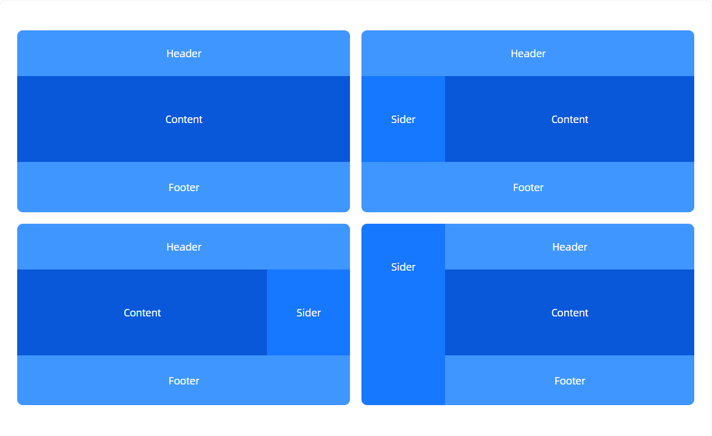

# Next.js 中的 Layout（页面布局）

[[toc]]

## 1. 什么是 Layout？

在实际项目中，很多页面共享同一个框架，比如：

- 顶部导航栏（Header）
- 侧边栏（Sidebar）
- 底部信息（Footer）

如果每个页面都重复写这些代码，会非常麻烦。 **Layout 就是 Next.js 提供的一种“页面骨架”，用来统一管理这些共享 UI。**

**如图所示：**



## 2. 在 Next.js 中的使用方式

### （1）App Router（`app/`目录）

在 Next.js 13+（包括 15）推荐使用 **App Router**，它自带 `layout.tsx` 文件来做布局。

例如目录结构：

```
app/
 ├─ layout.tsx
 ├─ page.tsx
 ├─ dashboard/
 │   ├─ layout.tsx
 │   └─ page.tsx
```

- `app/layout.tsx` 定义应用的全局布局，所有页面都会被包裹。

  ```tsx
  // app/layout.tsx
  export default function RootLayout({ children }: { children: React.ReactNode }) {
    return (
      <html lang="en">
        <body>
          <header>全局导航栏</header>
          <main>{children}</main>
          <footer>全局底部</footer>
        </body>
      </html>
    );
  }
  ```

- `app/page.tsx` 首页的内容会自动放到 `<main>{children}</main>` 里。

- `app/dashboard/layout.tsx` 给 `dashboard/` 下的页面单独定义一个布局（比如多加个侧边栏）。

  ```tsx
  // app/dashboard/layout.tsx
  export default function DashboardLayout({ children }: { children: React.ReactNode }) {
    return (
      <section>
        <aside>侧边栏</aside>
        <div>{children}</div>
      </section>
    );
  }
  ```

👉 这样，`/dashboard/page.tsx` 就会自动嵌套在 `DashboardLayout` 内，而 `DashboardLayout` 又嵌套在全局 `RootLayout` 内。

### （2）Pages Router（`pages/`目录）

如果你还在用老版本（Next.js 12 或以下），可以自己写一个 `Layout` 组件，然后在 `_app.tsx` 中包裹。

```tsx
// components/Layout.tsx
export default function Layout({ children }: { children: React.ReactNode }) {
  return (
    <div>
      <header>导航栏</header>
      <main>{children}</main>
      <footer>底部</footer>
    </div>
  );
}
```

```tsx
// pages/_app.tsx
import Layout from "@/components/Layout";

export default function MyApp({ Component, pageProps }) {
  return (
    <Layout>
      <Component {...pageProps} />
    </Layout>
  );
}
```

这样所有页面都会套用 `Layout`。

如果某个页面需要自定义 Layout，可以用 `getLayout` 模式：

```tsx
// pages/dashboard.tsx
const Dashboard = () => <div>Dashboard 内容</div>;

Dashboard.getLayout = function getLayout(page) {
  return (
    <Layout>
      <Sidebar />
      {page}
    </Layout>
  );
};

export default Dashboard;
```

然后在 `_app.tsx` 中：

```tsx
export default function MyApp({ Component, pageProps }) {
  const getLayout = Component.getLayout || ((page) => page);
  return getLayout(<Component {...pageProps} />);
}
```

## 3. 特点和应用场景

**特点**

- **可嵌套**：子目录的 `layout.tsx` 会叠加在父级布局之上。
- **持久化（Persistent）**：切换页面时，`layout.tsx` 不会被重新渲染，只更新 `children` 部分。
- **支持异步**：Layout 也可以是异步函数（比如请求菜单数据）。

**应用场景**

- 全局统一框架（导航栏 + Footer）
- 某些模块（如 `dashboard/`）需要独立的侧边栏
- 公共状态（比如登录信息、主题）可以放在 Layout 中共享
