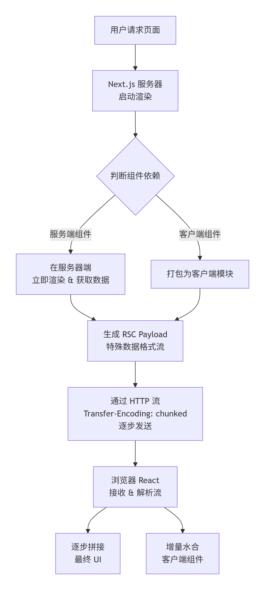
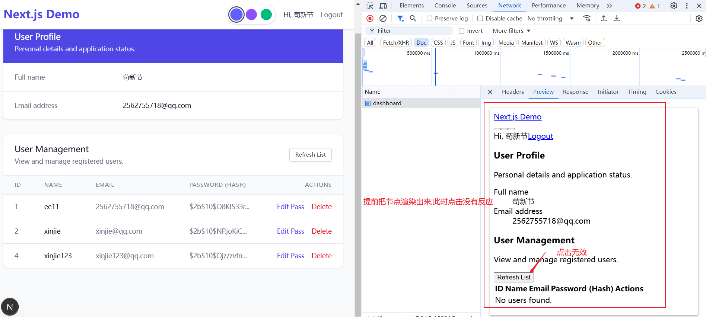

# 什么是 RSC 渲染

[[toc]]

Next.js 中的 `React Server Components (RSC)` 是一种从**服务器端**开始渲染组件的新型架构，它与传统的服务端渲染有本质区别。

### 一、RSC 的核心运作原理

RSC 模式的关键在于服务器和浏览器的“角色”分工发生了根本变化：

1.  **服务器：“产出蓝图”**

    - RSC 的代码完全在服务器端运行，**不会**被发送到浏览器。这可以显著减少客户端需要下载的 `JavaScript` 体积。
    - 服务器根据请求的组件树，进行渲染和数据获取，但生成的不是最终的 HTML，而是一种被称为 **RSC Payload** 的特殊数据流。这个 Payload 包含了服务端组件的渲染结果、**客户端组件占位符**以及它们所需的数据。

> RSC 的代码里面有服务端组件和客户端组件。服务端组件负责数据获取和渲染，而客户端组件负责处理用户交互。  
> 渲染客户端组件时，只是进行占位，过程中不能进行交互。

2.  **浏览器：“按图组装”**
    - 浏览器接收到的就是这份“蓝图”（RSC Payload）。它基于这份数据，在本地精确地协调（Reconcile）出用户界面。
    - 对于页面中需要交互的部分（如按钮、表单），对应的客户端组件代码会按需加载并“水合”（Hydrate），使其变得可交互。

### 二、开发模式：明确组件边界

在开发中，你需要清晰地区分两类组件：

- **服务端组件 (默认)**：用于处理**数据获取**（如直接连接数据库）和**静态内容渲染**。它们**不能**使用状态（`useState`）、生命周期（`useEffect`）或浏览器 API。
- **客户端组件**：用于处理**用户交互**和**状态管理**。需要在文件顶部添加 `'use client'` 指令来显式声明。

一个典型的模式是：在服务器端组件中获取数据，然后将数据作为 `props` 传递给嵌套的客户端子组件。

### 三、RSC 如何与流式渲染协同

RSC 的强大之处在于它能与 React 的 `Suspense` 结合，实现流式渲染：

- 当页面的某个部分（如一个依赖慢速 API 的评论模块）还在加载时，`Suspense` 允许你先发送页面的其余部分（如文章主体）到浏览器，并用占位符（`fallback`）替代未就绪的部分。
- 当该部分的数据在服务器端准备完毕后，对应的 `RSC Payload `片段会以“流”（Stream）的形式实时发送到浏览器，无缝插入到页面中。

::: tip transfer-encoding:chunked(另一种流式传输 )

服务端以 `transfer-encoding:chunked` 方式发送` RSC Payload`，浏览器端接收后，根据 `Payload` 中的占位符，逐步协调出用户界面。但是这种方式有一个问题，就是浏览器端需要等待所有的 `Payload` 片段都接收完毕，用户才能交互界面。

:::

**如图：**

#### 下面是渲染流程图

{width=50%}

### 四、🆚 对比传统服务端渲染 (SSR)

下表清晰地展示了 RSC 与 Next.js 早期 Pages Router 中 SSR 的主要区别：

| 特性 | RSC (App Router) | 传统 SSR (Pages Router) |
| :-- | :-- | :-- |
| **渲染单元** | **组件级**。页面可以混合使用服务端和客户端组件。 | **页面级**。一个页面要么整个在服务端渲染，要么在客户端渲染。 |
| **输出物** | **RSC Payload（数据流）** + 初始 HTML 骨架。 | **完整的 HTML 字符串**，其中内嵌了序列化的页面数据（脱水）。 |
| **水合方式** | **部分水合**。仅对客户端组件进行水合，服务端组件无需水合。 | **全量水合**。浏览器需要下载并执行整个页面的 JS，与水合完整的 DOM 树。 |
| **数据获取** | 组件内部可直接进行异步数据获取（`async/await`），无需额外 API 层。 | 通常通过 `getServerSideProps` 等特定函数在页面级获取数据。 |
| **代码体积** | 更优。服务端组件代码**零客户端打包体积**。 | 较大。页面的所有组件代码（无论是否交互）最终都会被打包发送到客户端。 |

### 五、如何开始使用 RSC？

从 **Next.js 13** 开始，使用新的 **App Router** 是体验 RSC 的最佳方式。

1.  **默认**：在 `app` 目录下的组件都是**服务端组件**。
2.  **交互需求**：在需要交互的组件文件顶部添加 `'use client'` 指令，将其变为客户端组件。
3.  **性能优化**：对于数据加载较慢的组件，用 `Suspense` 包裹以实现流式渲染。

总而言之，RSC 在 Next.js 中代表了一种更智能的渲染模型，它通过在服务器和客户端之间进行更精细的职责划分，旨在实现更快的加载速度、更小的客户端包体积和更流畅的用户体验。

### 六、什么是水合（Hydration）？

**水合**是**将交互功能“注入”到服务端预先生成的静态 HTML 页面中的过程**，让页面从“只读”变为“可交互”。

**核心类比**：就像泡一碗速食面——服务器给你一碗**熟的、看得见的**面条（静态 HTML），浏览器再倒入调料包和开水（JavaScript），你才能**吃到有味道的**面（可交互页面）。

**关键要点**：

1.  **目的**：解决“先快速显示内容，再补充交互能力”的矛盾。
2.  **过程**：React 将事件处理器、状态管理等“附加”到已有的 DOM 节点上，并接管后续更新。
3.  **革新**：Next.js 的**RSC 支持“部分水合”**，只对标记为 `‘use client’` 的交互组件进行水合，**大幅减少 JavaScript 负载，使页面可交互时间显著提前**。

简单来说，水合就是 **让已经显示出来的页面“活过来”** 的最后一步关键操作。

**如下图：** 

服务端提前把节点渲染出来，但是浏览器端需要等待所有的 `Payload` 片段都接收完毕，用户才能交互界面。  
让用户先看到东西。

