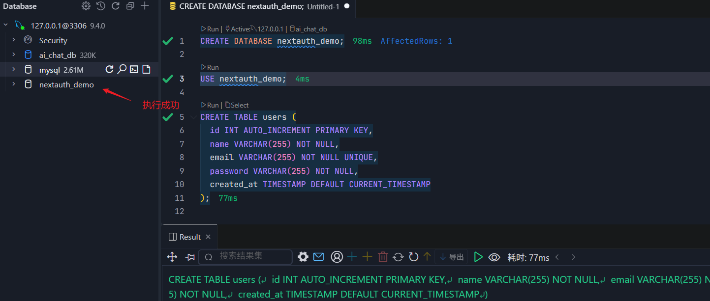
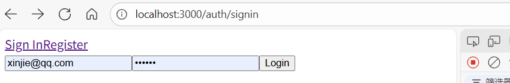
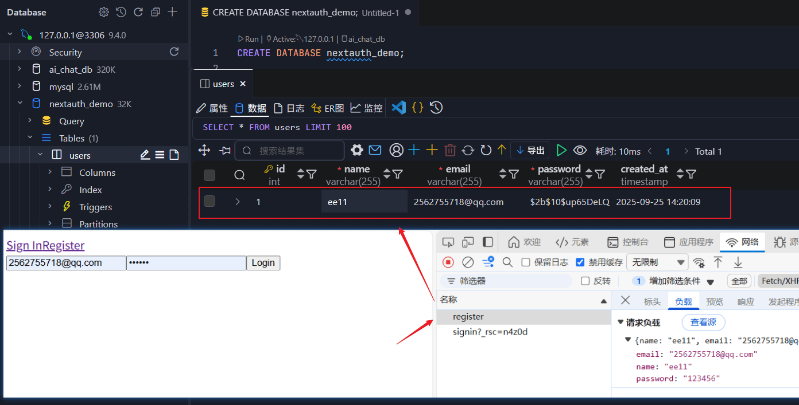
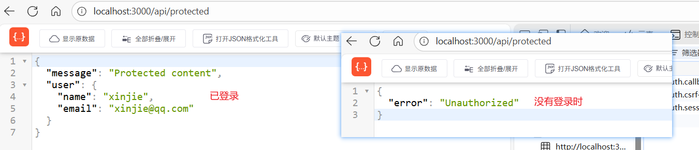
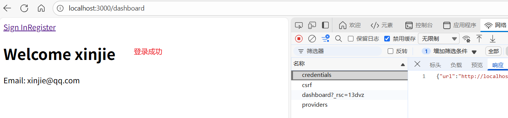
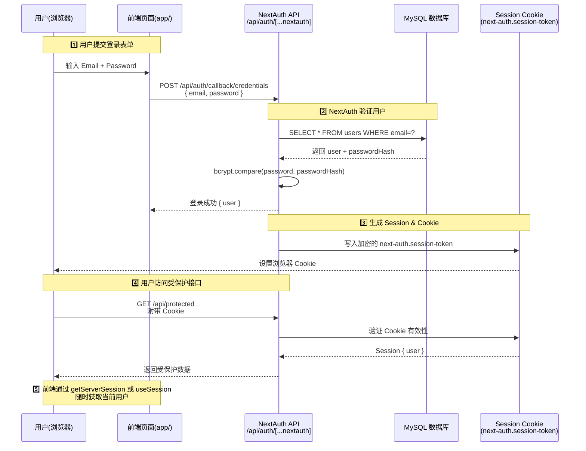

# Next.js 15 + MySQL + NextAuth.js 基于 Cookie/Session 鉴权实战

[[toc]]

## 1. 环境准备

- Node.js ≥ 18
- Next.js 15
- MySQL 数据库

### 安装依赖

```bash
# 初始化 Next.js 15 项目
npx create-next-app@latest my-nextauth-app --ts
cd my-nextauth-app

# 安装 MySQL 依赖
npm install mysql2

# 安装 Auth.js / NextAuth
npm install next-auth
```

> **注意**：NextAuth.js 从 v5 开始演进为 **Auth.js**，API 与 v4 基本类似，但更现代化。下面示例使用 **NextAuth v5 方式**。

## 2. 数据库设计 (MySQL)

创建一个用户表 `users`，用于存储账号和密码（这里示例用 bcrypt 加密）。

```sql
CREATE DATABASE nextauth_demo;

USE nextauth_demo;

CREATE TABLE users (
  id INT AUTO_INCREMENT PRIMARY KEY,
  name VARCHAR(255) NOT NULL,
  email VARCHAR(255) NOT NULL UNIQUE,
  password VARCHAR(255) NOT NULL,
  created_at TIMESTAMP DEFAULT CURRENT_TIMESTAMP
);
```

**如图：** 

## 3. 数据库连接

创建一个数据库工具文件 `app/lib/mysql.ts`：

```ts
// app/lib/mysql.ts
import mysql from "mysql2/promise";

export const db = mysql.createPool({
  host: process.env.MYSQL_HOST,
  user: process.env.MYSQL_USER,
  password: process.env.MYSQL_PASSWORD,
  database: process.env.MYSQL_DATABASE
});
```

在项目根目录新建 `.env` 文件并配置：

```
MYSQL_HOST=localhost
MYSQL_USER=root
MYSQL_PASSWORD=123456
MYSQL_DATABASE=nextauth_demo

NEXTAUTH_SECRET=5c2e7a9d3f8b1k6m4n0p2q7r9t8v3w5x7y1z9a4s6d8f0g2h4j6k8l0m2n4p6q8r
NEXTAUTH_URL=http://localhost:3000
```

## 4. 配置 NextAuth.js

在 **Next.js 15 App Router** 下，API 路由在 `app/api/auth/[...nextauth]/route.ts`：

```ts
// app/api/auth/[...nextauth]/route.ts
import NextAuth from "next-auth";
import CredentialsProvider from "next-auth/providers/credentials";
import { db } from "../../../lib/mysql";
import bcrypt from "bcryptjs";

export const authOptions = {
  session: {
    strategy: "jwt" // 修改为 JWT 策略，与 Credentials 兼容
  },
  providers: [
    CredentialsProvider({
      name: "Credentials",
      credentials: {
        email: { label: "Email", type: "text" },
        password: { label: "Password", type: "password" }
      },
      async authorize(credentials) {
        console.log("Authorize credentials:", credentials);
        try {
          if (!credentials?.email || !credentials?.password) return null;

          const [rows]: any = await db.query("SELECT * FROM users WHERE email = ?", [credentials.email]);
          console.log("Query result:", rows);
          const user = rows[0];

          if (!user) {
            console.log("No user found");
            return null;
          }

          const isValid = await bcrypt.compare(credentials.password, user.password);
          if (!isValid) {
            console.log("Invalid password");
            return null;
          }

          return { id: user.id, name: user.name, email: user.email };
        } catch (err) {
          console.error("Authorize error:", err);
          throw err; // 让你能在终端看到具体错误
        }
      }
    })
  ],
  pages: {
    signIn: "/auth/signin"
  },
  secret: process.env.NEXTAUTH_SECRET
};

const handler = NextAuth(authOptions);
export { handler as GET, handler as POST };
```

## 5. 注册用户接口

在 `app/api/auth/register/route.ts` 创建注册接口：

```ts
// app/api/auth/register/route.ts
import { db } from "@/lib/mysql";
import bcrypt from "bcryptjs";
import { NextResponse } from "next/server";

export async function POST(req: Request) {
  const { name, email, password } = await req.json();

  if (!name || !email || !password) {
    return NextResponse.json({ error: "Missing fields" }, { status: 400 });
  }

  const hashedPassword = await bcrypt.hash(password, 10);

  try {
    await db.query("INSERT INTO users (name, email, password) VALUES (?, ?, ?)", [name, email, hashedPassword]);
    return NextResponse.json({ message: "User registered" });
  } catch (error: any) {
    if (error.code === "ER_DUP_ENTRY") {
      return NextResponse.json({ error: "Email already exists" }, { status: 400 });
    }
    return NextResponse.json({ error: "Server error" }, { status: 500 });
  }
}
```

## 6. 登录页面 (App Router)

在 `app/auth/signin/page.tsx`：

```tsx
"use client";

import { signIn } from "next-auth/react";
import { useState } from "react";
import { useRouter } from "next/navigation";

export default function SignInPage() {
  const [email, setEmail] = useState("");
  const [password, setPassword] = useState("");
  const router = useRouter();

  const handleSubmit = async (e: React.FormEvent) => {
    e.preventDefault();
    const res = await signIn("credentials", {
      redirect: false,
      email,
      password
    });
    if (res?.ok) router.push("/dashboard");
    else alert("Invalid credentials");
  };

  return (
    <form onSubmit={handleSubmit}>
      <input type="email" placeholder="Email" value={email} onChange={(e) => setEmail(e.target.value)} />
      <input type="password" placeholder="Password" value={password} onChange={(e) => setPassword(e.target.value)} />
      <button type="submit">Login</button>
    </form>
  );
}
```

如图所示：



## 7. 注册页面

`app/auth/register/page.tsx`：

```tsx
"use client";

import { useState } from "react";
import { useRouter } from "next/navigation";

export default function RegisterPage() {
  const [name, setName] = useState("");
  const [email, setEmail] = useState("");
  const [password, setPassword] = useState("");
  const router = useRouter();

  const handleSubmit = async (e: React.FormEvent) => {
    e.preventDefault();
    const res = await fetch("/api/auth/register", {
      method: "POST",
      body: JSON.stringify({ name, email, password }),
      headers: { "Content-Type": "application/json" }
    });
    const data = await res.json();
    if (res.ok) router.push("/auth/signin");
    else alert(data.error);
  };

  return (
    <form onSubmit={handleSubmit}>
      <input type="text" placeholder="Name" value={name} onChange={(e) => setName(e.target.value)} />
      <input type="email" placeholder="Email" value={email} onChange={(e) => setEmail(e.target.value)} />
      <input type="password" placeholder="Password" value={password} onChange={(e) => setPassword(e.target.value)} />
      <button type="submit">Register</button>
    </form>
  );
}
```

注册成功，如下所示：



## 8. 保护 API 路由

创建 `app/api/protected/route.ts`：

```ts
import { getServerSession } from "next-auth";
import { authOptions } from "../auth/[...nextauth]/route";
import { NextResponse } from "next/server";

export async function GET(req: Request) {
  const session = await getServerSession(authOptions);

  if (!session) return NextResponse.json({ error: "Unauthorized" }, { status: 401 });

  return NextResponse.json({ message: "Protected content", user: session.user });
}
```

**它的作用是**：示例一个需要登录后才能访问的 API。

如果客户端直接访问 ` /api/protected``，NextAuth ` 会检查当前请求里带的 Cookie (session)。  
如果没登录（没有 session），就返回 { "error": "Unauthorized" }。  
如果已经登录，会返回用户信息。

👉 用途：你可以用它来写后台接口，比如 获取用户订单、获取个人资料 等。这类 API 需要鉴权，不能随便访问。

**如下图所示：**



## 9. 登录成功页面

`app/dashboard/page.tsx`：

```tsx
import { getServerSession } from "next-auth";
import { authOptions } from "../api/auth/[...nextauth]/route";
import { redirect } from "next/navigation";

export default async function DashboardPage() {
  const session = await getServerSession(authOptions);
  if (!session) redirect("/auth/signin");

  return (
    <div>
      <h1>Welcome {session.user?.name}</h1>
      <p>Email: {session.user?.email}</p>
    </div>
  );
}
```

登录成功，会跳转到 `/dashboard` 页面，如下所示：



## 10. 前端展示登录状态

你可以在 `app/layout.tsx` 中全局显示登录状态：

```tsx
import { getServerSession } from "next-auth";
import { authOptions } from "./api/auth/[...nextauth]/route";
import Link from "next/link";

export default async function RootLayout({ children }: { children: React.ReactNode }) {
  const session = await getServerSession(authOptions);

  return (
    <html>
      <body>
        <header>
          {session ? (
            <>
              <span>Hi, {session.user?.name}</span>
              <Link href="/api/auth/signout">Logout</Link>
            </>
          ) : (
            <>
              <Link href="/auth/signin">Sign In</Link>
              <Link href="/auth/register">Register</Link>
            </>
          )}
        </header>
        {children}
      </body>
    </html>
  );
}
```

## 11. ✅ 完成效果 和 鉴权流程图

**完成效果**

- 注册用户 → 自动加密密码存入 MySQL
- 登录 → NextAuth 验证 + Session Cookie
- 受保护页面/API → 未登录自动跳转或返回 401
- 全局显示登录状态

**鉴权流程图**



**✅ 关键点说明**

- Session Token 存在 Cookie

  - Cookie 名：next-auth.session-token（或 \_\_Secure-next-auth.session-token）
  - 默认有效期：30 天

- Session 校验方式

  - 每次请求时，NextAuth 从 Cookie 解密出 token，确认 session 是否有效。
  - 如果用 getServerSession(authOptions) → 直接在服务端验证。

- 保护 API/页面

  - API 路由：在 route.ts 里用 getServerSession 检查用户是否已登录。
  - 页面：在 page.tsx 里用 redirect("/auth/signin") 把未登录用户踢回登录页。
