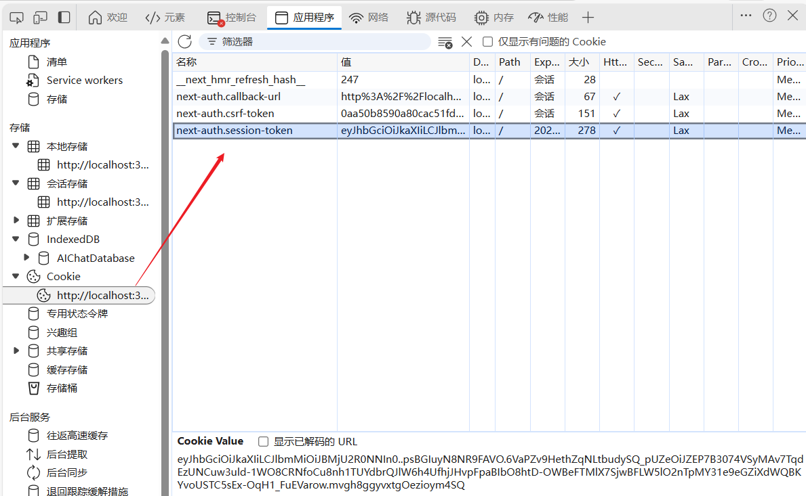
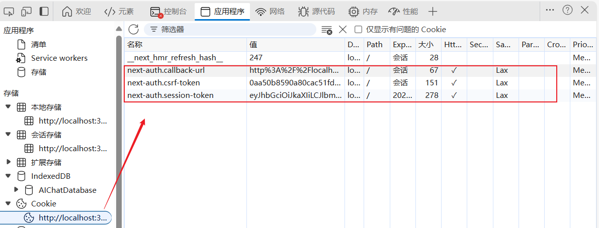

# NextAuth 认证常见问题

[[toc]]

[**书接上文（NextAuth 认证）**](/column/Next/nextjs/NextAuth认证)

::: tip 提示

这篇文章主要是记录在 `Next.js`中使用`NextAuth`认证中常见的问题，利于对`NextAuth`的深刻理解。  
这几个其实都是很多人第一次用 **NextAuth.js** 会困惑的点。

:::

## 1. 登录成功后，token/session 的生成和存储

登录成功后，token 是通过`NextAuth`的`signIn`方法生成的，默认会将 token 存放在`cookie`中，时间是`30`天(可配置)。

`NextAuth` 的工作流程和 `JWT` 有点不一样，默认是 **基于 Cookie/Session**。

### 1.1 生成过程

- 用户在 `/api/auth/[...nextauth]` 用 `CredentialsProvider` 登录成功后，NextAuth 会生成一个 **Session 对象**：

  ```json
  {
    "user": { "id": 1, "name": "Alice", "email": "alice@example.com" },
    "expires": "2025-09-26T09:00:00.000Z"
  }
  ```

- 同时，它会在 **浏览器 Cookie** 中存储一个 **加密的 session token**，名字是：

  - `next-auth.session-token` （生产环境 HTTPS 下）
  - `__Secure-next-auth.session-token` （安全模式下）

### 1.2 存放位置

- 不是 `localStorage` 或 `sessionStorage`，而是 **浏览器 Cookie**。
- 你可以在浏览器 → 开发者工具 → 应用 (Application) → Cookie → 找到。

**如图：**



### 1.3 有效期

- 默认 **30 天**，并且每次请求会 **刷新过期时间**。
- 你可以在 `authOptions.session` 里配置：

```ts
session: {
  strategy: "jwt", // 或 "database"
  maxAge: 60 * 60 * 24 * 7, // 7天
  updateAge: 60 * 60 * 24,  // 每24小时刷新一次
},
```

- **maxAge**: session 过期时间（秒数）
- **updateAge**: 访问后多久刷新 Cookie 里的过期时间

## 2. 为什么 NextAuth 的 token 存在 Cookie，而不是 localStorage/sessionStorage？

### 2.1 原因

- **安全性**

  - Cookie 可以设置为 `HttpOnly`，这样前端 JS 读不到，防止 **XSS 窃取 token**。
  - 而如果放在 `localStorage` 或 `sessionStorage`，只要页面有个 XSS 漏洞，攻击者就能直接拿到 token。

- **自动携带**

  - Cookie 是浏览器在请求同源接口时自动附带的，不需要你手动在 `fetch` 或 `axios` 里加 `Authorization` header。
  - 这样就能保证前后端天然对接，不用每个请求都写 token 注入逻辑。

- **跨子域支持**

  - 设置 Cookie 的 `domain=.example.com` 后，`api.example.com` 和 `app.example.com` 都能共享登录状态。
  - `localStorage` 只能在同一个域名下共享。

### 2.2 可以改吗？

理论上可以让 `NextAuth` 使用 `jwt` 模式，然后你手动存到 `localStorage`，但是：

- 不推荐（安全性大幅降低，容易被 XSS 攻击）。
- `NextAuth` 的设计初衷就是：**默认用 Cookie 来维护会话 (session)**，尽量减少开发者手工处理。

## 3. 每次调用业务接口时，都会携带 NextAuth 的 token 吗？

✅ **是的** —— 只要是 **同源请求**（比如 `/api/xxx`），浏览器会自动在请求头里带上：

```
Cookie: next-auth.session-token=xxxx
```

👉 这就是为什么在 `/api/protected/route.ts` 里你只需要写：

```ts
const session = await getServerSession(authOptions);
```

就能直接拿到用户信息，因为 NextAuth 会解密 Cookie，找到对应的 session。

如果你用的是 **跨域**（比如前端在 `http://localhost:3000`，API 在 `http://localhost:4000`），那就要设置：

- `credentials: "include"`（fetch/axios）
- 后端允许 `Access-Control-Allow-Credentials: true`

## 4. NextAuth 的 token 和日常的 JWT token，不是重复了吗？

这是一个关键点，很多人第一次接触会误会。

### 4.1 区别：

1. **传统 JWT 鉴权**（自己实现时）：

   - 登录成功 → 后端返回一个 JWT → 前端存 `localStorage` 或 Cookie。
   - 前端每次请求时 → 手动在 `Authorization: Bearer xxx` 里带上 JWT。
   - 后端校验 JWT → 放行。

2. **NextAuth 的 session token**：

   - 登录成功 → NextAuth 自动生成一个加密的 session token，放在 Cookie。
   - 前端请求时 → 浏览器自动带 Cookie。
   - NextAuth 校验 Cookie → 获取 session。

### 4.2 为什么看起来重复？

- 如果你只是「前端 + 自己写的后端 API」，那么 **确实用 JWT 就够了**，不需要再套一层。
- 但 NextAuth 的目标是：

  - 开箱即用，少写逻辑。
  - 支持多种登录方式（GitHub / Google / Credentials / Email Link / SSO）。
  - 不用每个地方都手动写 JWT 校验。

> 你可以理解为：
>
> - **JWT**：自己写的「低层 API」，灵活但要维护。
> - **NextAuth**：一个「高层封装」，里面也可能用到 JWT，但主要靠 Cookie 来维护登录态。

## 🚀 总结

1. **为什么存 Cookie**

   - 更安全 (`HttpOnly`)
   - 自动携带，不用手动加 token
   - 支持跨子域共享

2. **请求接口时**

   - 浏览器自动带上 `next-auth.session-token`（同源请求）
   - 跨域需要 `credentials: include`

3. **和 JWT 的关系**

   - 不是重复，而是两种思路：

     - JWT → 你自己维护 token。
     - NextAuth → 代替你管理 session，用 Cookie 保持状态。

   - 如果你的项目只需要前后端分离 + JWT，可以不用 NextAuth。
   - 如果你需要快速接入多种认证方式，或者不想维护 JWT 刷新逻辑，用 NextAuth 更方便。

## 5 NextAuth session 过期（maxAge）后怎么办？怎么重新认证？

### 5.1 机制

- 在 `authOptions.session` 里你可以设置：

  ```ts
  session: {
    strategy: "jwt",       // 或 "database"
    maxAge: 60 * 60 * 24,  // 一天（秒）
    updateAge: 60 * 60 * 24, // 每24小时刷新一次 Cookie
  }
  ```

- **maxAge**：session 最长有效时间（比如 1 天）。
- **updateAge**：用户只要有访问（比如打开页面、调用 API），NextAuth 就会自动刷新 Cookie 的过期时间，延长有效期。

👉 这意味着：

- 如果用户**每天至少访问一次**，登录状态会一直保持。
- 如果用户**一天都没访问**，session 就会过期。

### 5.2 过期后怎么办？

1. 如果 session 过期，NextAuth 的 `getServerSession` 会返回 `null`。
2. 这时你要做的就是：

   - 页面：`redirect("/auth/signin")` 跳转登录页。
   - API：返回 `401 Unauthorized`，前端捕获后跳转登录页。

换句话说：**过期后就是重新登录**，NextAuth 不会像 OAuth 那样自动刷新 token（除非你用的是 Google/GitHub provider，这种情况下会内置 refresh 逻辑）。

如果你希望 “自动续期”，可以：

- 设置 `maxAge` 大一点，比如 `7 天` 或 `30 天`。
- 配合 `updateAge`，只要用户活跃，就一直续命。

**总结（session 过期怎么办）**

- `maxAge` 控制最大有效期，`updateAge` 控制刷新机制。
- 用户活跃 → 自动续命；长时间不访问 → session 过期，必须重新登录。

## 6 浏览器上的 Cookie：为什么有好几个？

NextAuth 会生成 **多个 Cookie**，每个负责不同功能。常见的有：



### 6.1 🍪 `next-auth.session-token`

- 这是最重要的 **登录态 Cookie**。
- 存储加密的 session 信息，后端用它识别用户。
- 过期时间 = `session.maxAge`。
- 设置了 `HttpOnly` 和 `Secure`（生产环境下），JS 不能读。

---

### 6.2 🍪 `next-auth.csrf-token`

- 用于防止 **CSRF 攻击**（跨站请求伪造）。
- 主要在 **登录表单提交**时用。
- 存在于浏览器 Cookie，但前端提交时 NextAuth 会对比校验。
- 这个 cookie 本身安全性要求没那么高，但仍然有过期时间（一般是 1 天）。

---

### 6.3 🍪 `next-auth.callback-url`

- 用来保存登录后的回跳地址。
- 比如你访问 `/dashboard`，被重定向到 `/auth/signin`，登录成功后会自动回到 `/dashboard`。
- 这个 cookie 就是存储 **你原来想去的页面 URL**。
- 临时性 cookie，登录完成后基本就没用了。

**总结**

- `next-auth.session-token` → 维持登录态
- `next-auth.csrf-token` → 防止 CSRF 攻击
- `next-auth.callback-url` → 保存回跳地址，登录成功后重定向

## 7 NextAuth Session 过期处理方案

下面是一份 **NextAuth.js Session 过期后自动检测 + 重定向登录** 的完整方案（包含 **前端客户端检测** 和 **服务端页面保护** 两种方式）。

### 7.1 客户端检测（useSession Hook）

在前端组件里，可以用 `next-auth/react` 提供的 `useSession()`，它会返回：

- `status: "authenticated" | "unauthenticated" | "loading"`
- `data: session | null`

**示例：高阶组件保护页面**

```tsx
"use client";

import { useSession } from "next-auth/react";
import { useRouter } from "next/navigation";
import { useEffect } from "react";

export default function ProtectedClient({ children }: { children: React.ReactNode }) {
  const { data: session, status } = useSession();
  const router = useRouter();

  useEffect(() => {
    if (status === "unauthenticated") {
      router.push("/auth/signin"); // 未登录 → 跳转登录
    }
  }, [status, router]);

  if (status === "loading") {
    return <p>Loading...</p>; // 页面加载中
  }

  if (status === "authenticated") {
    return <>{children}</>; // 已登录 → 渲染内容
  }

  return null;
}
```

👉 使用时直接包裹页面内容：

```tsx
import ProtectedClient from "@/components/ProtectedClient";

export default function DashboardPage() {
  return (
    <ProtectedClient>
      <h1>Dashboard</h1>
    </ProtectedClient>
  );
}
```

---

### 7.2 服务端检测（getServerSession）

App Router 下推荐在 **page.tsx** 里用 `getServerSession()`，这样用户直接请求时就能被拦截。

**示例：保护 Dashboard 页面**

```tsx
import { getServerSession } from "next-auth";
import { authOptions } from "../api/auth/[...nextauth]/route";
import { redirect } from "next/navigation";

export default async function DashboardPage() {
  const session = await getServerSession(authOptions);

  if (!session) {
    redirect("/auth/signin"); // Session 过期 → 重定向登录
  }

  return (
    <div>
      <h1>Welcome {session.user?.name}</h1>
      <p>Email: {session.user?.email}</p>
    </div>
  );
}
```

👉 好处：

- **SSR 阶段就能拦截**，未登录用户看不到敏感页面。
- 对 SEO 友好，页面不会闪一下再跳转。

---

### 7.3 API 接口保护

业务 API 路由里，也要防止过期的 session：

```ts
// app/api/orders/route.ts
import { getServerSession } from "next-auth";
import { authOptions } from "../auth/[...nextauth]/route";
import { NextResponse } from "next/server";

export async function GET() {
  const session = await getServerSession(authOptions);

  if (!session) {
    return NextResponse.json({ error: "Unauthorized" }, { status: 401 });
  }

  return NextResponse.json({ orders: [{ id: 1, item: "Book" }] });
}
```

前端 fetch：

```ts
const res = await fetch("/api/orders");
if (res.status === 401) {
  router.push("/auth/signin"); // 自动跳登录
}
```

---

### 7.4 用户体验优化：自动续期

如果你觉得「一天过期就要重新登录」很烦，可以：

- 把 `maxAge` 设大一点，比如 30 天；
- 配合 `updateAge`（比如 1 天），只要用户每天来一次，Cookie 就会自动刷新。

```ts
session: {
  maxAge: 60 * 60 * 24 * 30, // 30 天
  updateAge: 60 * 60 * 24,   // 每 24 小时刷新一次
},
```

这样就变成「长期有效登录」，除非用户真的一个月没来。

---

**✅ 最终效果**

1. **客户端检测** → 在 React 组件里实时监控登录状态，失效自动跳转。
2. **服务端检测** → 在 page.tsx 里用 `getServerSession()`，未登录直接 redirect。
3. **API 接口保护** → 后端路由验证 session，过期返回 401。
4. **自动续期** → 只要用户活跃，session 就不会轻易过期。
