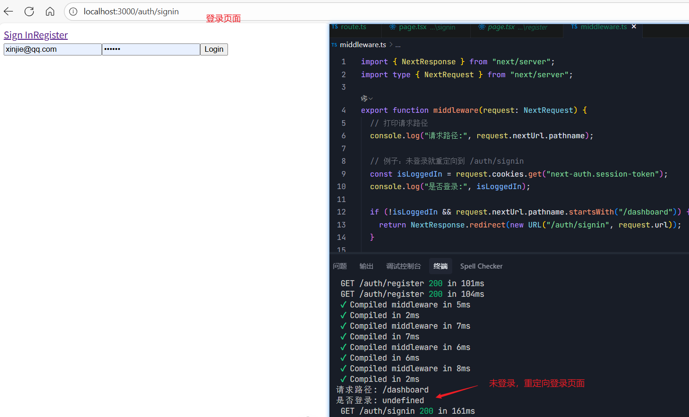
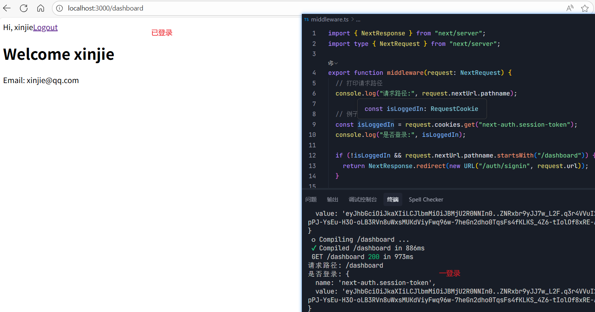

# middleware 中间件使用方式

[[toc]]


::: warning 注意事项！

从 Next.js 16 开始，中间件Middleware更名为代理（Proxy），以更好地体现其用途。其功能保持不变。

:::

## 1. 什么是 Middleware？

- **Middleware** 是运行在 **请求到达路由之前** 的一个函数。
- 它位于 **用户请求** 和 **路由处理器** 之间，可以对请求进行 **拦截、修改、重定向、鉴权** 等操作。
- 本质上是运行在 **Edge Runtime**（轻量、无 Node.js API，仅 Web API）。

## 2. Middleware 的文件位置

- 必须放在项目**根目录**的 `middleware.ts` 或 `middleware.js` 文件中。
- 作用范围取决于你在 `matcher` 中定义的路径。

```
project/
 ├── app/
 ├── middleware.ts   👈 全局 Middleware
 └── package.json
```

## 3. 常见场景

### (1) **权限控制 / 鉴权**

```ts
import { NextResponse } from "next/server";
import type { NextRequest } from "next/server";

export function middleware(request: NextRequest) {
  // 打印请求路径
  console.log("请求路径:", request.nextUrl.pathname);

  // 例子：未登录就重定向到 /auth/signin
  const isLoggedIn = request.cookies.get("next-auth.session-token");
  console.log("是否登录:", isLoggedIn);

  if (!isLoggedIn && request.nextUrl.pathname.startsWith("/dashboard")) {
    return NextResponse.redirect(new URL("/auth/signin", request.url));
  }

  // 默认放行
  return NextResponse.next();
}

// 匹配规则：只在 /dashboard 下生效
export const config = {
  matcher: ["/dashboard/:path*"]
};
```

`matcher: ["/dashboard/:path*"]` 表示 `/dashboard` 下的所有路径，包括： `/dashboard`、`/dashboard/about`、`/dashboard/blog/123` 等。都会触发 `middleware` 函数。

上面的代码含义：如果用户未登录，并且请求路径以 `/dashboard` 开头，就重定向到 `/auth/signin`。

**如图未登录：**



**如图已登录：**



### (2) **国际化 / 路由重写**

```ts
export function middleware(request: NextRequest) {
  const { pathname } = request.nextUrl;

  // 如果路径没有语言前缀，重写到默认语言
  if (!pathname.startsWith("/en") && !pathname.startsWith("/zh")) {
    const url = request.nextUrl.clone();
    url.pathname = `/en${pathname}`;
    return NextResponse.rewrite(url);
  }

  return NextResponse.next();
}
```

### (3) **A/B 测试**

```ts
export function middleware(request: NextRequest) {
  const response = NextResponse.next();

  // 简单随机分流
  if (Math.random() > 0.5) {
    return NextResponse.rewrite(new URL("/experiment-a", request.url));
  }
  return NextResponse.rewrite(new URL("/experiment-b", request.url));
}
```

### (4) **防盗链 / 访问控制**

```ts
export function middleware(request: NextRequest) {
  const referer = request.headers.get("referer");
  if (referer && !referer.includes("yourdomain.com")) {
    return new NextResponse("禁止访问", { status: 403 });
  }
  return NextResponse.next();
}
```

## 4. Middleware 的限制

- 运行在 **Edge Runtime**，不支持 `fs`、`net` 等 Node.js API。
- **执行时间非常短**，适合轻量逻辑。
- **不能直接修改响应体**（只能 `rewrite`、`redirect`、`next`）。
- 如果逻辑复杂，应该放在 **API Route 或 Server Action** 里处理。
