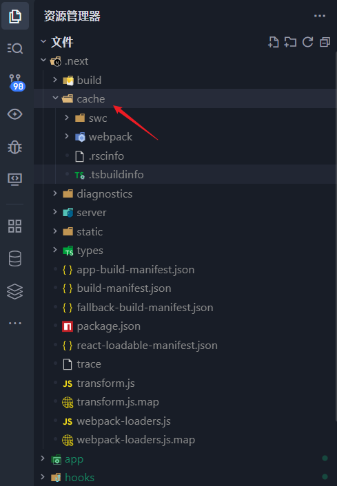

# Turbopack：Next.js 的默认开发快速构建工具

[[toc]]

随着 **Next.js 15** 的到来，`Turbopack 已经逐步取代 Webpack`，成为 `Next.js` 默认的开发构建工具。

## 1. 什么是 Turbopack？

> Turbopack 是由 **Vercel 团队**基于 Rust 编写的新一代打包器，它是 **Webpack 的继任者**。Webpack 的作者 Tobias Koppers 也是 Turbopack 的核心开发者。

**目标：**

- 提供 **更快的构建速度**（官方测试比 Webpack 快 700 倍，比 Vite 快 10 倍）。
- 支持 **增量编译和智能缓存**。
- 更好的扩展性，逐步替代 Webpack 生态。

`Turbopack 在 Next.js `中主要用于 **开发环境**，生产环境仍然可以使用` Webpack`，但在 `Next.js 15 `中已逐渐稳定，可作为未来主力。

## 2. Turbopack 的优势

| 特性         | Webpack      | Turbopack            |
| ------------ | ------------ | -------------------- |
| **编译速度** | 全量编译，慢 | 🚀 增量编译，极快    |
| **语言实现** | JavaScript   | Rust（更快、更安全） |
| **缓存机制** | 有，但复杂   | 更智能的持久缓存     |
| **热更新**   | 秒级         | 毫秒级               |
| **生态支持** | 成熟         | 不断扩展中           |

`Turbopack` 的核心能力是 **增量编译**：修改一个文件时，仅重新编译受影响的依赖，而不是整个项目，从而大幅提升热更新速度。

## 3. Turbopack 的基本使用

在` Next.js 15` 中，开发环境默认使用 `Turbopack`。常见命令如下：

**启动开发环境（默认 Turbopack）**

```bash
npm run dev
```

或

```bash
next dev --turbopack
```

当你看到类似输出：说明正在使用 Turbopack。

```
Ready in 0.3s with Turbopack
```

**如图所示：** 

### 构建生产环境

```bash
next build
```

默认仍然使用 Webpack。如果要启用 Turbopack 构建，需要在 `next.config.js` 中开启实验性配置：

```js
// next.config.js
module.exports = {
  experimental: {
    turbo: true
  }
};
```

然后运行：

```bash
npm run build
```

## 4. 可配置项

`Turbopack` 目前还处于逐步完善阶段，配置项相对较少，常用配置如下：

### `next.config.js`

```js
module.exports = {
  experimental: {
    turbo: true // 启用生产构建的 Turbopack
  }
};
```

### 开发环境命令

```json
"scripts": {
  "dev": "next dev --turbopack",
  "build": "next build",
  "start": "next start"
}
```

### 缓存控制

`Turbopack` 会自动使用 **增量缓存**，开发者无需额外配置。缓存目录一般位于：

```
.next/cache/turbo
```

**如图所示：**  

{width=400px}

可手动删除以强制全量编译：

```bash
rm -rf .next/cache/turbo
```

## 5. 多环境构建脚本实践

在真实项目中，往往需要针对不同的环境（开发 / 测试 / 生产）打包不同的配置。通常我们会维护多个 `.env` 文件：

::: tip 注意

Next.js 的环境机制比较“严格”：

它只识别 三种模式：development、production、test。

.env.uat 并不会自动被识别。

因为 next build 一定会走 production 模式，所以默认只会加载 .env.production（或 .env）。

:::

- `.env.dev` → 开发环境变量
- `.env.uat` → 测试环境变量
- `.env.production` → 生产环境变量

在 `package.json` 中，我们可以这样配置脚本：

```json
"scripts": {
  "dev": "next dev --turbopack",
  "build": "next build",
  "start": "next start",
  "prebuild:dev": "cp .env.dev .env.production",
  "build:dev": "pnpm prebuild:dev && next build",
  "prebuild:uat": "cp .env.uat .env.production",
  "build:uat": "pnpm prebuild:uat && next build",
  "build:prd": "next build"
}
```


### 工作原理

- `prebuild:dev`：将 `.env.dev` 覆盖为 `.env.production`。
- `build:dev`：执行上一步后再运行 `next build`，生成 **开发环境包**。
- `prebuild:uat`：将 `.env.uat` 覆盖为 `.env.production`。
- `build:uat`：生成 **测试环境包**。
- `build:prd`：默认读取 `.env.production`，生成 **生产环境包**。

这种方式保证了 **一套代码 → 多环境构建** 的能力，配合 Turbopack，可快速完成不同环境的打包。

📌 跨平台注意：在 Windows 下 `cp` 命令可能不可用，可以用 [`cross-env`](https://www.npmjs.com/package/cross-env) 或 `copyfiles` 来实现跨平台兼容。

## 6. 当前的限制

- **插件生态不完整**：Webpack 上的很多插件暂未支持。
- **部分配置不兼容**：自定义 Webpack 配置需要迁移。
- **生产环境尚未完全成熟**：Next.js 推荐在生产中逐步试用。

## 总结

`Turbopack 是 Next.js` 的未来构建引擎，它通过 **Rust + 增量编译 + 智能缓存** 实现了前所未有的构建性能提升。虽然生态仍在完善，但在开发环境中已经非常好用，未来也会全面替代 Webpack。

**推荐实践路线：**

1. 在开发环境全面使用 Turbopack。
2. 在测试环境试用 `experimental.turbo` 的生产构建。
3. 使用多环境打包脚本（dev/uat/prd），统一管理环境变量。
