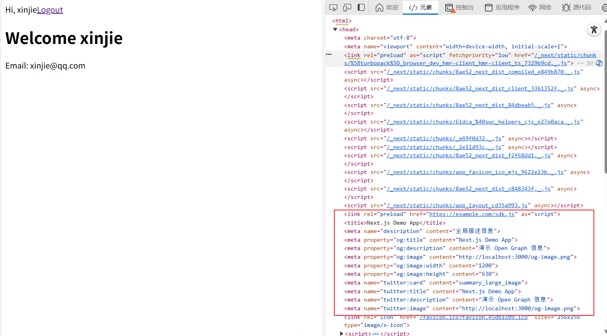

# 自定义 Document 讲解

[[toc]]

在` Next.js 15 的 App Router` 中，传统的 **自定义 Document（`_document.js`）** 已经不再是开发者必须掌握的内容。

官方提供了更现代的方式：通过 **layout.js + metadata + next/font/google + next/script** 来实现绝大多数全局 HTML、head、字体和脚本管理功能。

## 一、什么是自定义 Document？

在 **Pages Router**（`pages/_document.js`）中，自定义 Document 的主要作用是：

1. 控制整个 HTML 文档结构（`<html>`、`<body>`）。
2. 添加全局 `<meta>`、favicon、link、第三方脚本。
3. 设置字体、全局 class。
4. 注意：**只能在服务端执行**，不能使用 React hook。

示例（Pages Router）：

```js
// pages/_document.js
import { Html, Head, Main, NextScript } from "next/document";

export default function Document() {
  return (
    <Html lang="en">
      <Head>
        <link rel="icon" href="/favicon.ico" />
        <link href="https://fonts.googleapis.com/css2?family=Roboto:wght@400;700&display=swap" rel="stylesheet" />
      </Head>
      <body className="bg-gray-50">
        <Main />
        <NextScript />
      </body>
    </Html>
  );
}
```

> 在 Pages Router 中，如果你需要自定义 `<html>` 或 `<head>`，必须使用 `_document.js`。

## 二、为什么 App Router 下几乎不需要自定义 Document？

`Next.js 15 App Router` 引入了 **layout.js + metadata** 的概念：

- **layout.js**

  - 替代 `_document.js` 管理 `<html>` 和 `<body>`。
  - 可包裹全局 Provider、全局 class、全局样式。

- **metadata**

  - 自动生成 `<head>` 标签（title、description、OG、viewport 等）。
  - 页面或子 layout 可以覆盖全局 metadata，实现灵活 SEO。

- **next/font/google**

  - 替代手动引入 `<link>` 的 Google Fonts。
  - 支持 CSS 变量、优化字体加载。

- **next/script**

  - 替代手动 `<script>` 注入第三方 SDK。
  - 支持异步、懒加载、浏览器交互触发。

> 换句话说，App Router 提供了完整的 **现代化全局管理方案**，以前 `_document.js` 承担的功能现在都可以通过 layout.js + metadata + next/font/google + next/script 实现。

## 三、如何在 App Router 下实现自定义 Document 功能

### 1️⃣ 全局布局（layout.js）

```js
// app/layout.js
import { getServerSession } from "next-auth";
import Link from "next/link";
import Script from "next/script"; //  [!code highlight]

// 定义相关元数据  [!code highlight:16]
export const metadata = {
  title: "Next.js Demo App",
  description: "全局描述信息",
  viewport: "width=device-width, initial-scale=1",
  themeColor: "#ffffff",
  openGraph: {
    title: "Next.js Demo App",
    description: "演示 Open Graph 信息",
    images: [{ url: "/og-image.png", width: 1200, height: 630 }]
  },
  twitter: {
    card: "summary_large_image",
    title: "Next.js Demo App",
    images: ["/og-image.png"]
  }
};

export default async function RootLayout({ children }) {
  return (
    <html>
      <body>
        {/* 第三方脚本 相关 */}
        <Script src="https://example.com/sdk.js" strategy="afterInteractive" />
        {children}
      </body>
    </html>
  );
}
```

**如图所示：**



### 2️⃣ 字体管理（next/font/google）

```js
// app/fonts.js
import { Geist_Sans, Geist_Mono } from "next/font/google";

export const geistSans = Geist_Sans({
  subsets: ["latin"],
  weight: ["400", "700"],
  variable: "--geist-sans"
});

export const geistMono = Geist_Mono({
  subsets: ["latin"],
  weight: ["400"],
  variable: "--geist-mono"
});
```

> 通过 metadata，Next.js 会自动生成 `<head>` 标签，无需手动写 `_document.js`。

## 四、App Router 与 Pages Router 的对比

| 功能                     | Pages Router `_document.js` | App Router layout.js + metadata |
| ------------------------ | --------------------------- | ------------------------------- |
| HTML `<html>` / `<body>` | 必须自定义                  | layout.js 定义即可              |
| 全局 meta / title        | `_document.js` + `<Head>`   | metadata 自动生成               |
| 字体管理                 | `<link>` 手动引入           | next/font/google                |
| 第三方脚本               | `<script>` 手动引入         | next/script 动态加载            |
| React Hook / Client 逻辑 | ❌ 不可使用                 | ❌ layout.js 仍不可使用 Hook    |
| 页面级覆盖               | ❌ 不方便                   | ✅ 页面级 metadata 可覆盖       |
