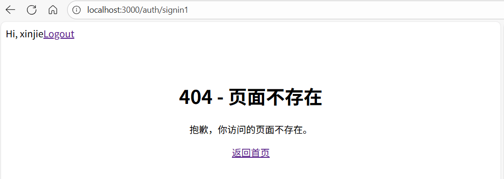
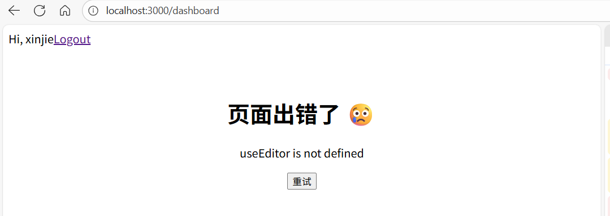

# Next.js 中自定义错误页面

[[toc]]

::: tip

在 **Next.js 15 App Router** 下，自定义错误页面有两种主要情况需要处理：**路由找不到（404）** 和 **页面渲染报错（Error）**。

:::

## 1. 自定义 404 页面（路由不存在）

### App Router

在` App Router` 下，你可以在 `app` 目录下创建一个特殊的 **`not-found.js`** 文件，用于处理路由不存在的情况。

```bash
app/
  not-found.js
```

示例：

```jsx
// app/not-found.js
"use client"; // 如果需要交互功能

import Link from "next/link";

export default function NotFound() {
  return (
    <div style={{ textAlign: "center", padding: "50px" }}>
      <h1>404 - 页面不存在</h1>
      <p>抱歉，你访问的页面不存在。</p>
      <Link href="/">返回首页</Link>
    </div>
  );
}
```

**注意事项**：

- 文件名必须是 `not-found.js`
- 可以使用 `"use client"` 声明为客户端组件，以实现交互功能
- 所有未匹配到的路由都会渲染这个组件

访问了一个不存在的路由，Next.js 会自动渲染 `not-found.js` 页面。

**如图所示：**



## 2. 自定义全局错误页面（页面报错）

当页面渲染过程中出现异常（JS 错误、fetch 报错等），可以通过 `error.js` 实现 **局部或全局错误边界**。

### 2.1 全局错误边界

在 `app` 根目录下创建 `error.js`：

```bash
app/
  error.js
```

示例：

```jsx
// app/error.js
"use client"; // 错误页面通常是客户端组件

import { useEffect } from "react";

export default function GlobalError({ error, reset }) {
  useEffect(() => {
    console.error(error);
  }, [error]);

  return (
    <div style={{ textAlign: "center", padding: "50px" }}>
      <h1>页面出错了 😢</h1>
      <p>{error.message}</p>
      <button onClick={() => reset()}>重试</button>
    </div>
  );
}
```

**说明**：

- `error`：捕获到的错误对象
- `reset`：触发重新渲染或重新请求数据的方法
- 支持客户端交互（按钮、表单等）
- 全局 `error.js` 捕获整个 App Router 下的渲染错误

**如图所示：**



### 2.2 局部错误边界

如果只想捕获某个 layout 或 page 的错误：

```bash
app/
  dashboard/
    layout.js
    error.js
```

```jsx
// app/dashboard/error.js
"use client";

export default function DashboardError({ error, reset }) {
  return (
    <div>
      <h2>Dashboard 加载失败</h2>
      <p>{error.message}</p>
      <button onClick={() => reset()}>重试</button>
    </div>
  );
}
```

> 局部 error.js 只会捕获 **对应 layout 下的子页面错误**，不影响其他页面。

以在不同 layout 下组合使用，实现全局或局部的用户友好错误提示。

## 3. 总结

| 文件名         | 功能                      | 位置          | 作用范围               |
| -------------- | ------------------------- | ------------- | ---------------------- |
| `not-found.js` | 路由不存在（404）         | app/ 或子目录 | 对应目录下未匹配路由   |
| `error.js`     | 页面报错（500 / JS 错误） | app/ 或子目录 | 对应目录下页面渲染异常 |

> Tip：提示
>
> - 建议全局 layout 下都有 `error.js` + `not-found.js`，保证整个网站用户体验统一
> - 局部 error.js 用于复杂模块或子系统，单独显示错误信息或提供重试逻辑
