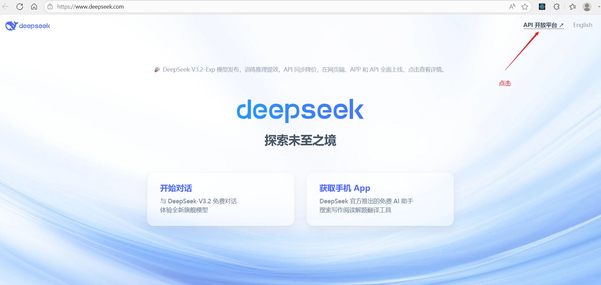
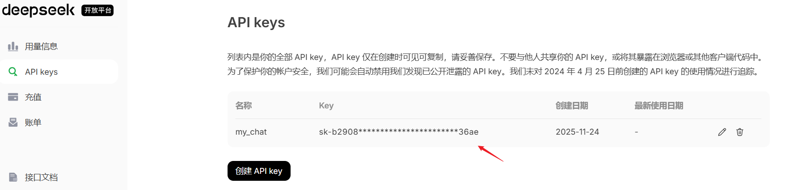
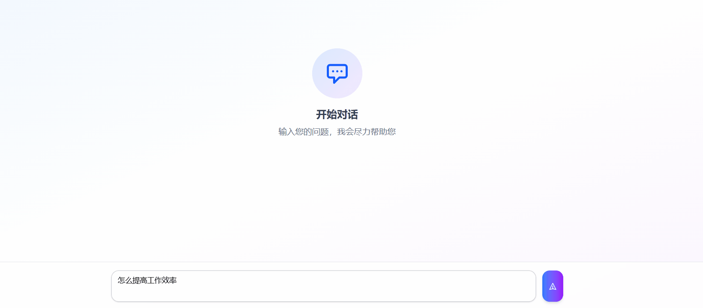

# 集成 Ai SDK

[[toc]]

`Vercel` 提供了 AI SDK，可以让我们在 Next.js 中轻松集成 AI 功能。

AI SDK 官网地址：`https://vercel.com/docs/ai-sdk`

## 1. 安装 AI SDK

首先，我们需要安装 AI SDK。可以通过 npm 或 pnpm 安装：

```bash
# npm
npm i ai @ai-sdk/deepseek @ai-sdk/react

# pnpm
pnpm add ai @ai-sdk/deepseek @ai-sdk/react

# yarn
yarn add ai @ai-sdk/deepseek @ai-sdk/react
```

这里我们使用 `deepseek` 作为 AI 模型，`@ai-sdk/react` 封装了流式输出和上下文管理 hook，可以让我们在` Next.js` 中轻松集成 AI 功能。如果你要安装其他模型，只需要将`deepseek`替换为其他模型即可。

例如：安装 openai 模型

```bash
# npm
npm i ai @ai-sdk/openai @ai-sdk/react

# pnpm
pnpm add ai @ai-sdk/openai @ai-sdk/react

# yarn
yarn add ai @ai-sdk/openai @ai-sdk/react
```

**获取 deepSeek API Key**

官网地址：`https://www.deepseek.com/`



创建 key 之后，要立马复制，否则需要重新创建。



## 2. 编写 API 接口

需创建 `src/app/api/chat/route.ts` 文件，用于处理 AI 模型的请求。

```ts
import { NextRequest } from "next/server";
import { streamText, convertToModelMessages } from "ai";
import { createDeepSeek } from "@ai-sdk/deepseek";
import { DEEPSEEK_API_KEY } from "./key";
const deepSeek = createDeepSeek({
  apiKey: DEEPSEEK_API_KEY //设置API密钥
});
export async function POST(req: NextRequest) {
  const { messages } = await req.json(); //获取请求体
  //这里为什么接受messages 因为我们使用前端的useChat 他会自动注入这个参数，所有可以直接读取
  const result = streamText({
    model: deepSeek("deepseek-chat"), //使用deepseek-chat模型
    messages: convertToModelMessages(messages), //转换为模型消息
    //前端传过来的额messages不符合sdk格式所以需要convertToModelMessages转换一下
    //转换之后的格式：
    //[
    //{ role: 'user', content: [ [Object] ] },
    //{ role: 'assistant', content: [ [Object] ] },
    //{ role: 'user', content: [ [Object] ] },
    //{ role: 'assistant', content: [ [Object] ] },
    //{ role: 'user', content: [ [Object] ] },
    //{ role: 'assistant', content: [ [Object] ] },
    //{ role: 'user', content: [ [Object] ] }
    //]
    system: "你是一个高级程序员，请根据用户的问题给出回答" //系统提示词
  });

  return result.toUIMessageStreamResponse(); //返回流式响应
}
```

## 3. 编写聊天界面

### 3.1 安装 shadcn ui 组件库

先安装 shadcn ui 组件库，与 nextjs 深度集成。

官方链接: `https://www.shadcn.com.cn/docs/installation/next`。


执行：

```bash
pnpm dlx shadcn@latest init
```

然后安装页面需要的组件，会自动添加到 根目录`/components` 目录下。

```bash
pnpm dlx shadcn@latest add button textarea
```

### 3.2 编写聊天界面

创建 `src/app/page.tsx` ,在里面写入：

```tsx
"use client";
import { useState, useRef, useEffect } from "react";
import { Button } from "@/components/ui/button";
import { Textarea } from "@/components/ui/textarea";
import { useChat } from "@ai-sdk/react";

export default function HomePage() {
  const [input, setInput] = useState(""); //输入框的值
  const messagesEndRef = useRef<HTMLDivElement>(null); //获取消息结束的ref
  //useChat 内部封装了流式响应 默认会向/api/chat 发送请求
  const { messages, sendMessage } = useChat({
    onFinish: () => {
      setInput("");
    }
  });

  // 自动滚动到底部
  useEffect(() => {
    messagesEndRef.current?.scrollIntoView({ behavior: "smooth" });
  }, [messages]);
  //回车发送消息
  const handleKeyDown = (e: React.KeyboardEvent<HTMLTextAreaElement>) => {
    if (e.key === "Enter" && !e.shiftKey) {
      e.preventDefault();
      if (input.trim()) {
        sendMessage({ text: input });
      }
    }
  };

  return (
    <div className="flex flex-col h-screen bg-linear-to-br from-blue-50 via-white to-purple-50">
      {/* 头部标题 */}
      <div className="bg-white/80 backdrop-blur-sm shadow-sm border-b border-gray-200">
        <div className="max-w-4xl mx-auto px-6 py-4">
          <h1 className="text-2xl font-bold bg-linear-to-r from-blue-600 to-purple-600 bg-clip-text text-transparent">AI 智能助手</h1>
          <p className="text-sm text-gray-500 mt-1">随时为您解答问题</p>
        </div>
      </div>

      {/* 消息区域 */}
      <div className="flex-1 overflow-y-auto px-4 py-6">
        <div className="max-w-4xl mx-auto space-y-4">
          {messages.length === 0 ? (
            <div className="flex flex-col items-center justify-center h-full text-center py-20">
              <div className="bg-linear-to-br from-blue-100 to-purple-100 rounded-full p-6 mb-4">
                <svg className="w-12 h-12 text-blue-600" fill="none" stroke="currentColor" viewBox="0 0 24 24">
                  <path
                    strokeLinecap="round"
                    strokeLinejoin="round"
                    strokeWidth={2}
                    d="M8 10h.01M12 10h.01M16 10h.01M9 16H5a2 2 0 01-2-2V6a2 2 0 012-2h14a2 2 0 012 2v8a2 2 0 01-2 2h-5l-5 5v-5z"
                  />
                </svg>
              </div>
              <h2 className="text-xl font-semibold text-gray-700 mb-2">开始对话</h2>
              <p className="text-gray-500">输入您的问题，我会尽力帮助您</p>
            </div>
          ) : (
            messages.map((message) => (
              <div
                key={message.id}
                className={`flex ${message.role === "user" ? "justify-end" : "justify-start"} animate-in fade-in slide-in-from-bottom-4 duration-500`}
              >
                <div className={`flex gap-3 max-w-[80%] ${message.role === "user" ? "flex-row-reverse" : "flex-row"}`}>
                  {/* 头像 */}
                  <div
                    className={`shrink-0 w-8 h-8 rounded-full flex items-center justify-center text-white font-semibold ${
                      message.role === "user" ? "bg-linear-to-br from-blue-500 to-blue-600" : "bg-linear-to-br from-purple-500 to-purple-600"
                    }`}
                  >
                    {message.role === "user" ? "你" : "AI"}
                  </div>

                  {/* 消息内容 */}
                  <div className={`flex flex-col ${message.role === "user" ? "items-end" : "items-start"}`}>
                    <div
                      className={`rounded-2xl px-4 py-3 shadow-sm ${
                        message.role === "user"
                          ? "bg-linear-to-br from-blue-500 to-blue-600 text-white"
                          : "bg-white border border-gray-200 text-gray-800"
                      }`}
                    >
                      {message.parts.map((part, index) => {
                        switch (part.type) {
                          case "text":
                            return (
                              <div key={message.id + index} className="whitespace-pre-wrap wrap-break-word">
                                {part.text}
                              </div>
                            );
                        }
                      })}
                    </div>
                  </div>
                </div>
              </div>
            ))
          )}
          <div ref={messagesEndRef} />
        </div>
      </div>

      {/* 输入区域 */}
      <div className="bg-white/80 backdrop-blur-sm border-t border-gray-200 shadow-lg">
        <div className="max-w-4xl mx-auto px-4 py-4">
          <div className="flex gap-3 items-end">
            <div className="flex-1 relative">
              <Textarea
                value={input}
                onChange={(e) => setInput(e.target.value)}
                onKeyDown={handleKeyDown}
                placeholder="请输入你的问题... (按 Enter 发送，Shift + Enter 换行)"
                className="min-h-[60px] max-h-[200px] resize-none rounded-xl border-gray-300 focus:border-blue-500 focus:ring-2 focus:ring-blue-200 transition-all shadow-sm"
              />
            </div>
            <Button
              onClick={() => {
                if (input.trim()) {
                  sendMessage({ text: input });
                }
              }}
              disabled={!input.trim()}
              className="h-[60px] px-6 rounded-xl bg-linear-to-r from-blue-500 to-purple-600 hover:from-blue-600 hover:to-purple-700 transition-all shadow-md hover:shadow-lg disabled:opacity-50 disabled:cursor-not-allowed"
            >
              <svg className="w-5 h-5" fill="none" stroke="currentColor" viewBox="0 0 24 24">
                <path strokeLinecap="round" strokeLinejoin="round" strokeWidth={2} d="M12 19l9 2-9-18-9 18 9-2zm0 0v-8" />
              </svg>
            </Button>
          </div>
        </div>
      </div>
    </div>
  );
}
```

我们在前端使用 `useChat` 组件来实现 AI 对话，这个组件内部封装了流式响应，默认会向`/api/chat` 发送请求。

- messages: 消息列表，包含用户和 AI 的对话内容
- sendMessage: 发送消息的函数，参数为消息内容
- onFinish: 消息发送完成后回调函数，可以在这里进行一些操作，例如清空输入框

messages：数据结构解析示例

```json
[
  {
    "parts": [
      {
        "type": "text", //文本类型
        "text": "你知道 api router 吗"
      }
    ],
    "id": "FPHwY1udRrkEoYgR", //消息ID
    "role": "user" //用户角色
  },
  {
    "id": "qno6vcWcwFM4Yc8J", //消息ID
    "role": "assistant", //AI角色
    "parts": [
      {
        "type": "step-start" //步骤开始
      },
      {
        "type": "text", //文本类型
        "text": "是的，我知道 **API Router**。", //文本内容
        "state": "done" //步骤完成
      }
    ]
  }
]
```

## 4. 实现效果

实现的聊天效果如下：


