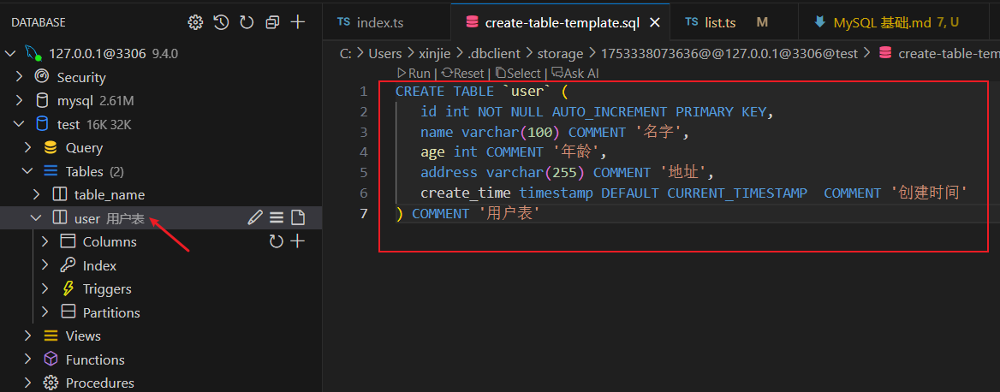
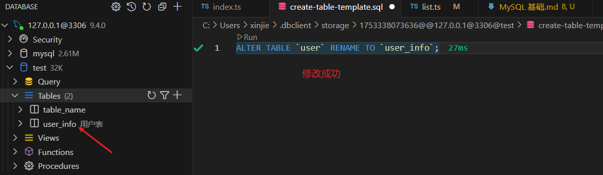
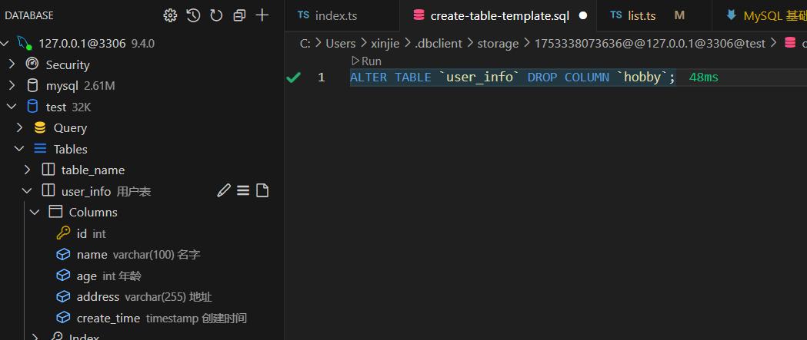

# MySQL 基础

## 一、数据库的安装

`MySQL` 是一个关系型数据库管理系统，由瑞典 `MySQL AB` 公司开发，目前属于 `Oracle` 公司。`MySQL` 是最流行的关系型数据库之一，在 web 应用方面，`MySQL` 是一个非常流行的数据库。

**安装详细见下：**

[MySQL 下载地址](https://juejin.cn/post/7324633501242851366?searchId=20250723092426188E5353488594F4E38D)

## 二、数据库基本命令

### 2.1登录命令

```sql
mysql -u 用户名 -p
```

执行后会提示输入密码（密码不会显示） 用 root 用户登录:

```sql
mysql -u root -p
```

### 2.2 退出 MySQL

登录后执行以下任意命令：

```sql
exit;
quit;
\q
```

### 2.3 数据库操作

```sql
-- 查看所有数据库
SHOW DATABASES;

-- 创建数据库
CREATE DATABASE 数据库名;

-- 删除数据库
DROP DATABASE 数据库名;

-- 使用/切换数据库
USE 数据库名;
```

## 三、数据库的操作

### 3.1 创建数据库：

```sql
CREATE DATABASE 数据库名;
```

### 3.2 创建表：

```sql
CREATE TABLE `user` (
   id int NOT NULL AUTO_INCREMENT PRIMARY KEY,
   name varchar(100) COMMENT '名字',
   age int COMMENT '年龄',
   address varchar(255) COMMENT '地址',
   create_time timestamp DEFAULT CURRENT_TIMESTAMP  COMMENT '创建时间'
) COMMENT '用户表'
```

**解析：**  
`create table `表名字 (  
1、`id`字段名称 `int`数据类型代表数字类型 ` NOT NULL`(不能为空) `AUTO_INCREMENT`(id 自增) `PRIMARY KEY`(id 为主键)  
2、`name`(字段名称) `varchar(100)`字符串类型 100 字符 `COMMENT`(注释)  
3、`age`(字段名称) int 数据类型代表数字类型 `COMMENT`(注释)  
4、`create_time`(字段名称) timestamp(时间戳) `DEFAULT` `CURRENT_TIMESTAMP`(自动填充创建时间)  
)



### 3.3 修改表名

```sql
ALTER TABLE `user` RENAME TO `user_info`;
```



### 3.4 增加列

```sql
ALTER TABLE `user` Add COLUMN `hobby` VARCHAR(200) ;
```


### 3.5 删除列

```sql
ALTER TABLE `user` DROP COLUMN `hobby`;
```



### 3.6 编辑列

```sql
ALTER TABLE `user` MODIFY COLUMN `age` VARCHAR(255) NULL COMMENT '年龄(岁)';
```


