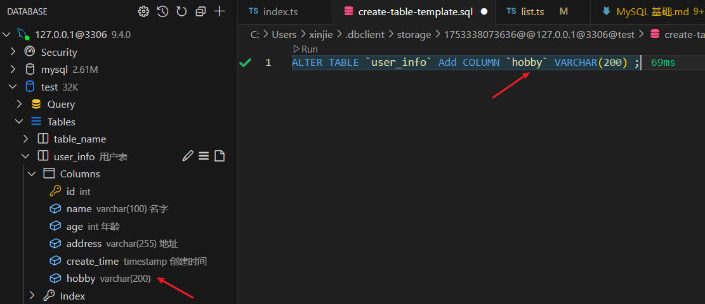
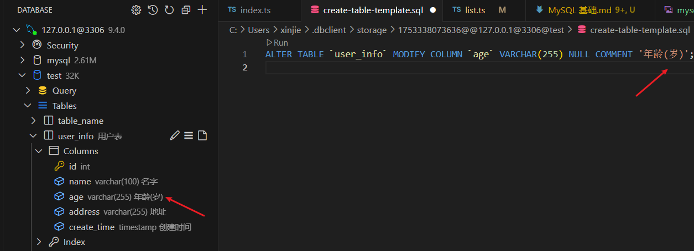

# MySQL 基础

## 一、数据库的安装

`MySQL` 是一个关系型数据库管理系统，由瑞典 `MySQL AB` 公司开发，目前属于 `Oracle` 公司。`MySQL` 是最流行的关系型数据库之一，在 web 应用方面，`MySQL` 是一个非常流行的数据库。

**安装详细见下：**

[MySQL 下载地址](https://juejin.cn/post/7324633501242851366?searchId=20250723092426188E5353488594F4E38D)

## 二、数据库基本命令

### 2.1 登录命令

```sql
mysql -u 用户名 -p
```

执行后会提示输入密码（密码不会显示） 用 root 用户登录:

```sql
mysql -u root -p
```

### 2.2 退出 MySQL

登录后执行以下任意命令：

```sql
exit;
quit;
\q
```

### 2.3 数据库操作

```sql
-- 查看所有数据库
SHOW DATABASES;

-- 创建数据库
CREATE DATABASE 数据库名;

-- 删除数据库
DROP DATABASE 数据库名;

-- 使用/切换数据库
USE 数据库名;
```

## 三、数据库的操作

### 3.1 创建数据库：

```sql
CREATE DATABASE 数据库名;
```

### 3.2 创建表：

```sql
CREATE TABLE `user` (
   id int NOT NULL AUTO_INCREMENT PRIMARY KEY,
   name varchar(100) COMMENT '名字',
   age int COMMENT '年龄',
   address varchar(255) COMMENT '地址',
   create_time timestamp DEFAULT CURRENT_TIMESTAMP  COMMENT '创建时间'
) COMMENT '用户表'
```

**解析：**  
`create table `表名字 (  
1、`id`字段名称 `int`数据类型代表数字类型 ` NOT NULL`(不能为空) `AUTO_INCREMENT`(id 自增) `PRIMARY KEY`(id 为主键)  
2、`name`(字段名称) `varchar(100)`字符串类型 100 字符 `COMMENT`(注释)  
3、`age`(字段名称) int 数据类型代表数字类型 `COMMENT`(注释)  
4、`create_time`(字段名称) timestamp(时间戳) `DEFAULT` `CURRENT_TIMESTAMP`(自动填充创建时间)  
)


### 3.3 修改表名

```sql
ALTER TABLE `user` RENAME TO `user_info`;
```


### 3.4 增加列

```sql
ALTER TABLE `user` Add COLUMN `hobby` VARCHAR(200) ;
```



### 3.5 删除列

```sql
ALTER TABLE `user` DROP COLUMN `hobby`;
```


### 3.6 编辑列

```sql
ALTER TABLE `user` MODIFY COLUMN `age` VARCHAR(255) NULL COMMENT '年龄(岁)';
```



## 四、查询语句

以下是 `MySQL` 中最常用的查询语句，涵盖基础查询、条件筛选、排序分组、连接查询等高频操作：

### 4.1 基础查询

```sql
-- 查询表中所有数据
SELECT * FROM 表名;

-- 查询特定列
SELECT 列1, 列2 FROM 表名;

-- 去重查询
SELECT DISTINCT 列名 FROM 表名;

-- 限制返回行数
SELECT * FROM 表名 LIMIT 10;       -- 前10条
SELECT * FROM 表名 LIMIT 5, 10;    -- 从第6行开始返回10条
```

### 4.2 条件查询（WHERE）

```sql
-- 基本条件
SELECT * FROM 表名 WHERE 列 = 值;

-- 多条件组合
SELECT * FROM 表名
WHERE 条件1 AND 条件2
   OR 条件3;

-- 模糊查询
SELECT * FROM 表名 WHERE 列 LIKE '%关键词%';  -- %表示任意字符
SELECT * FROM 表名 WHERE 列 LIKE '张_';      -- _表示单个字符

-- 范围查询
SELECT * FROM 表名 WHERE 列 BETWEEN 值1 AND 值2;
SELECT * FROM 表名 WHERE 列 IN (值1, 值2, 值3);

-- NULL值判断
SELECT * FROM 表名 WHERE 列 IS NULL;
SELECT * FROM 表名 WHERE 列 IS NOT NULL;
```

### 4.3 排序与分组

```sql
-- 排序
SELECT * FROM 表名 ORDER BY 列1 ASC;   -- 升序(默认)
SELECT * FROM 表名 ORDER BY 列1 DESC;  -- 降序

-- 多列排序
SELECT * FROM 表名 ORDER BY 列1 DESC, 列2 ASC;

-- 分组统计
SELECT 分组列, COUNT(*), AVG(数值列)
FROM 表名
GROUP BY 分组列;

-- 分组后筛选(HAVING)
SELECT 分组列, COUNT(*)
FROM 表名
GROUP BY 分组列
HAVING COUNT(*) > 5;
```

### 4.4 连接查询

```sql
-- 内连接(交集)
SELECT * FROM 表A
INNER JOIN 表B ON 表A.列 = 表B.列;

-- 左连接(左表全部+右表匹配)
SELECT * FROM 表A
LEFT JOIN 表B ON 表A.列 = 表B.列;

-- 右连接(右表全部+左表匹配)
SELECT * FROM 表A
RIGHT JOIN 表B ON 表A.列 = 表B.列;

-- 全连接(MySQL通过UNION实现)
SELECT * FROM 表A LEFT JOIN 表B ON 表A.列 = 表B.列
UNION
SELECT * FROM 表A RIGHT JOIN 表B ON 表A.列 = 表B.列;
```

### 4.5 子查询

```sql
-- WHERE子句中的子查询
SELECT * FROM 表A
WHERE 列 IN (SELECT 列 FROM 表B WHERE 条件);

-- FROM子句中的子查询
SELECT * FROM (SELECT 列1, 列2 FROM 表名) AS 临时表;

-- SELECT子句中的子查询
SELECT 列1, (SELECT MAX(列2) FROM 表B) AS 最大值
FROM 表A;
```

### 4.6 聚合函数

```sql
SELECT
  COUNT(*) AS 总数,          -- 计数
  SUM(数值列) AS 总和,       -- 求和
  AVG(数值列) AS 平均值,     -- 平均值
  MAX(数值列) AS 最大值,     -- 最大值
  MIN(数值列) AS 最小值,     -- 最小值
  GROUP_CONCAT(列) AS 合并值 -- 合并字符串
FROM 表名;
```
