# MySQL 简单实战演练

## 一、创建数据库与用户

```sql
-- 1️⃣ 创建数据库，设置字符集为 utf8mb4（支持 emoji）
CREATE DATABASE company_demo CHARACTER SET utf8mb4 COLLATE utf8mb4_general_ci;

-- 2️⃣ 切换到刚创建的数据库
USE company_demo;

-- 3️⃣ 创建一个普通用户（不是必须，但建议开发中使用非 root 账户）
CREATE USER 'dev'@'localhost' IDENTIFIED BY '123456';

-- 4️⃣ 给该用户授权（拥有对 company_demo 库的所有权限）
GRANT ALL PRIVILEGES ON company_demo.* TO 'dev'@'localhost';

-- 5️⃣ 刷新权限，让修改生效
FLUSH PRIVILEGES;
```

如下：

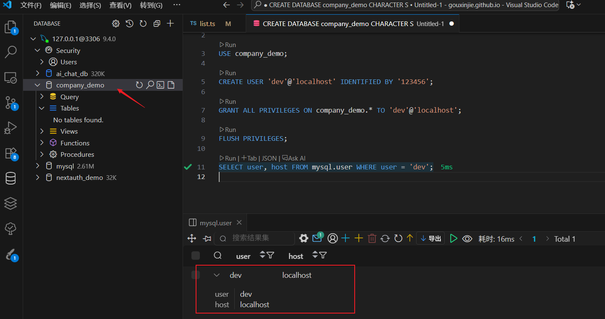

## 二、创建表结构

我们模拟一个公司系统，有：

- **部门表 departments**
- **员工表 employees**
- **项目表 projects**
- **员工与项目关系表 employee_project**（多对多）

### 1️⃣ 部门表

```sql
CREATE TABLE departments (
    id INT AUTO_INCREMENT PRIMARY KEY,   -- 部门ID（主键，自增）
    name VARCHAR(50) NOT NULL,           -- 部门名称
    location VARCHAR(100)                -- 部门所在地
);
```

### 2️⃣ 员工表

```sql
CREATE TABLE employees (
    id INT AUTO_INCREMENT PRIMARY KEY,             -- 员工ID（主键）
    name VARCHAR(50) NOT NULL,                     -- 员工姓名
    gender ENUM('M', 'F') NOT NULL,                -- 性别，只能为 M 或 F
    salary DECIMAL(10, 2),                         -- 工资，保留2位小数
    hire_date DATE,                                -- 入职日期
    department_id INT,                             -- 所属部门ID
    FOREIGN KEY (department_id) REFERENCES departments(id)  -- 外键约束，关联部门表
);
```

### 3️⃣ 项目表

```sql
CREATE TABLE projects (
    id INT AUTO_INCREMENT PRIMARY KEY,   -- 项目ID（主键）
    name VARCHAR(100) NOT NULL,          -- 项目名称
    budget DECIMAL(12, 2),               -- 项目预算
    start_date DATE,                     -- 项目开始日期
    end_date DATE                        -- 项目结束日期
);
```

### 4️⃣ 员工与项目多对多关系表

```sql
CREATE TABLE employee_project (
    employee_id INT,     -- 员工ID
    project_id INT,      -- 项目ID
    PRIMARY KEY (employee_id, project_id), -- 联合主键，防止重复分配
    FOREIGN KEY (employee_id) REFERENCES employees(id),
    FOREIGN KEY (project_id) REFERENCES projects(id)
);
```

如下,四个表已创建成功：

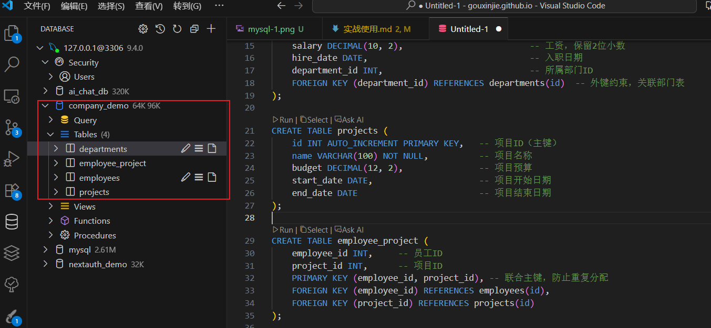

## 三、插入基础数据

### 1️⃣ 部门数据

```sql
INSERT INTO departments (name, location)
VALUES
('研发部', '北京'),
('市场部', '上海'),
('人事部', '深圳');
```

### 2️⃣ 员工数据

```sql
INSERT INTO employees (name, gender, salary, hire_date, department_id)
VALUES
('张三', 'M', 8000.00, '2022-05-10', 1),
('李四', 'F', 9500.00, '2021-03-15', 2),
('王五', 'M', 7000.00, '2020-07-20', 1),
('赵六', 'F', 6000.00, '2023-02-12', 3);
```

### 3️⃣ 项目数据

```sql
INSERT INTO projects (name, budget, start_date, end_date)
VALUES
('AI推荐系统', 500000.00, '2023-01-01', '2023-12-31'),
('市场调研系统', 300000.00, '2023-03-01', '2023-09-30');
```

### 4️⃣ 员工与项目关系

```sql
INSERT INTO employee_project (employee_id, project_id)
VALUES
(1, 1),
(2, 2),
(3, 1),
(4, 2);
```

如下,数据已插入成功：

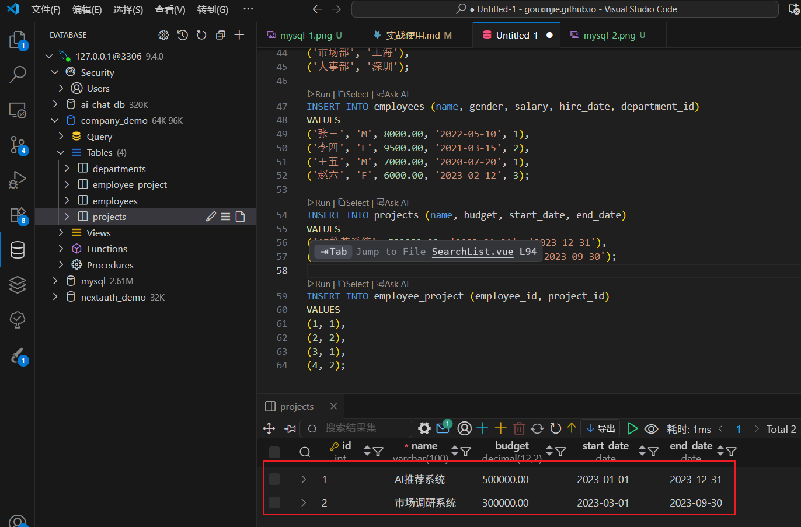

## 四、基础查询操作

### 1️⃣ 查询所有员工

```sql
SELECT * FROM employees;
```

如下：

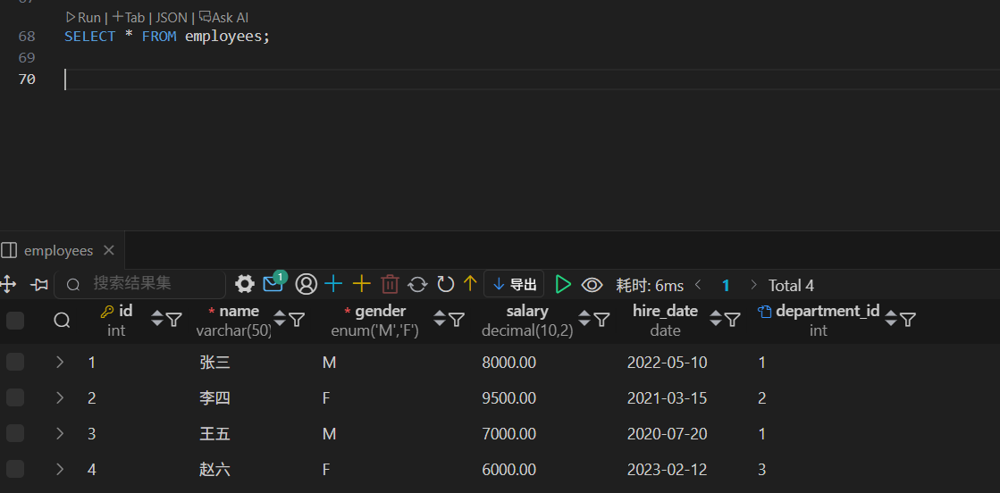

### 2️⃣ 查询工资高于 7000 的员工

```sql
SELECT name, salary
FROM employees
WHERE salary > 7000;
```

如下：

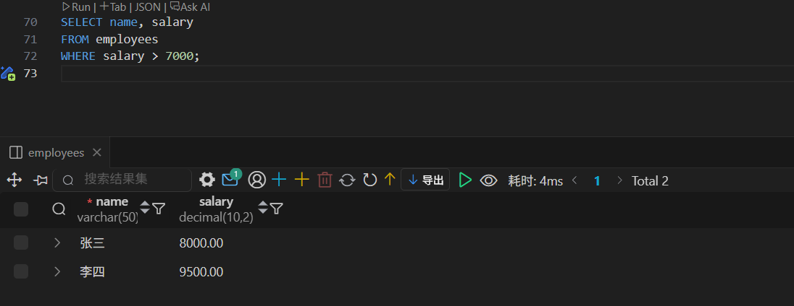

### 3️⃣ 模糊查询名字中包含“张”的员工

```sql
SELECT * FROM employees
WHERE name LIKE '%张%';
```

如下：

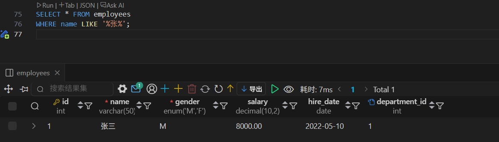

### 4️⃣ 查询工资前两名员工（降序）

```sql
SELECT * FROM employees
ORDER BY salary DESC
LIMIT 2;
```

如下：

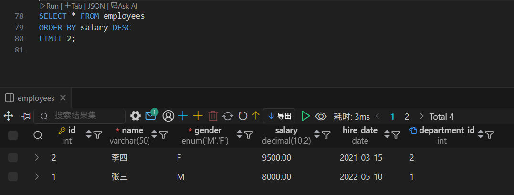

### 5️⃣ 查询每个部门的平均工资

```sql
SELECT department_id, AVG(salary) AS avg_salary
FROM employees
GROUP BY department_id;
```

如下：

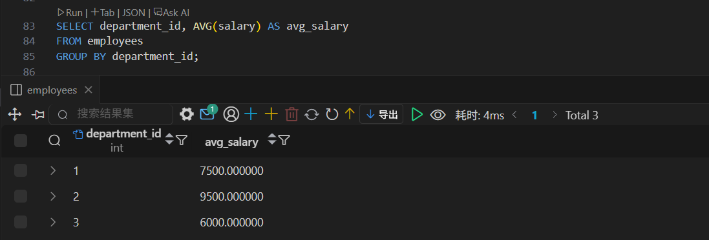

## 五、表关联（JOIN）

### 1️⃣ 查询员工及所属部门名称

```sql
SELECT e.name AS employee_name, d.name AS department_name
FROM employees e
JOIN departments d ON e.department_id = d.id;
```

**语句解释：**

- `SELECT` → 要显示什么：员工姓名和部门名称
- `AS employee_name` → 为员工姓名起别名
- `FROM employees` → 从员工表开始
- `JOIN departments` → 连接部门表
- `ON e.department_id = d.id` → 按部门 ID 匹配

**结果如下：**

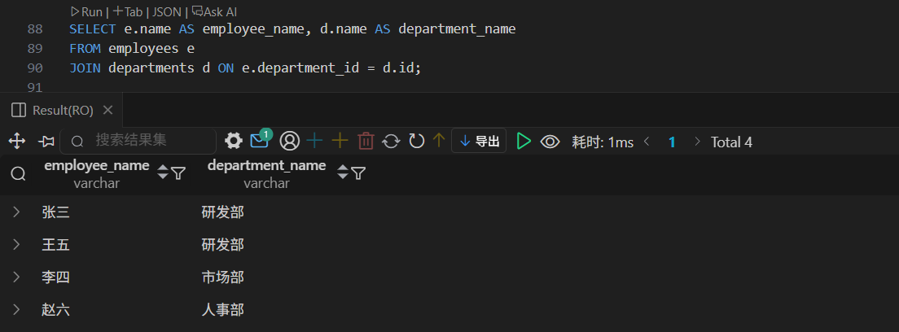

### 2️⃣ 查询所有部门及其员工（包含没有员工的部门）

```sql
SELECT d.name AS department, e.name AS employee
FROM departments d
LEFT JOIN employees e ON e.department_id = d.id;
```

**语句解释：**

- `FROM departments` → 从部门表开始（主表）
- `LEFT JOIN employees` → 左连接员工表
- 即使部门里没员工，这个部门也会显示

**结果如下：**

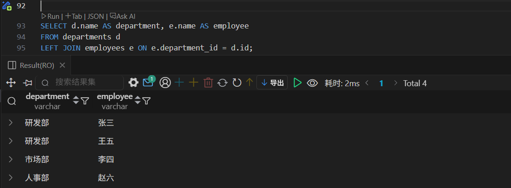

### 3️⃣ 查询员工及参与的项目

```sql
SELECT e.name AS employee, p.name AS project
FROM employees e
JOIN employee_project ep ON e.id = ep.employee_id
JOIN projects p ON p.id = ep.project_id;
```

**简单解释：**

- 涉及 3 张表：员工表、项目表、中间关系表
- `JOIN employee_project` → 先连接员工-项目关系表
- `JOIN projects` → 再连接项目表
- 通过中间表找到谁参与了什么项目

**结果如下：**

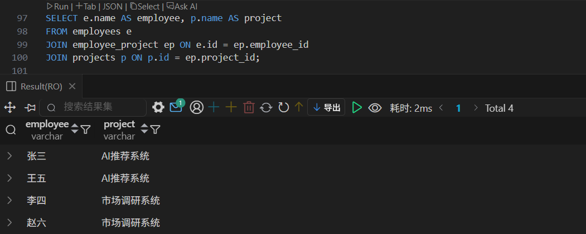

## 六、更新与删除

### 1️⃣ 更新员工工资（张三加薪 500）

```sql
UPDATE employees
SET salary = salary + 500
WHERE name = '张三';
```

### 2️⃣ 删除一个项目

```sql
DELETE FROM projects
WHERE name = '市场调研系统';
```

## 七、子查询与聚合

### 1️⃣ 查询工资高于平均工资的员工

```sql
SELECT *
FROM employees
WHERE salary > (SELECT AVG(salary) FROM employees);
```

**语句解释：**

- `(SELECT AVG(salary) FROM employees)` → 先算全公司的平均工资
- `WHERE salary >` → 再筛选比平均工资高的
- `SELECT *` → 显示这些高薪员工的所有信息

如图：

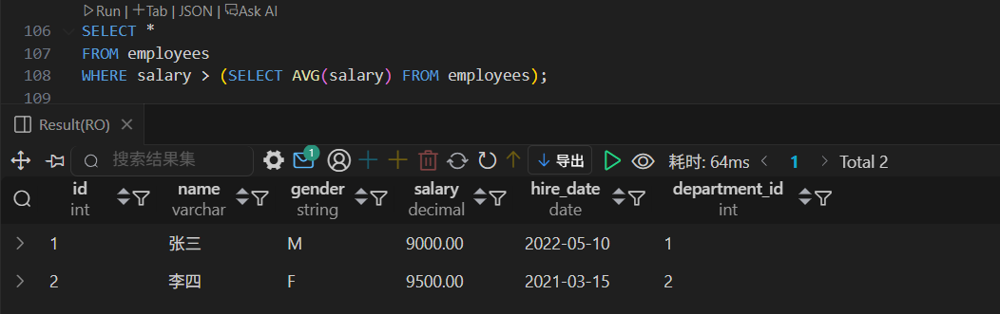

### 2️⃣ 查询每个部门工资最高的员工

```sql
SELECT e.*
FROM employees e
WHERE e.salary = (
    SELECT MAX(salary)
    FROM employees
    WHERE department_id = e.department_id
);
```

**语句解释：**

- 子查询：`找同一部门中的最高工资`
- 主查询：`找工资等于该部门最高工资的员工`
- 对每个员工，都去比对自己部门的最高工资

如图：

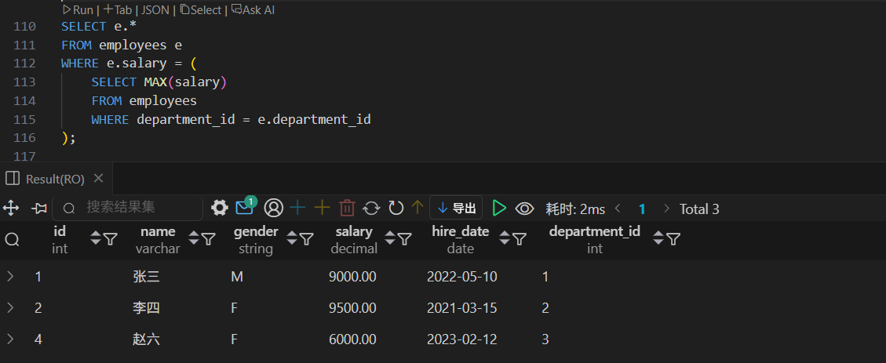

## 八、视图（VIEW）

视图可以看作是一个保存的查询结果，方便重复使用。

```sql
CREATE VIEW v_employee_department AS
SELECT e.id, e.name AS employee_name, d.name AS department_name, e.salary
FROM employees e
JOIN departments d ON e.department_id = d.id;

-- 使用视图查询
SELECT * FROM v_employee_department;
```

## 九、事务（Transaction）

事务用于保证多条语句要么都成功，要么都失败（保持数据一致性）。

```sql
START TRANSACTION;  -- 开始事务

UPDATE employees SET salary = salary - 1000 WHERE name = '张三';  -- 张三减1000
UPDATE employees SET salary = salary + 1000 WHERE name = '李四';  -- 李四加1000

COMMIT;   -- 提交事务（确认执行）
-- 或者如果出错：
-- ROLLBACK;  -- 回滚事务
```

## 🔍 十、常用管理命令

```sql
SHOW DATABASES;         -- 查看所有数据库
USE company_demo;            -- 切换数据库
SHOW TABLES;            -- 查看当前数据库中的表
DESC employees;         -- 查看 employees 表的字段结构
SHOW CREATE TABLE employees\G;  -- 查看创建表的完整SQL
SHOW INDEX FROM employees;      -- 查看索引信息
```

## ✅ 总结

| 功能模块     | 学到的知识点                      |
| ------------ | --------------------------------- |
| 数据库与用户 | 创建数据库、授权、权限管理        |
| 表设计       | 主键、外键、数据类型              |
| 数据操作     | INSERT / UPDATE / DELETE / SELECT |
| 查询         | 条件、排序、分组、分页、子查询    |
| 表关联       | JOIN、LEFT JOIN                   |
| 性能优化     | 外键设计、视图使用                |
| 数据安全     | 事务操作与回滚机制                |
