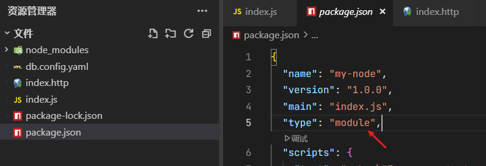
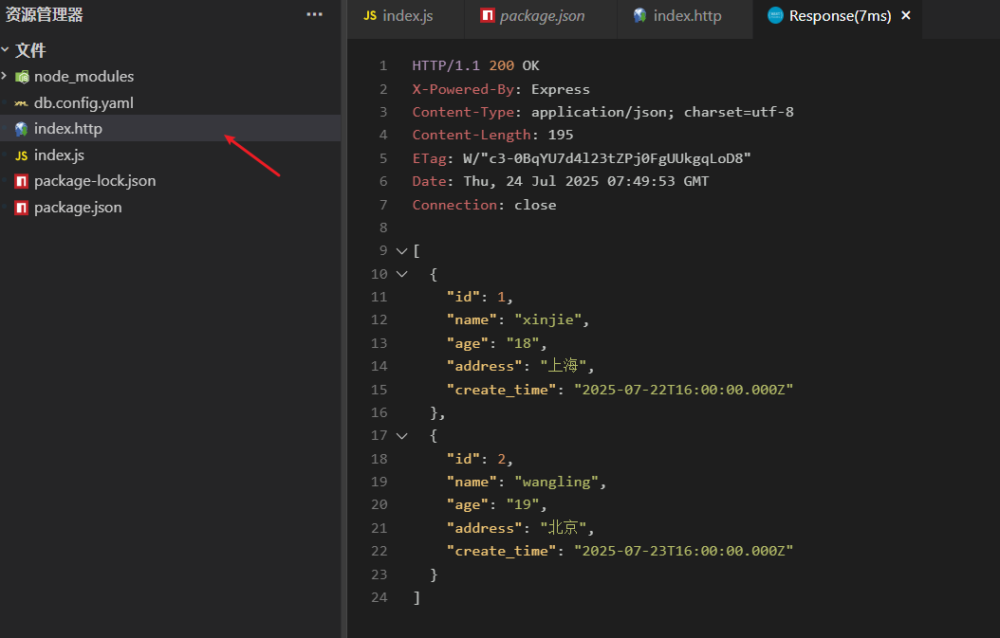

# 请求数据

## 一、安装依赖

```bash
npm install mysql2 express js-yaml
```

`mysql2` 用来连接 mysql 和编写 sq 语句  
`express` 用来提供接口 增删改差  
`js-yaml` 用来编写配置文件

## 二、配置数据库

新建 `db.config.yaml`：

```yaml
db:
  host: localhost
  port: 3306
  user: root
  password: "db123456"
  database: test
```

## 三、开始请求

工程结构如下：



`index.js`如下：

```js
import mysql2 from "mysql2/promise";
import fs from "node:fs";
import jsyaml from "js-yaml";
import express from "express";
const yaml = fs.readFileSync("./db.config.yaml", "utf8");
const config = jsyaml.load(yaml);

// 创建一个数据库连接实例
const sql = await mysql2.createConnection({
  ...config.db
});

// express
const app = express();
app.use(express.json());

//查询接口 全部
app.get("/", async (req, res) => {
  const [data] = await sql.query("select * from user");
  res.send(data);
});

//单个查询 params
app.get("/user/:id", async (req, res) => {
  const [row] = await sql.query(`select * from user where id = ?`, [req.params.id]);
  res.send(row);
});

//新增接口
app.post("/create", async (req, res) => {
  const { name, age, hobby } = req.body;
  await sql.query(`insert into user(name,age,hobby) values(?,?,?)`, [name, age, hobby]);
  res.send({ ok: 1 });
});

//编辑
app.post("/update", async (req, res) => {
  const { name, age, hobby, id } = req.body;
  await sql.query(`update user set name = ?,age = ?,hobby = ? where id = ?`, [name, age, hobby, id]);
  res.send({ ok: 1 });
});
//删除
app.post("/delete", async (req, res) => {
  await sql.query(`delete from user where id = ?`, [req.body.id]);
  res.send({ ok: 1 });
});
const port = 3000;

app.listen(port, () => {
  console.log(`Example app listening on port ${port}`);
});
```

## 四、测试接口

新建 `index.http`文件：

```js
# 查询全部
 GET http://localhost:3000/ HTTP/1.1

# 单个查询
GET http://localhost:3000/user/2 HTTP/1.1

# 添加数据
POST http://localhost:3000/create HTTP/1.1
Content-Type: application/json

{
    "name":"张三",
    "age":18
}

# 更新数据
POST http://localhost:3000/update HTTP/1.1
Content-Type: application/json

{
    "name":"法外狂徒",
    "age":20,
    "id":23
}


#删除
# POST http://localhost:3000/delete HTTP/1.1
# Content-Type: application/json

# {
#     "id":24
# }

```

然后`Vscode`安装 `Rest Client` 插件进行请求测试

右键点击`Send Request`，发起请求：


