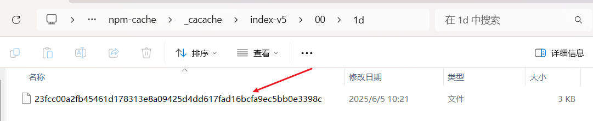

# Npm install 原理

## 1、在执行 npm install 的时候发生了什么？

首先安装的依赖都会存放在根目录的`node_modules`,默认采用`扁平化`的方式安装，并且排序规则`.bin第一个`然后`@开头的`系列，再然后按照首字母排序`abcd...`等，并且使用的算法是`广度优先遍历`，在遍历依赖树时，`npm`会首先处理项目根目录下的依赖，然后逐层处理每个依赖包的依赖，直到所有依赖都被处理完毕。

在处理每个依赖时，npm 会检查该依赖的版本号是否符合依赖树中其他依赖的版本要求，如果不符合，则会尝试安装适合的版本。

**如下图所示：**


## 2、扁平化

npm 从 v3 开始默认采用扁平化（flat）方式安装依赖。

**npm 扁平化的特点：依赖提升（Hoisting）**

将子依赖尽可能提升到项目根目录的 `node_modules` 中。  
例如：若`A`和`B`都依赖` @1.0.0`，则 `@1.0.0` 会被提升到顶层。

```text
node_modules/
├── A/               # 项目直接依赖 A@1.0.0
├── B/               # 项目直接依赖 B@1.0.0
│
└── C@1.0.0          # 被提升到顶层的公共依赖
```

如果：项目依赖 `A@1.0.0 `和 `B@1.0.0`，且： `A` 依赖 `C@1.0.0` `B` 依赖 `C@2.0.0`

```text
node_modules/
├── A/               # 主依赖A
│   └── (隐式使用顶层的C@1.0.0)
├── B/               # 主依赖B
│   └── node_modules/
│       └── C@2.0.0  # 冲突版本被迫嵌套
└── C@1.0.0          # 被提升到顶层的公共依赖
```

## 3、npm install 执行流程

### 3.1 检查 package.json

npm 首先会读取当前目录下的 package.json 文件，解析其中的依赖项：

`dependencies`：生产环境依赖（通过 `npm install` 或者 添加）。

`devDependencies`：开发环境依赖（通过 `npm install --save-dev` 添加）。

`peerDependencies`：宿主环境需提供的依赖（常见于插件开发）。

`optionalDependencies`：可选依赖（安装失败不会中断流程）。

### 3.2 生成或更新 package-lock.json

如果存在` package-lock.json` 或 `npm-shrinkwrap.json`，`npm` 会严格按锁文件中的版本安装，确保依赖树的一致性。

如果没有锁文件，`npm` 会根据 `package.json` 中的版本规则（如 ^1.2.0）下载最新兼容版本，并生成新的 `package-lock.json`。

### 3.3 下载依赖包

npm 从配置的 registry（默认是 https://registry.npmjs.org）下载依赖包。

**配置查看：**

```js
npm config list
```


下载的包会被缓存到本地（路径可通过` npm config get cache` 查看），后续安装会优先使用缓存。

```js
npm config get cache
C:\Users\xinjie\AppData\Local\npm-cache  // 复制路径直接到文件资源管理器
```

如下是我项目中的依赖缓存：


### 3.4 解析依赖树

`npm` 分析每个依赖包的` package.json`，递归安装它们的子依赖，构建完整的依赖树。

如果发现版本冲突（如 A 需要 lodash@4.x，B 需要 lodash@3.x），npm 会尝试在依赖树的不同层级安装不同版本（嵌套依赖）。

### 3.5 扁平化依赖（Dedupe）

`npm v3+` 会尝试“扁平化”依赖树，将重复的依赖提升到顶层` node_modules`，减少冗余。例如：

```text
node_modules/
├─ lodash@4.17.21    # 被提升到顶层
├─ A/                # A 需要 lodash@4.x
└─ B/
    └─ node_modules/
        └─ lodash@3.10.1  # B 需要 lodash@3.x，无法扁平化
```

### 3.6 执行生命周期脚本

安装完成后，npm 会按顺序执行包中定义的生命周期脚本（如果存在）：

```bash
preinstall → install → postinstall
```

例如，某些包（如` node-sass`）会在 `postinstall` 阶段编译原生代码。

### 3.7 创建 node_modules 目录

所有依赖（包括子依赖）会被安装到 `node_modules` 目录中。如果使用` npm ci`（用于 CI 环境），会先删除现有 `node_modules`，严格按锁文件安装。

### 3.8 常见问题

权限错误：在 `Linux/macOS `下，避免用 `sudo`，建议用 `nvm` 管理 `Node.js` 或修复` npm` 目录权限。

网络问题：可切换 registry（如淘宝镜像：npm config set registry https://registry.npmmirror.com）。

版本冲突：依赖冲突时，可通过 npm ls `<package>` 查看依赖路径，或使用 npm dedupe 优化。

## 4、.npmrc 文件

`.npmrc`（npm runtime configuration）是 `npm` 的配置文件，用于定义 包安装、发布、认证等行为的规则。它可以存在于不同层级（全局、用户、项目级），优先级从高到低为：

项目级 > 用户级 > 全局 > npm 默认值。

**常见配置项:**

```ini
# 示例：项目级 .npmrc
registry=https://registry.npmmirror.com  # 镜像源
save-exact=true                         # 保存精确版本（非语义化版本^/~）
strict-ssl=false                        # 跳过HTTPS证书验证（企业代理场景）
proxy=http://company-proxy.com:8080     # 设置代理
engine-strict=true
```

**核心用途**

切换镜像源：加速依赖下载（如淘宝镜像）。  
控制版本保存规则：避免 package.json 中自动添加 ^ 或 ~。  
安全与代理：处理企业内网认证或代理问题。  
覆盖默认行为：例如禁用脚本执行（ignore-scripts=true）。

**文件位置**

项目级：./.npmrc（与 package.json 同级）。  
用户级：~/.npmrc（用户主目录）。  
全局：/etc/npmrc（系统级）。

## 5、package-lock.json 文件

`package-lock.json` 是 npm v5+ 自动生成的锁文件，精确描述依赖树的结构和所有子依赖的版本，确保每次安装结果完全一致（无论何时何地）。

`version` 该参数指定了当前包的版本号 `resolved` 该参数指定了当前包的下载地址 `integrity` 用于验证包的完整性 `dev` 该参数指定了当前包是一个开发依赖包 `bin` 该参数指定了当前包中可执行文件的路径和名称 `engines` 该参数指定了当前包所依赖的 Node.js 版本范围

**注意：**

`package-lock.json` 帮我们做了缓存，他会通过` name + version + integrity` 信息生成一个唯一的 key，这个 key 能找到对应的`index-v5` 下的缓存记录 也就是`npm cache` 文件夹下的。

{width=80%}

如果发现有缓存记录，就会找到 tar 包的 hash 值，然后将对应的二进制文件解压到 `node_modeules`


