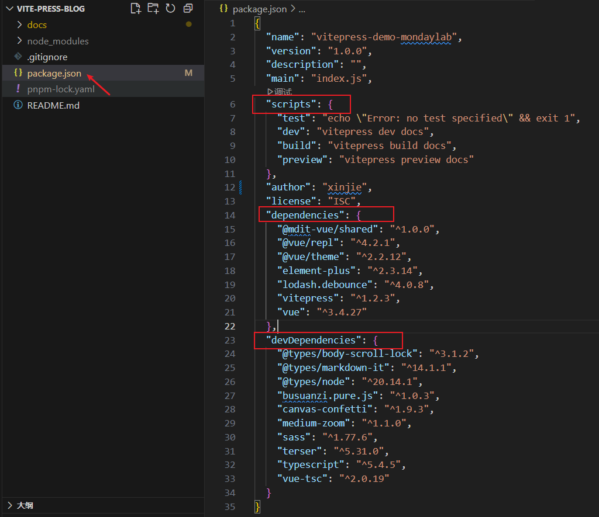

# npm 和 package.json 文件解析

## 一、npm

`npm`（全称 **Node Package Manager**）是 Node.js 的官方包管理工具。它是一个基于命令行的工具，用于帮助开发者在项目中**安装、升级、移除和管理依赖**，同时也支持发布自己的包到 npm 仓库。

官网：[https://www.npmjs.com/](https://www.npmjs.com/)

### 1.1 与其他语言包管理器的类比

| 语言     | 包管理器     | 说明                     |
|----------|--------------|--------------------------|
| Node.js  | **npm**      | Node.js 官方包管理器     |
| PHP      | Composer     | PHP 的依赖管理工具       |
| Java     | Maven / Gradle | 构建与依赖管理工具     |
| Python   | pip          | Python 包管理器          |
| Rust     | Cargo        | Rust 的包管理与构建工具  |
| Go       | go mod       | Go 的模块管理工具        |

### 1.2 npm 常用命令速查表



| **分类**       | **命令**                              | **作用描述**                              |
|----------------|---------------------------------------|-------------------------------------------|
| **项目初始化** | `npm init` / `npm init -y`            | 初始化项目并创建 package.json             |
| **安装依赖**   | `npm install`                         | 安装 package.json 中的所有依赖            |
|                | `npm install <package>`               | 安装指定包到 `dependencies`               |
|                | `npm install <package> -D`            | 安装到 `devDependencies`（推荐简写）      |
|                | `npm install <package> -g`            | 全局安装                                  |
|                | `npm install <package>@版本号`        | 安装指定版本                              |
| **依赖管理**   | `npm update <package>`                | 更新指定包                                |
|                | `npm uninstall <package>`             | 卸载包                                    |
|                | `npm outdated`                        | 检查过时的依赖                            |
|                | `npm audit` / `npm audit fix`         | 检查并尝试修复安全漏洞                    |
|                | `npm ls` / `npm list`                 | 查看已安装的依赖树                        |
| **脚本执行**   | `npm run <script>`                    | 运行 package.json 中的脚本                |
|                | `npm start` / `npm test`              | 特殊脚本可省略 `run`                      |
| **包信息**     | `npm search <keyword>`                | 搜索 npm 仓库                             |
|                | `npm info <package>` / `npm view`     | 查看包详细信息                            |
| **发布相关**   | `npm login` / `npm logout`            | 登录 / 注销 npm 账户                      |
|                | `npm publish`                         | 发布包到 npm                              |
| **配置管理**   | `npm config list`                     | 列出所有 npm 配置                         |
|                | `npm get registry`                    | 查看当前镜像源                            |
|                | `npm set registry <url>`              | 设置镜像源                                |
| **其他**       | `npm link`                            | 将本地包链接到全局                        |
|                | `npm ci`                              | 根据 lock 文件进行干净安装（推荐 CI 使用）|
|                | `npx <package>`                       | 临时执行包中的命令（无需全局安装）        |


## 二、package.json

`package.json` 是 Node.js 项目的**核心配置文件**，它定义了项目的元数据、依赖项、脚本命令、入口文件等重要信息。几乎所有基于 Node.js 的项目都会有这个文件。

### 2.1 常用字段总览

| **字段名**            | **类型**       | **作用描述**                                                                 |
|-----------------------|----------------|------------------------------------------------------------------------------|
| `name`                | 字符串         | 项目名称，发布到 npm 时必须唯一，推荐小写 + 连字符                           |
| `version`             | 字符串         | 项目版本号，遵循语义化版本（如 `1.0.0`）                                     |
| `description`         | 字符串         | 项目简短描述                                                                 |
| `main`                | 字符串         | CommonJS 入口文件（如 `dist/index.js`）                                      |
| `module`              | 字符串         | ES Module 入口文件（现代打包工具优先使用）                                   |
| `types` / `typings`   | 字符串         | TypeScript 类型声明文件入口                                                  |
| `exports`             | 对象/字符串    | 更现代的导出映射（推荐替代单纯的 `main`）                                    |
| `type`                | 字符串         | 指定模块系统：`"module"` 或 `"commonjs"`                                     |
| `keywords`            | 字符串数组     | 关键词，用于 npm 搜索                                                        |
| `author`              | 字符串/对象    | 作者信息                                                                     |
| `license`             | 字符串         | 开源许可证（如 `MIT`、`Apache-2.0`、`ISC`）                                  |
| `dependencies`        | 对象           | **生产环境**依赖                                                             |
| `devDependencies`     | 对象           | **开发环境**依赖                                                             |
| `peerDependencies`    | 对象           | 同级依赖（宿主环境需要提供的包）                                             |
| `optionalDependencies`| 对象           | 可选依赖（安装失败不会导致整体失败）                                         |
| `scripts`             | 对象           | 可执行的脚本命令                                                             |
| `repository`          | 对象           | 代码仓库信息                                                                 |
| `bugs`                | 对象/字符串    | Bug 反馈地址                                                                 |
| `homepage`            | 字符串         | 项目主页                                                                     |
| `engines`             | 对象           | 指定 Node.js / npm 版本要求                                                  |
| `files`               | 数组           | 发布到 npm 时包含的文件白名单                                                |
| `private`             | 布尔值         | 设为 `true` 可防止意外发布到 npm                                             |
| `browserslist`        | 数组/字符串    | 浏览器兼容性配置（供 Babel、Autoprefixer 等使用）                            |

> **必填字段**：发布到 npm 时，`name` 和 `version` 是必填项。


### 2.2 依赖相关字段详解

#### 1. dependencies（生产依赖）

项目**运行时**真正需要的包。

```json
"dependencies": {
  "react": "^18.2.0",
  "express": "^4.18.2"
}
```

安装方式：
```bash
npm install react
# 或
npm i express
```

#### 2. devDependencies（开发依赖）

只在**开发、构建、测试**时使用的包，不会被打包到生产环境。

```json
"devDependencies": {
  "typescript": "^5.0.0",
  "eslint": "^8.0.0",
  "vite": "^5.0.0"
}
```

安装方式：
```bash
npm install typescript -D
# 或
npm i eslint --save-dev
```

#### 3. peerDependencies（同级依赖）

常用于**组件库、插件**场景。表示：“我需要这个包，但不自己安装，要求宿主项目提供”。

```json
"peerDependencies": {
  "react": ">=17.0.0",
  "react-dom": ">=17.0.0"
}
```

#### 4. 版本号语法（semver）

| 写法          | 含义                              | 示例允许范围          |
|---------------|-----------------------------------|-----------------------|
| `1.2.3`       | 精确版本                          | 仅 1.2.3              |
| `^1.2.3`      | 兼容更新（默认）                  | ≥1.2.3 且 <2.0.0      |
| `~1.2.3`      | 近似更新                          | ≥1.2.3 且 <1.3.0      |
| `>=1.2.3`     | 大于等于                          | ≥1.2.3                |
| `*` 或 `x`    | 任意版本                          | 任意                  |
| `latest`      | 最新版本                          | 最新发布              |


### 2.3 scripts 脚本

`scripts` 是 package.json 中非常重要的字段，用于定义常用命令。

```json
"scripts": {
  "dev": "vite",
  "build": "vite build",
  "preview": "vite preview",
  "lint": "eslint src --ext .ts,.tsx",
  "test": "vitest",
  "prepare": "husky install"
}
```

执行方式：
```bash
npm run dev
npm run build
npm start          # 特殊脚本可省略 run
npm test           # 特殊脚本可省略 run
```

**生命周期脚本**（会自动执行）：
- `preinstall` / `postinstall`
- `prepublishOnly`
- `prepare`（安装依赖后自动执行，常用于 husky）


### 2.4 engines - 环境要求

```json
"engines": {
  "node": ">=18.0.0",
  "npm": ">=9.0.0"
}
```

配合 `.npmrc` 中的 `engine-strict=true` 可以强制检查。


### 2.5 其他实用字段

**repository**
```json
"repository": {
  "type": "git",
  "url": "https://github.com/user/repo.git"
}
```

**files**（控制发布内容）
```json
"files": [
  "dist",
  "README.md",
  "LICENSE"
]
```

**type**（决定默认模块系统）
```json
"type": "module"        // 默认使用 ES Module
// 或
"type": "commonjs"      // 默认使用 CommonJS
```

**private**
```json
"private": true         // 防止执行 npm publish 时误发布
```

### 2.6 package-lock.json 的作用

- 锁定依赖的**精确版本**和依赖树结构
- 保证不同环境（开发、测试、生产、CI）安装结果一致
- 由 npm 自动生成和维护，**不建议手动修改**
- 推荐提交到 Git 仓库

相关命令：
```bash
npm install          # 会根据 package.json 更新 lock 文件
npm ci               # 严格按照 lock 文件安装（CI 推荐）
```

## 三、最佳实践建议

1. **生产依赖 vs 开发依赖** 要严格区分，避免把测试工具、构建工具放进 `dependencies`。
2. 使用 `^` 作为默认版本前缀，兼顾兼容性与更新。
3. 把 `package-lock.json` 提交到 Git，保证依赖一致性。
4. 私有项目记得加 `"private": true`。
5. 合理使用 `scripts`，把常用命令都写进去，方便团队协作。
6. 发布到 npm 前，用 `files` 字段控制只上传必要文件。
7. 推荐配合 `.npmrc` 统一镜像源和配置。

