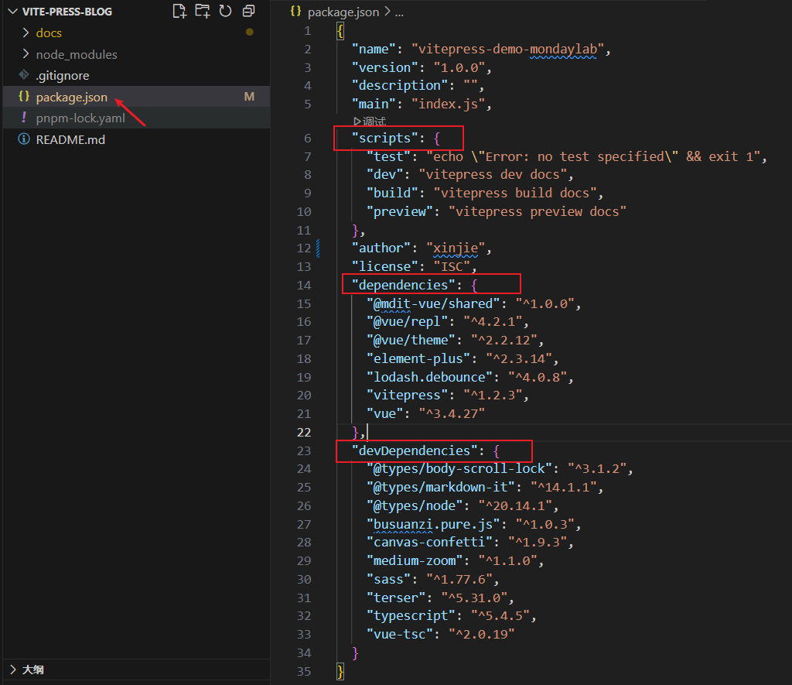

# npm 和 package.json 文件解析

## 一、npm

`npm（全称 Node Package Manager）是 Node.js 的包管理工具`，它是一个基于命令行的工具，用于帮助开发者在自己的项目中安装、升级、移除和管理依赖项。

<!-- 插入超链接 -->

<a href="https://www.npmjs.com/" target="_blank">npm</a>

1、类似于 `PHP` 的工具：`Composer`。它是 PHP 的包管理器，可以用于下载、安装和管理 PHP 的依赖项，类似于 npm。  
2、类似于 `Java` 的工具：`Maven`。它是 Java 的构建工具和项目管理工具，可以自动化构建、测试和部署 Java 应用程序，类似于 npm 和 webpack 的功能。  
3、类似于 `Pyth`on 的工具：`pip`。它是 Python 的包管理器，可以用于安装和管理 Python 的依赖项，类似于 npm。  
4、类似于 `Rust` 的工具：`Cargo`。它是 Rust 的包管理器和构建工具，可以用于下载、编译和管理 Rust 的依赖项，类似于 npm 和 Maven 的功能。

以下是简化后的 npm 常用命令分类表格：

### npm 常用命令速查表

| **分类**       | **命令**                           | **作用描述**                    |
| -------------- | ---------------------------------- | ------------------------------- |
| **项目初始化** | `npm init`                         | 初始化项目并创建 package.json   |
| **安装依赖**   | `npm install`                      | 安装 package.json 中的所有依赖  |
|                | `npm install <package>`            | 安装指定包到 dependencies       |
|                | `npm install <package> --save-dev` | 安装到 devDependencies          |
|                | `npm install -g <package>`         | 全局安装                        |
| **依赖管理**   | `npm update <package>`             | 更新指定包                      |
|                | `npm uninstall <package>`          | 卸载包                          |
|                | `npm outdated`                     | 检查过时的依赖                  |
|                | `npm audit`                        | 检查依赖安全漏洞                |
| **脚本执行**   | `npm run <script>`                 | 运行 package.json 中的脚本      |
| **包搜索**     | `npm search <keyword>`             | 搜索 npm 仓库                   |
|                | `npm info <package>`               | 查看包详细信息                  |
| **发布管理**   | `npm publish`                      | 发布包到 npm                    |
|                | `npm login`                        | 登录 npm 账户                   |
|                | `npm logout`                       | 注销当前账户                    |
| **配置管理**   | `npm config list`                  | 列出所有 npm 配置               |
|                | `npm get registry`                 | 查看当前镜像源地址              |
|                | `npm set registry <url>`           | 设置镜像源地址                  |
| **高级操作**   | `npm link`                         | 将本地包链接到全局 node_modules |
|                | `npm list`                         | 显示已安装的依赖树              |

`package.json` 是 `Node.js `项目的核心配置文件，它定义了项目的元数据、依赖项、脚本命令等重要信息。下面我将全面解析这个文件的各个部分。

## 二、package.json



### 2.1 常用配置

以下是 `package.json` 主要字段的总结表格：

| **字段名**         | **类型**    | **作用描述**                                                                          |
| ------------------ | ----------- | ------------------------------------------------------------------------------------- |
| `name`             | 字符串      | 项目名称，必须唯一，推荐小写字母和连字符组合（如 `my-project`）                       |
| `version`          | 字符串      | 项目版本号，遵循语义化版本规范（如 `1.0.0`）                                          |
| `description`      | 字符串      | 项目简短描述                                                                          |
| `main`             | 字符串      | 项目主入口文件路径（如 `dist/index.js`）                                              |
| `keywords`         | 字符串数组  | 项目关键词，用于 npm 搜索（如 `["vue", "utility"]`）                                  |
| `author`           | 字符串/对象 | 作者信息（如 `"John Doe <john@example.com>"` 或 `{ "name": "...", "email": "..." }`） |
| `license`          | 字符串      | 开源许可证类型（如 `MIT`、`Apache-2.0`）                                              |
| `dependencies`     | 对象        | 生产环境依赖包列表（如 `{ "react": "^18.2.0" }`）                                     |
| `devDependencies`  | 对象        | 开发环境依赖包列表（如 `{ "eslint": "^8.0.0" }`）                                     |
| `peerDependencies` | 对象        | 同级依赖，声明宿主环境需提供的包（如 `{ "react": ">=16.8.0" }`）                      |
| `scripts`          | 对象        | 可执行的 npm 脚本命令（如 `{ "start": "node app.js" }`）                              |
| `repository`       | 对象        | 代码仓库信息（如 `{ "type": "git", "url": "https://github.com/user/repo" }`）         |
| `bugs`             | 对象/字符串 | Bug 反馈地址（如 `{ "url": "https://github.com/user/repo/issues" }`）                 |
| `homepage`         | 字符串      | 项目官网或文档地址（如 `"https://example.com"`）                                      |

**补充说明：**

1. **必填字段**：`name` 和 `version` 是发布到 npm 时的必填字段
2. **版本语法**：
   - `^1.2.3`：允许次版本号和修订号更新（如 1.2.3 → 1.9.0）
   - `~1.2.3`：只允许修订号更新（如 1.2.3 → 1.2.9）
3. **扩展字段**：
   - `files`：控制发布到 npm 的文件白名单
   - `engines`：指定 Node.js 或 npm 版本要求
   - `private: true`：防止意外发布私有项目

需要补充其他字段（如 `types`、`module` 等 TypeScript/ESM 相关字段）吗？

### 2.2 dependencies & devDependencies

| 类型              | 说明     | 安装方式                           |
| ----------------- | -------- | ---------------------------------- |
| `dependencies`    | 生产依赖 | `npm install <package>`            |
| `devDependencies` | 开发依赖 | `npm install <package> --save-dev` |

示例：

```json
"dependencies": {
  "react": "^18.2.0"
},
"devDependencies": {
  "typescript": "^4.9.5"
}
```

### 2.3 engines - 环境要求

指定 Node.js 和 npm 的版本要求：

```json
"engines": {
  "node": ">=16.0.0",
  "npm": ">=8.0.0"
}
```

### 2.4 repository - 代码仓库

```json
"repository": {
  "type": "git",
  "url": "https://github.com/user/repo.git"
}
```

### 2.5 config - 自定义配置

```json
"config": {
  "port": 8080
}
```

可通过 `process.env.npm_package_config_port` 访问
