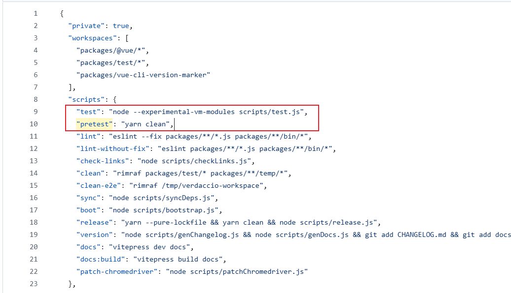

# npm run 原理

[[toc]]
当你运行 `npm run xxx` 时，npm 会执行 `package.json` 中 `scripts` 字段定义的名为 `xxx` 的脚本。这个过程涉及下面多个步骤：

### 1. 查找脚本定义

npm 首先会在当前项目的 `package.json` 文件的 `scripts` 字段中查找 `xxx` 对应的命令：

```json
{
  "scripts": {
    "xxx": "echo 'Hello World'", // 要执行的命令
    "build": "webpack --config webpack.config.js"
  }
}
```

- 如果 `xxx` 不存在，npm 会报错：`Missing script: "xxx"`。

### 2. 环境准备

- **PATH 环境变量增强**：  
  npm 会临时将 `node_modules/.bin` 添加到 `PATH` 中，这意味着：

  - 你可以直接运行安装在项目依赖中的 CLI 工具（如 `webpack`、`eslint`），而无需写完整路径（如 `./node_modules/.bin/webpack`）。
  - 示例：`npm run build` 中的 `webpack` 命令会自动从 `node_modules/.bin` 查找。

- **环境变量注入**：  
  npm 会注入一些额外的环境变量，例如：
  - `npm_package_name`：当前项目的包名（来自 `package.json` 的 `name` 字段）。
  - `npm_package_version`：当前版本号。
  - 可通过 `process.env.npm_package_name` 在脚本中访问。

### 3. 执行脚本

- **Shell 执行**：  
  npm 默认在系统的默认 Shell（如 Bash、CMD/PowerShell）中执行脚本命令。

  - 在 Unix 系统（Linux/macOS）中，实际执行的是 `sh -c "echo 'Hello World'"`。
  - 在 Windows 中，会通过 `cmd.exe /C` 执行。

- **顺序执行多条命令**：  
  如果脚本包含 `&&` 或 `;`，npm 会按顺序执行：
  ```json
  "scripts": {
    "test": "eslint . && jest"
  }
  ```
  - 先运行 `eslint .`，如果成功（退出码为 0），再运行 `jest`。

### 4. 生命周期脚本（如果适用）

如果 `xxx` 是 npm 内置的生命周期脚本（如 `start`、`test`、`preinstall`、`postinstall` 等），npm 会自动触发相关的 `prexxx` 和 `postxxx` 钩子。  
例如：

```json
{
  "scripts": {
    "prestart": "echo '准备启动...'", // 自动在 start 前执行
    "start": "node server.js",
    "poststart": "echo '服务已启动'" // 自动在 start 后执行
  }
}
```

运行 `npm run start` 时，实际执行顺序为：  
`prestart` → `start` → `poststart`。

**如下：**



### 5. 输出与错误处理

- **输出流**：  
  脚本的 `stdout` 和 `stderr` 会直接打印到终端。
- **退出码**：
  - 如果脚本成功执行（退出码为 0），npm 会静默退出。
  - 如果脚本失败（非零退出码），npm 会报错并停止后续命令（在 `&&` 链中）。

### 6. 常见场景示例

#### 场景 1：运行开发服务器

```json
{
  "scripts": {
    "dev": "vite" // 直接调用 vite（来自 node_modules/.bin）
  }
}
```

运行 `npm run dev` 等价于直接执行 `./node_modules/.bin/vite`。

#### 场景 2：组合命令

```json
{
  "scripts": {
    "deploy": "npm run build && rsync -av dist/ user@server:/path/to/deploy"
  }
}
```

- 先执行 `npm run build`，成功后通过 `rsync` 部署。

#### 场景 3：跨平台兼容

```json
{
  "scripts": {
    "clean": "rm -rf dist", // Unix
    "clean:win": "rmdir /s /q dist", // Windows
    "clean:all": "npm run clean || npm run clean:win"
  }
}
```

- 使用 `||` 实现跨平台回退。

### 7. 高级技巧

#### 传递参数

通过 `--` 向脚本传递参数：

```bash
npm run lint -- --fix
```

对应的 `package.json`：

```json
{
  "scripts": {
    "lint": "eslint ."
  }
}
```

实际执行：`eslint . --fix`。

#### 环境变量覆盖

临时覆盖环境变量：

```bash
NODE_ENV=production npm run build
```

脚本中可通过 `process.env.NODE_ENV` 读取。

#### 静默运行

禁止输出 npm 日志（仅输出脚本内容）：

```bash
npm run --silent xxx
```

### 8. 与直接命令的区别

| **对比项**       | `npm run xxx`                 | 直接命令行执行（如 `vite`） |
| ---------------- | ----------------------------- | --------------------------- |
| **PATH 解析**    | 自动识别 `node_modules/.bin`  | 需全局安装或写完整路径      |
| **环境变量**     | 注入 npm 相关变量（如版本号） | 仅系统环境变量              |
| **跨平台**       | 依赖 Shell，需处理兼容性      | 直接依赖系统 Shell          |
| **生命周期钩子** | 支持 `pre/post` 钩子          | 无                          |

### 总结

- `npm run xxx` 的本质是执行 `package.json` 中定义的 Shell 命令，并为其提供项目上下文（如 `node_modules/.bin` 路径和环境变量）。
- **核心优势**：标准化项目操作（如构建、测试），隐藏技术细节，提升团队协作一致性。
- **最佳实践**：将常用操作（如启动、构建）封装到 `scripts` 中，而非依赖文档说明。
