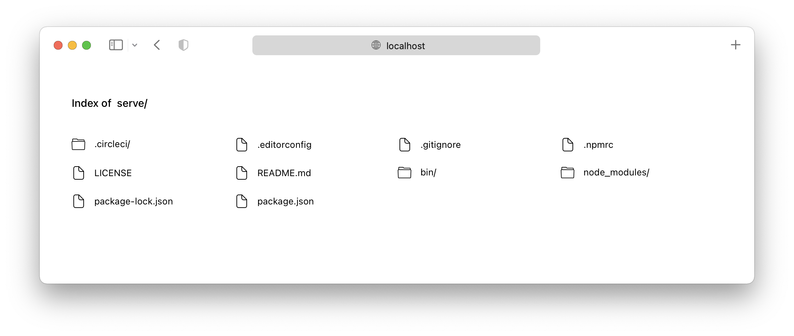
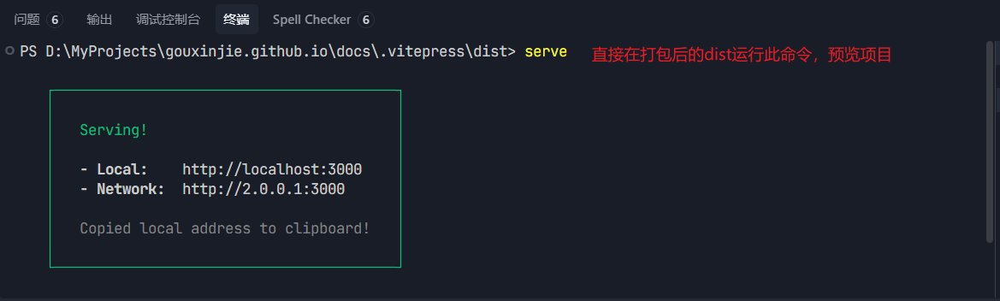
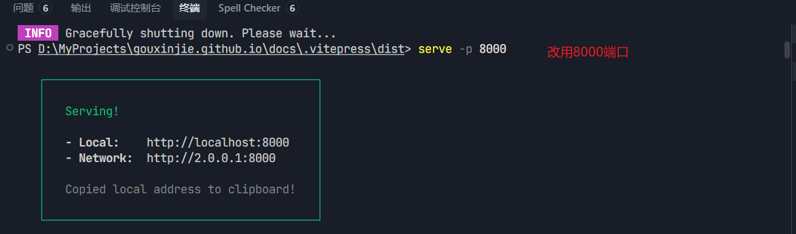

# npm serve

## 一、介绍

[serve](https://github.com/vercel/serve) 可以快速启动一台本地服务器来运行打包后的项目；

`serve` 帮助你服务静态网站、单页应用或静态文件（无论在你的设备上还是在本地网络上）。它还提供了一个简洁的界面来列出目录内容：



## 二、全局安装

```bash
  npm install -g serve
```

## 三、用法

`serve` 可以在项目目录中直接运行，也可以指定要服务的目录：

```bash
  serve [目录]
```

例如，要服务当前目录下的 `dist` 目录，你可以运行：

```bash
  serve
```



这将启动一个本地服务器，默认监听端口为 `3000`。你可以在浏览器中访问 `http://localhost:3000` 来查看服务的内容。

你还可以通过 `-p` 或 `--port` 选项来指定监听的端口：

```bash
  serve -p 8000
```

这将启动一个本地服务器，监听端口为 `8000`。


