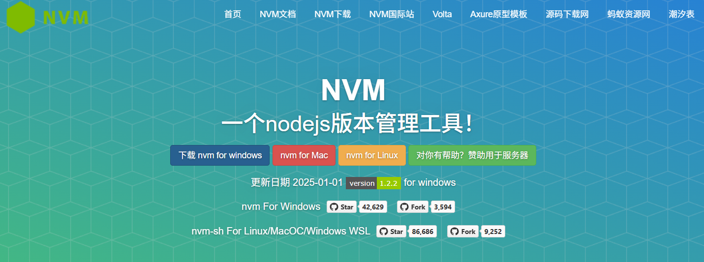
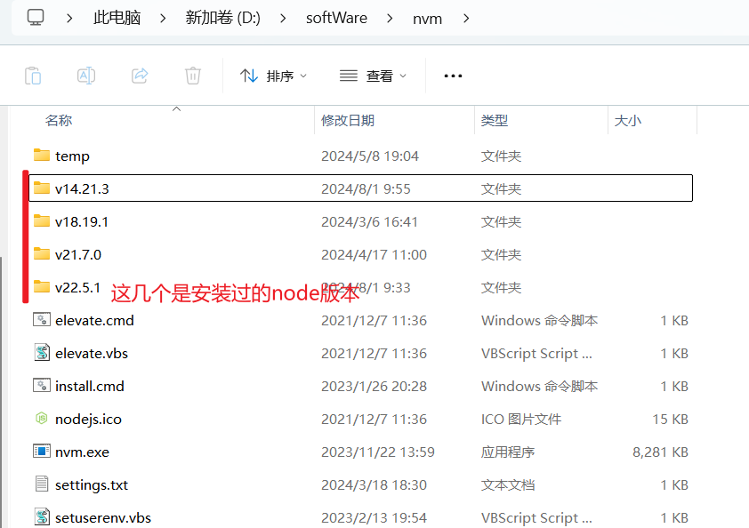

# **NVM 使用：Node.js 版本管理利器**

`NVM（Node Version Manager`）是 `Node.js` 开发者必备的工具，它允许你在同一台机器上安装和管理多个` Node.js` 版本。对于维护和开发多个不同的项目很是方便。

##  一、nvm 的安装和使用



### 1.1、介绍

> nvm 全名`node.js version management` 它是一个 nodejs 的版本管理工具；通过它可以安装和切换不同版本的 nodejs；

管理不同的 node 版本在日常开发中也是很方便的；比如 vue3 的项目对 node.js 版本需求比较高 15.0+；这样我们同时开发 vue2 和 vue3 项目时，我们使用 nvm 可以随时切换 node 的版本进行开发；

启动 vue3 项目如果出现下面这两行报错时，说明你的 node 版本过低：

```clike
error when starting dev server:
Error: Cannot find module 'node:url'
```

### 1.2、安装 nvm

**1，安装包下载地址**

```
https://github.com/coreybutler/nvm-windows/releases/download/1.1.9/nvm-setup.zip
```

**2，解压然后双击安装** 

**3，等待安装...**

**4，安装完成后 在 cmd 命令窗口输入 `nvm -v / nvm -V / nvm -version`**

出现版本号说明安装成功；


## 二、常用命令

**1，查看目前使用的版本**

```
nvm ls
```


**2，查看 node 的目前的所有版本**

```
 nvm list available
```


**3，下载需要的 node 版本**

```
nvm install 16.16.0
```

**4，切换版本**

```
 nvm use 16.16.0
```

**5，其他常用命令**

```
nvm install latest：安装最新稳定版node.js
nvm install [version]：安装指定版本node.js
nvm use [version]：使用某个版本node.js
nvm list：列出当前安装的node.js版本列表

nvm uninstall [version]：卸载指定版本的node.js
卸载一个版本后用 nvm list命令查看竟然还可以查出来； 就是使用不了 （也不知道是不是bug）

nvm node_mirror [url]：配置nvm的镜像
nvm npm_mirror [url]：配置npm的镜像
nvm arch：显示node是运行在32位还是64位。
nvm on：开启node.js版本管理
nvm off：关闭node.js版本管理
```

## 三、使用 nvm 切换其他 node 版本后发现 npm 命令不可用

### 问题描述

使用`nvm`切换其他 `node` 版本后发现`npm`命令不可用

```js
不是内部或外部命令，也不是可运行的程序或批处理文件。 
```

找到磁盘下 `nvm` 的安装目录，会发现不存在的 `node` 版本的文件下面的 `node_modules` 文件夹为空。

### 解决方案

从 Node.js 官网下载对应版本的压缩包，也就是将解压后的所有内容原封不动的拷贝到 `NVM` 目录下对应 `Node.js` 安装目录中的 `node_modules` 目录中

可以看一下生效 node 版本的 `node_modules` 目录结构是什么样的，把下载好的 node 版本复制到缺少文件的下面；

**node 的历史版本链接：** https://nodejs.org/download/release/

正常情况下的 node_modules 目录结构如下：

**图一：**

{width=80%}

**图二：**

{width=80%}
