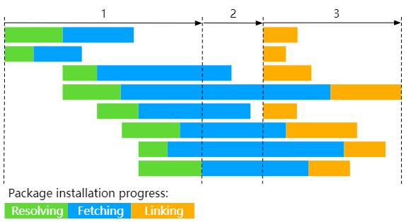
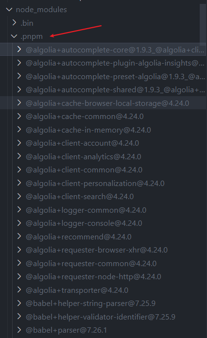
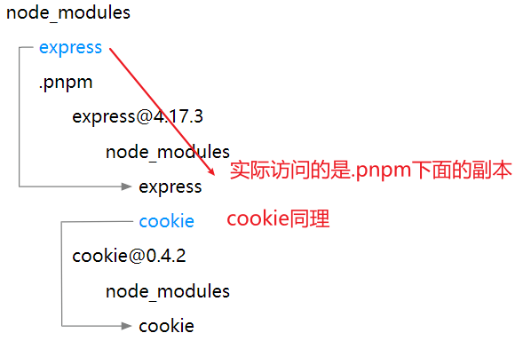
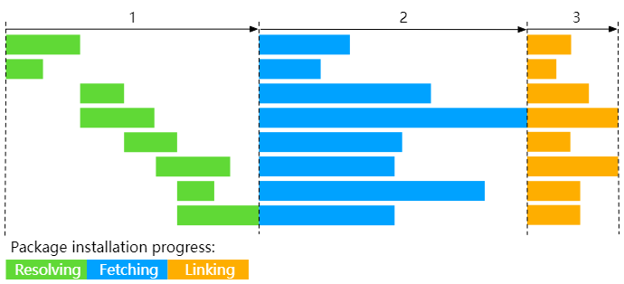
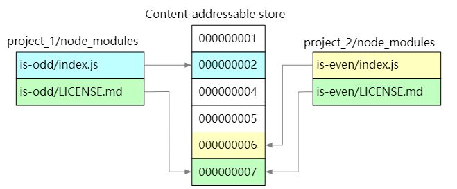
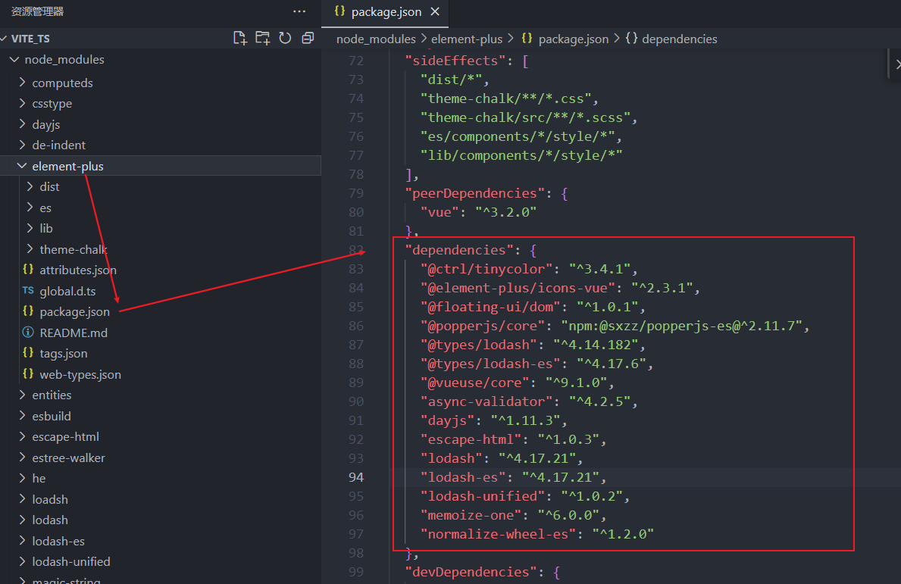
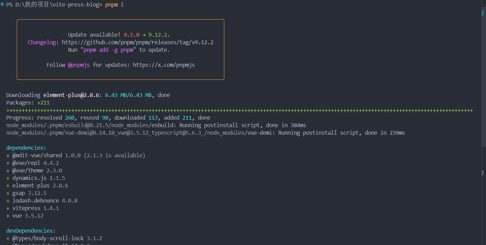

# pnpm: 解决幽灵依赖

[[toc]]

## 一、前言

`pnpm` - 速度快、节省磁盘空间的软件包管理器。

[pnpm中文网:](https://pnpm.nodejs.cn/)


## 二、pnpm 为什么快

`pnpm `的第一个特点速度快，是安装速度比较快。这是因为：

`pnpm `分三个阶段执行安装,如下：



(1) `依赖解析`： 仓库中没有的依赖都被识别并获取到仓库。

(2) `目录结构计算`： `node_modules` 目录结构是根据依赖计算出来的。 `pnpm` 会根据项目中的依赖关系，计算出一个最优的 `node_modules` 目录结构。这个结构会确保所有的依赖项都能够被正确地解析和引用，同时避免不必要的嵌套和重复。计算出一个扁平化的 `node_modules` 目录结构。

(3) `链接依赖项`： 在这个阶段，`pnpm` 会从之前创建的仓库中获取所有已经安装过的依赖项，并将它们链接到 `node_modules` 目录中。这个过程是通过**硬链接或符号链接**来实现的，具体取决于操作系统和文件系统的特性。



可以看到上图，`node_modules` 里有个 `.pnpm`. 这个就是 pnpm 在全局范围内存储一份依赖项的副本，并在需要时将它们链接到各个项目中，这也解决了**幽灵依赖**的问题。

默认情况下，`pnpm` 使用符号链接将项目的直接依赖项添加到模块目录的根目录中,如下： 

此外，由于链接的是依赖项的副本，因此项目代码无法直接修改这些依赖项。这有助于保持依赖项的完整性，并防止因误操作而导致的依赖项损坏或版本冲突。

这种方法比传统的三阶段安装过程（解析、获取和将所有依赖项写入 node_modules）快得多。下面是传统的安装： 

## 三、节省磁盘空间

使用 `npm` 时，依赖每次被不同的项目使用，都会重复安装一次。



而在使用 pnpm 时，依赖会被存储在内容可寻址的存储中，

**所以**：

(1) 如果你用到了某依赖项的不同版本，只会将不同版本间有差异的文件添加到仓库。

> 例如，如果某个包有 100 个文件，而它的新版本只改变了其中 1 个文件。那么` pnpm update` 时只会向存储中心额外添加 1 个新文件，而不会因为仅仅一个文件的改变复制整新版本包的内容。

(2) 所有文件都会存储在硬盘上的某一位置(`/node_modules/.pnpm/`)。

> 当软件包被被安装时，包里的文件会硬链接到这一位置，而不会占用额外的磁盘空间。 这允许你跨项目地共享同一版本的依赖。

因此，您在磁盘上节省了大量空间，这与项目和依赖项的数量成正比，并且安装速度要快得多！

## 四、什么是硬链接和符号链接(软链接)

### 4.1 硬链接

我们的文件数据都是存在磁盘上，比如我们创建了一个文件 A，然后就给 A 分配了一个磁盘空间，然后文件 A 其实就是一个指针，指向磁盘空间。

> 然后我们可以通过文件 A 去创建一个硬连接，文件 B，那么通过硬连接创建的话 B 的指针和 A 的指针是一样的，同样指向磁盘空间，这就实现了两个文件，共用一块磁盘空间。

这就是硬链接，在硬连接的模式下，文件 A 干掉以后，并不会影响文件 B。

### 4.2 软链接(符号链接)

软链接就类似于快捷方式，创建文件 A 时和硬连接一致，但是通过软连接创建文件 B 时，B 的指针就会指向文件 A，而不是磁盘空间，就相当于 B 是 A 的一个快捷方式。

> 那么这样子有一天 A 文件消失了，B 就不能用了。

这两种链接方式在 pnpm 里都用到了，具体它什么时候用什么链接，具体是如何用的，见官网解释：https://www.pnpm.cn/symlinked-node-modules-structure。

### 4.3 硬链接与符号链接的对比

(1) 关联方式：硬链接提供更紧密的关联，因为它们指向相同的物理数据块和 inode。而符号链接则通过路径名来关联目标文件或目录。

(2) 灵活性：符号链接提供更大的灵活性，允许链接到不同文件系统的对象，并支持链接到目录。

(3) 目标文件变动影响：如果目标文件被移动或删除，硬链接仍然有效（因为它们指向的是物理数据块），而符号链接将失效（因为它们指向的是路径）。

## 五、什么是幽灵依赖

幽灵依赖：即某个包没有在`package.json` 被依赖，但是用户却能够引用到这个包。

引发这个现象的原因是 [[模块查找规则](/column/Node/基础/模块查找规则.html)]。

例如我们项目中使用 npm 安装了 element-plus，element-plus 库却安装了其他的第三方依赖，lodash.js 等等其他的库，就会造成幽灵依赖，如下图：



当项目的两个或多个直接依赖间接依赖同一个模块但版本要求不同时，npm 会安装多个版本的该模块。未被项目直接声明的版本就形成了幽灵依赖。

> 为了减少磁盘空间占用和降低模块加载复杂度，npm 引入了扁平化安装策略。这种策略可能导致某些模块虽然未被项目直接引用，但由于被多个直接依赖共享，从而成为项目依赖树的一部分。

> 直接依赖更新时，它们可能引入新的间接依赖或升级已有间接依赖的版本，这也可能导致幽灵依赖的产生。

**缺点：**

1，占用存储空间：未使用的依赖包会增加项目的体积，占用存储空间。对于大型项目或频繁部署的项目来说，这可能会造成不必要的存储资源浪费。

2，增加构建时间：未使用的依赖包可能会增加构建过程中的解析和处理时间，导致构建过程变慢。这会影响开发人员的开发效率和项目的部署速度。

3，项目复杂性提升：幽灵依赖的存在使得项目的依赖关系变得更加复杂，难以管理和维护。这可能会导致在后续的开发过程中引入更多的潜在问题。

4，难以排查的问题：当更新父依赖的版本时，其子依赖的版本也会被更新。一旦子依赖的更新导致当前项目中用到的子依赖 API 失效，那么这个问题将非常难以排查，因为幽灵依赖并未在 package.json 中显式声明。

## 六、使用 pnpm

1，在全局安装 pnpm（推荐）：

```js
npm install -g pnpm
```

2，在项目中安装 pnpm：

如果你不想在全局范围内安装 pnpm，可以通过以下命令在项目中安装：

```js
npm install pnpm
```

3, 更新依赖

```js
pnpm update
```

4, 卸载依赖

```js
pnpm remove <package-name>
```

5, 清除缓存

```js
pnpm store prune
```

安装项目的依赖截图： 

更多 pnpm 命令:https://www.pnpm.cn/cli/add
