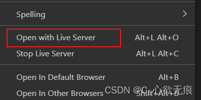

# CommonJs 和 ES6module 的使用和区别

[[toc]]

## 1，先说区别

阮一峰老师在 [ES6 入门](https://es6.ruanyifeng.com/#docs/module-loader#ES6-%E6%A8%A1%E5%9D%97%E4%B8%8E-CommonJS-%E6%A8%A1%E5%9D%97%E7%9A%84%E5%B7%AE%E5%BC%82) 中提到 `ES6 模块与 CommonJS` 模块有一些重大的差异：

::: tip 它们有三个重大差异：

- CommonJS 模块输出的是一个值的拷贝，ES6 模块输出的是值的引用。
- CommonJS 模块是运行时加载，ES6 模块是编译时输出接口。
- CommonJS 模块的 require()是同步加载模块，ES6 模块的 import 命令是异步加载，有一个独立的模块依赖的解析阶段。

:::

## 2，CommonJS

`Commonjs` 规范应用于 `nodejs` 应用中，在 `nodejs` 应用中每个文件就是一个模块，拥有自己的作用域，文件中的变量、函数都是私有的，与其他文件相隔离。

`CommonJS`模块的特点如下：

- 所有代码都运行在模块作用域，不会污染全局作用域。
- 模块可以多次加载，但是只会在第一次加载时运行一次，然后运行结果就被缓存了，以后再加载，就直接读取缓存结果。要想让模块再次运行，必须清除缓存。
- 模块加载的顺序，按照其在代码中出现的顺序。
- 同步的方式加载模块。

**使用如下**

- 通过`require`函数进行导入
- 通过`export`或者`module.exports`导出

**CommonJS 块暴露的方式有三种:**

---

**1，第一种暴露方式： exports.方法 || 属性**

```javascript
let name = "Eula";
let obj = {
  name: "Eula",
  age: 18
};
function say() {
  console.log("我是尤菈");
}

// 第一种暴露方式  exports.方法  ||  属性
exports.name = name;
exports.obj = obj;
exports.say = say;
```

require 接收:

```javascript
const receive = require('./src/utils.js')
console.log("接收到的",receive);
接收到的 { name: 'Eula', obj: { name: 'Eula', age: 18 }, say: [Function: say] }
```

**2，第二种暴露方式： module.exports.方法 || 属性**

```javascript
let name = "Eula";
let obj = {
  name: "Eula",
  age: 18
};
function say() {
  console.log("我是尤菈");
}
// 第二种暴露方式： module.exports.方法  ||  属性
module.exports.name = name;
module.exports.obj = obj;
module.exports.say = say;
```

require 接收:

```javascript
const receive = require('./src/utils.js')
console.log("接收到的",receive);
接收到的 { name: 'Eula', obj: { name: 'Eula', age: 18 }, say: [Function: say] }
```

**3，第三种暴露 ： module.exports = {方法 , 属性}**

直接暴露出去一个对象，对面接收的也是一个对象；

```javascript
let name = "Eula";
let obj = {
  name: "Eula",
  age: 18
};
function say() {
  console.log("我是尤菈");
}
// 第三种 ： module.exports = {方法 , 属性}  直接暴露出一个对象
module.exports = {
  name,
  obj,
  say
};
```

接收：

```javascript
const receive = require('./src/utils.js')
console.log("接收到的",receive);
接收到的 { name: 'Eula', obj: { name: 'Eula', age: 18 }, say: [Function: say] }
```

**`注意：`** Module.exports = {} 第三种方式和前两种多少有一点点区别；如果说 我们三种方式同时使用 或者说 只要使用第三种方式；那么他会覆盖前两种方式的暴露；

## 3，ES6 module

ES6 在语言标准的层面上，实现了模块功能，而且实现得相当简单，旨在成为`浏览器和服务器通`用的模块解决方案。

其模块功能主要由两个命令构成：`export`或`export default`和`import`。`export`命令用于规定模块的对外接口，`import`命令用于输入其他模块提供的功能。

**使用如下**

- 通过`import`进行导入
- 通过`export（具名导出）`或者`export default（默认导出）`

**ES6 module 导出方式有两种：**

**1，第一种导出方式：export 逐个导出 或 export { }直接导出一个对象**

新建一个 html 文件和 utils.js：

1，把 export 逐一写在属性或对象或方法前面；

```javascript
// 1，把export 逐一写在属性或对象或方法前面
export let name = "Eula";
export let obj = {
  name: "Eula",
  age: 18
};
export function say() {
  console.log("我是尤菈");
}
```

2，或者直接写到一个对象中一起导出；

```js
//2，或者直接写到一个对象中一起暴露
let name = "Eula";
let obj = {
  name: "Eula",
  age: 18
};
function say() {
  console.log("我是尤菈");
}
export { name, obj, say }; // 一起暴露
```

接收上面导出的值： 接收的时候也有两种方式，逐个接收和整体起别名接收一个对象；

```javascript
<!DOCTYPE html>
<html lang="en">
<head>
    <meta charset="UTF-8">
    <meta http-equiv="X-UA-Compatible" content="IE=edge">
    <meta name="viewport" content="width=device-width, initial-scale=1.0">
    <title>modules</title>
</head>
<body>
    <script type="module">
      // 第一种接收方式 :逐个接收
       import { name, obj, say } from './utils.js';
       console.log('name:', name);
       console.log('obj:', obj);
       console.log('say:', say);

	  //  第二种接收方式 :整体导出起别名 receive接收的是一个对象
      import * as receive from './utils.js';
      console.log('receive:', receive);
    </script>
</body>
</html>
```

`注意`：给 script 标签添加属性 type 为 module,告诉其加载的不是一个普通的 js 文件，而是一个 js 模块；如果直接在浏览器打开这个 html 文件，会报跨域问题；这是由于设置为`type`设置为`module`类型之后，就出现了跨域问题。

当你在某盘符位置下直接打开一个 html 文件(script 标签中引入了某地的某个 js 文件)，则在浏览器地址栏呈现如下：file:///F:/vscode/css3%E8%BF%9B%E9%98%B6/html5-3d-game-scene/indexw.html 则会出现跨域问题。而 http、https 等协议支持跨域请求。

所`以解决办法`就是通过搭建本地一个服务器去进行资源的问题来解决跨域问题。

我这里使用了 VScode 中的`Live Serve`插件打开就可以了； 

**2，第二种导出方式：export default （默认导出）**

export default { }

`默认导出`一个对象；不支持对象解构语法；接收的时候也是接收的一个对象；

```javascript
let name = "Eula";
let obj = {
  name: "Eula",
  age: 18
};
function say() {
  console.log("我是尤菈");
}
// 默认导出
export default {
  name,
  obj,
  say
};
```

接收：

```javascript
<!DOCTYPE html>
<html lang="en">
  <head>
    <meta charset="UTF-8" />
    <meta http-equiv="X-UA-Compatible" content="IE=edge" />
    <meta name="viewport" content="width=device-width, initial-scale=1.0" />
    <title>modules</title>
  </head>
  <body>
    <script type="module">
      // 默认导出接收方式
      import receive from './utils.js'
      console.log("receive:",receive);
    </script>
  </body>
</html>
```

当使用默认导入时，你可以在 import 语句后面进行任意命名。

比如 import Banana from './Button.js'，如此你能获得与默认导出一致的内容。

`相反:`对于具名导入，导入和导出的名字必须一致。这也是为什么称其为 具名导出的原因！

> 通常，文件中仅包含一个组件时，人们会选择默认导出，而当文件中包含多个组件或某个值需要导出时，则会选择具名导出。

**`注意：`** Es Module 默认开启了严格模式。即便你没有在文件的开头添加 `"use strict"`；

**既然开启了严格模式，严格模式限制有哪些？**

主要有以下限制：

1.  变量必须声明后再使用
2.  函数的参数不能有同名属性，否则报错
3.  不能使用 with 语句
4.  不能对只读属性赋值，否则报错
5.  不能使用前缀 0 表示八进制数，否则报错
6.  不能删除不可删除的属性，否则报错
7.  不能删除变量 delete prop，会报错，只能删除属性 delete global[prop]
8.  eval 和 arguments 不能被重新赋值 arguments
9.  禁止 this 指向全局对象
10. 增加了保留字（implements、interface、let、package、private、protected、public、static、yield）
