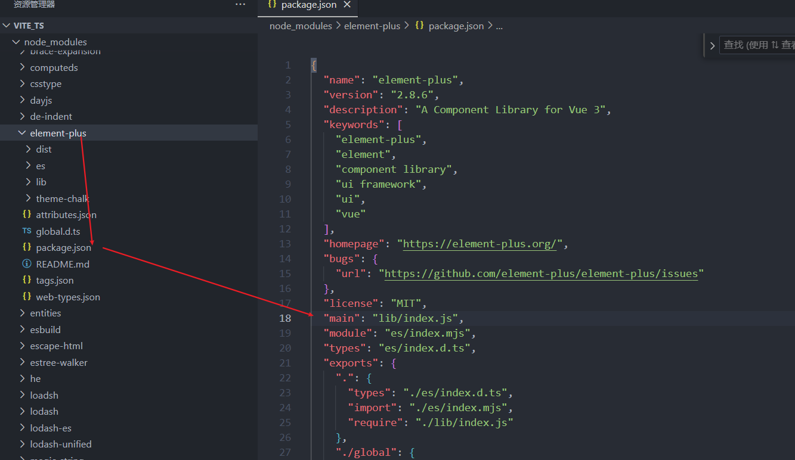

# Node模块的引入路径查找规则

___

在前端项目中，使用 `npm,yarn 或 pnpm` 管理依赖时，模块的引入路径查找规则是由 `Node.js `的模块解析机制决定的。下

当你在代码中使用` import 或 require `语句引入模块时，`Node.js` 会按照以下顺序查找模块：


## 一、基本查找规则

1，核心模块(内置)：
如果模块名是`Node.js核心模块（如fs、path、http等）`，则直接使用核心模块。

2，相对路径：
如果模块名以`./或../`开头，则将其视为相对路径，解析为相对于当前文件的路径。

3，绝对路径：
如果模块名以`/`开头，则将其视为绝对路径，解析为文件系统中的绝对路径。

4，第三方模块：

如果模块名不是以上三种情况，则将其视为一个包名，`Node.js会在node_modules`目录中查找该包(下面会介绍)

## 二、第三方模块的查找步骤


如果写入的路径不是以相对路径或者绝对路径开始的，直接写的`element-plus`:

```js
import ElementPlus from 'element-plus'
```

此时，我们引入的是一个第三方模块时，`Node.js`会按照以下步骤查找模块：


**1，逐级向上查找：**

`Node.js`会从当前文件所在目录开始，逐级向上查找`node_modules`目录，直到找到匹配的包或到达文件系统的根目录。

**2，读取package.json：**

如果在任何一级目录中找到了`node_modules`目录，并且该目录包含所需的包，则`Node.j`s会读取该包的`package.json`文件，以确定包的入口文件（通常是main字段指定的文件）。

如下图`element-plus`的入口文件：



main配置选项：

```json
 "main": "lib/index.js",
```

可以看到, `element-plus`的入口文件是lib/index.js。当我们在页面中引入`import ElementPlus from 'element-plus` 时，它会首先进入lib/index.js 这里面；


>那如果没有package.json文件或main字段为空呢？会默认使用index.js文件作为入口文件.


**3,  默认入口文件：**

如果没有package.json文件或main字段，Node.js会默认使用index.js文件作为入口文件。

___

上面这几部查找过程是递归的，会向上一级目录逐层查找，直到根目录，如果还没找到，则抛出错误：

```js
Error: Cannot find module 'element-plus'  // [!code warning]
```

**官方介绍**：  
https://nodejs.org/api/modules.html#loading-from-node_modules-folders